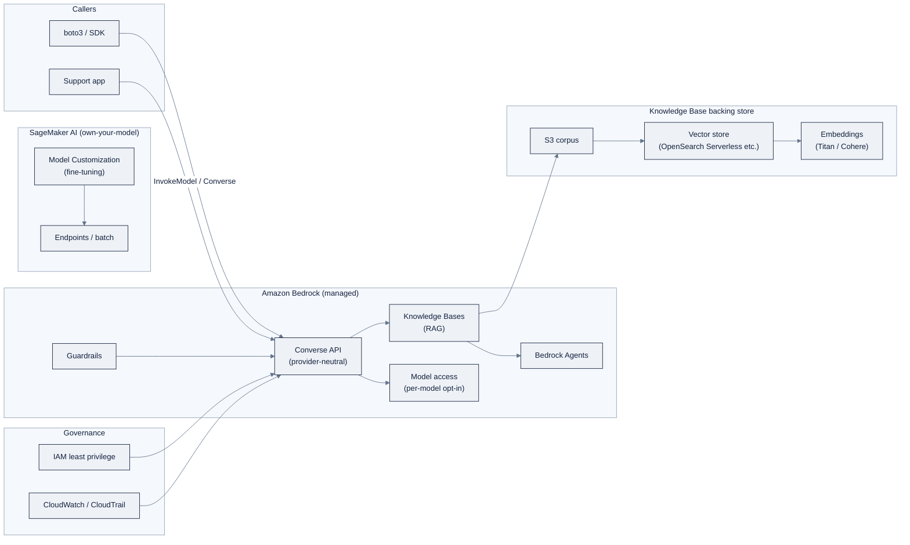

# AWS Bedrock: Module Guide

> **Week 20 · Cloud AI Platforms · AWS** · *A Bedrock RAG support agent with Guardrails,
> plus the three-cloud comparison matrix.*

This is the hands-on guide for Week 20. Read [reference/knowledge-base/12-cloud-platforms.md](/lib/01-foundations/ai-engineering-lab/reference-knowledge-base-12-cloud-platforms)
for the full Bedrock vs SageMaker mental model; this README is the runbook.

> **⚠️ Verify against live docs.** Bedrock model IDs carry dated suffixes and get superseded
> often; Guardrails/AgentCore capabilities and per-1M-token prices move fast. Treat every
> specific model ID, API field, and price in this file as "correct at time of writing, subject
> to change", click through to the links in [Sources](#sources) before you rely on any of
> them.

## 1. Overview: Bedrock vs SageMaker: the mental model

AWS's generative-AI story is **two complementary layers**:

- **Amazon Bedrock**: the managed foundation-model layer. Call models as an API without
  running infrastructure, unified behind one **Converse API**, with RAG, agents, guardrails,
  and evals layered on top.
- **SageMaker AI**: the build/train/deploy-your-own-model layer. Bring your own data and
  models, train on managed clusters (HyperPod, JumpStart), deploy to endpoints.

**The rule:** Bedrock = consume models + managed GenAI features. SageMaker = build,
fine-tune, and serve models you own. A production RAG app commonly uses **Bedrock (model +
Knowledge Bases)** and reaches for **SageMaker only if fine-tuning**. Around them sit
**Amazon Q** (assistants you buy) and **PartyRock** (a free no-code playground).

**When to use Bedrock over the other clouds:** you want the cleanest provider-neutral API
(the Converse API), you're already on AWS, or you value the managed RAG/agent/guardrails
arc. If you want the fastest free "hello world," Google AI Studio is quicker; if you need
Microsoft's hub/project governance model, Foundry is the fit.

### Decision table: Bedrock vs SageMaker

| Question | If yes → | Why |
|---|---|---|
| Am I *calling* a foundation model (Claude/Nova/Llama/Mistral)? | **Bedrock** | Serverless API, no endpoints to run |
| Am I building RAG / an agent / safety filters on top? | **Bedrock** | Knowledge Bases, Agents, Guardrails are managed |
| Am I *fine-tuning* a model I own? | **SageMaker** | Model Customization is the training path |
| Am I deploying my own/custom model behind an endpoint? | **SageMaker** | Endpoints, batch, autoscaling |
| Do I need an enterprise-ready **code-first** agent runtime (LangGraph/Strands)? | **Bedrock (AgentCore)** | Managed memory/sessions/gateway for your framework |
| Do I want a zero-code "taste of Bedrock" today? | **PartyRock** | Free drag-and-drop playground |

### The shape of the whole system



Two lessons in the diagram: (1) **everything on Bedrock is behind one `Converse` surface**,
so the model ID is a dial you turn rather than code you rewrite; (2) **IAM sits across every
arrow**, there are no API keys, only policies, and model access is an explicit opt-in.

## 2. Day-0 setup

### What you need

- An **AWS account** (free tier works for the labs).
- The **AWS CLI** and a configured profile.

```bash
# configure credentials (env, SSO, or instance role, no keys in code)
aws configure            # or: aws sso login
aws sts get-caller-identity   # confirm who you are and which account
```

### IAM least privilege

AWS has **no API keys for models**, everything is IAM. Create a least-privilege policy
scoped to what the labs actually need, attach it to a role/user, and use it for the week:

```json
{
  "Version": "2012-10-17",
  "Statement": [
    {
      "Sid": "BedrockInvoke",
      "Effect": "Allow",
      "Action": [
        "bedrock:ListFoundationModels",
        "bedrock:Converse",
        "bedrock:ConverseStream",
        "bedrock:InvokeModel",
        "bedrock:Retrieve",
        "bedrock:RetrieveAndGenerate"
      ],
      "Resource": "arn:aws:bedrock:us-east-1::foundation-model/*"
    },
    {
      "Sid": "BedrockRAGAndGuardrails",
      "Effect": "Allow",
      "Action": [
        "bedrock:Retrieve",
        "bedrock:RetrieveAndGenerate",
        "bedrock:CreateGuardrail",
        "bedrock:ApplyGuardrail",
        "bedrock:CreateAgent",
        "bedrock:InvokeAgent"
      ],
      "Resource": [
        "arn:aws:bedrock:us-east-1:*:knowledge-base/*",
        "arn:aws:bedrock:us-east-1:*:guardrail/*",
        "arn:aws:bedrock:us-east-1:*:agent/*"
      ]
    }
  ]
}
```

The three habits this encodes, which matter more than the exact ARNs:

1. **Explicit allow-list**: only the Bedrock actions the labs use; no wildcard on `Action`.
2. **Resource scoping**: the first statement scopes to foundation-model ARNs, the second to
   knowledge-base/guardrail/agent ARNs, not `*` everywhere.
3. **No admin anywhere**: the policy cannot do anything except invoke and configure the
   specific GenAI resources. In production you'd also add a `Condition` to pin the region
   and block specific model IDs you haven't approved.

> **Do not use `"Resource": "*"` on admin actions.** For the labs the *habits* (explicit
> allow-list, least privilege, no `*` on admin actions) matter more than the exact ARNs,
> but write the scoped version above so the muscle memory is correct.

### Model access requests

Bedrock models are **not enabled by default**, you must opt in per model, per region:

1. Bedrock console → **Model access** → request access to the models you need (Claude,
   Nova, Llama, or whichever the labs use).
2. Approval is usually instant for most models; some (notably Claude) require agreeing to
   the vendor's EULA.

Until you enable a model, invoking it returns an `AccessDeniedException`, not a code bug.

### Authenticate from code

`boto3` picks up credentials from the environment, an EC2 instance role, or SSO
(`aws sso login`). No keys in code.

## 3. Converse API quickstart

The **Converse API** is the recommended, provider-neutral surface: one request/response
format (system/messages/tool-calling) across Claude, Nova, Llama, and Mistral, swap the
`modelId` and nothing else.

```python
import boto3

client = boto3.client("bedrock-runtime", region_name="us-east-1")

resp = client.converse(
    modelId="anthropic.claude-3-5-sonnet-20241022-v2:0",   # or a Nova/Llama/Mistral id
    messages=[
        {"role": "user", "content": [{"text": "Explain Bedrock vs SageMaker."}]}
    ],
)
print(resp["output"]["message"]["content"][0]["text"])
```

### Walkthrough: system prompt, tool use, and streaming

**Step 1: System prompt + user turn.** The `system` list and the `messages` list are
provider-neutral; the model sees both.

```python
resp = client.converse(
    modelId="anthropic.claude-3-5-sonnet-20241022-v2:0",
    system=[{"text": "You are the ZoroLogistics support agent. Never invent tracking numbers."}],
    messages=[{"role": "user", "content": [{"text": "Where is ZRL-1042?"}]}],
)
print(resp["output"]["message"]["content"][0]["text"])
```

**Step 2: Tool use.** Declare a tool; when the model wants it, it returns a `toolUse`
block, and you reply with a `toolResult` in the next turn. This is the same loop you
hand-wrote in Week 14, expressed in the Converse shape:

```python
resp = client.converse(
    modelId="anthropic.claude-3-5-sonnet-20241022-v2:0",
    toolConfig={
        "tools": [
            {
                "toolSpec": {
                    "name": "track_shipment",
                    "description": "Look up a shipment by tracking number.",
                    "inputSchema": {
                        "json": {
                            "type": "object",
                            "properties": {"tracking_number": {"type": "string"}},
                            "required": ["tracking_number"],
                        }
                    },
                }
            }
        ]
    },
    messages=[{"role": "user", "content": [{"text": "Track ZRL-1042."}]}],
)

# the model asks to call the tool
if resp["stopReason"] == "tool_use":
    tool_use = next(b for b in resp["output"]["message"]["content"] if "toolUse" in b)["toolUse"]
    result = {"tracking_number": "ZRL-1042", "status": "in_transit", "eta": "2026-08-20"}
    # second turn: return the result
    resp2 = client.converse(
        modelId="anthropic.claude-3-5-sonnet-20241022-v2:0",
        messages=[
            {"role": "user", "content": [{"text": "Track ZRL-1042."}]},
            {"role": "assistant", "content": resp["output"]["message"]["content"]},
            {"role": "user", "content": [{"toolResult": {
                "toolUseId": tool_use["toolUseId"],
                "content": [{"json": result}],
            }}]},
        ],
    )
    print(resp2["output"]["message"]["content"][0]["text"])
```

**Step 3: Streaming.** Use `converse_stream` and iterate the event stream; text arrives in
`contentBlockDelta` events.

```python
stream = client.converse_stream(
    modelId="anthropic.claude-3-5-sonnet-20241022-v2:0",
    messages=[{"role": "user", "content": [{"text": "Summarize the refund policy."}]}],
)
for event in stream["stream"]:
    if "contentBlockDelta" in event:
        text = event["contentBlockDelta"]["delta"].get("text", "")
        if text:
            print(text, end="")
```

> **Gotcha:** Bedrock model IDs carry **dated suffixes** (e.g. `...-20241022-v2:0`) and get
> superseded often, copy the current ID from the console's Model catalog, don't memorize it.

The Week 20 core lab runs the **Week 6 prompt suite across several Bedrock models** and
compares quality, latency, and token cost per model, the same eval habit, now used to pick
a model.

### Model catalog: what's on Bedrock

The catalog spans first-party and third-party models, all behind the same Converse surface:

- **Amazon Nova**: AWS's first-party family: Nova Pro/Lite/Micro (text), Nova Canvas
  (image), Nova Reel (video). Cheapest, deepest AWS integration, the sensible default for
  high-volume text work.
- **Anthropic Claude**: Claude 3.7 Sonnet / Claude 4 families; the frontier pick for
  reasoning/coding, and the anchor of many Bedrock agents.
- **Meta Llama** (Llama 3.x / 4) and **Mistral**, open-weight options when you want
  portability or a self-host path later.
- **Amazon Titan**: older first-party text/embedding models; Titan embeddings are still
  the standard RAG default.
- Plus **Cohere, Stability AI, DeepSeek**, and more via **Bedrock Marketplace**.

A good Week 20 selection drill: run the same prompt suite on **Nova Lite vs Claude vs Llama**
and price each, that directly feeds the comparison matrix's "model access" and "pricing"
rows.

## 4. Knowledge Bases (RAG)

**Bedrock Knowledge Bases** is fully managed RAG: point it at S3, and it chunks, embeds
(Titan/Cohere), stores vectors (OpenSearch Serverless, Aurora, Pinecone, etc.), and exposes
`retrieve` / `retrieve_and_generate`.

### Set up and query with boto3

**Step 1: Put the Week 7 shipping-policy corpus in S3**, then create the Knowledge Base
(console: Bedrock → **Knowledge Bases** → Create → point at the bucket → choose an embedding
model and vector store → sync). The creation is long-running; the console and the
`bedrock-agent` client both create it.

**Step 2: Query with citations:**

```python
kb = boto3.client("bedrock-agent-runtime", region_name="us-east-1")

resp = kb.retrieve_and_generate(
    input={"text": "What is the ZoroLogistics refund policy for damaged freight?"},
    retrieveAndGenerateConfiguration={
        "type": "KNOWLEDGE_BASE",
        "knowledgeBaseConfiguration": {
            "knowledgeBaseId": "YOUR_KB_ID",
            "modelArn": "arn:aws:bedrock:us-east-1::foundation-model/anthropic.claude-3-5-sonnet-20241022-v2:0",
        },
    },
)
print(resp["output"]["text"])
