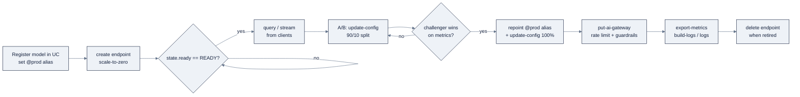

# 10: Model Serving

> Part of AI Engineering Lab · Developed by Zorost Intelligence AI Lab · [zorost.com](https://zorost.com)

Model Serving is the layer that turns a registered model or a hosted foundation model
into a **REST API** you (and any app) can call. It is serverless, auto-scaling, and
governed by Unity Catalog, and every LLM call you make on Databricks can be routed
through one control plane: the **Unity AI Gateway**.

> **Week 23 · ML & GenAI.** This file pairs with
> [`09-model-training.md`](/lib/01-foundations/ai-engineering-lab/reference-platforms-databricks-09-model-training) (you train and register a model first) and
> [`13-agents.md`](/lib/01-foundations/ai-engineering-lab/reference-platforms-databricks-13-agents) (agents are served as custom models).

---

## 1. The mental model: three things you can serve

An **endpoint** is identified by a unique **name** per workspace. Behind that name sits a
**config** made of two pieces, *what* to serve (served entities) and *how to route traffic
across them* (traffic config), plus a gateway for rate limits and a live `state`.

| Model type | What it is | Billing / sizing |
|---|---|---|
| **Databricks-hosted foundation models** | Foundation Model APIs (Llama, Claude, Gemini, GTE/BGE embeddings…) pre-provisioned in every workspace under the `system.ai.*` catalog | **Pay-per-token** (per-1M-token) or **provisioned throughput** (dedicated GPU, guaranteed throughput) |
| **External models** | Third-party providers (OpenAI, Anthropic, Amazon Bedrock, Google Vertex AI, Cohere…) behind one Databricks credential | Provider pricing; credentials centralized in the gateway |
| **Custom models** | Your own MLflow **PyFunc** (scikit-learn, XGBoost, PyTorch, Hugging Face), **agents are custom models** (wrapped in `ResponsesAgent`) | Auto-scaling from zero; GPU or CPU workloads |

**Foundation Model APIs are OpenAI-compatible**: you can point the OpenAI SDK at your
Databricks endpoint and get chat/completions/embeddings without rewriting client code. That
makes pay-per-token the fastest way to experiment; provisioned throughput is the production
answer when you need latency/throughput guarantees or a fine-tuned model.

> **Name note.** The "Mosaic AI" prefix has been retired in the docs, it is just
> **Model Serving** now (you will still see "Mosaic AI Model Serving" in older marketing).
> "AI Gateway" is now **Unity AI Gateway**.

The endpoint lifecycle, end to end:



Every arrow is a distinct, scriptable step. "Swap the model" is never one step, it is
**alias repoint** plus **endpoint config update**, and both are separate API calls (§3).

---

## 2. Creating a serving endpoint

### 2.1 From the UI

Serving UI → **Create serving endpoint** → pick a model type:

1. **Foundation model**: choose a model (e.g. a Llama chat model or `GTE` embedding),
   pick **pay-per-token** or **provisioned throughput**, name the endpoint, done.
2. **Custom model**: select a model registered in Unity Catalog (or an MLflow run),
   choose a version, set workload size (Small/Medium/Large) and
   **scale-to-zero**, done.
3. **External model**: select the provider, paste/select the API key secret, choose a
   model name (e.g. `gpt-4o`), done.

### 2.2 From the CLI

The CLI is the automation path (and the one DABs/CI use). Discover commands first, do not
guess flags:

```bash
databricks serving-endpoints -h
databricks serving-endpoints create -h
```

Create a **custom** endpoint that scales to zero (the cheap default for a dev endpoint):

```bash
databricks serving-endpoints create zrl-eta-model \
  --json '{
    "served_entities": [{
      "entity_name": "zrl_.zorologistics.eta_model",
      "entity_version": "1",
      "min_provisioned_throughput": 0,
      "max_provisioned_throughput": 0,
      "workload_size": "Small",
      "scale_to_zero_enabled": true
    }],
    "traffic_config": {
      "routes": [{
        "served_entity_name": "zrl_eta_model-1",
        "traffic_percentage": 100
      }]
    }
  }' --profile zrl
```

`scale_to_zero_enabled: true` + `min_provisioned_throughput: 0` means the endpoint costs
nothing while idle and cold-starts on the first request, perfect for the ETA model that ops
queries a few thousand times a day.

Create is long-running; the CLI waits by default. Add `--no-wait` to return immediately and
poll readiness:

```bash
databricks serving-endpoints get zrl-eta-model --profile zrl \
  | jq '{ready: .state.ready, config_update: .state.config_update}'
```

**Both** matter: `state.ready == "READY"` means *some* config is live; during a version swap
`ready` stays `READY` while `state.config_update == "IN_PROGRESS"`. Fully ready =
`ready == READY` **and** `config_update == NOT_UPDATING`.

### 2.3 Python (MLflow Deployments client)

```python
from mlflow.deployments import get_deploy_client

deploy = get_deploy_client("databricks")

deploy.create_endpoint(
    name="zrl-eta-model",
    config={
        "served_entities": [{
            "entity_name": "zrl_.zorologistics.eta_model",
            "entity_version": "1",
            "workload_size": "Small",
            "scale_to_zero_enabled": True,
        }],
        "traffic_config": {
            "routes": [{"served_model_name": "eta_model-1", "traffic_percentage": 100}]
        },
    },
)
```

> **Gotcha:** in `traffic_config.routes[].served_model_name`, the value is
> `"<model>-<version>"` (e.g. `eta_model-1`), not the catalog path. Get it wrong and the
> route silently points nowhere. The CLI/API auto-derives the entity's name from the served
> entity; you must reference the exact `<model>-<version>` string in `traffic_config`.

> **Second gotcha (SDK only):** `tags=` is a **top-level keyword** of `create_endpoint`,
> not a field inside `config`. Same `[\{key, value\}]` shape as the CLI `patch --add-tags`.

### 2.4 The full lifecycle reference

One command (or SDK method) per phase, learn the shape once and script it:

| Phase | CLI | SDK (`deploy` client / `WorkspaceClient`) |
|---|---|---|
| Create | `serving-endpoints create <NAME> --json '…'` | `deploy.create_endpoint(name=…, config=…)` |
| Inspect state | `serving-endpoints get <NAME>` | `deploy.get_endpoint(name=…)` |
| List | `serving-endpoints list` | `w.serving_endpoints.list()` |
| Update config | `serving-endpoints update-config <NAME> --json '…'` | `deploy.update_endpoint(endpoint=…, config=…)` |
| Patch tags | `serving-endpoints patch <NAME> --json '…'` | `w.serving_endpoints.patch(name=…, …)` |
| Gateway | `serving-endpoints put-ai-gateway <NAME> --json '…'` | `w.serving_endpoints.put_ai_gateway(name=…, …)` |
| Schema | `serving-endpoints get-open-api <NAME>` | `w.serving_endpoints.get_open_api(name=…)` |
| Build logs | `serving-endpoints build-logs <NAME> <ENTITY>` |(read via `get` → entity name) |
| Runtime logs | `serving-endpoints logs <NAME> <ENTITY>` | n/a |
| Metrics | `serving-endpoints export-metrics <NAME>` | n/a |
| Delete | `serving-endpoints delete <NAME>` | `w.serving_endpoints.delete(name=…)` |

For `build-logs` / `logs`, the **served entity name** is not the endpoint name, read it from
`get` output at `served_entities[].name` (e.g. `zrl_eta_model-1`). Getting this wrong is the
most common "logs are empty" mistake.

---

## 3. Traffic routing & A/B via model versions

A serving endpoint can host **multiple served entities** and split traffic between them.
This is how you A/B a new model version or canary it into production with **zero downtime**:

```bash
databricks serving-endpoints update-config zrl-eta-model --json '{
  "served_entities": [
    {"entity_name": "zrl_.zorologistics.eta_model", "entity_version": "1",
     "workload_size": "Small", "scale_to_zero_enabled": true},
    {"entity_name": "zrl_.zorologistics.eta_model", "entity_version": "2",
     "workload_size": "Small", "scale_to_zero_enabled": true}
  ],
  "traffic_config": {
    "routes": [
      {"served_entity_name": "zrl_eta_model-1", "traffic_percentage": 90},
      {"served_entity_name": "zrl_eta_model-2", "traffic_percentage": 10}
    ]
  }
}' --profile zrl
```

Version 2 (the "Challenger") now gets 10% of traffic. After you confirm MAE improved in the
serving metrics, move the `@prod` alias and repoint 100% of traffic, the **alias** and the
**endpoint config** are two separate steps and you must do both:

```python
from mlflow.tracking import MlflowClient
from mlflow.deployments import get_deploy_client

registry = MlflowClient(registry_uri="databricks-uc")
deploy   = get_deploy_client("databricks")

FULL = "zrl_.zorologistics.eta_model"
registry.set_registered_model_alias(FULL, "prod", "2")     # repoint the alias
deploy.update_endpoint(endpoint="zrl-eta-model", config={
    "served_entities": [{"entity_name": FULL, "entity_version": "2",
                         "workload_size": "Small", "scale_to_zero_enabled": True}],
    "traffic_config": {"routes": [
        {"served_model_name": "eta_model-2", "traffic_percentage": 100}]},
})
```

The same convention (aliases `Champion`/`Challenger` or `@prod`) is what you used when you
registered the model in [`07-mlflow-experiments.md`](/lib/01-foundations/ai-engineering-lab/reference-platforms-databricks-07-mlflow-experiments).

### 3.1 The routing fields, decoded

| Field | Meaning | ZoroLogistics use |
|---|---|---|
| `served_entities[]` | The models/versions the endpoint can serve (name + version + scaling) | v1 and v2 of `eta_model` side by side |
| `traffic_config.routes[]` | What fraction of requests each entity receives | 90/10 during canary |
| `served_entity_name` / `served_model_name` | The `<model>-<version>` string that identifies a route | `zrl_eta_model-2` |
| `traffic_percentage` | Integer % per route (must sum to 100) | 10% challenger |

### 3.2 A canary recipe (steps, not just config)

A safe canary is a *sequence*, not a single `update-config`:

1. **Register** v2 and give it the `Challenger` alias (leave `Champion` on v1).
2. **`update-config`** to 90/10. Watch serving metrics (latency, error rate, your business
   metric) for a few hours, not minutes.
3. **Promote** to 50/50, then 100/0 only after the challenger is stable.
4. **Repoint** `@prod` to v2 and keep a single-entity 100% config (simpler than a permanent
   split).
5. **Roll back** instantly by `update-config` back to v1 100%, no redeploy, no downtime.

The key discipline: **traffic routing and alias state are independent.** A "promoted" model
whose endpoint still routes 100% to v1 is the classic silent failure.

---

## 4. Scale-to-zero, provisioning, and cost shape

| Setting | Effect |
|---|---|
| `scale_to_zero_enabled: true` | Endpoint scales to **0 replicas** when idle; cold start on first request. Zero cost while idle, the right default for dev/low-traffic endpoints. |
| `min_provisioned_throughput` > 0 | Keeps capacity warm; you pay for it even when idle. |
| `max_provisioned_throughput` | Caps scale (and cost), set a sane ceiling for a public endpoint. |
| `workload_size` | Small/Medium/Large (CPU/GPU instance sizing) for custom models. |

> **Pay-per-token vs provisioned throughput:** pay-per-token is usage-only (great for
> experimentation and spiky traffic); provisioned throughput is a committed capacity that
> bills continuously but guarantees latency. For the ETA model, pay-per-token is almost
> certainly right, until you have a latency SLA, do not commit.

### 4.1 Scale-to-zero in practice

Scale-to-zero is the FinOps default, but it is a **latency trade**, not a free lunch:

- **Cold start**: a scale-to-zero endpoint has *no warm replica*, so the first request after
  idle pays a startup penalty (seconds for CPU; longer for GPU). A nightly ETL that calls the
  ETA model at 3 a.m. does not care; a chat assistant a user hits mid-conversation does.
- **Warm-keep is the middle ground**: set `min_provisioned_throughput` just above 0 to keep
  one replica warm and avoid the worst cold starts while still capping idle cost.
- **Measure before committing**: `export-metrics` gives you latency percentiles per served
  entity; use them to decide whether to keep scale-to-zero or pay for a warm floor.
- **Idle still means zero**: with scale-to-zero, an unqueried endpoint bills $0. That is why
  the capstone's `zrl-eta-model` ships with it on.

---

## 5. Unity AI Gateway (formerly AI Gateway)

The gateway is the **governance control plane** for all LLM/agent/MCP traffic, built on
Unity Catalog. It governs three dimensions:

| Dimension | What it governs |
|---|---|
| **Asset** | Models, MCP servers, functions, connections as governed UC securables |
| **Traffic** | Central routing, **rate limits**, **budgets**, usage tracking, cost observability |
| **Behavior** | **Service policies** (guardrails), `ALLOW` / `DENY` / `ASK` per request/response |

### 5.1 Rate limits

Attach a rate limit to an endpoint via `put-ai-gateway`. ZoroLogistics caps the ETA endpoint
so a runaway client cannot blow past the ops budget:

```bash
databricks serving-endpoints put-ai-gateway zrl-eta-model --json '{
  "rate_limits": [{
    "calls": 1000,
    "key": "user",
    "renewal_period": "minute"
  }]
}' --profile zrl
```

- `key` can be `user` (per-identity), `endpoint` (global), or a custom attribute.
- `renewal_period` is `minute` (or a time unit), 1,000 calls/minute/user here.
- A `RATE_LIMIT_EXCEEDED` (HTTP **429**) means the limit tripped; add backoff/retry in the
  client, or raise the limit if the traffic is legitimate.

A fuller gateway config, multiple limits plus a budget, reads:

```json
{
  "rate_limits": [
    {"calls": 1000, "key": "user", "renewal_period": "minute"},
    {"calls": 50000, "key": "endpoint", "renewal_period": "day"}
  ],
  "usage_tracking_config": {
    "enabled": true
  }
}
```

| Knob | Purpose | Typical ZoroLogistics value |
|---|---|---|
| `rate_limits[].key = user` | Per-caller ceiling | 1,000 calls/min/user |
| `rate_limits[].key = endpoint` | Global ceiling across all callers | 50,000 calls/day |
| `usage_tracking_config.enabled` | Record usage for cost observability | `true` (always) |
| `budgets` | Hard spend ceiling per time window | a monthly $ ceiling on the ops agent |

### 5.2 Credential management (external models)

External models store their provider API key **once** as a Databricks secret, and the gateway
injects it on every call, no key ever lives in application code:

```bash
# one-time, from the admin
databricks secrets create-scope zrl-ai --profile zrl
databricks secrets put-secret zrl-ai openai-key --string "$OPENAI_API_KEY" --profile zrl
```

Then create an external-model endpoint that references the secret by path:

```json
{
  "name": "zrl-gpt4o",
  "config": {
    "served_entities": [{
      "name": "gpt-4o",
      "external_model": {
        "name": "gpt-4o",
        "provider": "openai",
        "task": "llm/v1/chat",
        "openai_config": {
          "openai_api_key": "{{secrets/zrl-ai/openai-key}}"
        }
      }
    }]
  }
}
```

The secret stays in the scope; the config stores only the <code v-pre>{{secrets/…}}</code> reference. Rotating
the key is a `put-secret`, not a code change.

### 5.3 Guardrails (service policies)

**Service policies** (Beta) are SQL-UDF content checks evaluated **ON CALL** (request) and
**ON RESULT** (response). Built-in checks are LLM-as-judge and **fail-closed**:

- `block_unsafe_content`: refuse harmful content.
- `block_jailbreak`: refuse jailbreak/injection attempts.
- `block_hallucination`: flag responses unsupported by retrieved context (RAG).

A policy decides `ALLOW` / `DENY` / `ASK` per request or response. In a freight context where
a hallucinated rate is a liability, you gate the policy-RAG endpoint with
`block_hallucination` so an answer that invents a tariff is refused or flagged for review.

A content-check policy is just a SQL UDF returning a verdict, attached to the securable:

```sql
-- A guardrail that blocks prompts trying to override the assistant's instructions
CREATE OR REPLACE FUNCTION zrl_.zorologistics.no_injection(body STRING)
RETURN CASE
  WHEN lower(body) LIKE '%ignore previous instructions%'
    OR lower(body) LIKE '%act as%'
  THEN '{"decision": "DENY", "reason": "prompt injection pattern detected"}'
  ELSE '{"decision": "ALLOW"}'
END;

-- Attach it to the model/endpoint as a service policy (ON CALL).
```

The three verdicts map to action:

| Verdict | Meaning | Effect on the call |
|---|---|---|
| `ALLOW` | Passes the check | Request/response proceeds |
| `DENY` | Fails the check | Call refused (fail-closed) |
| `ASK` | Needs a human | Flagged for review, not silently blocked |

> **Fail-closed is the point.** If the judge cannot decide (timeout, error), the safe default
> is *deny*, never *allow*. For a refund-issuing agent, a guardrail that silently fails open
> is worse than no guardrail.

---

## 6. OpenAPI schema export

Every serving endpoint exposes its input/output contract as an **OpenAPI 3.1** schema. Use it
to discover a model's request shape (especially embeddings or custom schemas) before you code
against it:

```bash
databricks serving-endpoints get-open-api zrl-eta-model --profile zrl
```

The schema lists paths per served model (e.g. `/served-models/<name>/invocations`) with the
full request/response definitions, parameter types, enums, nullable fields. Feed it to a
typed client generator, or just read it to know whether the ETA model expects
`dataframe_records` vs `inputs`.

Practical uses of the exported schema:

```bash
# 1. Read the request schema for one served model (jq the paths + components)
databricks serving-endpoints get-open-api zrl-eta-model --profile zrl \
  | jq '.paths["/served-models/zrl_eta_model-1/invocations"].post.requestBody'

# 2. Generate a typed client (OpenAPI Generator example)
databricks serving-endpoints get-open-api zrl-eta-model --profile zrl > eta-openapi.json
openapi-generator-cli generate -i eta-openapi.json -g python -o eta_client
```

Because the schema is versioned with the served entity, you can diff it across versions, the
same way you diff a library's public API, before you bump traffic to a new model.

---

## 7. Calling endpoints from Python

### 7.1 databricks-sdk

```python
from databricks.sdk import WorkspaceClient

w = WorkspaceClient()

# Chat / foundation-model endpoints take a messages array
resp = w.serving_endpoints.query(
    name="databricks-llama-3-1-70b-instruct",
    messages=[{"role": "user", "content": "Summarize freight on-time risk."}],
)
print(resp.choices[0].message.content)

# Custom / classical-ML endpoints take dataframe_records (one dict per row)
eta = w.serving_endpoints.query(
    name="zrl-eta-model",
    dataframe_records=[{
        "distance_km": 1800.0,
        "weight_kg": 850.0,
        "carrier_on_time_rate": 0.88,
        "weather_severity": "moderate",
    }],
)
print(eta.predictions)
```

### 7.2 OpenAI-compatible

Foundation Model API endpoints speak the OpenAI wire format. Point the OpenAI SDK at your
workspace host and call `chat.completions` as if it were OpenAI:

```python
from openai import OpenAI

client = OpenAI(
    api_key="<DATABRICKS_PAT_OR_OAUTH_TOKEN>",
