# 15: Declarative Automation Bundles (DABs) & CI/CD

> Part of AI Engineering Lab · Developed by Zorost Intelligence AI Lab · [zorost.com](https://zorost.com)

**Declarative Automation Bundles** (DABs; formerly **Databricks Asset Bundles**) are
infrastructure-as-code for data + AI projects. You declare your source files and your
resources (jobs, pipelines, dashboards, apps, models, experiments, schemas) in
`databricks.yml`, and deploy the whole thing as one unit, then promote it through
`dev` → `prod` with Git and CI/CD.

> **Week 24 · Production & Capstone.** This file is what turns Weeks 21 to 23's ad-hoc artifacts
> into a reproducible, promotable project, the capstone's packaging layer.

---

## 1. Why bundles

Three ways to source-control Databricks work, from lightest to fullest:

| Option | What it manages | Good for |
|---|---|---|
| **Git-with-jobs** | Point a job at a Git repo's notebook | Quick notebooks in jobs |
| **Git folders** (formerly **Repos**) | Notebooks in a Git-backed folder | Notebook development |
| **Declarative Automation Bundles** | Source **+ resource definitions + tests**, deployed as a unit | **Production (recommended)** |

Bundles win because the *job definition itself* is versioned with the code, a pipeline
change and the job that runs it ship in the same commit.

The promotion arc this file builds:

```mermaid
%%{init:{"theme":"base","fontFamily":"Helvetica Neue,Helvetica,Arial,sans-serif","flowchart":{"curve":"basis","padding":14,"nodeSpacing":45,"rankSpacing":55},"themeVariables":{"fontSize":"15px","background":"#FFFFFF","primaryColor":"#EEF2F7","primaryTextColor":"#14213D","primaryBorderColor":"#14213D","secondaryColor":"#FFF1E3","secondaryTextColor":"#14213D","tertiaryColor":"#E7F4F1","tertiaryTextColor":"#14213D","lineColor":"#64748B","textColor":"#14213D","edgeLabelBackground":"#FFFFFF","clusterBkg":"#F5F8FC","clusterBorder":"#94A3B8","nodeBorder":"#14213D","mainBkg":"#EEF2F7","titleColor":"#14213D"}}}%%
flowchart LR
    GIT[Git push / tag] --> CI[CI runner\nGitHub Actions]
    CI --> VAL[validate --strict]
    VAL --> DEP[deploy -t dev]
    DEP --> RUN[run etl_job -t dev]
    RUN --> TEST[verify tables / gates]
    TEST --> TAG[tag release\nimmutable tree]
    TAG --> PROD["deploy -t prod\nmode: production"]
    PROD --> MON[monitor\nsystem tables]
```



---

## 2. `databricks.yml` anatomy

A bundle project:

```
project/
├── databricks.yml           # name, variables, targets, resources (or include:)
├── resources/               # one YAML per resource (convention <name>.<type>.yml)
│   ├── etl_job.job.yml
│   ├── medallion.pipeline.yml
│   └── ontime.dashboard.yml
└── src/                     # code + dashboard JSON
    ├── pipeline.sql
    └── dashboards/ontime.lvdash.json
```

### 2.1 The main config (fully commented)

```yaml
# databricks.yml, the bundle's single entry point.
# bundle.name + variables + targets + resources (or include:).

bundle:
  name: zorologistics            # unique project name; used in ${bundle.name}

# Pull resource definitions in from resources/*.yml (keeps one file small).
include:
  - resources/*.yml

# Variables are the "configuration knobs", parameterize per target.
variables:
  catalog:
    default: 'zrl_'             # default when a target doesn't override
  schema:
    default: 'zorologistics'
  warehouse_id:
    # lookup = resolve by name at deploy time, not a hardcoded id
    lookup:
      warehouse: 'Shared SQL Warehouse'

# Targets are environments. Promotion = `bundle deploy -t <target>`.
targets:
  dev:
    default: true               # the target used when you omit -t
    mode: development           # allows experimentation / overwrites
    workspace:
      profile: zrl-dev          # which CLI auth profile (from ~/.databrickscfg)
    variables:                  # per-environment overrides
      catalog: 'zrl_dev'
      schema: 'zorologistics'

  prod:
    mode: production            # locks the workspace against accidental overwrites
    workspace:
      profile: zrl-prod
    variables:
      catalog: 'zrl_'
      schema: 'zorologistics'
```

### 2.2 Resources

**`resources:`** keys are the resource *type*; under each, a keyed definition. Jobs:

```yaml
# resources/etl_job.job.yml
resources:
  jobs:
    etl_job:
      name: 'ZoroLogistics Medallion ETL'
      tasks:
        - task_key: 'run_pipeline'
          pipeline_task:
            pipeline_id: ${resources.pipelines.medallion.id}
      schedule:
        quartz_cron_expression: '0 30 2 * * ?'
        timezone_id: 'America/Chicago'
```

Pipelines (Lakeflow/SDP):

```yaml
# resources/medallion.pipeline.yml
resources:
  pipelines:
    medallion:
      name: 'ZoroLogistics Medallion'
      catalog: ${var.catalog}
      target: ${var.schema}
      libraries:
        - glob:
            include: ../src/pipeline.sql
      root_path: ../src
      serverless: true
      photon: true
      continuous: false
      development: true
      channel: current
      permissions:
        - level: CAN_VIEW
          group_name: 'users'
```

Dashboards (AI/BI):

```yaml
# resources/ontime.dashboard.yml
resources:
  dashboards:
    ontime_dashboard:
      display_name: 'On-Time Performance'
      file_path: ../src/dashboards/ontime.lvdash.json
      warehouse_id: ${var.warehouse_id}
      dataset_catalog: ${var.catalog}
      dataset_schema: ${var.schema}
```

Registered models, experiments, schemas, volumes, and apps are all first-class `resources:`
types too (`registered_models`, `experiments`, `schemas`, `volumes`, `apps`).

| Resource type | `resources:` key | What it deploys |
|---|---|---|
| Job | `jobs` | Scheduled/task DAGs |
| Pipeline | `pipelines` | Lakeflow (SDP) pipelines |
| Dashboard | `dashboards` | AI/BI `.lvdash.json` |
| App | `apps` | Databricks Apps |
| Model | `registered_models` | Models in UC |
| Experiment | `experiments` | MLflow experiments |
| Schema / Volume | `schemas` / `volumes` | UC securables |

> **Path resolution matters:** resource files live one level deep, so their paths are
> `../src/...`; paths in `databricks.yml` itself are `./src/...`.

### 2.3 Variables & substitutions

```yaml
${var.catalog}                          # a variable you declared
${bundle.name}                          # bundle.name
${bundle.target}                        # dev / staging / prod
${workspace.current_user.userName}      # who is deploying
${resources.jobs.etl_job.id}            # another resource's deployed id
```

Variables parameterize catalog/schema/warehouse per target, the difference between
"works on my workspace" and "promotes cleanly to prod."

### 2.4 Resource permissions

Declare who can view/manage each deployed resource, right in the bundle, permissions deploy
with the resource, so a fresh workspace gets the same access without a manual grant pass:

```yaml
# resources/medallion.pipeline.yml (excerpt)
permissions:
  - level: CAN_VIEW
    group_name: 'users'
  - level: CAN_MANAGE
    group_name: 'data_engineers'
```

| Resource | Common permission levels |
|---|---|
| Job / Pipeline | `CAN_VIEW`, `CAN_MANAGE_RUN`, `CAN_MANAGE`, `IS_OWNER` |
| Dashboard | viewer / editor levels |
| Serving endpoint | `CAN_QUERY`, `CAN_MANAGE` |
| App | access + SSO group scoping |

Declarative permissions are the difference between "the pipeline exists" and "the pipeline is
governed", and they travel with the bundle through every environment.

### 2.5 A parameterized job (job-level parameters)

```yaml
# resources/refresh_job.job.yml
resources:
  jobs:
    refresh_job:
      name: 'ZoroLogistics Model Refresh'
      parameters:
        - name: model_version
          default: '1'
      tasks:
        - task_key: retrain
          notebook_task:
            notebook_path: ../src/train_eta.py
        - task_key: repoint_alias
          depends_on: [{task_key: retrain}]
          sql_task:
            warehouse_id: ${var.warehouse_id}
            query:
              query: 'ALTER MODEL zrl_.zorologistics.eta_model SET ALIAS prod AS VERSION {{job.parameters.model_version}}'
```

Job parameters flow into tasks as <code v-pre>{{job.parameters.&lt;name>}}</code>; notebooks read them with
`dbutils.widgets.get()`. Use parameters instead of hardcoding version numbers, so a re-run can
promote a different model version without editing the notebook, the same "no hardcode" rule as
the variables in §2.3.

---

## 3. The bundle lifecycle

```bash
databricks bundle init                          # scaffold (templates: default-python/sql, lakeflow-pipelines, …)
databricks bundle validate --strict -t dev      # validate config (--strict = warnings are errors)
databricks bundle deploy -t dev                 # deploy resources to the target workspace
databricks bundle run etl_job -t dev            # run a resource
databricks bundle summary                       # what's deployed where
databricks bundle destroy -t dev                # remove everything the bundle deployed (destructive)
```

- `bundle deploy` is idempotent, re-running updates the resources.
- **Always `validate --strict`** after a config change.
- **Code changes only take effect after `deploy`**: then `run`.
- `bundle destroy` removes deployed resources; confirm the target first.

You can also **generate** config from an existing workspace resource instead of hand-writing:

```bash
