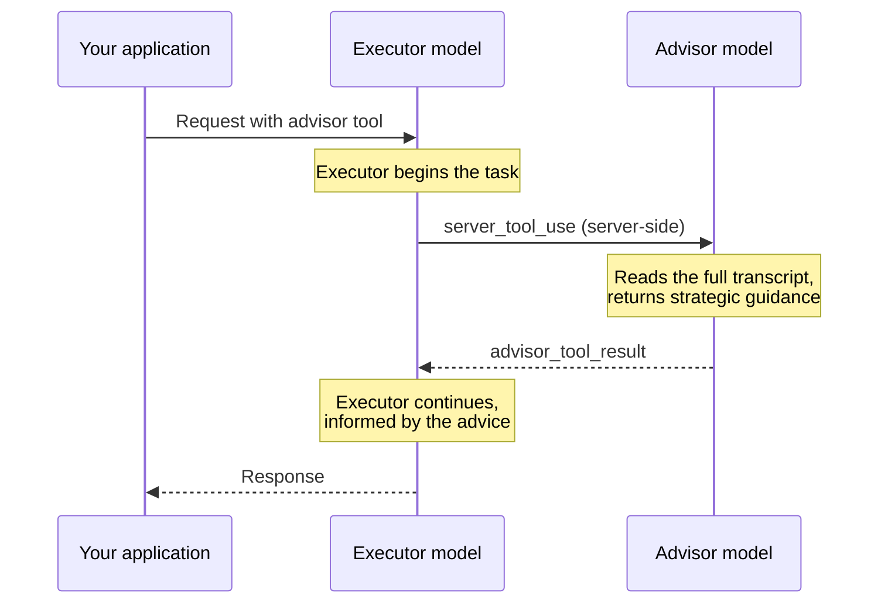

The advisor tool lets a faster, lower-cost **executor model** consult a higher-intelligence **advisor model** mid-generation for strategic guidance. The advisor reads the full conversation, produces a plan or course correction, and the executor continues with the task.

This pattern fits long-horizon agentic workloads (coding agents, computer use, multistep research pipelines) where most turns are mechanical but having an excellent plan is crucial. You get close to advisor-solo quality while the bulk of token generation happens at executor-model rates. For measured results, including how the benefit shrinks as the executor's own capability approaches the advisor's, see [Optimizing for cost and intelligence](https://platform.claude.com/docs/en/about-claude/models/optimizing-for-cost-and-intelligence).

  To learn how zero data retention (ZDR) applies to this feature, see [API and data retention](https://platform.claude.com/docs/en/manage-claude/api-and-data-retention).

## 本篇目录

- [When to use it](https://platform.claude.com/docs)
- [Quick start](https://platform.claude.com/docs)
- [How it works](https://platform.claude.com/docs)
- [Tool parameters](https://platform.claude.com/docs)
- [Response structure](https://platform.claude.com/docs)
- [Multi-turn conversations](https://platform.claude.com/docs)
- [Streaming](https://platform.claude.com/docs)
- [Usage and billing](https://platform.claude.com/docs)
- [Advisor prompt caching](https://platform.claude.com/docs)
- [Combining with other tools](https://platform.claude.com/docs)
- [Best practices](https://platform.claude.com/docs)
- [Model compatibility](https://platform.claude.com/docs)
- [Advisor on Claude Managed Agents](https://platform.claude.com/docs)
- [Next steps](https://platform.claude.com/docs)
