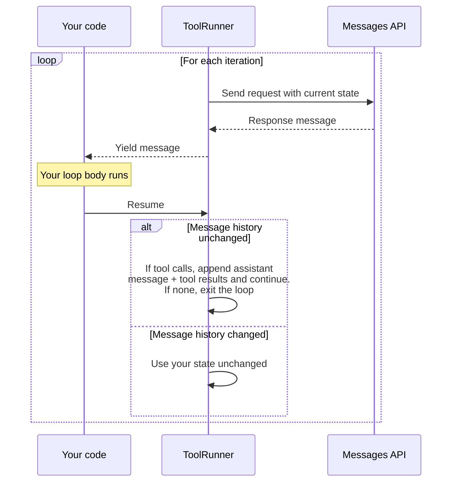

## Advanced usage

Within the loop, you can read each response message and modify the runner's state before the next API call. Each iteration follows this lifecycle:

1. The runner sends a request to the Messages API with its current state.

2. The runner yields the response message to your loop body.

3. Your loop body runs. You can read the message and optionally modify the runner's state.

4. When your loop body returns, the runner checks whether you modified its message history.

   * **If you did not modify message history:** If the message contains tool calls, the runner appends the assistant message and the tool results, then continues. If there are no tool calls, the loop exits.
   * **If you modified message history:** The runner skips its automatic append and uses your state unchanged. See [Taking over message history](https://platform.claude.com/docs/en/agents-and-tools/tool-use/tool-runner#taking-over-message-history).



### Taking over message history

By default, the runner manages conversation state for you: after each tool-call turn, it appends the assistant message and any tool results to its own message history. You take over message history when you want to retry a turn (discard the response and resend), inject a follow-up message, or build the tool result yourself.

You take over by modifying the runner's messages from inside the loop body. The exact method depends on the SDK. See the per-language tabs that follow.

When you take over for an iteration, the runner does not append the assistant message or tool results from that turn. You become responsible for keeping the conversation valid: append the assistant message and a tool result yourself (if you want the turn to count), modify state conditionally so the loop can still exit when there are no tool calls, and pass `max_iterations` to bound the loop. All seven SDKs support `max_iterations`.

    Use `generate_tool_call_response()` to inspect or compute the tool result. Calling `append_messages()` inside the loop tells the runner you're managing history yourself, so include the assistant message and tool result in what you append.

    ```python
    runner = client.beta.messages.tool_runner(
        model="claude-opus-5",
        max_tokens=1024,
        max_iterations=10,
        tools=[get_weather],
        messages=[\{"role": "user", "content": "What's the weather in San Francisco?"\}],
    )

    for message in runner:
        tool_response = runner.generate_tool_call_response()
        if tool_response is not None:
            # append_messages() flags state as modified, so the runner skips its
            # automatic append for this iteration. Append the assistant message and
            # tool result yourself, plus any follow-up.
            runner.append_messages(
                message,
                tool_response,
                \{"role": "user", "content": "Please be concise."\},
            )
        # When there's no tool call, leave state untouched so the loop exits.
    ```

    To change request parameters such as `max_tokens` without taking over message history, use `set_messages_params()`. The runner still appends the assistant message and tool result automatically.

    ```python
    for message in runner:
        runner.set_messages_params(lambda params: \{**params, "max_tokens": 2048\})
    ```

    Use `runner.params` to read the current request parameters and `setMessagesParams()` to replace them. Calling `setMessagesParams()` or `pushMessages()` inside the loop tells the runner you're managing state yourself: the assistant message and tool result from this iteration are dropped, and the next request goes out with your state.

    The following example retries a truncated response with a larger `max_tokens` budget.

    ```typescript
    const runner = client.beta.messages.toolRunner(\{
      model: "claude-opus-5",
      max_tokens: 1024,
      max_iterations: 10,
      tools: [getWeatherTool],
      messages: [
        \{
          role: "user",
          content: "Give me a detailed weather report for every major US city."
        \}
      ]
    \});

    const MAX_TOKEN_CEILING = 8192;

    for await (const message of runner) \{
      if (message.stop_reason === "max_tokens") \{
        const current = runner.params.max_tokens;
        if (current >= MAX_TOKEN_CEILING) \{
          console.warn(`Hit ceiling (${MAX_TOKEN_CEILING}); stopping.`);
          break;
        }
        const doubled = Math.min(current * 2, MAX_TOKEN_CEILING);
        console.log(`Response truncated at ${current\} tokens; retrying with ${doubled}.`);
        // Bump the budget. setMessagesParams() flags state as modified, so the
        // runner does NOT append the truncated message. The next iteration retries
        // the same turn with the larger budget.
        runner.setMessagesParams((params) => ({ ...params, max_tokens: doubled }));
      }
      // Otherwise leave state untouched so the runner auto-appends and continues.
    }
    ```

    Calling `SetParams()` or `PushMessages()` flags state as modified, which causes the runner to skip its auto-append for that turn. The C# runner still runs the matched tools for that turn and discards their auto-built results, so a tool you also run yourself inside the loop body runs twice unless you account for it. When you take over, push the assistant message and a tool result yourself. Otherwise the conversation won't make forward progress. The C# runner always exits when a response has no tool calls, so condition any state mutation on the presence of a `tool_use` block.

    ```csharp
    var runner = client.Beta.Messages.ToolRunner(
        new MessageCreateParams
        {
            Model = Model.ClaudeOpus5,
            MaxTokens = 1024,
            Messages = [new() { Role = Role.User, Content = "What's the weather in San Francisco?" }],
        },
        [getWeatherTool],
        maxIterations: 10
    );

    await foreach (var message in runner)
    {
        var toolUseBlock = message
            .Content.Select(block => block.TryPickToolUse(out var toolUse) ? toolUse : null)
            .FirstOrDefault(toolUse => toolUse is not null);

        if (toolUseBlock is null)
        {
            // No tool call: leave state untouched so the loop exits normally.
            continue;
        }

        // Run the tool yourself and build the result block.
        var toolResult = new BetaToolResultBlockParam(toolUseBlock.ID)
        {
            Content = await getWeatherTool.ExecuteAsync(toolUseBlock, default),
        };

        // PushMessages() flags state as modified; the runner skips its auto-append.
        // Supply the assistant turn and the tool result yourself, then add a follow-up.
        runner.PushMessages(
            new()
            {
                Role = Role.Assistant,
                Content = new BetaMessageParamContent(
                    JsonSerializer.SerializeToElement(
                        message.Content.Select(block => block.Json).ToArray()
                    )
                ),
            },
            new()
            {
                Role = Role.User,
                Content = new List&lt;BetaContentBlockParam> { toolResult },
            },
            new() { Role = Role.User, Content = "Please be concise in your response." }
        );
    }
    ```

    The Go runner exposes parameters as a public `Params` field. Modifying `runner.Params` between calls to `NextMessage(ctx)` applies to the next API request. Unlike other SDKs, the Go runner always appends the assistant message and tool results unconditionally. Modifying `Params` does not suppress that step.

    ```go
    runner := client.Beta.Messages.NewToolRunner(
    	[]anthropic.BetaTool{getWeather},
    	anthropic.BetaToolRunnerParams{
    		BetaMessageNewParams: anthropic.BetaMessageNewParams{
    			Model:     anthropic.ModelClaudeOpus5,
    			MaxTokens: 1024,
    			Messages: []anthropic.BetaMessageParam{
    				anthropic.NewBetaUserMessage(anthropic.NewBetaTextBlock(
    					"What's the weather in San Francisco?",
    				)),
    			},
    		},
    		MaxIterations: 10,
    	},
    )

    for {
    	message, err := runner.NextMessage(ctx)
    	if err != nil {
    		log.Fatal(err)
    	}
    	if message == nil {
    		break // conversation complete
    	}

    	// The Go runner always appends the assistant message and tool results.
    	// Param changes here apply to the next iteration.
    	runner.Params.MaxTokens = 2048
    }
    ```

    Use `runner.params()` to read the current parameters and `runner.setNextParams()` to replace them for the next iteration. When you call `setNextParams()` inside the loop, the runner skips its automatic append. The just-yielded message is discarded, and the next iteration sends your new params unchanged.

    The following example retries a turn that hit the token limit by doubling `max_tokens`. Mutating only on the `max_tokens` branch keeps the loop converging: turns that complete normally fall through, and the runner auto-appends and exits when there are no more tool calls.

    ```java
    BetaToolRunner runner = client.beta()
            .messages()
            .toolRunner(ToolRunnerCreateParams.builder()
                    .initialMessageParams(MessageCreateParams.builder()
                            .model(Model.CLAUDE_OPUS_5)
                            .maxTokens(1024)
                            .addBeta("structured-outputs-2025-11-13")
                            .addUserMessage("Give me a detailed weather report for every major US city.")
                            .addTool(GetWeather.class)
                            .build())
                    .maxIterations(10L)
                    .build());

    long ceiling = 8192;

    for (BetaMessage message : runner) {
        if (BetaStopReason.MAX_TOKENS.equals(message.stopReason().orElse(null))) {
            long current = runner.params().maxTokens();
            if (current >= ceiling) {
                IO.println("Hit ceiling (" + ceiling + "), accepting truncated response.");
                break;
            }
            long doubled = Math.min(current * 2, ceiling);
            IO.println("Response truncated at " + current + " tokens, retrying with " + doubled + ".");

            // Calling setNextParams() flags this turn as user-managed: the runner
            // does NOT auto-append the truncated message, so the next iteration
            // re-sends the same conversation prefix with the larger budget.
            runner.setNextParams(runner.params().toBuilder().maxTokens(doubled).build());
        }
        // No mutation on a normal turn: the runner auto-appends and continues.
    }
    ```

    Use `setMessagesParams()` and `pushMessages()` to modify the runner's state, and `getParams()` to read it. Calling either setter inside the loop tells the runner to skip its automatic append, so the conversation continues from your modified state instead.

    The following example doubles `max_tokens` and retries when a response is cut off.

    ```php
    use Anthropic\Beta\Messages\BetaStopReason;

    $runner = $client->beta->messages->toolRunner(
        maxTokens: 1024,
        messages: [
            ['role' => 'user', 'content' => 'Give a detailed weather report for every major US city.'],
        ],
        model: Model::CLAUDE_OPUS_5,
        tools: [$getWeather],
        maxIterations: 10,
    );

    $maxTokenCeiling = 8192;

    foreach ($runner as $message) {
        if ($message->stopReason === BetaStopReason::MAX_TOKENS->value) \{
            $current = $runner->getParams()['maxTokens'];

            if ($current >= $maxTokenCeiling) \{
                echo "Hit ceiling (\{$maxTokenCeiling}), accepting truncated response.\n";
                break;
            }

            $doubled = min($current * 2, $maxTokenCeiling);
            echo "Response truncated at \{$current} tokens, retrying with {$doubled\}.\n";

            // Calling setMessagesParams() inside the loop tells the runner to skip
            // its automatic append. The truncated message is discarded; the next
            // iteration retries with the larger budget.
            // Keys are camelCase, matching the toolRunner() named parameters.
            $runner->setMessagesParams(['maxTokens' => $doubled]);
        \}
    \}
    ```

    Use `next_message` for step-by-step control. By the time `next_message` returns, the assistant message and tool result for that turn are already appended. Use `feed_messages` to inject follow-up messages between turns, and `runner.params.update(...)` to change request parameters in place.

    You take over message history when, from inside an `each_message` or `each_streaming` block, you reassign `runner.params[:messages]` or call `feed_messages`. The following pattern calls `feed_messages` between `next_message` calls, which does not take over.

    ```ruby
    runner = client.beta.messages.tool_runner(
      model: "claude-opus-5",
      max_tokens: 1024,
      max_iterations: 10,
      tools: [GetWeather.new],
      messages: [\{role: "user", content: "What's the weather in San Francisco?"\}]
    )

    # Step the runner once. The assistant message and tool result are appended
    # to runner.params[:messages] before next_message returns.
    message = runner.next_message
    puts message.content

    # Inject a follow-up before continuing. feed_messages takes a splat, not an array.
    runner.feed_messages(\{role: "user", content: "Also check Boston."\})

    # Change parameters in place. Reassigning runner.params[:messages] takes over
    # message history only when it happens inside an each_message or each_streaming block.
    runner.params.update(max_tokens: 2048)

    runner.run_until_finished
    ```

### Automatic context management

For long-running agentic tasks, the TypeScript and Ruby tool runners support automatic [compaction](https://platform.claude.com/docs/en/build-with-claude/context-editing#client-side-compaction-sdk), which generates summaries when token usage exceeds a threshold so the conversation can continue beyond context window limits. Both SDKs have deprecated this client-side option in favor of [server-side compaction](https://platform.claude.com/docs/en/build-with-claude/compaction), which works with every SDK's tool runner through the `context_management` request parameter. The Python SDK (v1.0 and later) and the Go, Java, C#, and PHP tool runners don't include client-side compaction.

### Debugging tool execution

When a tool throws an exception, the tool runner catches it and returns the error to Claude as a tool result with `is_error: true`. The tool result carries the exception's message (in Python, its type and message), not the full stack trace.

What the SDK logs is language-specific. The Python SDK logs the full exception, including its stack trace, through the standard `logging` module whenever a tool raises an unhandled exception. The Python, TypeScript, and Java SDKs read the `ANTHROPIC_LOG` environment variable to turn on the SDK's logging, which includes request and response detail:

```bash
# Log at info level
export ANTHROPIC_LOG=info

# Log at debug level for more verbose output
export ANTHROPIC_LOG=debug
```

The Go, Ruby, C#, and PHP SDKs don't read `ANTHROPIC_LOG`. Outside Python, no SDK logs a failed tool: to see why a tool failed, catch and log the exception inside the tool function before returning or rethrowing it.

### Intercepting tool errors

By default, tool errors are passed back to Claude, which can then respond appropriately. However, you might want to detect errors and handle them differently, for example, to stop execution early or implement custom error handling.

In the Python and TypeScript SDKs, use the tool response method (`generate_tool_call_response()` in Python, `generateToolResponse()` in TypeScript) to intercept tool results and check for errors before they're sent to Claude. The other SDKs don't expose that hook. Their tabs describe the closest alternative:

    ```python
    client = anthropic.Anthropic()
    # ...
    runner = client.beta.messages.tool_runner(
        model="claude-opus-5",
        max_tokens=1024,
        tools=[my_tool],
        messages=[\{"role": "user", "content": "Run my_tool with the query 'hello'."\}],
    )

    for message in runner:
        tool_response = runner.generate_tool_call_response()

        if tool_response is not None:
            # tool_response is a dict: \{"role": "user", "content": [...]\}
            # Check if any tool result has an error
            for block in tool_response["content"]:
                if block.get("is_error"):
                    # Option 1: Raise an exception to stop the loop
                    raise RuntimeError(f"Tool failed: \{json.dumps(block['content'])\}")

                    # Option 2: Log and continue (let Claude handle it)
                    # logger.error(f"Tool error: \{json.dumps(block['content'])\}")

        # Process the message normally
        print(message.content)
    ```

    ```typescript
    const client = new Anthropic();
    // ...
    const runner = client.beta.messages.toolRunner(\{
      model: "claude-opus-5",
      max_tokens: 1024,
      tools: [myTool],
      messages: [\{ role: "user", content: "Run my_tool with the query 'hello'." \}]
    \});

    for await (const message of runner) \{
      const toolResultMessage = await runner.generateToolResponse();

      if (toolResultMessage && typeof toolResultMessage.content !== "string") \{
        // Check if any tool result has an error
        for (const block of toolResultMessage.content) \{
          if (block.type === "tool_result" && block.is_error) \{
            // Option 1: Throw to stop the loop
            throw new Error(`Tool failed: ${JSON.stringify(block.content)}`);

            // Option 2: Log and continue (let Claude handle it)
            // console.error(`Tool error: ${JSON.stringify(block.content)\}`);
          \}
        \}
      \}

      // Process the message normally
      console.log(message.content);
    \}
    ```

    The C# tool runner doesn't expose a hook for inspecting the tool result before it's sent to Claude. To control error content, throw `BetaToolError` from inside the tool body. The runner converts it to a `tool_result` with `is_error: true` and the content you supply.

    ```csharp
    var client = new AnthropicClient();

    var getWeatherTool = new BetaRunnableTool
    \{
        Name = "get_weather",
        Definition = new BetaTool
        \{
            Name = "get_weather",
            Description = "Get the current weather in a given location.",
            InputSchema = new InputSchema
            \{
                Properties = new Dictionary&lt;string, JsonElement>
                \{
                    ["location"] = JsonSerializer.SerializeToElement(new \{ type = "string" \}),
                \},
                Required = ["location"],
            \},
        \},
        Run = async (toolUse, cancellationToken) =>
        \{
            try
            \{
                return await CallExternalWeatherService(
                    toolUse.Input["location"].GetString()!,
                    cancellationToken
                );
            \}
            catch (HttpRequestException ex)
            \{
                // Log here if you need to inspect the failure before Claude sees it.
                throw new BetaToolError($"Weather service unavailable: {ex.Message}");
            }
        },
    };

    var runner = client.Beta.Messages.ToolRunner(
        new MessageCreateParams
        {
            Model = Model.ClaudeOpus5,
            MaxTokens = 1024,
            Messages =
            [
                new() { Role = Role.User, Content = "What's the weather in San Francisco?" },
            ],
        },
        [getWeatherTool]
    );

    Console.WriteLine(await runner.RunUntilDoneAsync());
    ```

    Intercepting tool errors before they're sent to Claude is not currently supported in the Go SDK. The runner converts an error returned from your handler into a tool result with `is_error: true` internally. To customize the error content, catch the error inside your handler and return a result instead of returning the error.

    Intercepting tool errors before they're sent to Claude is not currently supported in the Java SDK. The runner catches any exception thrown from a tool's `get()` method and converts it into a tool result with `is_error: true` automatically. To control the error content, catch the exception inside your tool and return a custom string.

    The PHP tool runner does not currently expose tool results before they are appended. Exceptions thrown from a tool's `run` closure are caught and sent to Claude as tool results with `is_error: true` automatically. To inspect or replace error content, use the manual `pushMessages()` pattern shown in [Modifying tool results](https://platform.claude.com/docs/en/agents-and-tools/tool-use/tool-runner#modifying-tool-results).

    ```ruby
    client = Anthropic::Client.new
    # ...
    runner = client.beta.messages.tool_runner(
      model: "claude-opus-5",
      max_tokens: 1024,
      tools: [MyTool.new],
      messages: [{role: "user", content: "Run my_tool with the query 'hello'."}]
    )

    loop do
      message = runner.next_message
      break unless message

      # By the time next_message returns, the runner has run this turn's tools and
      # appended their results as the last (user-role) message. Inspect them here,
      # before the next request sends them to Claude.
      tool_results = runner.params[:messages].last

      if tool_results && tool_results[:role] == :user && tool_results[:content].is_a?(Array)
        tool_results[:content].each do |block|
          if block[:type] == :tool_result && block[:is_error]
            # Option 1: Raise an exception to stop the loop
            raise "Tool failed: #{block[:content]}"

            # Option 2: Log and continue (let Claude handle it)
            # logger.error("Tool error: #{block[:content]}")
          end
        end
      end

      puts message.content
      break if message.stop_reason != :tool_use
    end
    ```

### Modifying tool results

You can modify tool results before they're sent back to Claude. This is useful for adding metadata such as `cache_control` to enable [prompt caching](https://platform.claude.com/docs/en/build-with-claude/prompt-caching) on tool results, or for transforming the tool output.

In the Python and TypeScript SDKs, use the tool response method to get the tool result, then modify it before the runner proceeds. Whether you explicitly append the modified result or mutate it in place depends on the SDK. See the code comments in each tab.

    ```python
    client = anthropic.Anthropic()
    # ...
    runner = client.beta.messages.tool_runner(
        model="claude-opus-5",
        max_tokens=1024,
        tools=[search_documents],
        messages=[
            {
                "role": "user",
                "content": "Search for information about the climate of San Francisco",
            }
        ],
    )

    for message in runner:
        tool_response = runner.generate_tool_call_response()

        if tool_response is not None:
            # tool_response is a dict: {"role": "user", "content": [...]}
            # Modify the tool result to add cache control
            for block in tool_response["content"]:
                if block["type"] == "tool_result":
                    # Add cache_control to cache this tool result
                    block["cache_control"] = {"type": "ephemeral"}

            # Append the modified response (this prevents auto-append of the original)
            runner.append_messages(message, tool_response)

        print(message.content)
    ```

    ```typescript
    const client = new Anthropic();
    // ...
    const runner = client.beta.messages.toolRunner({
      model: "claude-opus-5",
      max_tokens: 1024,
      tools: [searchDocuments],
      messages: [
        { role: "user", content: "Search for information about the climate of San Francisco" }
      ]
    });

    for await (const message of runner) {
      const toolResultMessage = await runner.generateToolResponse();

      if (toolResultMessage && typeof toolResultMessage.content !== "string") {
        // Modify the tool result to add cache control
        for (const block of toolResultMessage.content) {
          if (block.type === "tool_result") {
            // Add cache_control to cache this tool result
            block.cache_control = { type: "ephemeral" };
          }
        }
        // No pushMessages call needed: the runner auto-appends both the assistant
        // message and the (now-mutated) cached tool response.
      }

      console.log(message.content);
    }
    ```

    Modifying tool results before they're appended (for example, to add `cache_control`) is not currently supported in the C# SDK. The runner constructs the `tool_result` block internally and provides no hook to alter it.

    The Go runner does not expose a hook to modify the outer `tool_result` block. You can, however, set `cache_control` on the inner content blocks your handler returns.

    ```go
    client := anthropic.NewClient()
    ctx := context.Background()

    searchDocuments, err := toolrunner.NewBetaToolFromJSONSchema(
    	"search_documents",
    	"Search documents for relevant information.",
    	func(ctx context.Context, input SearchDocumentsInput) (anthropic.BetaToolResultBlockParamContentUnion, error) {
    		return anthropic.BetaToolResultBlockParamContentUnion{
    			OfText: &anthropic.BetaTextBlockParam{
    				Text: fmt.Sprintf("Found 3 documents matching: %s", input.Query),
    				// Set cache_control on the inner content block. The outer
    				// tool_result block's cache_control is not currently
    				// settable through the Go runner.
    				CacheControl: anthropic.NewBetaCacheControlEphemeralParam(),
    			},
    		}, nil
    	},
    )
    if err != nil {
    	log.Fatal(err)
    }

    runner := client.Beta.Messages.NewToolRunner(
    	[]anthropic.BetaTool{searchDocuments},
    	anthropic.BetaToolRunnerParams{
    		BetaMessageNewParams: anthropic.BetaMessageNewParams{
    			Model:     anthropic.ModelClaudeOpus5,
    			MaxTokens: 1024,
    			Messages: []anthropic.BetaMessageParam{
    				anthropic.NewBetaUserMessage(anthropic.NewBetaTextBlock(
    					"Search for information about the climate of San Francisco",
    				)),
    			},
    		},
    	},
    )

    finalMessage, err := runner.RunToCompletion(ctx)
    if err != nil {
    	log.Fatal(err)
    }
    fmt.Println(finalMessage)
    ```

    To set `cache_control` on a tool result, return `BetaToolResultBlockParam.Content` from the tool instead of `String` and set `cacheControl` on the inner text block. The runner does not currently support setting `cache_control` on the outer `tool_result` block.

    ```java
    @JsonClassDescription("Look up reference documentation for a topic")
    static class SearchDocuments implements Supplier&lt;BetaToolResultBlockParam.Content> {
        @JsonPropertyDescription("The search query")
        public String query;

        @Override
        public BetaToolResultBlockParam.Content get() {
            String largeResult = "..."; // a long document worth caching
            return BetaToolResultBlockParam.Content.ofBlocks(List.of(
                    BetaToolResultBlockParam.Content.Block.ofText(
                            BetaTextBlockParam.builder()
                                    .text(largeResult)
                                    .cacheControl(BetaCacheControlEphemeral.builder().build())
                                    .build())));
        }
    }
    ```

    The PHP tool runner has no callback to mutate the auto-generated `tool_result` block. To add fields such as `cache_control`, build the tool result yourself and push it. Calling `pushMessages()` skips the runner's auto-append for that turn.

    ```php
    $client = new Client();
    // ...
    $runner = $client->beta->messages->toolRunner(
        maxTokens: 1024,
        messages: [
            ['role' => 'user', 'content' => 'Search for information about the climate of San Francisco.'],
        ],
        model: Model::CLAUDE_OPUS_5,
        tools: [$searchDocuments],
    );

    foreach ($runner as $message) {
        $toolResults = [];
        foreach ($message->content as $block) \{
            if ($block instanceof BetaToolUseBlock) {
                $toolResults[] = [
                    'type' => 'tool_result',
                    'tool_use_id' => $block->id,
                    'content' => $searchDocuments->run($block->input),
                    // Add cache_control to cache this tool result
                    'cache_control' => ['type' => 'ephemeral'],
                ];
            }
        }

        if ($toolResults !== []) \{
            // pushMessages() flags state as mutated, so the runner skips its
            // automatic append. Push the assistant message and tool results.
            $runner->pushMessages(
                ['role' => 'assistant', 'content' => $message->content],
                ['role' => 'user', 'content' => $toolResults],
            );
        \}
        // No tool call: leave state untouched so the loop exits.
    \}
    ```

    ```ruby
    client = Anthropic::Client.new
    # ...
    runner = client.beta.messages.tool_runner(
      model: "claude-opus-5",
      max_tokens: 1024,
      tools: [SearchDocuments.new],
      messages: [\{role: "user", content: "Search for information about the climate of San Francisco"\}]
    )

    loop do
      message = runner.next_message
      break unless message

      # Access the most recent tool results from the messages array
      # The runner automatically adds tool results, but you can modify them
      tool_results_message = runner.params[:messages].last

      if tool_results_message && tool_results_message[:role] == :user && tool_results_message[:content].is_a?(Array)
        tool_results_message[:content].each do |block|
          if block[:type] == :tool_result
            # Modify the tool result to add cache control
            block[:cache_control] = \{type: "ephemeral"\}
          end
        end
      end

      puts message.content
      break if message.stop_reason != :tool_use
    end
    ```

  Adding `cache_control` to tool results is particularly useful when tools return large amounts of data (such as document search results) that you want to cache for subsequent API calls. See [Prompt caching](https://platform.claude.com/docs/en/build-with-claude/prompt-caching) for more details on caching strategies.
