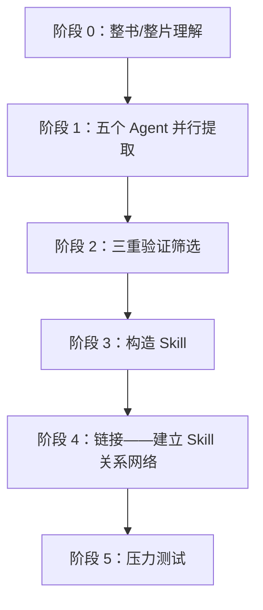

# 快速读一本书，并迅速掌握书中的技能

买书容易，读完也不算太难。难的是过一阵子真遇到问题时，明明记得书里讲过类似的方法，翻遍笔记却找不到该从哪一步开始。

如果一本书只能留下摘要和几句金句，它很快就会沉进笔记里。

仓颉 Skill 想做的，是把书里的框架和判断方法整理成可以反复调用的步骤，让豆包工作在碰到合适的问题时把它们找出来。

## 仓颉 Skill 蒸馏的是什么

普通摘要追求更短，仓颉 Skill 追求以后还能用。它先理解全书，再从框架、原则、案例、反例和术语五个方向提取候选内容。候选内容还要经过三项检查。

1. 书中是否有至少两处独立内容支持它。
2. 它能否帮助回答书中没有直接讨论的新问题。
3. 它是否提供了超出常识的独特方法。

通过检查的方法会被写成原子 Skill。每个 Skill 都会说明什么情况下调用、需要什么输入、怎样执行、什么时候不适用，还会配上测试题，检查它会不会在错误场景中乱触发。

一轮完整蒸馏通常会留下全书概览、Skill 索引、术语表、精华长文、多个原子 Skill、测试题和测试结果。原始候选与淘汰原因也会保留，方便以后回看。这样的产物更像一套可审计的工作方法，和一篇读书笔记的用途不同。

cangjie-skill 使用六个阶段将一本书或一组视频蒸馏成一套 Skill。



## 在豆包工作中安装仓颉 Skill

最简单的方式，你可以告诉你的豆包工作，自己安装这个skill，

## 用一本书跑通蒸馏

先为这本书建立一个独立项目或工作文件夹，把原始材料和后续产物放在一起。第一次只处理一本书。方法论密度高、案例较多、能指导行动的书更适合蒸馏。小说、散文和金句集通常更适合做阅读地图或主题笔记。

电子书优先准备为 Markdown 或 TXT。普通 PDF 也可以直接交给豆包工作，扫描版或含有重要图表的 PDF 要先确认 OCR 是否准确。文件交给豆包工作后，可以使用下面这段任务描述。

比如蒸馏《王川宝典》，如下

```text
请使用仓颉 Skill 蒸馏这本书，把书中的方法论整理成一组可以在真实任务中调用的 Skill。
```

::video[20260830173924.mp4](https://github.com/AlephAITech/DoubaoWorkGuide/blob/ad7338e8fc889ec082cdfb3fa41fb659520c7174/media/FKxmwNAB-video-KFV9bFmPaoKM.mp4)

最终蒸馏出7个原子 Skill，包括，

&lt;sheet sheet-id="kFwoiN" token="VuHHsibY2hn9WvtyVpYcISRZnYc">&lt;/sheet>

这个筛选过程也提醒我们，蒸馏质量不能用 Skill 数量衡量。书里有内容，不等于每一段都值得变成工具。

## 把蒸馏后的知识用起来

安装完成后，不必先背下全部 Skill 名称。直接把真实问题、背景材料和希望得到的结果交给豆包工作，并要求它在开始前说明将调用哪些方法。

```text
用当下空间中的王川宝典skill，回答我，我现在并没有多少钱，但是我很看好 AI 的发展，也非常看好具身智能的发展。我需要去投资吗？如果要投资的话，我应该怎么样投资呢？以什么策略去做？
```

会根据蒸馏出来的知识技能进行回答，

::video[20260830175814.mp4](https://github.com/AlephAITech/DoubaoWorkGuide/blob/ad7338e8fc889ec082cdfb3fa41fb659520c7174/media/FKxmwNAB-video-Q0OQb9uP0ocD.mp4)

我觉得，回答的很好，

```JSON
策略① 投自己 —— 主力，现在就做
每天固定时间学 AI / 具身智能相关技能（视频、课程、论文都行），定量化：比如每天 30 分钟；
每周用 AI 工具做一个作品（写一篇、做一个 demo、做一个 agent），沉淀为可复用资产 —— 这是书里 "让单次努力变成复利资产"；
把思考公开写出去 —— 作者明言这是 "高效的分享方式"，既是积善缘，也是积累连接与影响力。
策略② 小额金融配置 —— 只用闲钱
定一个 "亏光也不影响生活" 的上限（比如每月可支配收入的 5%–10%），固定周期投入，不追加、不抄底；
用分散工具（指数 / 宽基或龙头 ETF 这类有真实垄断机制的标的）替代个股赌博，不加杠杆；
引用书里的保命规则："拒绝以短期 Profit and Loss 为导向"—— 别用 "别人恐惧我贪婪" 给自己加仓找理由。
策略③ 战略耐心 —— 重注等机制明朗
现在不重注，但长期在场：持续学习、持续观察具身智能生态里谁在形成 "数据 + 硬件 + 生态" 的锁定效应；
当你能清楚说出某个标的 "靠什么垄断、网络效应如何自我强化" 时，才是考虑加大仓位的时机 —— 这就是书里 "用 5-10 年框架想一个问题，再用足够小的仓位验证"。

```

## 知识库怎样配合

知识库擅长保存原文和找回相关段落，Skill 擅长在合适的问题出现时执行一套方法。需要核对作者原话、数据和上下文时回到原书或知识库，需要分析、判断和行动时调用 Skill。两者放在同一个项目里，来源和方法可以互相校验。

无论蒸馏得多完整，最终判断仍由人负责。投资、医疗、法律和组织制度一类高风险内容尤其如此。Skill 可以补检查项和反例，不能替代专业意见、事实核验和人的责任。

知识精馏 vs RAG，这是使用者最常问的问题。

| 维度 | RAG | 知识精馏（Skill） |
|-|-|-|
| 本质 | 检索——找出最相关的原文片段 | 提炼——从原文中提取可执行的方法论 |
| 使用前提 | 用户需要知道该问什么 | 用户描述问题，Skill 自动识别并激活 |
| 质量控制 | 无——任何内容都可以入库 | 三重验证过滤，宁缺毋滥 |
| 调用方式 | 被动等待查询 | 主动匹配场景并触发 |
| 知识形态 | 存储原文（记住知识） | 提纯为执行步骤（运用知识） |
| 边界控制 | 无 | 诱饵测试确保不乱激活 |
| 资源消耗 | 较重（需维护向量索引） | 较轻（Skill 文件即可） |

RAG 解决"知识管理"问题——让你能查到书里有什么。知识精馏解决"知识运用"问题——让 Agent 在对的时刻主动拿出对的框架。

当你不知道该问什么时，RAG 帮不了你。Skill 不需要你记得书里有哪些方法论。

## 与 Karpathy LLM Wiki 思路的对比

Andrej Karpathy 提出 LLM 知识库（LLM Wiki）的思路：将原始资料索引到目录，让 LLM 编译成 Wiki，然后对 Wiki 做 Q&A，产出结果再回填，持续增强。

cangjie-skill 的阶段 0（整书理解）和阶段 1（并行提取）吸收了这一核心思想：先让 AI 深度阅读、结构化整理、建立索引、维护一致性。

两者的差别在于最后几步：

| 对比点 | LLM Wiki | 知识精馏 |
|-|-|-|
| 产物形态 | Wiki 条目（结构化知识库） | Skill 集合（可执行单元） |
| 使用方式 | 用户主动查询 | Agent 被动触发后主动激活 |
| 解决问题 | 知识管理 | 知识运用 |

两种方案不互斥，但目标不同。
