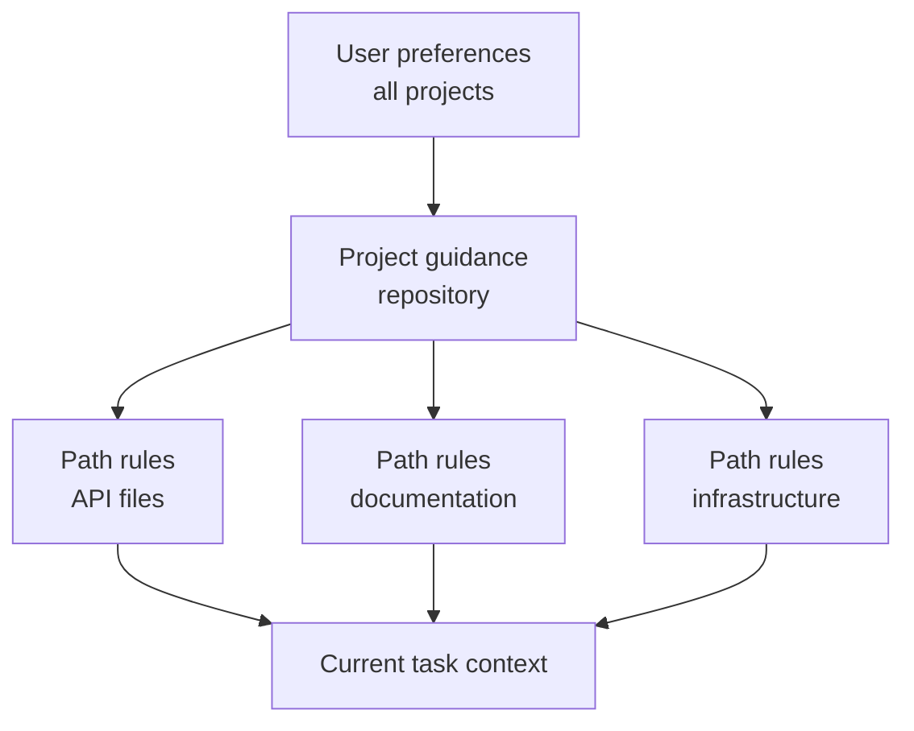

# Claude Code Memory、Rule、Skill 与 CI

> 稳定的指引应放在其适用范围真实成立的位置；不能容忍失败的约束应当可执行。

**类型：** Reference
**语言：** Python
**前置要求：** [Claude Code 靠共享约束支持规模化协作](https://github.com/fancyboi999/ai-engineering-from-scratch-zh/blob/109181ce68128c1bf27ec20867177007a8bace89/certifications/claude/lessons/15-claude-code-for-development-teams/README.md)、[Agent SDK Session、Subagent 与上下文](https://github.com/fancyboi999/ai-engineering-from-scratch-zh/blob/109181ce68128c1bf27ec20867177007a8bace89/certifications/claude/lessons/17-agent-sdk-sessions-subagents-and-context/README.md)
**预计时间：** 约 210 分钟

## 学习目标

- 在不造成上下文膨胀的前提下设计项目与用户指令层级
- 按用途选择 CLAUDE.md、路径 Rule、Skill、command、agent、hook 与 settings
- 编写并分发一个具有窄 tool 授权的真实多文件 `SKILL.md` 包
- 用 plan、直接执行和有边界的 subagent，并要求明确报告障碍
- 为可复现的 CI 证据配置无头 Claude Code
- 防止陈旧 memory、宽泛权限和隐藏本地配置控制团队工作

## 问题所在

一个团队把每条指令都塞进根 `CLAUDE.md`：架构历史、格式、数据库规则、deploy 步骤、个人偏好、命令，以及六种语言的示例。每项任务都会复制这份文件。

开发者再加私有覆盖项，CI 又有另一套配置。一条 command 假定自己有写权限；一个宽泛 hook 重格式化了无关文件。指令写着“始终跑全部测试”，于是一次小文档编辑触发 40 分钟测试套件。agent 忽略安全规则时，团队只会再加更多粗体字。

根因是作用域和优先级混乱、没有渐进式披露，还把指引与强制机制混在了一起。

## 核心概念

### 为不同工作选择正确机制

| 机制 | 最适合 | 避免 |
|-----------|----------|-------|
| `CLAUDE.md` | 简练稳定的仓库指引和入口 | 完整手册、临时状态、secret |
| 导入文件 | 靠近 owner 的共享辅助指令 | 循环或不可见的指令图 |
| 路径 Rule | 仅对匹配文件成立的指引 | 复制到每项任务的全局规则 |
| Skill | 相关时加载的可复用流程或领域 playbook | 一次性事实或硬授权 |
| Command | 用户显式调用 workflow 的兼容名称 | 没有 Skill 结构的新多步骤包 |
| Agent | 有隔离上下文和 tool 的有边界角色 | 确定性的工具函数 |
| Hook | 确定性的校验、阻止、规范化或自动化 | 开放式语义判断 |
| Settings | 权限、模型、plugin 和运行时配置 | 提交到仓库的 secret 值 |

产品说明（核验于 2026-08-09）：custom command 已并入 Skill。`.claude/commands/` 下的文件仍兼容，而 `.claude/skills/<name>/SKILL.md` 是新 workflow 的首选包。具体字段、优先级和产品可用性会变化，实施前应核对当前 Claude Code 文档。2026 年 7 月 CCAR-F blueprint 要求理解层级、Rule、command、Skill、agent、memory、规划与无头 workflow。

### 保持根指令文件精简

根文件应帮助有能力的新 contributor 正确起步。

应包含：

- 项目用途和不直观的架构边界
- 规范的构建、测试和格式化命令
- source-of-truth 文件
- 安全和范围约束
- 指向深入指引的链接或 import
- 验证和贡献预期

应排除：

- 临时任务状态
- 生成的清单
- 很长的 API 参考
- 个人编辑器设置
- secret 值
- 只适用于一个目录的指令

把它写成上手路由，别往里倾倒知识。

### 在最窄的真实作用域放置指令

用户作用域保存不应定义团队行为的个人默认值；项目作用域保存经过版本管理的共享决定；路径特定 Rule 只在文件 pattern 匹配时加载；任务指令包含当前请求。

两条 Rule 冲突时，调查文档化的优先级，并明确项目 source of truth。关键 workflow 不要依赖隐藏的本地覆盖项。

### 导入稳定的辅助指引

用 import 保持根文件简洁，同时维护模块化 owner。例如，数据库迁移 policy 应放在数据库文档附近，而根文件中的指针让它仍可发现。

审计 import 图：

- 每个目标都存在
- 没有循环
- 宽泛文件 import 不泄露 secret 或无关文本
- owner 与更新触发条件明确
- 删除或重命名的指引会明显失败

memory 检查命令可帮助发现哪些指令处于激活状态。用它们调试配置，不要存放不可恢复的项目状态。

### 用 Skill 实现渐进式披露

Skill 将可重复的方法、参考资料、脚本和产物打包。它的 description 帮助 agent 判断何时适用；完整正文只在被选中时加载，为无关工作保留上下文。

好的 Skill 包括：

- 数据库迁移审查
- 事故分诊
- release note 生成
- 威胁模型清单
- 架构决策访谈

Skill 应定义输入、顺序、证据、输出和停止条件，但不应嵌入 secret 或授予权限。
