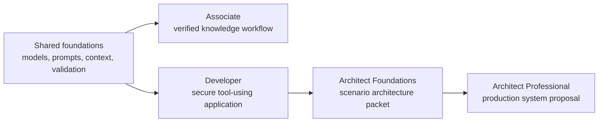

# Claude 认证课程

> 亲手构建考试所描述的系统，理解答案背后的判断。

**状态：**本地预览
**指南版本：**1.0
**指南生效日期：**2026 年 7 月
**最后核验：**2026-08-18

这套免费课程覆盖：

| 考试 | 认证 | 题目数 | 时长 | 费用 | 核心路线 |
|------|------------|------:|-----:|----:|-----------:|
| CCAO-F | Claude 认证助理 - 基础 | 60 | 120 分钟 | $99 | 9 lessons |
| CCDV-F | Claude 认证开发者 - 基础 | 53 | 120 分钟 | $125 | 15 lessons |
| CCAR-F | Claude 认证架构师 - 基础 | 60 | 120 分钟 | $125 | 21 lessons |
| CCAR-P | Claude 认证架构师 - 专业 | 63 | 120 分钟 | $175 | 25 lessons |

四份指南均采用 100 至 1,000 分量表中的 720 分合格线，认证有效期为 12
个月。项目细节可能变动，报名前请以官方指南为准。

截至 2026 年 8 月 18 日，官方考试报名仅面向 Claude Partner Network 组织的
成员，且必须使用已获认可的合作伙伴公司邮箱。官方考试和备考内容目前只提供
英文，Pearson 监考平台不允许使用浏览器翻译工具。这套课程仍向所有学习者开放，
包括只想掌握技能、并不参加考试的人。资格规则可能变动，付费或预约前请查阅最新
[认证项目 FAQ](https://anthropic-partners.skilljar.com/page/faq-certifications)。

## 在 GitHub 上通过 AI 导师学习

这是一套 AI 原生课程。Claude Code、Codex、ChatGPT、Cursor 或其他 agent
可以逐课带学、运行仓库中的实验、评审你构建的产物、组织课后测验，并从已保存的
学习进度继续。

请先阅读 [GitHub 学习者指南](/lib/07-coding/ai-engineering-from-scratch-zh/certifications-claude-GETTING_STARTED)，或者安装
[可移植的认证导师 Skill](/lib/07-coding/ai-engineering-from-scratch-zh/skills-claude-certification-SKILL)：

```bash
npx skills add fancyboi999/ai-engineering-from-scratch-zh
```

然后让你的 agent 运行：

```text
/claude-certification
```

克隆仓库后，本地 Claude Code 会从 `.claude/skills/` 发现同一份 Skill。不支持
斜杠命令的 harness 可以直接阅读 `GETTING_STARTED.md` 和导师 Skill。学习进度保存在
`CLAUDE-CERTIFICATION.md`；学习者的作业保存在 `learning-artifacts/claude/`。
仓库内的 `outputs/` 始终是参考产物，不会被覆盖。

## 你将构建什么

各条路线先共享基础内容，再按角色分流：



- 助理：带有证据和升级机制的受治理知识工作流。
- 开发者：以协议为先、具备工具、测试、安全与评估的 Claude 应用。
- 基础架构师：包含架构决策记录、威胁模型、评估器、上下文方案和故障恢复手册。
- 专业架构师：从调研到运维的完整架构材料包，覆盖 RAG、集成、评估、治理、SLA 和职责归属。

每条路线均包含一套简短诊断题和一套原创完整模拟题，题量与公开指南一致。题目组合在
合理取整范围内遵循蓝图权重，不模仿或复现真实试题。

## GitHub 课程索引

导师会读取所选路线文件来确定顺序。这份完整索引也让所有共享课程都能直接在 GitHub
上浏览。

| # | 课程 |
|---:|--------|
| 00 | [研究决策，而非背诵术语](https://github.com/fancyboi999/ai-engineering-from-scratch-zh/blob/109181ce68128c1bf27ec20867177007a8bace89/certifications/claude/lessons/00-certification-strategy/README.md) |
| 01 | [选择足以承载工作的最小产品表面](https://github.com/fancyboi999/ai-engineering-from-scratch-zh/blob/109181ce68128c1bf27ec20867177007a8bace89/certifications/claude/lessons/01-claude-product-and-model-landscape/README.md) |
| 02 | [把能力用在失败代价高的地方](https://github.com/fancyboi999/ai-engineering-from-scratch-zh/blob/109181ce68128c1bf27ec20867177007a8bace89/certifications/claude/lessons/02-model-selection-and-token-economics/README.md) |
| 03 | [把请求变成可验证的契约](https://github.com/fancyboi999/ai-engineering-from-scratch-zh/blob/109181ce68128c1bf27ec20867177007a8bace89/certifications/claude/lessons/03-prompting-and-task-decomposition/README.md) |
| 04 | [让每项事实进入恰当的上下文](https://github.com/fancyboi999/ai-engineering-from-scratch-zh/blob/109181ce68128c1bf27ec20867177007a8bace89/certifications/claude/lessons/04-context-knowledge-memory-and-caching/README.md) |
| 05 | [验证主张，而非自信程度](https://github.com/fancyboi999/ai-engineering-from-scratch-zh/blob/109181ce68128c1bf27ec20867177007a8bace89/certifications/claude/lessons/05-output-evaluation-and-validation/README.md) |
| 06 | [用权限约束能力](https://github.com/fancyboi999/ai-engineering-from-scratch-zh/blob/109181ce68128c1bf27ec20867177007a8bace89/certifications/claude/lessons/06-governance-safety-and-responsible-use/README.md) |
| 07 | [先设计交接，再设计自动化](https://github.com/fancyboi999/ai-engineering-from-scratch-zh/blob/109181ce68128c1bf27ec20867177007a8bace89/certifications/claude/lessons/07-workflow-design-and-human-handoffs/README.md) |
| 08 | [Messages API 是一台状态机](https://github.com/fancyboi999/ai-engineering-from-scratch-zh/blob/109181ce68128c1bf27ec20867177007a8bace89/certifications/claude/lessons/08-messages-api-and-application-lifecycle/README.md) |
| 09 | [结构化输出是不可信的契约](https://github.com/fancyboi999/ai-engineering-from-scratch-zh/blob/109181ce68128c1bf27ec20867177007a8bace89/certifications/claude/lessons/09-structured-output-and-defensive-parsing/README.md) |
| 10 | [工具循环是受控委派](https://github.com/fancyboi999/ai-engineering-from-scratch-zh/blob/109181ce68128c1bf27ec20867177007a8bace89/certifications/claude/lessons/10-tool-use-and-agentic-loops/README.md) |
| 11 | [MCP 将能力与宿主分离](https://github.com/fancyboi999/ai-engineering-from-scratch-zh/blob/109181ce68128c1bf27ec20867177007a8bace89/certifications/claude/lessons/11-mcp-server-design-and-integration/README.md) |
| 12 | [Agent SDK 是 harness，不是权限](https://github.com/fancyboi999/ai-engineering-from-scratch-zh/blob/109181ce68128c1bf27ec20867177007a8bace89/certifications/claude/lessons/12-claude-agent-sdk-and-hooks/README.md) |
| 13 | [安全边界在 prompt 之外](https://github.com/fancyboi999/ai-engineering-from-scratch-zh/blob/109181ce68128c1bf27ec20867177007a8bace89/certifications/claude/lessons/13-application-security-and-secrets/README.md) |
| 14 | [Evals 将 agent 行为变成工程证据](https://github.com/fancyboi999/ai-engineering-from-scratch-zh/blob/109181ce68128c1bf27ec20867177007a8bace89/certifications/claude/lessons/14-evals-testing-debugging-and-observability/README.md) |
| 15 | [Claude Code 通过共享约束实现规模化](https://github.com/fancyboi999/ai-engineering-from-scratch-zh/blob/109181ce68128c1bf27ec20867177007a8bace89/certifications/claude/lessons/15-claude-code-for-development-teams/README.md) |
| 16 | [多 agent 编排与委派](https://github.com/fancyboi999/ai-engineering-from-scratch-zh/blob/109181ce68128c1bf27ec20867177007a8bace89/certifications/claude/lessons/16-multi-agent-orchestration-and-delegation/README.md) |
| 17 | [Agent SDK 会话、子 agent 与上下文](https://github.com/fancyboi999/ai-engineering-from-scratch-zh/blob/109181ce68128c1bf27ec20867177007a8bace89/certifications/claude/lessons/17-agent-sdk-sessions-subagents-and-context/README.md) |
| 18 | [工具契约、错误与渐进式发现](https://github.com/fancyboi999/ai-engineering-from-scratch-zh/blob/109181ce68128c1bf27ec20867177007a8bace89/certifications/claude/lessons/18-tool-contracts-errors-and-progressive-discovery/README.md) |
| 19 | [Claude Code 的记忆、规则、Skills 与 CI](https://github.com/fancyboi999/ai-engineering-from-scratch-zh/blob/109181ce68128c1bf27ec20867177007a8bace89/certifications/claude/lessons/19-claude-code-memory-rules-skills-and-ci/README.md) |
| 20 | [可靠提取、批处理与独立评审者](https://github.com/fancyboi999/ai-engineering-from-scratch-zh/blob/109181ce68128c1bf27ec20867177007a8bace89/certifications/claude/lessons/20-reliable-extraction-batch-and-reviewers/README.md) |
| 21 | [让长上下文可观测](https://github.com/fancyboi999/ai-engineering-from-scratch-zh/blob/109181ce68128c1bf27ec20867177007a8bace89/certifications/claude/lessons/21-long-context-reliability-provenance-and-escalation/README.md) |
| 22 | [业务调研、需求与 SLA](https://github.com/fancyboi999/ai-engineering-from-scratch-zh/blob/109181ce68128c1bf27ec20867177007a8bace89/certifications/claude/lessons/22-business-discovery-requirements-and-slas/README.md) |
| 23 | [端到端架构与价值取舍](https://github.com/fancyboi999/ai-engineering-from-scratch-zh/blob/109181ce68128c1bf27ec20867177007a8bace89/certifications/claude/lessons/23-end-to-end-architecture-and-value-tradeoffs/README.md) |
| 24 | [RAG、检索与数据管道](https://github.com/fancyboi999/ai-engineering-from-scratch-zh/blob/109181ce68128c1bf27ec20867177007a8bace89/certifications/claude/lessons/24-rag-retrieval-and-data-pipelines/README.md) |
| 25 | [集成协议、身份与最小权限](https://github.com/fancyboi999/ai-engineering-from-scratch-zh/blob/109181ce68128c1bf27ec20867177007a8bace89/certifications/claude/lessons/25-integration-protocols-identity-and-least-privilege/README.md) |
| 26 | [生产可观测性、延迟与成本](https://github.com/fancyboi999/ai-engineering-from-scratch-zh/blob/109181ce68128c1bf27ec20867177007a8bace89/certifications/claude/lessons/26-production-observability-latency-and-cost/README.md) |
| 27 | [企业治理、合规与人工评审](https://github.com/fancyboi999/ai-engineering-from-scratch-zh/blob/109181ce68128c1bf27ec20867177007a8bace89/certifications/claude/lessons/27-enterprise-governance-compliance-and-hitl/README.md) |
| 28 | [干系人沟通、ADR 与生命周期责任](https://github.com/fancyboi999/ai-engineering-from-scratch-zh/blob/109181ce68128c1bf27ec20867177007a8bace89/certifications/claude/lessons/28-stakeholder-communication-adrs-and-lifecycle/README.md) |
| 29 | [交付一周的工作，而非完美的 prompt](https://github.com/fancyboi999/ai-engineering-from-scratch-zh/blob/109181ce68128c1bf27ec20867177007a8bace89/certifications/claude/lessons/29-associate-workflow-capstone/README.md) |
| 30 | [交付经得起论证的 Claude 应用](https://github.com/fancyboi999/ai-engineering-from-scratch-zh/blob/109181ce68128c1bf27ec20867177007a8bace89/certifications/claude/lessons/30-developer-application-capstone/README.md) |
| 31 | [在六种语境下论证同一套架构](https://github.com/fancyboi999/ai-engineering-from-scratch-zh/blob/109181ce68128c1bf27ec20867177007a8bace89/certifications/claude/lessons/31-architect-foundations-scenario-capstone/README.md) |
| 32 | [专业架构师系统综合项目](https://github.com/fancyboi999/ai-engineering-from-scratch-zh/blob/109181ce68128c1bf27ec20867177007a8bace89/certifications/claude/lessons/32-architect-professional-system-capstone/README.md) |

## 本地预览

在仓库根目录运行：

```bash
node site/build.js
python3 scripts/audit_certifications.py
python3 -m http.server 4173 --bind 127.0.0.1
```

然后打开：

```text
http://127.0.0.1:4173/site/certifications.html
```

服务器必须从仓库根目录启动，这样课程查看器才能读取本地尚未推送的课程文件。

认证课程通过 GitHub 和网站发布。它有意不纳入 EPUB/PDF 图书流程，因为导师状态、
可运行实验、测评和交互机制本身就是课程的一部分。

## 研究资料

- [CCAR-F 考试机制核对](/lib/07-coding/ai-engineering-from-scratch-zh/certifications-claude-references-ccar-f-exact-mechanics)
- [官方 Anthropic Academy 对齐图](/lib/07-coding/ai-engineering-from-scratch-zh/certifications-claude-research-official-academy-parity)
- [官方蓝图对照](/lib/07-coding/ai-engineering-from-scratch-zh/certifications-claude-research-official-blueprint-map)
- [来源核验台账](/lib/07-coding/ai-engineering-from-scratch-zh/certifications-claude-research-source-verification-ledger)
- [YouTube 来源评审](/lib/07-coding/ai-engineering-from-scratch-zh/certifications-claude-research-youtube-source-review)
- [近期社区信号](/lib/07-coding/ai-engineering-from-scratch-zh/certifications-claude-research-recent-community-signal)

## 独立性与考试诚信

这是独立的社区课程，不隶属于、未获 Anthropic 背书、赞助或授权。Claude 和认证名称
仅用于指明本课程研究的项目。

课程使用公开目标和原创场景，不使用保密考试内容。若你参加考试，请遵守其保密和考生
行为规则。
