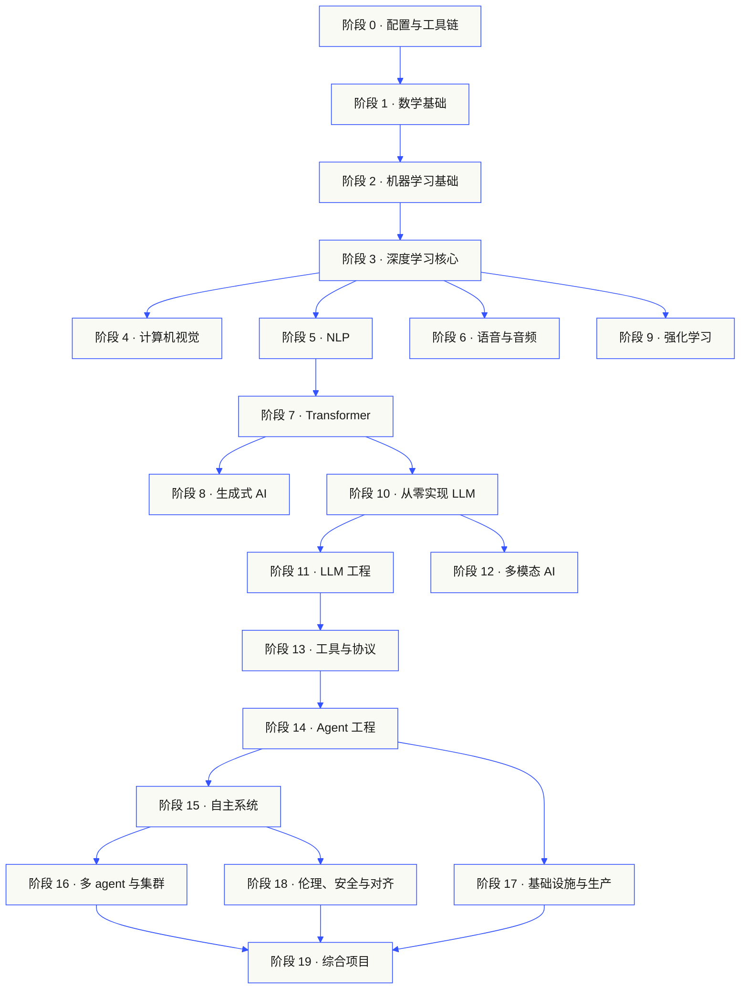

# AI 工程从零到一（中文）

<b>从零开始，亲手实现每一个 AI 算法</b><br/>
  <sub>523 节课 · 20 个阶段 · Python / TypeScript / Rust / Julia · 配套中文网站 <a href="https://aieng-zh.cn">aieng-zh.cn</a></sub>

  
  
  
  
  

```
░░░▒▒▒░░░▒▒▒░░░▒▒▒░░░▒▒▒░░░▒▒▒░░░▒▒▒░░░▒▒▒░░░▒▒▒░░░▒▒▒░░░▒▒▒░░░▒▒▒░░░▒▒▒░░░▒▒▒░░░▒▒▒░░░▒▒▒
```

> **84% 的学生已经在用 AI 工具，可只有 18% 觉得自己能在专业场景里用好它们。**
> 这套课程要填的就是这道沟。
>
> 523 节课，20 个阶段，约 348 小时。Python、TypeScript、Rust、Julia。每节课都交付一件
> 能复用的东西：一个提示词、一个技能、一个 agent、一个 MCP server。免费，开源，MIT。
>
> 你不只是学 AI，你亲手把它造出来。从头到尾，全手写。

> 本项目是 [AI Engineering from Scratch](https://github.com/rohitg00/ai-engineering-from-scratch)（作者 [Rohit Ghumare](https://github.com/rohitg00)，MIT 协议）的**简体中文衍生版**。衷心感谢原作者创作并开源了这套课程。

### 这个中文版做了什么

不是机器翻译堆出来的镜像。在忠实翻译之上，我们做了一套面向中文读者的本地化：

| | |
|---|---|
| 🇨🇳 **全站简体中文** | 523 节课正文、83 条术语表、测验题、`mermaid` 流程图、交互图表标签全部中文化（`agent`、`token`、`transformer` 等技术术语按惯例保留英文） |
| 🌐 **独立中文网站 [aieng-zh.cn](https://aieng-zh.cn)** | 可搜索的课程目录、[AI 工程学习路径](https://aieng-zh.cn/learning-paths.html)、学习进度追踪、可拖动的交互式图表、命令面板（`Cmd / Ctrl + K`）、深色模式 |
| 🎬 **配套动画讲解视频** | 3Blue1Brown 风格的无真人动画讲解，把每节课的数学推导与核心直觉做成可视化短片，中文配音、在课程页内嵌播放。Phase 1（数学基础 22 节）已上线，其余阶段陆续制作中——它是对动手推导的补充，不是替你跳过思考的速成视频 |
| 🔍 **为 AI 检索优化** | 构建时自动生成 `sitemap.xml` / `llms.txt` / 结构化数据，方便被搜索引擎和 AI 助手引用 |
| ✅ **课数一致性护栏** | CI 自动校验课程数（`node site/build.js --check`），防止课程列表与磁盘上的实际内容漂移 |

> 翻译怎么翻见 [TRANSLATION.md](https://github.com/fancyboi999/ai-engineering-from-scratch-zh/blob/109181ce68128c1bf27ec20867177007a8bace89/TRANSLATION.md)。课程结构、代码与上游保持一致，译文持续跟进上游更新。

**目录** · [怎么运作](#怎么运作) · [课程结构](#课程的结构) · [学习路径](https://aieng-zh.cn/learning-paths.html) · [一节课的样子](#一节课的样子) · [快速开始](#快速开始) · [每节课都有产出](#每节课都有产出) · [课程目录](#contents) · [工具箱](#工具箱) · [参与贡献](#参与贡献)

## 怎么运作

大多数 AI 教材都是碎片化教学。这儿一篇论文，那儿一篇微调心得，别处再来个炫酷的 agent
demo。这些碎片很少能拼到一起。你做出了一个聊天机器人，却讲不清它的 loss 曲线；你给
agent 挂了个函数，却说不出调用它的那个模型内部，attention 到底在干什么。

这套课程就是那根脊椎。20 个阶段，523 节课，四种语言：Python、TypeScript、Rust、Julia。
一头是线性代数，另一头是自主 agent 集群。每个算法都先从最原始的数学手写出来。反向传播、
分词器、注意力、agent 循环——等 PyTorch 登场时，你已经知道它底层在做什么了。

每节课都跑同一个循环：读懂问题、推导数学、写代码、跑测试、留下产物。没有五分钟速成视频，
没有复制粘贴式部署，没有手把手喂饭。免费，开源，在你自己的笔记本上就能跑。

```
░░░▒▒▒░░░▒▒▒░░░▒▒▒░░░▒▒▒░░░▒▒▒░░░▒▒▒░░░▒▒▒░░░▒▒▒░░░▒▒▒░░░▒▒▒░░░▒▒▒░░░▒▒▒░░░▒▒▒░░░▒▒▒░░░▒▒▒
```

## 课程的结构

二十个阶段层层叠起来。数学是地基，agent 和生产部署是屋顶。下层的东西你已经会了，就尽管
往前跳；但别跳过去之后，又回头纳闷上层为什么塌了。



```
░░░▒▒▒░░░▒▒▒░░░▒▒▒░░░▒▒▒░░░▒▒▒░░░▒▒▒░░░▒▒▒░░░▒▒▒░░░▒▒▒░░░▒▒▒░░░▒▒▒░░░▒▒▒░░░▒▒▒░░░▒▒▒░░░▒▒▒
```

## 一节课的样子

每节课都待在自己的文件夹里，整套课程结构统一：

```
