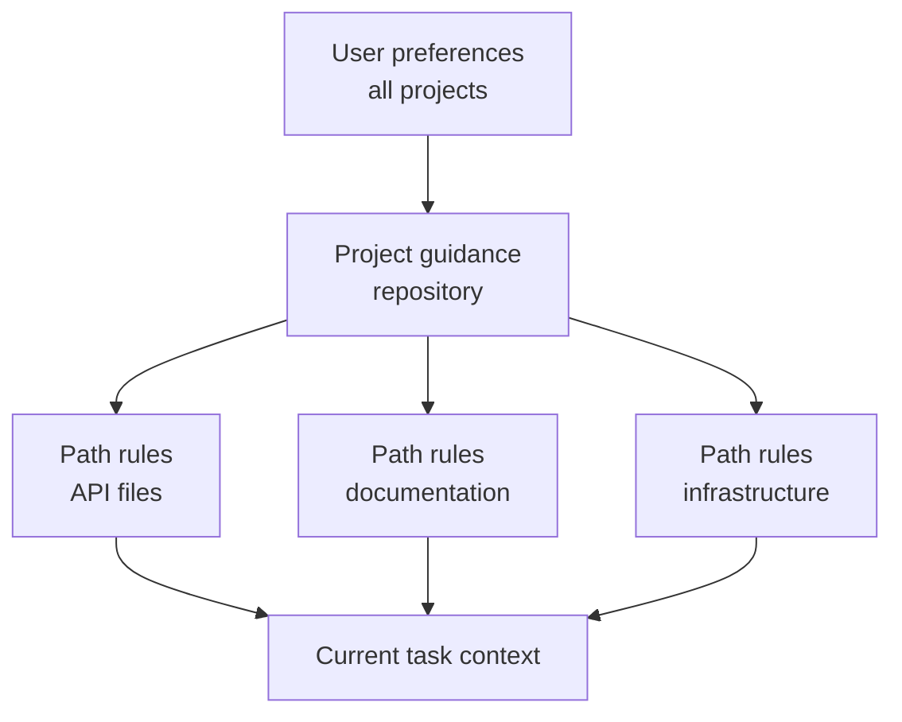

# Claude Code Memory, Rules, Skills, and CI

> Put stable guidance where its scope is true, and executable constraints where failure is unacceptable.

**Type:** Reference
**Languages:** Python
**Prerequisites:** [Claude Code Scales Through Shared Constraints](https://github.com/rohitg00/ai-engineering-from-scratch/blob/d18b8fe5a913c46011a3b06cb6ebd6a924414fd3/certifications/claude/lessons/15-claude-code-for-development-teams/README.md), [Agent SDK Sessions, Subagents, and Context](https://github.com/rohitg00/ai-engineering-from-scratch/blob/d18b8fe5a913c46011a3b06cb6ebd6a924414fd3/certifications/claude/lessons/17-agent-sdk-sessions-subagents-and-context/README.md)
**Time:** ~210 minutes

## Learning Objectives

- Design project and user instruction hierarchy without context bloat
- Choose CLAUDE.md, path rules, Skills, commands, agents, hooks, and settings by purpose
- Author and distribute a real multi-file `SKILL.md` package with narrow tool grants
- Use plan, direct execution, and bounded subagents with explicit obstacle reports
- Configure headless Claude Code for reproducible CI evidence
- Prevent stale memory, broad permissions, and hidden local configuration from controlling team work

## The Problem

A team keeps every instruction in one root `CLAUDE.md`: architecture history,
formatting, database rules, deployment steps, personal preferences, commands, and
examples for six languages. It is copied into every task.

Developers add private overrides. CI has a different configuration. One command
assumes write access. A broad hook reformats unrelated files. The instructions
say "always run every test," so a small docs edit triggers a 40-minute suite.
When the agent ignores a safety rule, the team adds more bold text.

The problem is not insufficient instruction. The problem is scope, precedence,
progressive disclosure, and confusing guidance with enforcement.

## The Concept

### Match the Mechanism to the Job

| Mechanism | Best use | Avoid |
|-----------|----------|-------|
| `CLAUDE.md` | Concise stable repository guidance and pointers | Full manuals, transient state, secrets |
| Imported files | Shared supporting instructions kept near their owners | Circular or invisible instruction graphs |
| Path rules | Guidance true only for matching files | Global rules copied into every task |
| Skill | Reusable process or domain playbook loaded when relevant | One-off facts or hard authorization |
| Command | Compatibility name for an explicit user-invoked workflow | New multi-step packages without Skill structure |
| Agent | Bounded role with isolated context and tools | Deterministic utility functions |
| Hook | Deterministic validation, blocking, normalization, or automation | Open-ended semantic judgment |
| Settings | Permission, model, plugin, and runtime configuration | Secret values committed to the repository |

Product note, verified 2026-08-09: custom commands have been merged into Skills.
Files under `.claude/commands/` remain compatible, while
`.claude/skills/<name>/SKILL.md` is the preferred package for new workflows.
Exact fields, precedence, and product availability can change. Verify the
current Claude Code documentation before implementation. The July 2026 CCAR-F
blueprint expects you to understand the hierarchy, rules, commands, Skills,
agents, memory, planning, and headless workflows.

### Keep the Root Instruction File Small

The root file should help a capable new contributor start correctly.

Include:

- project purpose and non-obvious architecture boundaries
- canonical build, test, and formatting commands
- source-of-truth files
- security and scope constraints
- links or imports to deeper guidance
- verification and contribution expectations

Exclude:

- temporary task status
- generated inventories
- long API references
- personal editor settings
- secret values
- instructions that apply only to one directory

Treat it as an onboarding router, not a knowledge dump.

### Place Instructions at the Narrowest True Scope

User scope holds personal defaults that should not define team behavior. Project
scope holds versioned shared decisions. Path-specific rules load only where
their file patterns apply. Task instructions contain the current request.

When two rules conflict, investigate the documented precedence and make the
project source of truth explicit. Do not depend on a hidden local override for a
critical workflow.

### Import Stable Supporting Guidance

Use imports to keep the root file concise while preserving modular ownership.
For example, database migration policy belongs near database documentation. A
root pointer keeps it discoverable.

Audit the import graph:

- every target exists
- no cycles
- no broad file import leaks secrets or irrelevant text
- ownership and update trigger are clear
- deleted or renamed guidance fails visibly

Memory inspection commands can help reveal which instructions are active. Use
them to debug configuration, not to store unrecoverable project state.

### Use Skills for Progressive Disclosure

A Skill packages a repeatable method, references, scripts, and artifacts. Its
description helps the agent decide when it applies. The full body loads only
when selected, protecting context for unrelated work.

Good Skills:

- database migration review
- incident triage
- release-note generation
- threat-model checklist
- architecture decision interview

The Skill should define inputs, sequence, evidence, output, and stop conditions.
It should not embed secrets or grant permissions.
