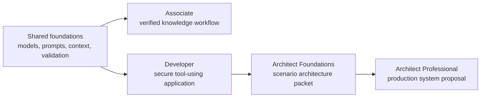

# Claude Certification Curriculum

> Learn the judgment behind the answers by building the systems the exams describe.

**Status:** Local preview
**Guide version:** 1.0
**Guide effective date:** July 2026
**Last verified:** 2026-08-09

This free curriculum covers:

| Exam | Credential | Items | Time | Fee | Core route |
|------|------------|------:|-----:|----:|-----------:|
| CCAO-F | Claude Certified Associate - Foundations | 60 | 120 min | $99 | 9 lessons |
| CCDV-F | Claude Certified Developer - Foundations | 53 | 120 min | $125 | 15 lessons |
| CCAR-F | Claude Certified Architect - Foundations | 60 | 120 min | $125 | 21 lessons |
| CCAR-P | Claude Certified Architect - Professional | 63 | 120 min | $175 | 25 lessons |

All four guides use a scaled passing score of 720 on a 100 to 1,000 scale and
state a 12-month credential validity period. Confirm facts in the official
guide before registering because program details can change.

As verified on August 9, 2026, official exam registration is limited to people
at Claude Partner Network organizations and requires a recognized
partner-company email. This curriculum remains open to everyone, including
learners who want the skills without sitting an exam. Check the current
[certification FAQ](https://anthropic-partners.skilljar.com/page/faq-certifications)
before paying or scheduling because eligibility can change.

## Learn From GitHub With an AI Tutor

This curriculum is AI-native. Claude Code, Codex, ChatGPT, Cursor, or another
agent can teach the route step by step, run the checked-in lab, review the
artifact you build, administer the lesson quiz, and resume from saved progress.

Start with the [GitHub learner guide](/lib/07-coding/ai-engineering-from-scratch/certifications-claude-GETTING_STARTED), or install the
[portable certification tutor skill](https://github.com/rohitg00/ai-engineering-from-scratch/blob/d18b8fe5a913c46011a3b06cb6ebd6a924414fd3/skills/claude-certification/SKILL.md):

```bash
npx skills add rohitg00/ai-engineering-from-scratch
```

Then ask your agent to run:

```text
/claude-certification
```

A local Claude Code session discovers the same skill from `.claude/skills/`
after you clone the repository. Harnesses without slash-command support can
read `GETTING_STARTED.md` and the tutor skill directly. Learner progress lives
in `CLAUDE-CERTIFICATION.md`; learner work lives under
`learning-artifacts/claude/`. The checked-in `outputs/` files remain reference
artifacts and are never overwritten.

## What You Build

The routes share foundations and then diverge by role:



- Associate: a governed knowledge-work workflow with evidence and escalation.
- Developer: a protocol-first Claude application with tools, tests, security,
  and evaluation.
- Architect Foundations: an architecture decision record, threat model,
  evaluator, context plan, and failure-recovery runbook.
- Architect Professional: a complete discovery-to-operations architecture
  packet with RAG, integration, evaluation, governance, SLAs, and ownership.

Each track includes a short diagnostic and a full-length original mock with the
same item count as its public guide. The question mix follows blueprint weights
within practical rounding. It does not imitate or reproduce live questions.

## GitHub Lesson Index

The tutor reads each selected track file for route order. This complete index
also makes every shared lesson directly browsable from GitHub.

| # | Lesson |
|---:|--------|
| 00 | [Study the Decisions, Not the Vocabulary](https://github.com/rohitg00/ai-engineering-from-scratch/blob/d18b8fe5a913c46011a3b06cb6ebd6a924414fd3/certifications/claude/lessons/00-certification-strategy/README.md) |
| 01 | [Choose the Smallest Surface That Can Carry the Work](https://github.com/rohitg00/ai-engineering-from-scratch/blob/d18b8fe5a913c46011a3b06cb6ebd6a924414fd3/certifications/claude/lessons/01-claude-product-and-model-landscape/README.md) |
| 02 | [Spend Capability Where Failure Is Expensive](https://github.com/rohitg00/ai-engineering-from-scratch/blob/d18b8fe5a913c46011a3b06cb6ebd6a924414fd3/certifications/claude/lessons/02-model-selection-and-token-economics/README.md) |
| 03 | [Turn a Request Into a Testable Contract](https://github.com/rohitg00/ai-engineering-from-scratch/blob/d18b8fe5a913c46011a3b06cb6ebd6a924414fd3/certifications/claude/lessons/03-prompting-and-task-decomposition/README.md) |
| 04 | [Put Each Fact in the Right Kind of Context](https://github.com/rohitg00/ai-engineering-from-scratch/blob/d18b8fe5a913c46011a3b06cb6ebd6a924414fd3/certifications/claude/lessons/04-context-knowledge-memory-and-caching/README.md) |
| 05 | [Validate the Claim, Not the Confidence](https://github.com/rohitg00/ai-engineering-from-scratch/blob/d18b8fe5a913c46011a3b06cb6ebd6a924414fd3/certifications/claude/lessons/05-output-evaluation-and-validation/README.md) |
| 06 | [Put Authority Around Capability](https://github.com/rohitg00/ai-engineering-from-scratch/blob/d18b8fe5a913c46011a3b06cb6ebd6a924414fd3/certifications/claude/lessons/06-governance-safety-and-responsible-use/README.md) |
| 07 | [Design the Handoff Before the Automation](https://github.com/rohitg00/ai-engineering-from-scratch/blob/d18b8fe5a913c46011a3b06cb6ebd6a924414fd3/certifications/claude/lessons/07-workflow-design-and-human-handoffs/README.md) |
| 08 | [The Messages API Is a State Machine](https://github.com/rohitg00/ai-engineering-from-scratch/blob/d18b8fe5a913c46011a3b06cb6ebd6a924414fd3/certifications/claude/lessons/08-messages-api-and-application-lifecycle/README.md) |
| 09 | [Structured Output Is an Untrusted Contract](https://github.com/rohitg00/ai-engineering-from-scratch/blob/d18b8fe5a913c46011a3b06cb6ebd6a924414fd3/certifications/claude/lessons/09-structured-output-and-defensive-parsing/README.md) |
| 10 | [A Tool Loop Is Controlled Delegation](https://github.com/rohitg00/ai-engineering-from-scratch/blob/d18b8fe5a913c46011a3b06cb6ebd6a924414fd3/certifications/claude/lessons/10-tool-use-and-agentic-loops/README.md) |
| 11 | [MCP Separates Capability From Host](https://github.com/rohitg00/ai-engineering-from-scratch/blob/d18b8fe5a913c46011a3b06cb6ebd6a924414fd3/certifications/claude/lessons/11-mcp-server-design-and-integration/README.md) |
| 12 | [The Agent SDK Is a Harness, Not Permission](https://github.com/rohitg00/ai-engineering-from-scratch/blob/d18b8fe5a913c46011a3b06cb6ebd6a924414fd3/certifications/claude/lessons/12-claude-agent-sdk-and-hooks/README.md) |
| 13 | [Security Lives Outside the Prompt](https://github.com/rohitg00/ai-engineering-from-scratch/blob/d18b8fe5a913c46011a3b06cb6ebd6a924414fd3/certifications/claude/lessons/13-application-security-and-secrets/README.md) |
| 14 | [Evals Turn Agent Behavior Into Engineering Evidence](https://github.com/rohitg00/ai-engineering-from-scratch/blob/d18b8fe5a913c46011a3b06cb6ebd6a924414fd3/certifications/claude/lessons/14-evals-testing-debugging-and-observability/README.md) |
| 15 | [Claude Code Scales Through Shared Constraints](https://github.com/rohitg00/ai-engineering-from-scratch/blob/d18b8fe5a913c46011a3b06cb6ebd6a924414fd3/certifications/claude/lessons/15-claude-code-for-development-teams/README.md) |
| 16 | [Multi-Agent Orchestration and Delegation](https://github.com/rohitg00/ai-engineering-from-scratch/blob/d18b8fe5a913c46011a3b06cb6ebd6a924414fd3/certifications/claude/lessons/16-multi-agent-orchestration-and-delegation/README.md) |
| 17 | [Agent SDK Sessions, Subagents, and Context](https://github.com/rohitg00/ai-engineering-from-scratch/blob/d18b8fe5a913c46011a3b06cb6ebd6a924414fd3/certifications/claude/lessons/17-agent-sdk-sessions-subagents-and-context/README.md) |
| 18 | [Tool Contracts, Errors, and Progressive Discovery](https://github.com/rohitg00/ai-engineering-from-scratch/blob/d18b8fe5a913c46011a3b06cb6ebd6a924414fd3/certifications/claude/lessons/18-tool-contracts-errors-and-progressive-discovery/README.md) |
| 19 | [Claude Code Memory, Rules, Skills, and CI](https://github.com/rohitg00/ai-engineering-from-scratch/blob/d18b8fe5a913c46011a3b06cb6ebd6a924414fd3/certifications/claude/lessons/19-claude-code-memory-rules-skills-and-ci/README.md) |
| 20 | [Reliable Extraction, Batch, and Independent Reviewers](https://github.com/rohitg00/ai-engineering-from-scratch/blob/d18b8fe5a913c46011a3b06cb6ebd6a924414fd3/certifications/claude/lessons/20-reliable-extraction-batch-and-reviewers/README.md) |
| 21 | [Make Large Context Observable](https://github.com/rohitg00/ai-engineering-from-scratch/blob/d18b8fe5a913c46011a3b06cb6ebd6a924414fd3/certifications/claude/lessons/21-long-context-reliability-provenance-and-escalation/README.md) |
| 22 | [Business Discovery, Requirements, and SLAs](https://github.com/rohitg00/ai-engineering-from-scratch/blob/d18b8fe5a913c46011a3b06cb6ebd6a924414fd3/certifications/claude/lessons/22-business-discovery-requirements-and-slas/README.md) |
| 23 | [End-to-End Architecture and Value Tradeoffs](https://github.com/rohitg00/ai-engineering-from-scratch/blob/d18b8fe5a913c46011a3b06cb6ebd6a924414fd3/certifications/claude/lessons/23-end-to-end-architecture-and-value-tradeoffs/README.md) |
| 24 | [RAG, Retrieval, and Data Pipelines](https://github.com/rohitg00/ai-engineering-from-scratch/blob/d18b8fe5a913c46011a3b06cb6ebd6a924414fd3/certifications/claude/lessons/24-rag-retrieval-and-data-pipelines/README.md) |
| 25 | [Integration Protocols, Identity, and Least Privilege](https://github.com/rohitg00/ai-engineering-from-scratch/blob/d18b8fe5a913c46011a3b06cb6ebd6a924414fd3/certifications/claude/lessons/25-integration-protocols-identity-and-least-privilege/README.md) |
| 26 | [Production Observability, Latency, and Cost](https://github.com/rohitg00/ai-engineering-from-scratch/blob/d18b8fe5a913c46011a3b06cb6ebd6a924414fd3/certifications/claude/lessons/26-production-observability-latency-and-cost/README.md) |
| 27 | [Enterprise Governance, Compliance, and Human Review](https://github.com/rohitg00/ai-engineering-from-scratch/blob/d18b8fe5a913c46011a3b06cb6ebd6a924414fd3/certifications/claude/lessons/27-enterprise-governance-compliance-and-hitl/README.md) |
| 28 | [Stakeholder Communication, ADRs, and Lifecycle Ownership](https://github.com/rohitg00/ai-engineering-from-scratch/blob/d18b8fe5a913c46011a3b06cb6ebd6a924414fd3/certifications/claude/lessons/28-stakeholder-communication-adrs-and-lifecycle/README.md) |
| 29 | [Ship a Week of Work, Not a Perfect Prompt](https://github.com/rohitg00/ai-engineering-from-scratch/blob/d18b8fe5a913c46011a3b06cb6ebd6a924414fd3/certifications/claude/lessons/29-associate-workflow-capstone/README.md) |
| 30 | [Ship a Claude Application You Can Defend](https://github.com/rohitg00/ai-engineering-from-scratch/blob/d18b8fe5a913c46011a3b06cb6ebd6a924414fd3/certifications/claude/lessons/30-developer-application-capstone/README.md) |
| 31 | [Defend One Architecture Across Six Contexts](https://github.com/rohitg00/ai-engineering-from-scratch/blob/d18b8fe5a913c46011a3b06cb6ebd6a924414fd3/certifications/claude/lessons/31-architect-foundations-scenario-capstone/README.md) |
| 32 | [Architect Professional System Capstone](https://github.com/rohitg00/ai-engineering-from-scratch/blob/d18b8fe5a913c46011a3b06cb6ebd6a924414fd3/certifications/claude/lessons/32-architect-professional-system-capstone/README.md) |

## Local Preview

From the repository root:

```bash
node site/build.js
python3 scripts/audit_certifications.py
python3 -m http.server 4173 --bind 127.0.0.1
```

Then open:

```text
http://127.0.0.1:4173/site/certifications.html
```

The server must start at the repository root so local, unpushed lesson files
remain readable by the lesson viewer.

The certification curriculum is published through GitHub and the website. It
is intentionally outside the EPUB/PDF book workflow because its tutor state,
runnable labs, assessments, and interactive mechanisms are part of the course.

## Research Trail

- [CCAR-F exact mechanics review](/lib/07-coding/ai-engineering-from-scratch/certifications-claude-references-ccar-f-exact-mechanics)
- [Official Anthropic Academy parity map](/lib/07-coding/ai-engineering-from-scratch/certifications-claude-research-official-academy-parity)
- [Official blueprint map](/lib/07-coding/ai-engineering-from-scratch/certifications-claude-research-official-blueprint-map)
- [Source verification ledger](/lib/07-coding/ai-engineering-from-scratch/certifications-claude-research-source-verification-ledger)
- [YouTube source review](/lib/07-coding/ai-engineering-from-scratch/certifications-claude-research-youtube-source-review)
- [Recent community signal](/lib/07-coding/ai-engineering-from-scratch/certifications-claude-research-recent-community-signal)

## Independence and Exam Integrity

This is an independent community curriculum. It is not affiliated with,
endorsed by, sponsored by, or authorized by Anthropic. Claude and certification
names identify the program being studied.

The curriculum uses public objectives and original scenarios. It does not use
confidential exam content. If you sit an exam, follow its nondisclosure and
candidate-conduct rules.
