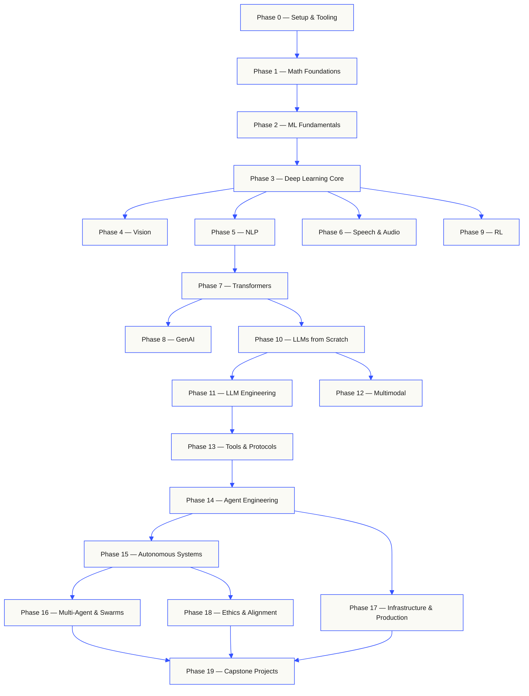

## 课程的整体结构

Twenty phases stack on top of each other. Math is the floor. Agents and production are the roof.
Skip ahead if you already know the lower layers, but don't skip and then wonder why something at
the top is breaking.



```text
░░░▒▒▒░░░▒▒▒░░░▒▒▒░░░▒▒▒░░░▒▒▒░░░▒▒▒░░░▒▒▒░░░▒▒▒░░░▒▒▒░░░▒▒▒░░░▒▒▒░░░▒▒▒░░░▒▒▒░░░▒▒▒░░░▒▒▒
```
