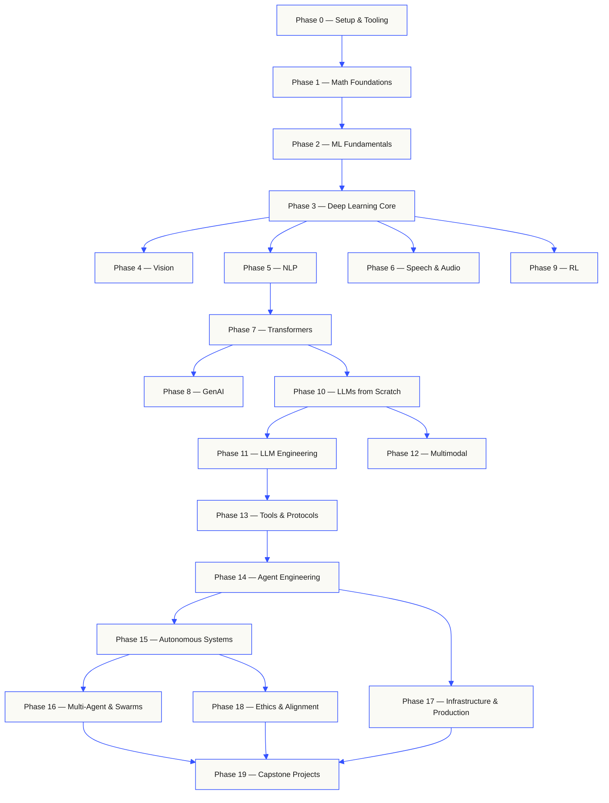

# AI Engineering from Scratch（英文原版）

<b>Read in your language:</b>
[Türkçe](https://github.com/rohitg00/ai-engineering-from-scratch/blob/d18b8fe5a913c46011a3b06cb6ebd6a924414fd3/i18n/tr/README.md)
  <br><sub>Translated landing pages, committed to the repo. English is canonical; lesson pages are machine-translated on the <code>translations</code> branch. See <a href="https://github.com/rohitg00/ai-engineering-from-scratch/blob/d18b8fe5a913c46011a3b06cb6ebd6a924414fd3/docs/i18n.md">docs/i18n.md</a>.</sub>

  
  
  
  
  

```text
░░░▒▒▒░░░▒▒▒░░░▒▒▒░░░▒▒▒░░░▒▒▒░░░▒▒▒░░░▒▒▒░░░▒▒▒░░░▒▒▒░░░▒▒▒░░░▒▒▒░░░▒▒▒░░░▒▒▒░░░▒▒▒░░░▒▒▒
```

> **84% of students already use AI tools. Only 18% feel prepared to use them
> professionally.** This curriculum closes that gap.
>
> 523 lessons. 20 phases. ~342 hours. Python, TypeScript, Rust, Julia. Every lesson ships
> a reusable artifact: a prompt, a skill, an agent, an MCP server. Free, open source, MIT.
>
> You don't just learn AI. You build it. End-to-end. By hand.

## Start here: choose what you want to build

You do not need to scan 523 lessons before beginning. Pick one goal. Each link
opens the same curriculum on GitHub or the website, and both versions use the
same lesson code.

| Your goal | Learn on GitHub | Learn on the website |
|---|---|---|
| I am new and want the complete foundation | [Phase 0: Setup and Tooling](https://github.com/rohitg00/ai-engineering-from-scratch/blob/d18b8fe5a913c46011a3b06cb6ebd6a924414fd3/phases/00-setup-and-tooling/README.md) | [Dev Environment](https://aiengineeringfromscratch.com/lesson?path=phases/00-setup-and-tooling/01-dev-environment) |
| I know Python and want math plus ML foundations | [Phase 1: Math Foundations](https://github.com/rohitg00/ai-engineering-from-scratch/blob/d18b8fe5a913c46011a3b06cb6ebd6a924414fd3/phases/01-math-foundations/README.md) | [Linear Algebra Intuition](https://aiengineeringfromscratch.com/lesson?path=phases/01-math-foundations/01-linear-algebra-intuition) |
| I want to build production LLM applications | [Phase 11: LLM Engineering](https://github.com/rohitg00/ai-engineering-from-scratch/blob/d18b8fe5a913c46011a3b06cb6ebd6a924414fd3/phases/11-llm-engineering/README.md) | [Prompt Engineering](https://aiengineeringfromscratch.com/lesson?path=phases/11-llm-engineering/01-prompt-engineering) |
| I want to build agents | [Phase 14: Agent Engineering](https://github.com/rohitg00/ai-engineering-from-scratch/blob/d18b8fe5a913c46011a3b06cb6ebd6a924414fd3/phases/14-agent-engineering/README.md) | [The Agent Loop](https://aiengineeringfromscratch.com/lesson?path=phases/14-agent-engineering/01-the-agent-loop) |
| I want to use coding agents on real repositories | [Agent-Assisted Engineering path](https://github.com/rohitg00/ai-engineering-from-scratch/blob/d18b8fe5a913c46011a3b06cb6ebd6a924414fd3/learning-paths/using-coding-agents.json) | [Agent-Assisted Engineering](https://aiengineeringfromscratch.com/lesson?path=phases/14-agent-engineering/31-agent-workbench-why-models-fail&learningPath=using-coding-agents) |
| I want to shape the right build before implementation | [Product Judgment and Delivery path](https://github.com/rohitg00/ai-engineering-from-scratch/blob/d18b8fe5a913c46011a3b06cb6ebd6a924414fd3/learning-paths/shaping-the-build.json) | [Product Judgment and Delivery](https://aiengineeringfromscratch.com/lesson?path=phases/14-agent-engineering/47-outcomes-before-output&learningPath=shaping-the-build) |
| I want to build with Model Context Protocol (MCP) | [Model Context Protocol (MCP) route](https://github.com/rohitg00/ai-engineering-from-scratch/blob/d18b8fe5a913c46011a3b06cb6ebd6a924414fd3/phases/13-tools-and-protocols/README.md#model-context-protocol-mcp-path) | [Model Context Protocol (MCP) path](https://aiengineeringfromscratch.com/lesson?path=phases/13-tools-and-protocols/06-mcp-fundamentals&learningPath=model-context-protocol) |
| I want to write and ship Agent Skills | [Focused Agent Skills route](https://github.com/rohitg00/ai-engineering-from-scratch/blob/d18b8fe5a913c46011a3b06cb6ebd6a924414fd3/phases/13-tools-and-protocols/README.md#agent-skills-fast-path) | [Agent Skills path](https://aiengineeringfromscratch.com/lesson?path=phases/13-tools-and-protocols/22-skills-and-agent-sdks&learningPath=agent-skills) |
| I want to prepare for a Claude certification | [Certification onboarding](/lib/07-coding/ai-engineering-from-scratch/certifications-claude-GETTING_STARTED) | [Certification Academy](https://aiengineeringfromscratch.com/certifications.html) |

Not sure where you fit? Use the [`start-learning` placement tutor](https://github.com/rohitg00/ai-engineering-from-scratch/blob/d18b8fe5a913c46011a3b06cb6ebd6a924414fd3/skills/start-learning/SKILL.md)
or the [website prerequisites guide](https://aiengineeringfromscratch.com/prereqs.html).

Compare four core domains and six career routes in the [AI Engineering Learning Paths](https://aiengineeringfromscratch.com/learning-paths.html).

### Use every lesson the same way

1. **Read** `docs/en.md` and explain the core idea in your own words.
2. **Type and build** the important code instead of treating the code block as decoration.
3. **Run** the lesson command from the repository root, the directory containing `README.md` and `phases/`.
4. **Keep evidence**: the command, working directory, exit code, meaningful output, and the artifact you changed or produced.
5. **Continue** only when you can explain the output and make one small change without guessing.

Commands in lesson pages are paths from the repository root unless the lesson
explicitly says to change directories. If a lesson offers several languages,
run the implementation for the language you are learning.

### Clone it and produce your first evidence

```bash
git clone https://github.com/rohitg00/ai-engineering-from-scratch.git
cd ai-engineering-from-scratch
python3 phases/00-setup-and-tooling/01-dev-environment/code/verify.py --route beginner
python3 phases/01-math-foundations/01-linear-algebra-intuition/code/vectors.py
```

The preflight separates requirements needed now from tools needed later. Every
required failure includes the detected reason and a corrective command. The
second command is a dependency-free lesson and ends by showing that a matrix
times a vector is the operation inside a neural network layer. Save that
terminal output as your first evidence.

## Add the AI tutor in 30 seconds

If Node.js, `npx`, and a skill-capable coding agent are already installed,
your coding agent can become your tutor in two commands. A repository clone is
not needed to install or read the tutor. Runnable focused-path labs need
`python3`. Agent Skills host labs also need a selected host and a writable
user or project skill scope.

Check the local requirements first:

```bash
node --version
npx --version
python3 --version
```

Then install the curriculum skills and choose the host and scope you intend to
use when the installer asks:

```bash
npx skills add rohitg00/ai-engineering-from-scratch
```

Invocation syntax belongs to the host, not to the portable `SKILL.md` format:

| Host | Start the course | Start Model Context Protocol (MCP) | Start Agent Skills | Run a phase quiz |
|---|---|---|---|---|
| Codex | `start-learning`, or choose it from `/skills` | `learn-mcp`, or choose it from `/skills` | `learn-agent-skills`, or choose it from `/skills` | `check-understanding 13`, or choose it from `/skills` |
| Claude Code | `/start-learning` | `/learn-mcp` | `/learn-agent-skills` | `/check-understanding 13` |
| Other compatible hosts | `Use start-learning to begin the course.` | `Use learn-mcp to start the Model Context Protocol (MCP) path.` | `Use learn-agent-skills to start the Agent Skills Engineering path.` | `Use check-understanding to quiz me on Phase 13.` |

A ten-question placement quiz maps what you already know to a starting phase and
saves a personalized study plan to `LEARNING.md`. From there, the `learn` skill
teaches one lesson per session: concept, math, code, quiz. It streams lessons
straight from this repo, and the `course-guide` skill jumps you to the exact
lesson that covers anything you are stuck on. In Codex, invoke these skills with
`learn` and `course-guide`; in Claude Code, use `/learn` and `/course-guide`;
in other compatible hosts, ask to use the skill by name.

Only want Model Context Protocol (MCP)? Use the MCP invocation for your host. It creates
`MCP-LEARNING.md` and follows one 17-lesson route through stateless
requests, transports, bidirectional work, security, reliability, registry
governance, and conformance evidence. The exact order and checkpoints live in
the [Model Context Protocol (MCP) manifest](https://github.com/rohitg00/ai-engineering-from-scratch/blob/d18b8fe5a913c46011a3b06cb6ebd6a924414fd3/learning-paths/model-context-protocol.json).

Only want Agent Skills? Use the Agent Skills invocation for your host. It
creates `AGENT-SKILLS-LEARNING.md` and follows one coherent five-lesson route:
contract, discovery, invocation, sandbox boundaries, then release evals and
real-host portability. Start on the web with the
[Agent Skills path](https://aiengineeringfromscratch.com/lesson?path=phases/13-tools-and-protocols/22-skills-and-agent-sdks&learningPath=agent-skills).

The installer lists the hosts it can configure and asks where to install. If
you do not have Node.js, `npx`, `python3`, a supported host, or a writable
scope yet, use the website or read `docs/en.md` manually. That path teaches the
concepts, but real-host discovery, invocation, script, and uninstall evidence
remains pending until the preflight is available. Read the lessons at
[aiengineeringfromscratch.com](https://aiengineeringfromscratch.com).

## How this works

Most AI material teaches in scattered pieces. A paper here, a fine-tuning post there, a
flashy agent demo somewhere else. The pieces rarely line up. You ship a chatbot but can't
explain its loss curve. You hook a function to an agent but can't say what attention does
inside the model that's calling it.

This curriculum is the spine. 20 phases, 523 lessons, four languages: Python, TypeScript,
Rust, Julia. Linear algebra at one end, autonomous swarms at the other. Every algorithm
gets built from raw math first. Backprop. Tokenizer. Attention. Agent loop. By the time
PyTorch shows up, you already know what it's doing under the hood.

Each lesson runs the same loop: read the problem, derive the math, write the code, run
the test, keep the artifact. No five-minute videos, no copy-paste deploys, no hand-holding.
Free, open source, and built to run on your own laptop.

```text
░░░▒▒▒░░░▒▒▒░░░▒▒▒░░░▒▒▒░░░▒▒▒░░░▒▒▒░░░▒▒▒░░░▒▒▒░░░▒▒▒░░░▒▒▒░░░▒▒▒░░░▒▒▒░░░▒▒▒░░░▒▒▒░░░▒▒▒
```

## The shape of the curriculum

Twenty phases stack on top of each other. Math is the floor. Agents and production are the roof.
Skip ahead if you already know the lower layers, but don't skip and then wonder why something at
the top is breaking.



```text
░░░▒▒▒░░░▒▒▒░░░▒▒▒░░░▒▒▒░░░▒▒▒░░░▒▒▒░░░▒▒▒░░░▒▒▒░░░▒▒▒░░░▒▒▒░░░▒▒▒░░░▒▒▒░░░▒▒▒░░░▒▒▒░░░▒▒▒
```

## The shape of a lesson

Each lesson lives in its own folder, with the same structure across the entire curriculum:

```text
