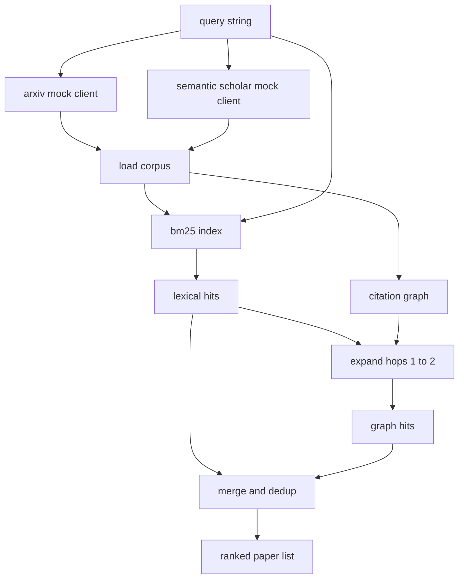

# Literature Retrieval

> A hypothesis is cheap. Knowing whether someone already proved it is the expensive part. Build the retrieval layer that answers that question before the runner spins up a sandbox.

**Type:** Build
**Languages:** Python
**Prerequisites:** Phase 19 Track A lessons 20-29
**Time:** ~90 minutes

## Learning Objectives
- Model a small paper record with the fields the loop will read downstream.
- Build a BM25 index over abstracts with stdlib data structures only.
- Walk a citation graph to surface papers the lexical search missed.
- Deduplicate hits across the lexical and graph passes by stable paper id.
- Wrap two mock external APIs behind a single client so the upstream call site stays the same when real endpoints land.

## Why two retrieval passes

A keyword search over abstracts returns papers that share vocabulary with the query. That covers most of the surface. It misses two cases. The first is when the foundational paper uses different vocabulary; for example a query for "sparse attention" misses a paper titled "block selection in transformer routing." The second is when the relevant paper is a follow up that cites a known anchor; it is more efficient to find the anchor and walk forward than to brute force the abstract pool.

The lesson builds both passes. BM25 over abstracts catches the lexical hits. A citation graph traversal expands a seed set forward and backward by one or two hops. The union is deduplicated by paper id and ranked by a small combined score.

## The Paper shape

```text
Paper
  id          : str           (stable identifier, "p001" for the mock corpus)
  title       : str
  abstract    : str
  year        : int
  authors     : list[str]
  references  : list[str]     (paper ids this paper cites)
  citations   : list[str]     (paper ids that cite this paper)
  source      : str           (which mock api supplied it, "arxiv" or "s2")
```

The references and citations fields form the directed citation graph. The two mock APIs return overlapping but not identical fields, so the corpus loader unions them on `id`.

```figure
cg-citation-hops
```

## Architecture



The retrieval client owns both passes and the merge. The caller hands it a query and gets back a ranked list where each entry carries per paper score fields (`bm25_score`, `graph_distance`, `recency_score`, `final_score`) that explain the ranking.

## BM25 from scratch

The implementation is the standard Okapi BM25 with default parameters `k1=1.5`, `b=0.75`. The index is two dictionaries: `term -> doc_frequency` and `term -> list of (doc_id, term_count)`. The document length is the token count of the abstract. The average document length is computed once at index build time. Scoring a query is a sum over query terms of `idf * tf_norm` where `tf_norm` is the standard BM25 length normalised term frequency.

The tokeniser is `lower` then split on non alphanumeric. It is not stemmed. A production system would swap in a small stemmer. The interface stays the same.

```text
idf(t)      = log((N - df + 0.5) / (df + 0.5) + 1.0)
tf_norm(t)  = (f * (k1 + 1)) / (f + k1 * (1 - b + b * dl / avgdl))
score(d, q) = sum over t in q of idf(t) * tf_norm(t)
```
