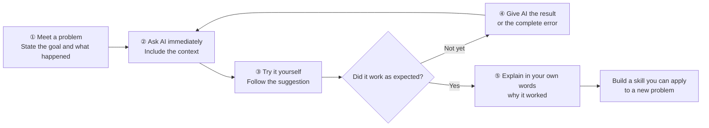

# Beginner Level 2: Learn AI Programming Tools

## Learn Actively with AI

::: tip 💡 The most important learning rule: when you have a question, ask AI first
From now on, treat AI as your **first place to ask for help**. Whether a concept is unclear, a tool will not install, you do not know a command, your program reports an error, or you simply do not know what to do next, **ask AI first and then try the answer yourself**.

Questions you would once have taken to a teacher, classmate, or group chat can usually go to AI first. It responds quickly, accepts follow-up questions, and can use your error message and project context to suggest the next step. Do not wait until you have been stuck for a long time, and do not use AI only when you want it to write code.

**AI-native learning is not merely completing work with AI. It means involving AI throughout the learning process: ask when a problem appears, try the answer, and ask again when the result raises a new question.**
:::

### The AI-Native Learning Loop

Active learning with AI does not mean handing over the task and waiting. AI shortens the time needed to find an answer, so you can spend more time **trying, checking, and understanding**. Use this loop throughout the course:

### Questions You Can Ask Directly

| What happened | What you can say to AI |
| --- | --- |
| **A concept is unclear** | “I have no programming background. Explain an API with an everyday analogy, then give me the smallest example.” |
| **You cannot install the environment** | “I use macOS and want to run this project. First check what I need, then guide me through one step at a time and explain what each step does.” |
| **A command reports an error** | “Here are the command and the complete error. First identify the most likely cause, then give me the smallest fix. If you need more information, tell me what to provide.” |
| **You do not know what comes next** | “My goal is to build Snake, and the game screen already appears. Tell me the smallest next step and how I will know it is finished.” |
| **AI wrote code you do not understand** | “Do not change more code yet. Explain the last change module by module and what problem each part solves.” |
| **You cannot choose between two options** | “I am a beginner and want a runnable version quickly. Compare options A and B under those conditions and recommend one clearly.” |
| **The result differs from your expectation** | “I expected the page to look like this: …; it currently looks like this: …. Compare them and fix only the most obvious difference first.” |

::: info A reusable question template
**My goal is …; I have completed …; I tried …; the actual result or full error is …; please explain the cause first, then give me the smallest next action.**

The more concrete the information, the more useful the answer will be. It is normal if the first answer does not solve the problem. Send the new result back to AI—that follow-up is part of AI-native learning.
:::

## Chapter Overview

Previously, we experienced AI programming on z.ai, but the web version has many limitations — you **can't save your work anytime**, it's **hard to manage files**, and you **can't handle complex projects**. This chapter helps you move your development environment to your own computer so you can **truly build things independently**.

We'll first clarify **what the difference is between an IDE and an AI IDE**, and why the latter can **double your efficiency**. Then we'll **walk you through step by step** using Trae to build a Snake game locally, covering the **complete workflow** from installation to running. Finally, we'll share some **practical tips** for communicating with AI so you can avoid common pitfalls.

After completing this chapter, you'll have **mastered a development workflow similar to that of professional programmers**.

::: tip 💡 Advanced Tip
If you have some programming experience and want to use more powerful tools early on, you can refer to [Modern CLI Coding Tools](https://github.com/datawhalechina/easy-vibe/blob/130e9b75b28b524e8cc74e615fd9733a4e2b330d/docs/en/stage-2/backend/modern-cli/README.md) to develop using the command line.
:::

## 1. What Environment and Tools Do You Need to Write Code

### 1.1 Mindset Shift: When in Doubt, Ask AI First

Before we introduce the various environments and tools, here's an important reminder: you need to **change your thinking habits**.

In traditional programming learning, if you need to install Python, configure Conda, or fix an npm installation failure, you'd typically open a search engine, find a tutorial, and follow the steps one by one. If you hit an error along the way, you'd search for the error message and try again repeatedly.

Wrong! ❌

In the AI era, especially when using an AI IDE, remember one core principle: **For any task, you can ask AI first, or even let it do it for you.**

- **Don't know how to set up your environment?** Just ask AI in the sidebar: "I want to write Python. Please check if Python is installed, and if not, install it for me."
- **Network stuck?** If installing dependencies keeps spinning or throwing errors, just throw the error to AI: "The download failed. Is it a network issue? Can you help me switch to a different mirror source?"
- **Can't remember commands?** No need to memorize Git or Conda commands. Just tell AI: "Help me create a new virtual environment called demo."

### 1.2 Why You Need an Environment and Tools

Going from "trying to write a few lines of code" to "building a long-term maintainable project" requires completely different environments and tools.

In theory, you could write code with the system's built-in Notepad, but problems quickly arise:

- **All code is plain black text** — keywords, strings, and comments are all mixed together, making it hard to see the structure at a glance
- **No smart suggestions** — you have to type every word completely by hand, and a single typo means repeatedly checking your code
- **Files become chaotic** — switching back and forth between dozens of files, often unable to find the line you need to edit
- **Debugging is guesswork** — when the program crashes, you don't know what went wrong and can only add print statements line by line

That's why you need an IDE (Integrated Development Environment). It displays code in different colors, provides auto-suggestions as you type, organizes files by project, and lets you trace errors step by step — making development more efficient and less error-prone.

## 2. What Is an IDE, and Why Do You Need One

::: info Pre-reading Tip
If you're not yet familiar with what an IDE is or what each interface element does, we recommend reading [IDE Basics](https://github.com/datawhalechina/easy-vibe/blob/130e9b75b28b524e8cc74e615fd9733a4e2b330d/en/appendix/2-development-tools/ide-basics/README.md) first to learn the basic concepts and common features.
:::

In the early days of programming, all we needed was a simple text editor and a language processor. But as projects grew more complex, developers urgently needed a tool that could efficiently manage files, support syntax highlighting, and enable debugging — and thus the Integrated Development Environment (IDE) was born.

You can think of an IDE as a program specifically designed to "edit, manage, run, and debug" code. Early IDEs looked very "primitive" and were operated almost entirely through the keyboard.

Terminal Interface — Image source: https://en.wikipedia.org/wiki/File:Emacs-screenshot.png

Well-known and mature "built-in IDEs" like `Vim` are commonly used for remote server operations.

For greater efficiency, we need modern IDEs that support mouse interaction, typically including:

- **Source Code Editor**: Syntax highlighting, auto-completion.
- **Build and Run Tools**: Built-in compiler/interpreter.
- **Debugger**: Breakpoint debugging, variable inspection.

Modern IDEs often also include built-in tools like Git. The most popular is Microsoft's **[Visual Studio Code (VS Code)](https://code.visualstudio.com/)**, which is lightweight and extensible. While there are also professional IDEs like the JetBrains suite, VS Code is the most beginner-friendly.

VS Code's core philosophy is "everything is a plugin." Through its plugin system, it supports various languages — install the Python plugin and it becomes a Python IDE, install the C++ plugin and it becomes a C++ IDE. Without plugins, it's just an advanced text editor.

You can even use it to edit Markdown documents.

In short, an IDE is a set of tools that helps developers write code and run programs efficiently.

For more detailed explanations, check out the [Virtual IDE Visualization section in the Appendix](https://github.com/datawhalechina/easy-vibe/blob/130e9b75b28b524e8cc74e615fd9733a4e2b330d/en/appendix/2-development-tools/ide-basics/README.md).

## 3. How Is an AI IDE Different from a Regular IDE

A regular IDE (like the original VS Code) is essentially a "toolbox":
You can open projects, write code, run and debug, and install plugins — but the prerequisite is that you need to know what to do and how to do it yourself:

- When there's an error, you read the message yourself and figure out which line has the problem;
- When you want to add a new page or API endpoint, you find the right file and write the code yourself;
- When you want to configure the environment or build the project, you look up the documentation and follow the steps yourself.

But in an AI IDE, you can directly use a large language model to help you code and modify files:

- Just say "make a login page," and it generates the basic code structure first;
- Throw the error message and related code at it, and let it analyze the cause and suggest fixes;
- After you confirm, let it automatically create files, batch-edit code, and handle cross-file grunt work.

For example, you can select a piece of code and ask it to "refactor this" or "add comments." You can also ask in the sidebar "How is this project designed?" and specify the reference scope using `@filename` or `@entire project`, completing the tedious operations of creating files, writing code, and running with a single sentence.

In the latest version of VS Code, a large language model assistant is already built in. You can have conversations with the model about the entire codebase, a specific file, or even a specific function. You can also use it like the auto-coding tools you used on the web — send your requirements as prompts to the built-in coding Agent, and let it automatically implement the features you need, create files, modify code, configure environments, and more.

You can download and install VS Code, click the sidebar entry in the top-right corner, and open the AI feature area to experience these capabilities.

However, VS Code is not the IDE with the strongest AI capabilities. For scenarios that require heavy AI-assisted coding, we often want to use "smarter, more efficient" tools — a good AI IDE can significantly save time on writing code and fixing bugs. Below we'll introduce several popular AI IDEs. You can choose any AI IDE based on your personal preference.

Since VS Code is open source (anyone can download the source code and compile it themselves), the vast majority of AI IDEs on the market today are built on top of VS Code. So you don't need to worry about "learning many different IDEs" — **as long as you're familiar with the basics of VS Code**, migrating to these AI IDEs doesn't require starting from scratch.

Generally speaking, the differences between AI IDEs mainly come down to four aspects: pricing; available model types (some advanced models may be restricted in certain regions); Agent capabilities (how smart and capable it is at assisting with coding); and speed and performance. You can choose based on your own testing results — the best tool is the one that works best for you.

> Typical AI IDEs generally have the following core capabilities:
>
> - Smart Code Generation and Completion: In traditional IDEs, we typically type a few characters to auto-complete variable or function names. In modern AI IDEs, you can write a few lines of pseudocode or simply describe your requirements, and the IDE will auto-complete the full logic, or even generate large blocks of code based on instructions.
> - Code Understanding and Q&A: The IDE can understand and answer questions about a specific piece of code, a file, or even the entire project directory structure.
> - Code Refactoring and Optimization: The IDE can rewrite or optimize the implementation logic of specified code snippets based on your intent.
> - Automatic Test Generation: The IDE can automatically generate test code for different functions and modules, making it easy to perform targeted testing.
> - Agent-style Task Execution: Smart Agents can automatically generate, build, install, run, and modify code, partially replacing the work of junior software engineers in many tasks.

::: details Antigravity

### [Antigravity](https://antigravity.google/)

Antigravity is a brand-new AI IDE released by Google in November 2025 alongside Gemini 3, adopting an "Agent-First" development model. Unlike traditional AI-assisted coding, Antigravity makes the AI agent the "active executor," capable of directly operating the editor, terminal, browser, and other tools, taking on more "execution," "planning," and "verification" work. Developers only need to express high-level intent, and the agent will automatically break down tasks, create plans, execute code, run tests, and generate results. It supports multi-model switching, including Gemini 3 Pro, Claude Sonnet 4.5, and more. It's currently available as a public preview, supporting Windows, macOS, and Linux.
:::

::: details Trae

### [Trae](https://www.trae.ai/)

Trae is an AI programming assistant developed by ByteDance that supports over 100 programming languages and can be integrated into mainstream IDEs. Its features include: generating code from natural language, automatic debugging, and converting design mockups into React/Vue components. After its August 2025 update, Trae added smart dependency imports, rename suggestions, task checklist management, and more. SOLO mode also began supporting backend code generation and technical architecture document editing.
:::

::: details Cursor

### [Cursor](https://cursor.com/)

Cursor is an AI code editor developed by Anysphere, built on a customized VS Code, with optimizations focused on large-scale codebases and multi-file collaboration scenarios. It supports models like GPT-4o and Claude 3.7. The Claude Max mode introduced in 2025 can handle projects with millions of lines of code. The Pro version removed request limits, making it ideal for complex enterprise projects.

Currently, Cursor is arguably one of the best AI IDEs with a graphical interface in terms of overall experience, with a large user base and frequent feature updates. Its biggest drawback is the higher price — the Pro version costs about $20 per month.

:::

::: details Qoder

### [Qoder](https://qoder.com/)

Qoder is an AI IDE from Alibaba that emphasizes "transparent collaboration" and "enhanced context engineering capabilities." It supports breaking tasks into multiple steps through Action Flow and tracks AI execution in real time. It also supports multi-model dynamic routing and task state machine management, making it ideal for architecture governance in medium-to-large projects and "reverse engineering" analysis of legacy systems.

:::

::: details CodeBuddy

### [CodeBuddy](https://www.codebuddy.com/)

CodeBuddy is an AI programming tool from Tencent Cloud that emphasizes Chinese language command support and enterprise-grade compliance capabilities. It offers code completion, batch code review, and multi-model switching. Its Craft agent can perform multi-file code generation and API integration. The enterprise version supports private deployment and has passed Level 3 security certification, making it suitable for industries with high data security requirements such as finance and healthcare.

:::

::: details VS Code + Cline

### VS Code + [Cline](https://cline.bot/)

Cline is an AI programming Agent plugin for VS Code (Visual Studio Code) that can flexibly switch between different large models by configuring different API endpoints. Cline supports multimodal input, MCP tool extensions, and cost monitoring, with all operations requiring user confirmation before execution. It's ideal for quickly validating ideas or integrating with existing development workflows. Basic features are free, and the enterprise version supports deploying models in private environments.

:::

::: details Kiro

### [Kiro](https://kiro.dev/)

Kiro is an AI programming IDE from AWS (Amazon Web Services), deeply integrated with Amazon Bedrock and the AWS cloud service ecosystem. It supports multiple large models including Claude and Nova, making it particularly suitable for development scenarios that require tight integration with AWS cloud services. Kiro provides smart code generation, automated testing, and seamless integration with AWS resources (such as Lambda, S3, DynamoDB), offering unique advantages for cloud-native application development.

> **Note**: If you want to use Anthropic Claude models, you'll need to use Cursor, Kiro, or Antigravity as your IDE. These IDEs have official partnerships or deep integrations with Anthropic, providing a more stable and complete Claude model experience.
:::

## 4. Hands-on: Build a Snake Game Locally with an AI IDE

The previous sections were mainly about "concepts" and "differences." In this section, we'll turn abstract concepts into concrete actions through a complete hands-on exercise: **Create a new empty folder -> Open it with an AI IDE -> Chat in the sidebar and have it build a Snake game from scratch using React.** Here we'll use Trae as our example, so first we need to install it and understand what Trae is.

::: tip 💡 Quick Tip: Seamless Transition from Web to Local
If you've previously developed projects on z.ai or other web-based AI programming platforms, you can download the code directly to your local machine and open it with an AI IDE to continue development. This way you can keep your previous work while enjoying the more powerful AI assistance of a local IDE.

The steps are simple:
1. Click the download button on platforms like z.ai to save the project locally
2. Unzip and open the folder with an AI IDE like Trae/Cursor
3. Continue chatting with AI in the sidebar to iterate and improve your project
:::

### 4.1 Preparation: Install and Learn About Trae

#### 4.1.1 What Is Trae

Trae's full name can be understood as "The Real AI Engineer." It's an adaptive AI Integrated Development Environment (IDE) developed by ByteDance. It's built on top of the popular VS Code, which means if you're already familiar with VS Code, you'll find Trae's interface layout and basic operations very familiar and comfortable.

Trae's core goal is to be a developer's "smart programming partner." Through deep AI integration, it can automatically handle a large amount of repetitive work, providing you with a more intuitive and efficient development experience. It's not just a "code completion tool" — it aims to assist throughout the entire development workflow, from creating projects, writing code, debugging, testing, to deployment.

#### 4.1.2 Installing Trae

Trae comes in an international version and a China version. The international version requires access to overseas networks but lets you use the latest overseas models like GPT-5. The China version primarily supports the latest domestic large models such as GLM, Qwen, Kimi, etc.

International version download: https://www.trae.ai/
China version download: https://www.trae.cn/

##### Trae Pricing and Usage Options

::: info 💡 Version Selection Tips (CN Version Recommended for Beginners)
- **For beginners, we strongly recommend downloading the China version (CN version, trae.cn)** — it currently provides a better overall experience and is free to use, with no overseas network required
- If you need to use overseas models like GPT-5 and your network conditions allow it, you can choose the international version
- If you already have a third-party model API Key, connecting third-party models gives you flexible cost control
:::

> 💡 **Currently recommended: Use OpenRouter free models for testing**
>
> As of the time this tutorial was written (2026-02-12), you can still try StepFun's models for free. See section 4.2 below for how to connect the model `stepfun/step-3.5-flash:free`.

Regarding Trae's costs and usage options, here are several choices:

- **China Version CN (Strongly Recommended)**: Basic usage is free, and it currently provides a better overall experience than the international version — ideal for beginners. Due to high user volume, you may occasionally need to wait in a queue.
- **International Version**: Subscription costs about $3 per month, giving access to overseas models like GPT-5, but requires overseas network access.
- **Third-party Model Integration**: If you already have a Token API from a domestic large model provider (such as DeepSeek, Tongyi Qianwen, Kimi, etc.), you can connect these APIs through Trae's third-party model configuration. Major cloud service providers (such as Alibaba Cloud, Tencent Cloud, Baidu Cloud, etc.) typically offer Coding Plan subscriptions that let you use their large model APIs at more favorable prices. This way you can freely choose your preferred model while controlling costs.

We recommend beginners start with the free China CN version (download: https://www.trae.cn/), which currently offers a better experience and is completely free. If you encounter queuing issues or need more stable service, consider connecting a third-party model and purchasing the corresponding cloud provider's Coding Plan.

#### 4.1.3 Trae Interface Overview

In terms of interface design, Trae is very similar to the VS Code we use daily: the same classic three-column layout with a file explorer on the left, an editing area in the center, and an extension panel on the right.

The sidebar on the right is the Copilot interaction window, which can also be thought of as the Agent window. If you can't see it right away, click the sidebar icon in the top-right corner of Trae to open it.

After opening the sidebar, you'll see a `Builder` option — this is the Agent mode. Simply put, it's like a "local version" of z.ai that can operate your local environment, install runtime environments, open web pages, and more.

After clicking "Builder," you'll see "Chat" mode and "Builder with MCP" mode:

- **Chat Mode**: Primarily used for chatting about the code in your current folder, or as a general chat model. (You can open a folder through the "File" menu in the top-left corner and edit within that folder. In this case, any files Builder creates or modifies will only happen inside this folder.)
- **Builder with MCP Mode**: Provides the Agent with more available tools (such as connecting the language model with other software, querying weather, etc.). You can simply understand it as: MCP makes it easier for the language model to call various external tools.

In the area below, you'll also see model selection options — click to change the current large model. In the China version, you can choose domestic models like Kimi k2 or GLM. If you're using the international version of Trae, you can also select overseas models like ChatGPT or Claude. However, since domestic large models are developing very rapidly, Kimi, Qwen, GLM, and others already offer experiences close to Claude 3.5 or 3.7 in many tasks, which is more than sufficient for daily development. There's no strict requirement to use the international or China version here.

**Note that we don't recommend using Auto mode (automatic model selection). For the international version, we recommend using Gemini or GPT models. For the China version, we recommend trying domestic models like Kimi k2, Minimax, or GLM.** Different models suit different use cases — there's no dogmatic rule about which is better. When you hit a wall with one model, try switching to another. Through multiple tests, you'll find the best results for your own workflow.

That's a brief introduction to Trae. Next, let's revisit what we did previously on z.ai and try doing the same thing in Trae.

### 4.2 Step 1: Create an Empty Folder and Open It with an AI IDE

Before getting started, we first need to prepare a clean project working directory.
For this section's example, you can create a new empty folder named `snake-game-react` on your local machine.

Then, open your installed AI IDE, select "Open Folder" on the startup screen, and import the empty folder as the project root directory. You can also drag the folder directly into the IDE window to open it. At this point, the file explorer on the left won't show any code files, indicating that we're starting from a completely blank project state.

::: details 📚 Optional: Connect a Cloud Service Provider's API or Coding Plan

This section introduces how to connect a cloud service provider's API or Coding Plan for more stable and frequent model calls. Screenshots of the Trae integration are provided at the end.

**What Is a Coding Plan**

A Coding Plan is a subscription offered by major cloud service providers. After purchasing, you can **use the provider's large model API without limits or at high frequency** for a certain period. Compared to per-token billing, a Coding Plan is more like a "monthly package" — you pay a fixed fee and can use it freely without worrying about per-call charges.

**Why Purchase a Coding Plan**

You might ask: since you can call large models directly via API, why buy a Coding Plan? The main reason is: **unlimited usage**. The core advantage of a Coding Plan is that you can call the large model anytime, as frequently as you want, without worrying about costs exploding or constantly checking billing statements.

**Recommended Domestic Cloud Service Coding Plans**

Here are recommended Coding Plan options from major domestic cloud service providers:

- Zhipu AI (BigModel Plan): https://bigmodel.cn/glm-coding
- Volcengine (ByteDance Cloud AI Plan): https://www.volcengine.com/activity/codingplan

> 💡 **You can also directly connect a large model API**
> Besides Coding Plans, you can also directly connect various model APIs through Add Model. You can refer to the method below for connecting the OpenRouter StepFun free API to integrate it with Trae. Testing shows it meets basic programming needs.
> If you need to top up, we suggest starting with a small amount (e.g., 10 RMB) to see how long it lasts, such as with cost-effective models like DeepSeek.

**How to Connect a Coding Plan**

Connecting a Coding Plan is very simple and takes just a few minutes:

1. Visit your chosen cloud service provider's website (e.g., Zhipu AI: https://bigmodel.cn/glm-coding, Volcengine: https://www.volcengine.com/activity/codingplan)
2. Register an account and log in
3. Find the "Pricing" or "Coding Plan" page
4. Choose a plan that suits you and complete the payment
5. After payment, you'll receive an API Key or Plan ID

::: tip 🎯 Custom Model Recommendations

When connecting custom models in Trae, we **recommend using the OpenRouter approach by default**. OpenRouter provides a unified API interface for conveniently connecting to multiple large language models.

**As of February 12, 2026, you can still use StepFun's free API:**

- **`stepfun/step-3.5-flash:free`**: A free model from StepFun that can be directly connected in Trae.

**Other free models:**

- **`openrouter/free`**: A model option that uses free LLM APIs by default. You can use it directly in Trae's Custom Model integration (just enter the model ID), experiencing AI programming features without any cost.

These free options are great for beginners. Before committing to production use, you can familiarize yourself with the AI IDE workflow through these free options.

**Optional: Connect a Large Model API (Using DeepSeek as an Example)**

1. Visit the DeepSeek platform: https://platform.deepseek.com/usage
2. Register an account and log in
3. Purchase a 10 RMB token package on the top-up page
4. After topping up, create and copy an API Key on the API Keys page
5. In Trae, click **"Add Model"**, find DeepSeek, select the corresponding model, and enter the API Key to start using it

Through the interface below, you can successfully add a model (note: after selecting the model option, **make sure to scroll all the way to the bottom** — there's a "Custom Model" option. Click it to enter a model ID, where you can type the recommended model IDs like `stepfun/step-3.5-flash:free`. Also click "Get Key" below to visit the official website and obtain the corresponding API Key.)

:::

### 4.3 Step 2: Chat in the Sidebar and Have AI Design a Snake Game with React

Next, open the AI chat sidebar: usually by pressing `Ctrl+L` or clicking the chat icon on the right. Then enter a clear prompt:

> Please implement a Snake game using React architecture, including keyboard controls, growing and scoring when eating food, and displaying "Game Over" with restart support when hitting walls or itself. After implementation, help me start this project. If any program environment is not installed, automatically install the missing environment.

During this process, you need to realize that AI is not just a chat model—it can help you operate your local environment: creating files, installing dependencies, executing startup commands, etc. You can directly describe your goals in natural language, and let AI decide which specific commands to execute and how to organize the code.

If problems occur during execution, AI will display errors and solutions in the conversation. You can continue to have it adjust through dialogue without having to remember all command details yourself.

::: warning ⚠️ Important Note
As shown in the figure below, **sometimes the AI Agent will pause during execution because it needs to wait for you to input some information for interaction**, such as entering a created name, or pressing Enter to confirm command execution, or clicking a command to execute. Usually we just press Enter directly. If you're unsure what this step requires, you can take a screenshot of the current interface and ask the large model what operation should be performed.
:::

As shown, here we need to click Run to confirm:

As shown, here we just need to input y to confirm:

As shown, here we are creating a template but don't know how to operate. We can take a screenshot of this part and ask the large model:

Another reason the AI Agent pauses during execution is because it has started a "service." Our Snake game itself is a type of "service." If you see a URL with the following command, it means the Agent has executed a local computer service for us. We can visit the corresponding URL to access our Snake game. Since the service needs to run continuously, it will pause here. We just need to click the `Skip` button.

During this process, if you encounter some terms and content you don't understand, don't worry. You can refer to the "Computer Terminology Explanation" section in the appendix, or directly consult AI, or ask questions in time!

If you encounter unexpected phenomena during the process, such as the snake not ending the game when hitting a wall, or the snake not moving after clicking start, you just need to describe the phenomenon to the sidebar Agent. If you encounter error problems, remember to take a screenshot or copy the error to the sidebar Agent. If it still can't be solved after multiple attempts, please try changing the model.

After a short while, we can get results similar to z.ai:

We can click the checkmark in the bottom right corner to confirm code changes, or click the `Cancel` button to cancel changes. Or click on the "2 files need review" area to expand and view the modified code.

It's also worth noting that since code modifications may not always be correct, we need to know that all IDE Agents support code rollback. For example, if I accidentally made a wrong modification operation here, or if the result of this operation is unsatisfactory, after the modification is complete, we can return to the input box area and click the Revert button to roll back the operation to the state before modification. You can modify the input text for another operation:

### 4.4 Step 3 (Optional): Ask AI About Code Implementation Details

When the Snake game is running normally, if you're not yet familiar with frontend or React, you can continue in the same chat window and ask AI to guide you through the code in as colloquial a way as possible. You don't need to switch tools or deliberately look through documentation—just keep asking questions about the current project.

A practical approach is to have AI first give an overall explanation of "how the game moves," then break it down into specific details. For example, you can directly ask:

> "Please explain from top to bottom how this Snake game moves step by step? Try to use as few technical terms as possible."

Then follow up on key points based on its answer, such as:

> "What data structure is used to record each segment of the snake's body on the screen? Can you give an analogy?"
> "How do you control 'moving once every while'? Which section of code is this in?"
> "When the snake eats food, what steps do you take? Where is the logic that determines it ate something?"
> "Where in the code are hitting walls and hitting itself judged respectively?"

If you see a certain file (like `SnakeGame.tsx`) but have no idea what it's doing, you can also directly ask AI to explain it in sections:

> "Please explain `SnakeGame.tsx` in several functional blocks: what is each block roughly responsible for, using simpler language."

In this round of dialogue, you can treat any word you don't understand as an entry point for follow-up questions, such as:

> "What exactly does 'state' mean in what you just said? Can you explain it with a real-life example?"
> "What does 'timer' mainly do here? What would happen if it were removed?"

Through this method, your goal is not to memorize all concepts at once, but to first understand three things: what core data exists in this game (snake, food, score, game state, etc.), when this data changes (moving, eating food, game over, etc.), and which small section of code corresponds to each change. Once these three points are clear, you can basically understand the main logic of this code.

### 4.5 Step 4: Have AI Make the Interface Look Better

First, a reminder for beginners: don't just tell AI "I want to make this interface look better." This statement is too vague even for human designers, let alone models—what style does "good-looking" mean, which parts need adjustment, is it a layout problem or a color problem? AI can't read all this from your one sentence. To make AI truly produce results close to what you have in mind, you need to learn to break down the vague goal of "I want it to look good" into a series of specific, executable small requirements.

For example, many people initially say something like this:

> "I want to make this interface look a bit better."

Instead, you can first give a set of overall requirements:

> "Please help me beautify the game interface overall:
>
> - Center the game area, don't stick it to the top-left corner;
> - Change to a lighter background color to make the snake and food more prominent;
> - Enlarge the score and place it in a prominent position;
> - Use blue as the main color scheme to beautify the overall color scheme and buttons."

If you want clearer feedback when the game ends, you can further supplement:

> "When the game ends, please display 'Game Over' in the center of the screen, with a 'Restart' button below it that can reset the game."

AI will directly modify React components and styles based on your description. After saving, refresh the browser to see the new interface. If the effect still differs from what you imagined, you can continue making small adjustments, such as:

> "Make the score a bit larger and the color more prominent."
> "Make the game area more compact with some margin around it."
> "Change the restart button to a blue rounded style, centered below the prompt."

At this stage, if a modification causes an error, you don't need to troubleshoot it yourself. Just copy the error message to the chat window, or provide a brief description like "This is the error that appeared after I beautified the interface," and let AI locate and fix it within the current project context. This way you can gradually polish a running demo into a small finished product with a clear interface and smooth interactions through the cycle of "continuous dialogue, continuous refreshing."

### 4.6 (Optional) Reference z.ai Architecture to Modify Snake Results

For vibe coding beginners, the hardest thing is not knowing what counts as "best practices" or what architecture is most suitable; because you don't know computer basics, you can't guide AI well. The solution to this problem is "direct reference." Remember when we said you can view code in z.ai? In fact, the corresponding README (the part used in projects to introduce functionality and technical architecture) already gives a best architecture reference:

If we want the local result to match the z.ai result as closely as possible, we can copy all the content of this README and paste it into Trae's sidebar, asking it to modify the local code according to the README architecture.

Finally, we can get page design styles highly similar to z.ai:

## 5. What Each Button on the Interface Does

In the above operations, we've quickly run through the minimum program generation loop, but we're still not familiar with the IDE. To thoroughly familiarize ourselves with this tool that we'll be working with long-term, we'll provide in-depth explanations of every detail of the IDE in this section. Starting with the interface, different AI IDEs have slightly different interfaces, but most follow the [VS Code layout](https://code.visualstudio.com/docs/getstarted/getting-started).

The specific function of each part is:

- **Title Bar**: Displays file name and window control buttons.
- **Activity Bar**: Switches between functional views like files and search.
- **Side Bar**: Displays specific content like file lists.
- **Editor Groups**: The core area for writing code.
- **Breadcrumbs**: Shows file path and supports navigation.
- **Minimap**: Quick preview and positioning of code.
- **Panel**: Contains terminal and output windows.
- **Status Bar**: Displays current environment status.

For more detailed explanations, please refer to the [Virtual IDE Visualization section in the Appendix](https://github.com/datawhalechina/easy-vibe/blob/130e9b75b28b524e8cc74e615fd9733a4e2b330d/en/appendix/2-development-tools/ide-basics/README.md).

## 6. How to Talk to AI Effectively

As AI capabilities become stronger and stronger, we can delegate much of the "programmer writes code" work to AI. However, in actual use, you'll find that using the same AI, some people can get a working small project in a few sentences, while others chat for a long time but get results completely different from what they wanted. The difference often lies not in "who is smarter," but in—whether the way you talk to AI is specific enough and step-by-step enough. This section introduces some questioning methods suitable for complete beginners from several common scenarios, helping you more stably get usable results from AI.

### 6.1 Clarify Your Requirements: From "Vague Idea" to "Specific Description"

Many people, when first using AI, are accustomed to saying only one very general sentence, such as:

> "Help me make a webpage."
> "Help me write a small program."

In this case, AI can only "imagine" what you want, so it will casually give you something that looks quite complete, but often differs greatly from what you really want to do. To make AI understand you better, you need to break down the "idea in your head" and explain it step by step.

You can supplement from these aspects:

1. **Tell it what you're using this thing for**
   For example, don't just say "personal website," but say:
   - "I want to make a personal profile webpage with only one page of content, to send to recruiters."

2. **Tell it roughly what blocks of content you need**
   No need to use professional terms, just describe what you hope appears on the page, such as:
   - "The page should have three sections: at the top is my name and a self-introduction sentence, the middle lists several work experiences, and the bottom puts email and WeChat ID."

3. **Tell it your level and limitations**
   Let AI do it in a way that beginners can accept, such as:
   - "I can't write code at all, please use the simplest method so I can directly copy it into one file and open it in the browser."

4. **Tell it how you hope to get the results**
   For example:
   - "Please give me complete code that can be directly saved as `index.html` and opened in the browser."

Putting it together, you can say this to AI:

> "I can't write code at all and want to make a personal profile webpage with only one page of content, to send to recruiters.
> The page needs three sections: the top line is my name and a self-introduction sentence, the middle is several work experiences, and the bottom is email and WeChat ID.

When you clarify this information, AI can get closer to your real needs, rather than casually giving you something "that looks impressive but is useless."

### 6.2 Use the Right Rhythm: "Get It Running" First, Then Gradually Make It Complex

For complete beginners, the most common pitfall is: wanting to make something "very complete" and "with many features" right from the start.
For example:

> "Help me make a website like Taobao."
> "Help me make a system with registration, login, and ordering."

The result is often: AI gives you a large chunk of code, which either won't open or has errors everywhere after you copy it; you also can't understand where the problem is, and finally have to give up.

A better approach is to **actively control the rhythm**, letting AI follow you step by step, rather than throwing everything at you at once. You can request in this order:

1. **First step: Ask for a "minimal example"**
   Only check one thing: can you see something in the browser?
   For example:

   > "Please first give me the simplest example, as long as I can see a line saying 'This is my homepage' in the browser.
   > Then tell me step by step: what should the file name be, how should I save it, and how to open it."

2. **Second step: Slowly add complete content on this basis**
   After you confirm "I can indeed see that line of text," then say:

   > "On the basis of what we just had, help me add a 'Work Experience' area and send me the complete code again. Don't just send the changed parts."

3. **Third step: After the structure is almost done, then consider whether it looks good**
   For example:
   > "Now the page can display content normally. Next, please help me beautify it a bit: center it overall, make the title larger, and use a more comfortable font. Please give me the updated complete code."

With each addition, you run it once first to confirm there really is a change before letting AI continue. This way, even if something goes wrong at any step, you can quickly return to the "previous version that was working" state without having to start completely from scratch.

### 6.3 Make Good Use of Screenshots and Copying: If You Can't Say It, "Throw the Screen at AI"

Many difficulties complete beginners encounter don't lie in "not knowing how to modify code," but in **not knowing how to describe the problem**.
For example:

- A bunch of English errors suddenly pop up in the browser, which you completely don't understand.
- The webpage layout is different from what you wanted, but you don't know what words to use to describe it.

In these cases, you don't need to force out professional terms. The simplest way is to **throw what you see directly at AI**.

You can do this:

1. **Copy error text**
   When you see a string of red error messages, you can directly copy them out and say:

   > "This is the complete error message that appeared after I ran it. I don't understand this English, please first explain in words that ordinary people can understand what this roughly means.
   > Then tell me what is the simplest way I should modify it now."

2. **Show AI a screenshot**
   If you feel "this page just looks wrong" but can't describe it, you can:
   - Take a screenshot of the current page;
   - Copy the entire section of code you're using to AI;
   - Then explain:
     > "This is what the page looks like now, this is my current complete code.
     > I originally wanted it to be a three-column layout, but now it's become one column. Please help me find the reason and give me a corrected complete code."

   ::: tip 💡 Supplementary Note on Screenshot Functionality

   It's important to note that **not all AI models support "looking at pictures."** This involves two different concepts:

   - **Pure text large models (LLM)**: Can only process text input and cannot recognize image content. If you send it a screenshot, it will either refuse to process it or cannot correctly understand the information in the image.

   - **Multimodal models**: Can process multiple types of input such as text and images simultaneously, can "understand" the screenshots you send, and give suggestions based on the image content.

   **Common model capability reference** (taking models available in Trae as an example):

   | Model | Supports Image Input |
   |------|-----------------|
   | Doubao-Seed Series | ✅ Supported |
   | GLM-4.7 / 4.6 | ❌ Not Supported |
   | MiniMax-M2.7 / M2.5 | ❌ Not Supported |
   | DeepSeek-V3.1 | ❌ Not Supported |
   | Kimi-K2.5 | ✅ Supported |
   | Kimi-K2-0905 | ❌ Not Supported |
   | Qwen-3-Coder | ❌ Not Supported |
   | Gemini Series | ✅ Supported |
   | GPT Series | ✅ Supported |

   **Usage suggestion**: If you want AI to help you troubleshoot interface problems through screenshots, please first confirm that the model you are using supports image input. If not supported, you can use text to describe the problem, or copy and paste error messages to AI.

   :::

3. **Encounter a webpage you like and want to make something similar**
   No need to say "what is this layout called," just:
   - Take a screenshot or copy the page's main title and paragraphs;
   - Then say:
     > "I want to make a page with a similar structure to this, doesn't need to be exactly the same.
     > Please help me build a similar framework with simpler code, then I'll replace the text with my own."

Simply put: you're responsible for "moving what you see to AI," then using the simplest words to say "I hope it becomes like this"; the rest of "translating into code, explaining terms, finding problems" is left to AI.

### 6.4 When AI-Generated Code Doesn't Work: A Universal Response Method

In actual practice, you will definitely encounter this situation:
AI seriously gave you a piece of code, and you honestly copied it in, but the result is either a blank browser page or completely different from what it said.
This doesn't mean you "can't learn," nor does it mean AI is completely wrong, but rather that you and AI are still missing a few rounds of "back-and-forth confirmation."

When code "doesn't work," you can follow this fixed process to talk to AI:

1. **First clearly state "what you did + what it looks like now"**
   Avoid just saying "won't open" or "not working." You can describe it like this:

   > After opening, the page is completely blank, not showing the welcome text you mentioned.
   > I opened the relevant page, and the part I just mentioned is not there, so this still doesn't work.

2. **Send AI your current complete code**
   Many times the problem is: you copied one line less, or mixed content from the previous and current times together.
   You can say:

   > "Below is all the code currently in my file.
   > Please compare to see if anything is missing, written wrong, or in the wrong order.
   > Please directly give me a corrected complete code, don't just send a small section."

3. **If there are error prompts, provide them together**
   For example, errors that pop up in the top-right corner of the browser, or some red text at the bottom. You can:
   - Copy out the error text;
   - Or take a screenshot;
   - Then say:
     > "This is the error prompt I see. I completely don't understand it, please first explain in simple terms what this problem roughly is, then tell me which lines need to be modified most urgently now."

4. **Ask the other party to use "beginner mode" to explain step by step**
   You can directly state your situation and ask it not to skip intermediate steps:

   > "I can't write code at all, please tell me step by step:
   > Step 1: which line to modify,
   > Step 2: how to save,
   > Step 3: how to reopen or refresh the page.
   > Please write out each step in complete sentences."

5. **Finally, ask it to help you do a "what you should see" comparison**
   For example:
   > Please first say, according to your corrected code, what content should I normally see when I open the webpage.

As long as you follow this process to interact with AI, most "code not working" situations can be resolved in a few rounds of back-and-forth.
At the same time, you will gradually become familiar with common problem types, and next time you encounter similar situations, you can solve them directly.

## 7. Summary and Next Steps

In this chapter, you completed an upgrade from "playing an AI-generated Snake in a webpage" to "building a small game yourself with an AI IDE locally." You roughly figured out three things: why writing code can't be separated from an IDE like VS Code; on this basis, adding AI (Trae, Cursor, etc.) makes the IDE no longer just a toolbox, but adds an "intern engineer" who can understand natural language, help you create files, install environments, and modify code; and what each area of the IDE interface (left files, bottom terminal, middle editing area, right AI panel) is responsible for, so you're no longer confused when using it.

More importantly, you've actually run through a complete process once: create an empty folder locally → open with AI IDE → describe requirements in sidebar dialogue → let AI generate project and start development server → when problems occur, throw "phenomenon + complete code + error screenshot" to AI together, asking it to fix step by step in "beginner mode." In this process, you also practiced how to write more effective prompts: clarify goals, content structure, and your level, control the rhythm well, from "get it running first" to "then make it look good, make it fun."

In the next chapter, we'll shift focus from "knowing how to use tools" to "making a prototype that people actually want to use": starting from the user perspective, designing rules, interactions, and feedback, then letting AI help you turn these ideas into a product prototype.

## 8. 📚 Assignment: Make a More Complex Game with Local AI IDE
