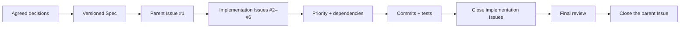
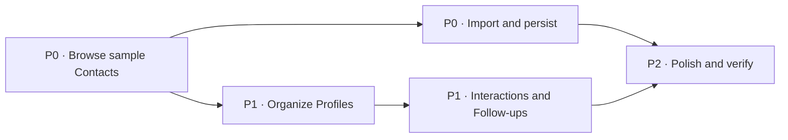

# Building Software End to End with GitHub Issues: From Product Conversation to a macOS App

This tutorial follows one complete Spec-driven development cycle. We begin with a rough product idea, clarify it with an AI agent, turn the agreement into a written specification, publish prioritized GitHub Issues, implement them in dependency order, and review the finished software.

::: info How is this different from the previous chapter?

[From Vibe Coding to Spec Coding](https://github.com/datawhalechina/easy-vibe/blob/130e9b75b28b524e8cc74e615fd9733a4e2b330d/en/stage-3/core-skills/spec-coding/README.md) explains why specifications are becoming central to AI development. This chapter is the practical companion: a real public repository shows how a specification becomes Issues, dependencies, commits, tests, and a working product.

:::

Our starting point was one sentence:

> I want to build a macOS CRM that helps me manage imported contacts and understand my relationships. We can use sample data first.

The result is **Relationship Compass**, a native macOS application that searches and filters contacts, edits relationship profiles, imports CSV files, records interactions, and calculates who needs a follow-up.


Explore the complete [public example repository](https://github.com/sanbuphy/relationship-compass-macos). It contains only sample data and preserves the specification, Issues, commit history, source code, and tests.

## 1. What Spec-driven development means

A common AI coding loop looks like this:

```text
Describe an idea → AI writes code → something is wrong → add another instruction → modify again
```

That can work for a small page. As a project grows, however, earlier requirements disappear from the conversation, large changes become hard to track, and a feature may run without actually satisfying the original request.

Matt Pocock's Skills address this by giving the agent a repeatable workflow. A **Skill** tells the agent what to establish, what artifact to produce, and when to stop for confirmation—not merely which code to write.

### 1.1 Chat-first versus Spec-driven work

| Chat-first implementation | Spec-driven implementation |
| --- | --- |
| The current conversation is the main source of truth | A versioned Spec is the source of truth |
| New requirements are appended informally | Scope changes update the Spec and tasks first |
| Progress lives in agent summaries | Progress lives in Issues and commits |
| “It runs” is the main completion signal | Every acceptance criterion is checked |

The goal is not paperwork. It is to turn intent into a shared, durable standard that humans and agents can inspect, update, and verify.

### 1.2 GitHub's role in the workflow

GitHub is more than code storage here. It is simultaneously:

1. a **project archive** for the Spec, terminology, and architecture decisions;
2. a **task board** where Issues, priority, and dependencies express the work order;
3. a **completion record** where commits, tests, comments, and closed Issues show what happened.

| GitHub artifact | Plain-language meaning | Example |
| --- | --- | --- |
| Spec | What the finished software must do | `specs/relationship-compass-mvp.md` |
| Issue | One independently deliverable task | `#2 Browse sample Contacts` |
| Dependency | Which task must finish first | `#3` is blocked by `#2` |
| Commit | What changed in one implementation step | `feat: browse sample contacts` |
| Tests | Evidence that behavior still works | `swift test` |
| ADR | Why an important technical choice was made | `docs/adr/0002-native-swiftui-macos.md` |



GitHub therefore becomes a development workspace with memory. A new session can reconstruct the project's decisions and current frontier without replaying the entire conversation.

### 1.3 The complete route

This example uses five Skills:

1. `grill-with-docs` clarifies the product and technical boundaries;
2. `to-spec` writes the agreement as a formal specification;
3. `to-tickets` creates prioritized, dependency-aware GitHub Issues;
4. `implement` completes the ready Issues one at a time;
5. `code-review` checks code health and requirement coverage.

```text
Idea → clarify → specify → create tickets → implement → review
```

## 2. Before you begin

To reproduce the example, prepare:

- a GitHub account;
- GitHub CLI (`gh`) authenticated in your terminal;
- Node.js 18 or newer;
- an AI coding tool that can load project Skills;
- a Mac with Xcode if you want to run the finished application.

### 2.1 Install Matt Pocock's Skills

Run this inside your project directory:

```bash
npx skills@latest add mattpocock/skills
```

To install every Skill without selecting them individually:

```bash
npx skills@latest add mattpocock/skills -y
```

The practical flow is:

```text
grill-with-docs → to-spec → to-tickets → implement → code-review
```

For a very large or uncertain project, `wayfinder` can identify the decisions that must be made before this flow begins.

### 2.2 Create a public example repository

Check GitHub authentication:

```bash
gh auth status
```

If necessary, sign in with `gh auth login -h github.com`. Then create and push the repository:

```bash
gh repo create relationship-compass-macos \
  --public \
  --source . \
  --remote origin \
  --push
```

::: warning Never publish real contact data

This tutorial uses a public repository because every record is fictional. For a personal relationship manager, use `--private` and check samples, logs, and Git history for names, email addresses, or private notes before pushing.

:::

### 2.3 Prepare task labels

| Label | Meaning |
| --- | --- |
| `ready-for-agent` | The requirement is clear enough to implement |
| `priority:P0` | Foundation work that must happen first |
| `priority:P1` | Core work waiting on a dependency |
| `priority:P2` | Polish, documentation, and final verification |
| `completed-by-agent` | Implemented and verified by the agent |

## 3. The product we will build

Relationship Compass is a personal relationship manager rather than a sales pipeline. The first release:

- starts with six deterministic sample contacts;
- searches contacts and filters by relationship strength and circle;
- edits organization, role, email, notes, and follow-up rhythm;
- imports UTF-8 CSV files;
- records an interaction and calculates the next follow-up date;
- persists data in a local JSON file and restores it on launch.

It deliberately excludes cloud sync, AI relationship scoring, accounts, a backend, and macOS Contacts access. This preserves a complete but privacy-safe MVP.

## 4. Step one: clarify the request with `grill-with-docs`

`grill-with-docs` behaves like an experienced product and technical partner. It asks about decisions that materially change the implementation before any code is written.

<div class="workflow-chat">
  <div class="workflow-message workflow-message--user">
    <div class="workflow-message__speaker">🙋 You</div>
    <div class="workflow-message__command">/grill-with-docs</div>
    <p>I want to build a macOS CRM that manages imported contacts and helps me understand my relationships. We can start with sample data.</p>
  </div>
  <div class="workflow-message workflow-message--agent">
    <div class="workflow-message__speaker">✨ Agent</div>
    <p>Let's clarify the first release before writing code. We will agree on what it does, what it excludes, where data lives, and how completion will be verified. I will explain the trade-offs and recommend an option whenever a decision is needed.</p>
  </div>
</div>

### 4.1 Let the conversation converge

The user does not need to know SwiftUI or database design. They only need to describe the desired experience clearly.

<div class="workflow-chat">
  <div class="workflow-message workflow-message--agent">
    <div class="workflow-message__speaker">✨ Agent</div>
    <p>I recommend native SwiftUI and a local-first architecture. Should the first release read macOS Contacts, sync to the cloud, or import a file?</p>
  </div>
  <div class="workflow-message workflow-message--user">
    <div class="workflow-message__speaker">🙋 You</div>
    <p>Use native SwiftUI and import UTF-8 CSV only. Keep everything local, with no account, network access, backend, or Contacts permission.</p>
  </div>
  <div class="workflow-message workflow-message--agent">
    <div class="workflow-message__speaker">✨ Agent</div>
    <p>Then this is a private relationship-maintenance tool, not a sales funnel. Which relationship details and actions form the smallest useful loop?</p>
  </div>
  <div class="workflow-message workflow-message--user">
    <div class="workflow-message__speaker">🙋 You</div>
    <p>I need relationship strength, circles, notes, interaction history, and a view of who needs attention. Calculate it from the latest interaction and a follow-up interval.</p>
  </div>
  <div class="workflow-message workflow-message--agent">
    <div class="workflow-message__speaker">✨ Agent</div>
    <p>Contacts with no interaction can appear immediately in Follow-ups. We will use six fixed samples and test search, import, persistence, and date calculations. Does that define the MVP?</p>
  </div>
  <div class="workflow-message workflow-message--user">
    <div class="workflow-message__speaker">🙋 You</div>
    <p>Yes. Exclude cloud sync, AI scoring, and Contacts access. We agree; generate the specification.</p>
  </div>
</div>

The conversation established these durable decisions:

| Decision | Choice | Reason |
| --- | --- | --- |
| Platform | Native SwiftUI on macOS 14+ | Native file selection, keyboard behavior, and accessibility |
| Seed data | Six deterministic samples | No sensitive data needed to evaluate the app |
| Import | UTF-8 CSV | Easy to prepare, inspect, and repair |
| Persistence | Local JSON | Transparent and backend-free |
| Strength | Close / Active / Dormant | Avoid turning relationships into sales scores |
| Privacy | No Contacts access or network | No sensitive permission in the MVP |
| Test surface | Public `RelationshipStore` behavior | Verify outcomes rather than implementation details |

### 4.2 Establish a shared project vocabulary

The team records ambiguous terms in `CONTEXT.md`:

```markdown
**Interaction**:
A dated note that records a meaningful exchange with a Contact.
_Avoid_: Activity, event, touchpoint

**Follow-up**:
A suggested next connection date derived from the latest Interaction
and the Relationship Profile's rhythm.
_Avoid_: Task, reminder, notification
```

This keeps code, tests, and Issues from drifting between `Contact`, `Lead`, and `Customer`, or between follow-ups, reminders, and notifications.

### 4.3 Record only consequential architecture decisions

The project contains two short ADRs:

- `0001-local-first-private-data.md`: relationship data stays local and no Contacts permission is requested;
- `0002-native-swiftui-macos.md`: the app uses SwiftUI instead of Electron or a web shell.

ADRs are valuable for decisions that are expensive to reverse and have real trade-offs. They are not needed for every small implementation choice.

::: info GitHub at this stage

The discussion happens in chat, but agreed facts are committed as `CONTEXT.md` and `docs/adr/*`. GitHub preserves the confirmed context so a later session can recover it. No implementation ticket exists yet.

:::

## 5. Step two: write the specification with `to-spec`

<div class="workflow-chat">
  <div class="workflow-message workflow-message--user">
    <div class="workflow-message__speaker">🙋 You</div>
    <div class="workflow-message__command">/to-spec</div>
    <p>Turn our agreed discussion into a complete specification, save it in the repository, and publish it as a GitHub Issue labeled ready-for-agent.</p>
  </div>
  <div class="workflow-message workflow-message--agent">
    <div class="workflow-message__speaker">✨ Agent</div>
    <p>I will organize the decisions we already confirmed, save the document, and create one parent GitHub Issue as the project's entry point.</p>
  </div>
</div>

The resulting Spec covers the problem, proposed MVP, 24 user stories, accepted technical decisions, verification strategy, and explicit non-goals. Read it at [`specs/relationship-compass-mvp.md`](https://github.com/sanbuphy/relationship-compass-macos/blob/main/specs/relationship-compass-mvp.md) or [Issue #1](https://github.com/sanbuphy/relationship-compass-macos/issues/1).

### 5.1 Specify behavior, not filenames

A useful user story says:

> As a user, I want contacts with no interaction history to appear in Follow-ups so newly imported people are not silently forgotten.

It identifies the user, desired behavior, and value without freezing the Swift file structure. The requirement survives refactoring.

### 5.2 Define verification early

The Spec requires public-behavior tests for sample initialization, combined filtering, CSV validation and deduplication, JSON persistence, profile editing, interaction ordering, and follow-up calculations at a controlled date.

::: info GitHub at this stage

The Markdown file supports version history and review; Issue #1 provides a visible project entry point. A later scope change must update the Spec in a commit instead of living only in a new chat.

:::

## 6. Step three: turn the Spec into ordered Issues with `to-tickets`

<div class="workflow-chat">
  <div class="workflow-message workflow-message--user">
    <div class="workflow-message__speaker">🙋 You</div>
    <div class="workflow-message__command">/to-tickets</div>
    <p>Create GitHub Issues from the Relationship Compass MVP Spec. Each ticket must deliver a demonstrable vertical slice and state its priority, acceptance criteria, and prerequisites.</p>
  </div>
  <div class="workflow-message workflow-message--agent">
    <div class="workflow-message__speaker">✨ Agent</div>
    <p>I will show the proposed tickets and dependency order first. After confirmation, I will publish them to GitHub.</p>
  </div>
</div>

Avoid horizontal tickets such as “all models,” “all stores,” “all UI,” and “tests at the end.” A vertical slice joins the minimum data, interface, and tests needed to demonstrate one user outcome.

| Issue | Priority | Demonstrable result | Blocked by |
| --- | --- | --- | --- |
| [#2 Browse sample Contacts](https://github.com/sanbuphy/relationship-compass-macos/issues/2) | P0 | Launch, samples, search, and details | None |
| [#3 Import and persist private Contact data](https://github.com/sanbuphy/relationship-compass-macos/issues/3) | P0 | CSV deduplication and JSON persistence | #2 |
| [#4 Organize Relationship Profiles](https://github.com/sanbuphy/relationship-compass-macos/issues/4) | P1 | Profile editing, strength, circles, filters | #2 |
| [#5 Record Interactions and plan Follow-ups](https://github.com/sanbuphy/relationship-compass-macos/issues/5) | P1 | History and Follow-ups | #4 |
| [#6 Polish and verify the MVP](https://github.com/sanbuphy/relationship-compass-macos/issues/6) | P2 | Errors, docs, packaging, full verification | #3 and #5 |



Priority says how important a task is; a dependency says whether it can start now. The ready, unblocked tickets form the current **task frontier**.

::: info GitHub at this stage

The Spec becomes five independently trackable Issues with `priority:P0/P1/P2` and native `Blocked by` relationships. GitHub has now changed from an archive into the live task board.

:::

## 7. Step four: implement one ready Issue at a time

<div class="workflow-chat">
  <div class="workflow-message workflow-message--user">
    <div class="workflow-message__speaker">🙋 You</div>
    <div class="workflow-message__command">/implement</div>
    <p>Implement every ready-for-agent Issue in priority and dependency order. Start with the first unblocked ticket. Use TDD, run type checks and relevant tests, and commit each ticket separately.</p>
  </div>
  <div class="workflow-message workflow-message--agent">
    <div class="workflow-message__speaker">✨ Agent</div>
    <p>I will work on one ready ticket at a time: failing test, implementation, full verification, commit, and Issue update. Then I will move to the next unblocked ticket.</p>
  </div>
</div>

| Issue | Main commit |
| --- | --- |
| #2 Browse samples | [`9d9d7bd`](https://github.com/sanbuphy/relationship-compass-macos/commit/9d9d7bd) |
| #3 Import and persist | [`935750b`](https://github.com/sanbuphy/relationship-compass-macos/commit/935750b) |
| #4 Organize profiles | [`329bd67`](https://github.com/sanbuphy/relationship-compass-macos/commit/329bd67) |
| #5 Interactions and follow-ups | [`83f4af6`](https://github.com/sanbuphy/relationship-compass-macos/commit/83f4af6) |
| #6 Polish and verify | [`3ae0bbf`](https://github.com/sanbuphy/relationship-compass-macos/commit/3ae0bbf) |
| Review fixes | [`cbad102`](https://github.com/sanbuphy/relationship-compass-macos/commit/cbad102), [`11361ca`](https://github.com/sanbuphy/relationship-compass-macos/commit/11361ca), [`d1c83be`](https://github.com/sanbuphy/relationship-compass-macos/commit/d1c83be) |

### 7.1 Prove the behavior is missing first

For the CSV ticket, the agent:

1. wrote a test proving that importing the same CSV twice must not duplicate contacts;
2. ran it and confirmed the behavior was absent;
3. implemented parsing and deduplication;
4. added a test proving an invalid header cannot corrupt existing contacts;
5. reran the focused tests and full build;
6. committed the change and closed the Issue.

```bash
swift test --filter RelationshipStoreTests
swift build
swift test
```

The final project passes all 13 public-behavior tests.

### 7.2 Inspect the real code

The committed [`RelationshipStore.importCSV`](https://github.com/sanbuphy/relationship-compass-macos/blob/main/Sources/RelationshipCompass/RelationshipStore.swift#L69-L154) reads UTF-8, validates headers, identifies duplicates, and builds a candidate result before replacing live data. A failure therefore cannot leave a half-imported state.


The matching [`RelationshipStoreTests`](https://github.com/sanbuphy/relationship-compass-macos/blob/main/Tests/RelationshipCompassTests/RelationshipStoreTests.swift#L29-L69) cover repeated imports, duplicate headers, malformed input, and UTF-8 BOM files.


::: info GitHub at this stage

The agent selects work using `ready-for-agent`, priority, and `Blocked by`. On completion it posts the commit and test result, removes the ready label, adds `completed-by-agent`, and closes the Issue. Issue state is therefore the real project state.

:::

## 8. Step five: review code and requirement coverage

Closing the implementation Issues is not enough. `code-review` performs two distinct passes.

### 8.1 Review code health

The first pass checks naming, duplication, oversized files, coupling, and repository conventions. It found that the main SwiftUI view carried too many responsibilities and that the follow-up interval could bypass its minimum-one-day rule. The implementation was refactored and a validated value type was introduced.

### 8.2 Review completion against the Spec

The second pass rereads the Spec and every Issue. It found real gaps that the initial test suite missed:

- duplicate CSV headers produced a runtime error rather than a safe message;
- contacts without email could not be deduplicated by name and organization;
- the Follow-ups list ignored filters applied to the main contact list;
- saved data was not restored automatically on launch;
- the detail view did not show the calculated next follow-up date.

Tests were added first, the defects were fixed, and both review passes were rerun. This matters because green tests prove only the behavior those tests describe; they do not prove that every original requirement was tested.

::: info GitHub at this stage

Review fixes remain visible as separate commits. Completion comments on Issues #2–#6 link the commits and verification results; only after both reviews pass is parent Issue #1 closed.

:::

## 9. The finished application

Relationship Compass is a buildable, testable, packageable native macOS application—not a mockup.

| Deliverable | Result |
| --- | --- |
| GitHub planning | One parent requirement Issue and five implementation Issues, all closed |
| Implementation history | Nine focused commits completed in dependency order |
| Automated verification | 13/13 behavior tests pass and the project builds |
| Final review | Code-health and Spec-completion reviews pass |
| Runnable artifact | A script creates `Relationship Compass.app` |
| Privacy boundary | Local-only data, no Contacts access, no relationship upload |

### 9.1 Search and combined filters

Searching for `Founder` narrows six sample contacts to Maya Chen. Relationship strength and circle filters can be combined, and the main list and Follow-ups use the same rules.


### 9.2 Edit a relationship profile

The detail view edits organization, role, email, relationship strength, circles, rhythm, and notes. Duplicate circles are normalized and the follow-up interval must be at least one day.


### 9.3 Record an interaction and calculate the next follow-up

After an interaction on August 9, 2026, a 30-day rhythm produces September 8, 2026 as the next connection date. The entry appears in Interaction History and the contact moves into Follow-ups when due.


On a Mac, run the complete project with:

```bash
git clone https://github.com/sanbuphy/relationship-compass-macos.git
cd relationship-compass-macos
swift build
swift test
./scripts/package-app.sh
open "dist/Relationship Compass.app"
```

::: warning This is not a production contacts product

Cloud sync, Contacts permission, encryption, and AI analysis would require a new privacy discussion and new architecture decisions.

:::

## 10. Copy-ready prompts

### 10.1 Clarify the request

<div class="workflow-chat">
  <div class="workflow-message workflow-message--user">
    <div class="workflow-message__speaker">🙋 You · Copy this</div>
    <div class="workflow-message__command">/grill-with-docs</div>
    <p>I want to build a macOS CRM that manages imported contacts and helps me understand my relationships. Sample data is fine initially.</p>
    <p>Discuss what the first release does and excludes, where data lives, which technology to use, and how we will verify completion. Ask only the most important current question, explain trade-offs, and recommend an option. Do not write code until I explicitly confirm our shared understanding.</p>
  </div>
</div>

### 10.2 Generate the Spec

<div class="workflow-chat">
  <div class="workflow-message workflow-message--user">
    <div class="workflow-message__speaker">🙋 You · Copy this</div>
    <div class="workflow-message__command">/to-spec</div>
    <p>Turn our confirmed discussion into a complete requirements document, save it in the repository, and publish one parent GitHub Issue with the ready-for-agent label. Include user behavior, acceptance criteria, and explicit non-goals.</p>
  </div>
</div>

### 10.3 Create Issues

<div class="workflow-chat">
  <div class="workflow-message workflow-message--user">
    <div class="workflow-message__speaker">🙋 You · Copy this</div>
    <div class="workflow-message__command">/to-tickets</div>
    <p>Create GitHub Issues from the Spec. Each ticket should deliver a demonstrable vertical slice and state priority, completion criteria, and prerequisites. Show me the list and dependency graph before publishing.</p>
  </div>
</div>

### 10.4 Implement everything

<div class="workflow-chat">
  <div class="workflow-message workflow-message--user">
    <div class="workflow-message__speaker">🙋 You · Copy this</div>
    <div class="workflow-message__command">/implement</div>
    <p>Implement every ready-for-agent Issue by priority and dependency. Work on one unblocked ticket at a time, write a failing behavior test first, run tests and the full build frequently, and commit each ticket separately. Afterward, review both code quality and Spec completion, fix all findings, and rerun verification.</p>
  </div>
</div>

## 11. When full-autonomy mode is appropriate

This workflow suits scoped MVPs, sites, apps, and backends with observable behavior and reliable test or build commands. It is a poor fit when requirements change hourly, verification is impossible, or the work directly mutates production data.

Even during continuous implementation, a person should confirm:

1. the MVP boundary after the requirements conversation;
2. ticket coverage and dependency order before Issues are published;
3. any payment, deployment, deletion, permission, privacy, or production operation;
4. the real interface, build artifact, and review results at the end.

Reliable autonomy does not outsource every decision. The human owns goals, boundaries, and acceptance; the agent executes the agreed work consistently.

## Summary

```text
Rough idea
  ↓ grill-with-docs
Agreed scope + vocabulary + durable technical decisions
  ↓ to-spec
Versioned, testable requirements
  ↓ to-tickets
Prioritized, dependency-aware GitHub Issues
  ↓ implement
One ticket, test, and commit at a time
  ↓ code-review
Code-health review + Spec-completion review
  ↓
Buildable and verifiable software
```

When a chat ends, the Spec, Issues, dependency graph, commits, and test evidence remain in GitHub. The next session can resume from recorded project state instead of guessing the user's intent again.

## References

- [Skills to Spec](https://www.aihero.dev/skills-to-spec)
- [AI Skills for Real Engineers](https://www.aihero.dev/skills)
- [Skills v1.1 changelog](https://www.aihero.dev/skills/skills-changelog-v1-1-wayfinder-to-spec-to-tickets-grilling-improvements)
- [OpenAI: Save repeatable workflows as Skills](https://learn.chatgpt.com/codex/use-cases/reusable-codex-skills)
- [Relationship Compass public example repository](https://github.com/sanbuphy/relationship-compass-macos)
