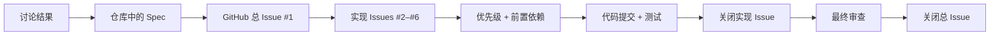
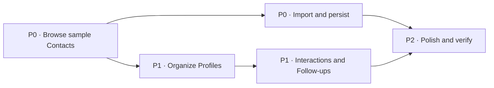

# 用 GitHub Issues 驱动 AI 全流程开发：从需求讨论到 macOS 成品

在这篇教程中，我们会完整走一遍这样的过程：先把一个还比较模糊的想法告诉 AI，再和它一起把需求讨论清楚；接着让 AI 写出需求文档、在 GitHub 上拆好任务，最后按照任务顺序把软件真正做出来。

这种方法叫 **Spec 驱动开发**。Spec 是“需求规格”的简称。它不是一份写完就放在角落里的文档，而是后续拆任务、写代码、测试和审查时共同遵守的依据。需求发生变化时，先更新 Spec，再继续实现，而不是只在聊天里临时补一句。

::: info 和上一篇有什么区别？

[《从 Vibe Coding 到 Spec Coding》](https://github.com/datawhalechina/easy-vibe/blob/130e9b75b28b524e8cc74e615fd9733a4e2b330d/zh-cn/stage-3/core-skills/spec-coding/README.md)主要解释为什么规范会成为 AI 开发的核心；本文不再重复理论，而是用一个真实 GitHub 仓库演示如何把规范变成 Issues、任务依赖、提交、测试和最终成品。

:::

我们不会停在“讲概念”这一步。文章里的仓库、Issues、代码、测试和截图都来自一次真实开发。最开始，我们只有下面这一句话：

> 我想做一个 macOS 上的 CRM，用来管理联系人关系，帮助我梳理人脉。可以先使用假数据。

最后，我们得到了一个名为 **Relationship Compass** 的原生 macOS 应用。它可以搜索和筛选联系人、维护关系档案、导入 CSV、记录互动，并自动算出下一次应该联系谁。


你可以直接查看这次实践产生的[公开 GitHub 示例仓库](https://github.com/sanbuphy/relationship-compass-macos)。仓库只使用假数据，里面保留了需求文档、GitHub Issues、提交记录、源代码和测试。

## 1. 先理解：什么是 Spec 驱动开发

很多人第一次用 AI 写代码时，会采用下面这种方式：

```text
告诉 AI 想做什么 → AI 写代码 → 发现不对 → 再补一句要求 → 继续修改
```

做一个小页面时，这种方式通常够用。但项目变大后，很容易遇到三个问题：

1. 前面讨论过的要求，过几轮对话后被忘掉了；
2. AI 一次改很多文件，你不知道现在到底完成了多少；
3. 功能看起来能运行，却没人逐条检查它是否真的符合最初需求。

Matt Pocock 的 Skills 就是为了解决这些问题。这里的 **Skill** 可以先简单理解成“写给 AI 的标准工作流程”。它不会只告诉 AI 写哪一段代码，而是规定 AI 在每个阶段应该先做什么、产出什么、什么时候停下来让你确认。

### 1.1 它和直接让 AI 写代码有什么不同

普通的 AI 辅助开发，常常把聊天记录当成唯一需求来源。Spec 驱动开发则会在写代码前，先把已经确认的要求保存成仓库里的正式文档。后续每一步都回到这份文档检查。

| 直接从聊天开始写 | Spec 驱动开发 |
| --- | --- |
| AI 主要依赖当前聊天内容 | AI 以仓库中的 Spec 为主要依据 |
| 想到一个要求就直接补一句 | 先确认需求，再更新 Spec 和任务 |
| 进度通常只存在于 AI 的总结里 | 进度保存在 GitHub Issues 和提交中 |
| 完成后主要看“能不能运行” | 完成后逐条对照 Spec 检查有没有漏项 |

因此，Spec 驱动开发的重点并不是“多写一份文档”，而是让需求从聊天中的一句话，变成整个开发过程都能引用、更新和验证的共同标准。

### 1.2 GitHub 在这条流程中具体做什么

一次聊天只能保存“我们刚才说了什么”，GitHub 则可以长期保存“项目已经决定了什么、接下来要做什么、哪些事情已经完成”。

在这篇教程里，GitHub 不只是存放源代码的网盘。它同时承担三种角色：

1. **项目档案室**：保存 Spec、项目用词和重要技术决定；
2. **任务看板**：用 Issues、优先级和依赖关系表示工作顺序；
3. **完成记录**：用提交、测试结果和关闭状态证明每张任务是怎样完成的。

| GitHub 中的内容 | 用大白话解释 | 本例中的实际文件或记录 |
| --- | --- | --- |
| 需求文档（Spec） | 这个软件最后要做到什么 | `specs/relationship-compass-mvp.md` |
| Issue | 一张可以独立完成的任务卡 | `#2 Browse sample Contacts` |
| 任务依赖 | 哪张任务卡必须先完成 | `#3` 要等待 `#2` |
| Commit | 这一轮具体改了什么 | `feat: browse sample contacts` |
| Tests | 已经完成的功能有没有被后续修改弄坏 | `swift test` |
| 架构决策记录（ADR） | 为什么选择这种技术，而不是另一种 | `docs/adr/0002-native-swiftui-macos.md` |

下面这张表更具体地展示了 GitHub 在每个阶段发生的变化：

| 开发阶段 | GitHub 中发生什么 | Relationship Compass 的实际结果 |
| --- | --- | --- |
| 需求讨论结束 | 把统一用词和重要决定写入仓库 | `CONTEXT.md` 和 2 份 ADR |
| 生成 Spec | 保存需求文件，并创建一张总 Issue | `specs/relationship-compass-mvp.md` 和 [Issue #1](https://github.com/sanbuphy/relationship-compass-macos/issues/1) |
| 拆分任务 | 创建实现 Issues，添加优先级和前置依赖 | [Issues #2–#6](https://github.com/sanbuphy/relationship-compass-macos/issues?q=is%3Aissue%20state%3Aclosed) |
| 逐张实现 | 每完成一张 Issue，就产生对应提交并运行测试 | 5 个主要功能提交 |
| 完成任务 | 移除 `ready-for-agent`，添加 `completed-by-agent`，关闭 Issue | #2–#6 全部关闭 |
| 最终审查 | 把审查修复继续提交，确认无遗漏后关闭总 Issue | 3 个修复提交，#1 最终关闭 |



所以 GitHub 在这里更像一块“有记忆的开发工作台”。AI 每次开始工作前都可以先读取当前状态；人也可以随时打开仓库，看到需求、进度、代码和验证结果，而不必翻完整聊天记录。

### 1.3 整条路线先看一遍

这次实践会依次使用五个命令：

1. `grill-with-docs`：先和 AI 讨论，把“我大概想做什么”变成双方都理解的明确范围；
2. `to-spec`：把已经确认的讨论整理成一份正式需求文档；
3. `to-tickets`：把大需求拆成几张有先后顺序的 GitHub Issues；
4. `implement`：让 AI 从第一张可以开始的任务卡出发，边测试边实现；
5. `code-review`：完成后再检查两遍，一遍看代码质量，一遍看有没有漏掉需求。

```text
想法 → 讨论清楚 → 写成文档 → 拆成任务 → 逐个实现 → 检查结果
```

现在不需要记住所有英文名词。你只要先记住一件事：**我们不再让 AI 拿到一句话就马上写完整项目，而是先把需求说清楚，再让它按有记录、有顺序、可检查的方式开发。**

## 2. 开始之前要准备什么

如果你只想理解这套工作方法，可以直接继续往下读。如果你想自己跟着做一遍，需要提前准备：

1. 一个 GitHub 账号；
2. 已经登录的 GitHub CLI，也就是终端里的 `gh` 命令；
3. Node.js 18 或更高版本，用来安装 Skills；
4. 一个能够读取项目 Skills 的编程 AI 工具；
5. 如果要运行本文的 macOS 示例，还需要一台 Mac 和 Xcode。

### 2.1 安装 Matt Pocock 的 Skills

先在你准备开发的项目目录中打开终端，然后运行：

```bash
npx skills@latest add mattpocock/skills
```

安装过程可能会询问你要把 Skills 安装到哪里。如果希望直接安装全部内容、不逐项确认，可以使用：

```bash
npx skills@latest add mattpocock/skills -y
```

本次实践实际安装了 35 个 Skills。安装完成后，它们会出现在项目的 `.agents/skills/` 目录中。本文重点使用的是下面这条主流程：

```text
grill-with-docs → to-spec → to-tickets → implement → code-review
```

这里比最初流传的“四步流程”多了最后的 `code-review`。原因很简单：软件“能运行”不等于“已经按要求做好”。完成实现后，再单独检查一次，往往能发现测试和第一次开发都没有注意到的问题。

::: tip 项目特别大时怎么办？

如果你的项目大到连“应该先讨论哪些问题”都不清楚，可以先使用 `wayfinder`。它会帮助你列出还没有做出的关键决定，再回到本文这条主流程。第一次练习时不需要使用它。

相关说明可以查看 [AI Skills for Real Engineers](https://www.aihero.dev/skills) 和 [Skills v1.1 更新说明](https://www.aihero.dev/skills/skills-changelog-v1-1-wayfinder-to-spec-to-tickets-grilling-improvements)。

:::

### 2.2 创建 GitHub 示例仓库

先确认终端已经登录 GitHub：

```bash
gh auth status
```

如果还没有登录，再运行：

```bash
gh auth login -h github.com
```

接着创建一个名为 `relationship-compass-macos` 的公开仓库，并把当前项目推送上去：

```bash
gh repo create relationship-compass-macos \
  --public \
  --source . \
  --remote origin \
  --push
```

这几个参数分别表示：仓库公开、使用当前文件夹、把 GitHub 地址保存为 `origin`，并立即推送当前代码。

::: warning 真实联系人数据不要放进公开仓库

本文为了方便读者查看完整案例，使用的是公开仓库和固定假数据。如果你要开发自己的联系人管理工具，请改用 `--private`，并在推送前检查样例文件、日志和 Git 历史中是否包含真实姓名、邮箱或关系备注。

:::

### 2.3 准备任务标签

GitHub 标签就像贴在任务卡上的彩色便签。它能告诉 AI 一张 Issue 是否可以开始，以及它有多重要。本例实际使用了下面几类标签：

| 标签 | 表示什么 |
| --- | --- |
| `ready-for-agent` | 需求已经写清楚，AI 可以开始做 |
| `priority:P0` | 最先完成，否则后面的功能无法继续 |
| `priority:P1` | 核心功能，但需要等待前置任务 |
| `priority:P2` | 收尾、文档和完整验证 |
| `completed-by-agent` | 已经由 AI 实现并验证完成 |

## 3. 这次要做一个什么软件

我们的例子是一个 macOS 联系人关系管理工具。它不是用来追踪销售业绩，而是帮助个人记住：我认识谁、我们是什么关系、上次聊了什么、什么时候适合再次联系。

之所以选择这个例子，是因为它足够小，可以在一篇教程里走完；同时又包含真实软件常见的多个环节：界面、数据导入、本地保存、搜索筛选、日期计算和自动化测试。

第一版只做下面这些事情：

- 内置 6 个假联系人，打开应用就能看到效果；
- 支持搜索联系人，并按关系强度和圈子筛选；
- 可以编辑组织、角色、邮箱、备注和跟进周期；
- 可以从 UTF-8 CSV 文件导入联系人；
- 可以记录一次互动，并自动计算下一次跟进日期；
- 数据保存为本地 JSON 文件，下次启动时可以恢复。

第一版暂时不做云同步、AI 人脉评分，也不读取 macOS 系统通讯录。这样可以先把最重要的使用闭环做完整，同时避免一开始就申请敏感权限。

## 4. 第一步：用 grill-with-docs 把需求聊清楚

`grill-with-docs` 可以理解为“先把需求问透”。它不会在收到第一句话后马上写代码，而是像一位有经验的产品和技术伙伴一样，继续问你几个真正会影响结果的问题。

进入新仓库后，像平时说话一样描述目标即可，不需要提前写正式的产品文档：

<div class="workflow-chat">
  <div class="workflow-message workflow-message--user">
    <div class="workflow-message__speaker">🙋 你</div>
    <div class="workflow-message__command">/grill-with-docs</div>
    <p>我想实现一个 macOS 上的 CRM，可以管理我导入的联系人关系，帮助我梳理人脉。可以先使用假数据。</p>
  </div>
  <div class="workflow-message workflow-message--agent">
    <div class="workflow-message__speaker">✨ Agent</div>
    <p>好，我们先不急着写代码。我会和你一起把“第一版做什么、不做什么、数据放在哪里”讨论清楚。遇到需要选择的地方，我会先解释区别，再给出推荐。</p>
  </div>
</div>

这一步看起来像“多聊了一会儿”，其实是在提前避免返工。比如，要不要读取系统通讯录，会影响隐私权限；要不要云同步，会影响是否需要账号和服务器。这些问题如果等代码写到一半才决定，改动会更大。

### 4.1 对话如何逐步收敛

下面是本例中最关键的几轮对话。你会发现，用户不需要懂 SwiftUI、数据库或测试框架，只需要说清楚自己想要的使用体验。

<div class="workflow-chat">
  <div class="workflow-message workflow-message--agent">
    <div class="workflow-message__speaker">✨ Agent</div>
    <p>我建议首版采用原生 SwiftUI 和本地优先架构，这样能获得真正的 macOS 体验，又不必先建设账号和服务器。先确认三件事：是否直接读取系统通讯录？是否需要云同步？首版准备如何导入数据？</p>
  </div>
  <div class="workflow-message workflow-message--user">
    <div class="workflow-message__speaker">🙋 你</div>
    <p>首版使用原生 SwiftUI，只导入 UTF-8 CSV，不直接读取系统通讯录。数据全部保存在本地，也不需要账号、联网和后端。</p>
  </div>
  <div class="workflow-message workflow-message--agent">
    <div class="workflow-message__speaker">✨ Agent</div>
    <p>明白。那它更像“私人关系维护工具”，而不是销售漏斗。联系人档案除了姓名、组织、角色和邮箱，还需要哪些关系信息？怎样才算形成一个最小闭环？</p>
  </div>
  <div class="workflow-message workflow-message--user">
    <div class="workflow-message__speaker">🙋 你</div>
    <p>我需要关系强度、圈子、备注和互动记录；还想看到哪些人该联系了。可以按最近一次互动和我设置的跟进周期计算，不需要把私人关系做成销售评分。</p>
  </div>
  <div class="workflow-message workflow-message--agent">
    <div class="workflow-message__speaker">✨ Agent</div>
    <p>建议把从未记录过互动的联系人直接放进“待跟进”列表；记录一次互动后，再按你设置的天数计算下一次日期。首版使用 6 个固定假联系人，并为搜索、导入、保存和日期计算编写自动化测试。这个范围可以吗？</p>
  </div>
  <div class="workflow-message workflow-message--user">
    <div class="workflow-message__speaker">🙋 你</div>
    <p>可以，就按这个范围。先不要做云同步、AI 人脉评分和系统通讯录权限。我们已经达成共识，可以生成规格了。</p>
  </div>
</div>

在本例中，我们确定了以下范围：

| 决策 | 选择 | 原因 |
| --- | --- | --- |
| 产品形态 | macOS 14+ 原生 SwiftUI | 获得原生文件选择、键盘操作和辅助功能 |
| 首版数据 | 6 个确定性的假联系人 | 不要求用户一开始就交出敏感数据 |
| 导入格式 | UTF-8 CSV | 容易准备、检查和修复 |
| 数据保存 | 本地 JSON | 简单、透明、不需要后端 |
| 关系强度 | Close / Active / Dormant | 避免把私人关系变成销售评分 |
| 核心行为 | 搜索筛选、资料维护、互动记录、待跟进列表 | 构成可验证的最小闭环 |
| 隐私边界 | 不读取系统通讯录、不联网 | 首版不申请敏感权限 |
| 测试入口 | `RelationshipStore` 对外提供的功能 | 测试用户能看到的结果，不依赖内部写法 |

### 4.2 同步建立项目语言

讨论过程中，一些词很容易产生歧义。比如 `Contact` 既可以翻译成“联系人”，也可能被 AI 理解成“销售线索”；`Follow-up` 可能被理解成任务、提醒或通知。

因此，我们把已经确认的项目用词写进 `CONTEXT.md`。下面这段的意思是：`Interaction` 专门表示一次有日期的交流记录，`Follow-up` 专门表示根据最近交流推算出的下次联系日期。

```markdown
**Interaction**:
A dated note that records a meaningful exchange with a Contact.
_Avoid_: Activity, event, touchpoint

**Follow-up**:
A suggested next connection date derived from the latest Interaction
and the Relationship Profile's rhythm.
_Avoid_: Task, reminder, notification
```

这不是为了把文档写得更正式，而是为了让后面的代码、测试和 Issue 一直使用同一套说法，避免 AI 一会儿写 `Contact`，一会儿又改成 `Lead` 或 `Customer`。

### 4.3 只记录真正重要的 ADR

ADR 是“架构决策记录”的缩写。你可以把它理解成一张很短的说明卡：记录一个重要选择，以及当时为什么这样选。这样几个月后再看到代码，不会疑惑“为什么没有用另外一种方案”。

本例只记录了两条真正重要的决定：

- `0001-local-first-private-data.md`：关系信息留在本地，不申请通讯录权限；
- `0002-native-swiftui-macos.md`：使用原生 SwiftUI，而不是 Electron 或 Web 壳。

ADR 不需要很长，也不用为每个小选择都写一份。只有那些以后很难改、而且存在明显取舍的决定，才值得单独记录。

### 4.4 确认共享理解

讨论结束时，AI 会问你是否已经达成共识。只有你明确确认后，流程才进入下一步。

这个暂停很重要。此时改一句需求只需要几秒；如果等 20 个文件都写完才发现方向错了，就要花更多时间返工。

::: tip 完成这一步后，你应该得到什么？

- 一份明确的第一版功能范围；
- 一份“不做什么”的清单；
- 统一的项目用词；
- 少量真正重要的技术决定；
- 你对最终方向的一次明确确认。

这时还没有开始实现功能，是正常的。

:::

::: info GitHub 在这一步做什么？

需求讨论发生在你和 AI 的对话中，但确认后的结果不能只留在聊天里。本例把统一用词写进 `CONTEXT.md`，把两项重要技术选择写进 `docs/adr/`，然后提交到 GitHub。这样下一次会话重新打开仓库时，AI 可以直接读取这些决定。

此时 GitHub 负责“保存已经确认的上下文”，还没有开始创建实现任务。

:::

## 5. 第二步：用 to-spec 写成需求文档

需求已经聊清楚了，下一步是把聊天内容整理成一份以后可以反复查看的正式文档。这里的 **Spec** 就是“需求规格”：它应该讲清楚软件解决什么问题、用户可以完成哪些操作、哪些内容不在第一版范围内，以及最后怎样判断功能已经做好。

你只需要告诉 AI：把刚才确认的内容写下来。

<div class="workflow-chat">
  <div class="workflow-message workflow-message--user">
    <div class="workflow-message__speaker">🙋 你</div>
    <div class="workflow-message__command">/to-spec</div>
    <p>根据刚才的讨论生成完整规格，保存到仓库，并发布到 GitHub Issues，标签使用 ready-for-agent。</p>
  </div>
  <div class="workflow-message workflow-message--agent">
    <div class="workflow-message__speaker">✨ Agent</div>
    <p>收到。我会直接整理刚才已经确认的内容，不会再从头问一遍。完成后，我会把文档保存进仓库，并创建一张总的 GitHub Issue 作为入口。</p>
  </div>
</div>

`to-spec` 会综合刚才的对话、项目用词和架构决定，生成一份结构化文档。本例最终得到的规格包括：

```text
要解决的问题
第一版解决方案
24 条用户故事
已经确认的技术选择
测试方式
第一版明确不做的内容
其他补充说明
```

完整规格保存在 [`specs/relationship-compass-mvp.md`](https://github.com/sanbuphy/relationship-compass-macos/blob/main/specs/relationship-compass-mvp.md)，同时发布为 [GitHub Issue #1](https://github.com/sanbuphy/relationship-compass-macos/issues/1)。以后无论是人还是 AI，都可以从这张总 Issue 找到完整需求。

::: info GitHub 在这一步做什么？

同一份需求会以两种方式存在：仓库中的 Markdown 文件便于版本管理和代码审查；GitHub Issue #1 则作为项目入口，方便跟踪状态和关联后续任务。

如果需求后来发生变化，应该先修改 Spec 文件并留下提交，而不是只在新聊天里补充一句。这样 GitHub 会保留“需求为什么变了、什么时候变了”的历史。

:::

### 5.1 好 Spec 要描述行为，而不是文件

一份好规格应该描述“用户最后能做到什么”，而不是过早指定“必须创建哪个文件”。例如，本例有一条用户故事是：

> 作为用户，我希望从未记录过互动的联系人也出现在待跟进列表中，这样刚导入的人不会被悄悄忘掉。

这句话包含三个信息：谁需要它、希望发生什么、为什么有价值。它没有规定 Swift 文件叫什么，所以以后即使重构代码，这条需求仍然成立。

### 5.2 提前说明怎样验证

规格还要提前说明“做完后怎样证明它是对的”。本项目把 `RelationshipStore` 对外提供的功能当作主要测试入口，自动检查：

- 样例数据初始化；
- 搜索与组合筛选；
- CSV 导入、校验与去重；
- JSON 保存和恢复；
- 关系档案编辑；
- 互动记录的时间顺序；
- 指定日期下的下一次跟进计算。

这些测试只关心用户最终能观察到的结果，不关心内部某个小函数被调用了几次。这样以后整理代码结构时，测试不会因为内部写法变化而全部失效。

::: tip 完成这一步后，你应该看到什么？

仓库中会出现一份可以直接阅读的 Spec，GitHub 上会出现一张对应的总 Issue。此时你应该能逐条回答：“第一版到底要做什么？什么算完成？哪些功能明确不做？”

:::

## 6. 第三步：用 to-tickets 拆成有顺序的任务

一份 Spec 可能包含几十条要求，直接让 AI “一次全部实现”仍然很冒险。`to-tickets` 的作用，就是把大目标拆成几张能够单独完成、单独检查的 GitHub 任务卡。

接着输入：

<div class="workflow-chat">
  <div class="workflow-message workflow-message--user">
    <div class="workflow-message__speaker">🙋 你</div>
    <div class="workflow-message__command">/to-tickets</div>
    <p>根据 Relationship Compass 的第一版需求文档拆分 GitHub Issues。每张任务都要交付一个可以独立演示的小功能，并写清楚优先级、完成标准和前置任务。</p>
  </div>
  <div class="workflow-message workflow-message--agent">
    <div class="workflow-message__speaker">✨ Agent</div>
    <p>我会先把任务清单和先后顺序展示给你。你确认没有漏项后，我再创建 GitHub Issues，并写清楚每张任务卡的完成标准和前置任务。</p>
  </div>
</div>

拆任务时，最容易犯的错误是按技术类别分工：一张票只建数据模型，另一张票只写界面，最后一张票才补测试。这样前几张票做完时，用户仍然看不到任何可以使用的功能。

更合适的方法叫 **纵向切片**。你可以把它想象成切蛋糕：每一块都同时包含蛋糕胚、奶油和水果。对应到软件里，就是每张 Issue 都尽量同时包含必要的数据、界面和测试，关闭一张就能多演示一个完整的小功能。

本例拆成 5 张实现票：

| Issue | 优先级 | 完成后可以看到什么 | 前置任务 | 状态 |
| --- | --- | --- | --- | --- |
| [#2 Browse sample Contacts](https://github.com/sanbuphy/relationship-compass-macos/issues/2) | P0 | 可启动的应用、样例联系人、搜索和详情 | 无 | 已关闭 |
| [#3 Import and persist private Contact data](https://github.com/sanbuphy/relationship-compass-macos/issues/3) | P0 | CSV 导入去重、JSON 打开保存 | #2 | 已关闭 |
| [#4 Organize Relationship Profiles](https://github.com/sanbuphy/relationship-compass-macos/issues/4) | P1 | 编辑资料、关系强度、圈子与筛选 | #2 | 已关闭 |
| [#5 Record Interactions and plan Follow-ups](https://github.com/sanbuphy/relationship-compass-macos/issues/5) | P1 | 互动历史与待跟进列表 | #4 | 已关闭 |
| [#6 Polish and verify the MVP](https://github.com/sanbuphy/relationship-compass-macos/issues/6) | P2 | 文档、错误状态、打包和完整验证 | #3、#5 | 已关闭 |



::: info GitHub 在这一步做什么？

`to-tickets` 会把 Spec 中的大目标发布为独立 Issues，并给它们添加 `priority:P0`、`priority:P1` 或 `priority:P2`。本例还使用了 GitHub 原生的 `Blocked by` 依赖关系，所以 #6 会明确等待 #3 和 #5，而不是只在正文里写一句“以后再做”。

这一步之后，GitHub 从“需求档案室”变成了真正的任务看板。

:::

### 6.1 任务为什么要有先后顺序

表格里的 `Blocked by` 表示“必须等待谁先完成”。例如，应用还不能显示联系人时，就不适合先开发联系人资料编辑。

流程刚开始时，只有 #2 可以动手。#2 完成后，#3 和 #4 都具备了前置条件；#5 必须等 #4 完成；最后的 #6 则要等导入保存和互动跟进两条功能线都完成。

Skills 把“所有前置任务已经完成、现在可以开始”的那几张票称为 **任务前沿**。名字听起来有些抽象，其实就是“当前没有被卡住的任务”。

优先级和依赖是两回事：P0 表示很重要，依赖关系则表示现在能不能做。一张很重要的任务，如果依赖的基础功能还没完成，也需要先等待。

### 6.2 不要拆成横向任务

下面这种按技术层拆分的方法不适合让 Agent 连续交付：

```text
创建所有数据模型 → 创建所有 Store → 创建所有 UI → 最后补测试
```

因为任何一张中间任务完成后都无法单独使用，要到最后才知道各层能不能真正连起来。更好的拆法是：

```text
先让“浏览样例联系人”从模型到 UI 完整工作并通过测试，
再增加“导入与保存”的完整路径。
```

::: tip 完成这一步后，你应该看到什么？

GitHub 上会出现 5 张实现 Issue。每张 Issue 都有优先级、验收标准和前置任务。你不需要自己猜下一步做什么，只要从当前没有被阻塞的第一张任务开始。

:::

## 7. 第四步：用 implement 逐张任务实现

任务已经拆好后，才正式进入写代码阶段。`implement` 会读取 GitHub Issues，找到当前没有被前置任务卡住、同时优先级最高的那一张，然后只围绕这张票工作。

输入：

<div class="workflow-chat">
  <div class="workflow-message workflow-message--user">
    <div class="workflow-message__speaker">🙋 你</div>
    <div class="workflow-message__command">/implement</div>
    <p>根据优先级和依赖关系逐个实现所有 ready-for-agent Issues，从第一个未被阻塞的 Issue 开始。每张票使用 TDD，在完成后运行类型检查和对应测试并提交。</p>
  </div>
  <div class="workflow-message workflow-message--agent">
    <div class="workflow-message__speaker">✨ Agent</div>
    <p>我会一次只处理一张可以开始的任务。每张任务都先写测试，再完成代码、运行构建并提交。全部完成后，我会继续检查代码质量和需求完成情况。</p>
  </div>
</div>

本例中，每张任务完成后都会留下一个主要提交。这样如果某一轮出现问题，可以准确知道是哪张任务带来的修改。

| GitHub 任务 | 主要提交 |
| --- | --- |
| #2 浏览样例联系人 | [`9d9d7bd`](https://github.com/sanbuphy/relationship-compass-macos/commit/9d9d7bd) |
| #3 导入并保存联系人 | [`935750b`](https://github.com/sanbuphy/relationship-compass-macos/commit/935750b) |
| #4 维护关系档案 | [`329bd67`](https://github.com/sanbuphy/relationship-compass-macos/commit/329bd67) |
| #5 记录互动和跟进 | [`83f4af6`](https://github.com/sanbuphy/relationship-compass-macos/commit/83f4af6) |
| #6 打磨、打包和验证 | [`3ae0bbf`](https://github.com/sanbuphy/relationship-compass-macos/commit/3ae0bbf) |
| 审查后修复 | [`cbad102`](https://github.com/sanbuphy/relationship-compass-macos/commit/cbad102)、[`11361ca`](https://github.com/sanbuphy/relationship-compass-macos/commit/11361ca)、[`d1c83be`](https://github.com/sanbuphy/relationship-compass-macos/commit/d1c83be) |

::: info GitHub 在这一步做什么？

Agent 不会随便挑一项功能开始写。它先读取 `ready-for-agent`、优先级和 `Blocked by`，找到当前可以执行的 Issue。完成后，把提交哈希和测试结果写回对应 Issue，移除 `ready-for-agent`，添加 `completed-by-agent`，再关闭这张任务。

因此，GitHub 上的 Issue 状态就是项目的真实进度，而不是一份需要手动维护、很快就会过期的旁观清单。

:::

### 7.1 每张任务都先证明“现在还不行”

本例使用 TDD，也就是“测试驱动开发”。这个名字听起来很专业，但做法并不复杂：先写一个描述正确结果的测试，确认它现在会失败；再补上最少的代码，让测试变成通过。

以 CSV 导入这张任务为例，Agent 实际按照下面的顺序工作：

1. 先写一个测试：同一份 CSV 导入两次，联系人数量不能翻倍；
2. 运行测试，确认当前版本确实还做不到；
3. 实现 CSV 读取和去重，让这个测试通过；
4. 再补一个测试：CSV 表头错误时，原来的联系人不能被破坏；
5. 修正实现，重新运行这一组测试和完整构建；
6. 提交代码，关闭当前 Issue，再领取下一张没有被阻塞的任务。

本项目使用 Swift Testing：

```bash
swift test --filter RelationshipStoreTests
swift build
swift test
```

`swift build` 负责确认整个项目可以编译，`swift test` 负责运行全部自动化测试。最终共有 13 项行为测试，完整构建和测试都通过。

### 7.2 打开真实代码看一眼

下面是本例真正提交到仓库的 [`RelationshipStore.importCSV`](https://github.com/sanbuphy/relationship-compass-macos/blob/main/Sources/RelationshipCompass/RelationshipStore.swift#L69-L154)，不是为了截图临时写的示例代码。

这段代码做了四件事：读取 UTF-8 CSV、检查表头、寻找重复联系人、准备导入结果。它会先在一份候选数据上完成全部处理，只有所有行都合法时才替换当前联系人列表。因此，文件中途出错也不会让应用留下“只导入一半”的状态。


对应的 [`RelationshipStoreTests`](https://github.com/sanbuphy/relationship-compass-macos/blob/main/Tests/RelationshipCompassTests/RelationshipStoreTests.swift#L29-L69) 会把同一份 CSV 连续导入两次，确认第二次只更新已有联系人，而不是再新增一份。测试还覆盖了重复表头和带 UTF-8 BOM 的文件等边界情况。


::: tip 完成这一步后，你应该看到什么？

GitHub 上的实现 Issues 会按照依赖顺序逐张关闭；仓库里会出现对应提交；应用功能会一块一块增加；每轮都能用测试和构建命令确认当前版本仍然可用。

:::

## 8. 第五步：用 code-review 检查有没有遗漏

所有 Issues 都关闭，并不代表工作已经结束。第一次实现时，AI 的注意力主要放在“把当前任务做通”，仍然可能出现两类问题：代码越来越难维护，或者有些需求表面上做了、实际还有缺口。

因此，当前流程在实现完成后还会运行 `code-review`。它分成两次独立检查。

### 8.1 第一遍：检查代码是否健康

第一遍只看代码本身，不重新讨论产品需求。它会检查：

- 文件和类型的名字是否容易理解；
- 同一段逻辑是否在多个地方重复；
- 一个界面文件是否承担了太多工作；
- 修改一个小功能是否需要同时改很多无关位置；
- 代码是否遵守仓库 `AGENTS.md` 中的约定。

本例第一次检查时，就发现 SwiftUI 主界面过大，而且“跟进天数”只是一个普通整数，很容易绕过最小一天的校验。随后我们拆分了界面职责，并把跟进周期变成一个会主动校验的数据类型。

### 8.2 第二遍：逐条检查需求是否真的完成

第二遍不评价代码写得漂不漂亮，而是重新打开 Spec 和所有 Issues，逐条核对：

- 有没有遗漏的要求；
- 有没有只做了一半的功能；
- 界面看起来存在，但实际行为是否正确；
- 有没有擅自增加不在第一版范围内的功能。

这次审查并不是走形式，它找出了第一轮测试没有覆盖的真实问题：

- CSV 中出现两个同名表头时，应用会报运行时错误，而不是安全提示；
- 没有邮箱的联系人，无法通过“姓名＋组织”识别为同一个人；
- 普通联系人列表已经筛选了，但“待跟进”列表没有使用同样的筛选条件；
- 数据虽然能保存，却不会在下次启动时自动恢复；
- 详情页没有明确显示计算出来的下一次跟进日期。

我们先为这些问题补上测试，再修正代码，然后重新执行两遍检查。最终，代码质量检查和需求完成度检查都通过。

这里最值得记住的是：**测试全部通过，只能证明“已经写进测试的行为”没有出错，不能自动证明最初需求一条都没有漏。** 所以最后仍然需要重新对照 Spec。

::: tip 完成这一步后，你应该看到什么？

审查发现的问题会变成新的修复提交；完整测试会再次通过；两份审查结果都明确给出通过结论。到这里，才适合把整个 Spec 标记为完成。

:::

::: info GitHub 在这一步做什么？

审查发现的问题继续以独立提交保留在仓库中。确认全部修复后，#2–#6 的完成评论会写明主要提交和验证结果；最后再关闭总需求 Issue #1。这样打开 [Issues 页面](https://github.com/sanbuphy/relationship-compass-macos/issues?q=is%3Aissue%20state%3Aclosed) 就能从任务一直追溯到代码和测试。

:::

## 9. 最终得到的软件

经过需求讨论、文档整理、任务拆分、逐张实现和两轮审查后，我们最终得到了 **Relationship Compass**。

它不是一张界面效果图，也不是一堆无法运行的示例代码，而是一个可以编译、测试、打包并双击打开的原生 macOS 应用。

| 交付项 | 最终结果 |
| --- | --- |
| GitHub 项目管理 | [1 张总需求 Issue](https://github.com/sanbuphy/relationship-compass-macos/issues/1) 和 5 张实现 Issues，全部关闭 |
| 实现过程 | 9 个小步提交，按照任务依赖逐个完成 |
| 自动化验证 | 13/13 项行为测试通过，完整项目可以编译 |
| 最终审查 | 代码质量与需求完成度两项检查均通过 |
| 可运行产物 | 脚本可以生成 `Relationship Compass.app` |
| 数据边界 | 数据只保存在本地，不读取系统通讯录，也不上传联系人关系 |

完成后的产品包含：

- 6 个固定的假联系人；
- 按姓名、组织、角色、邮箱和圈子搜索；
- 按关系强度和圈子组合筛选；
- 编辑联系人的关系档案；
- UTF-8 CSV 导入、表头校验与安全去重；
- 本地 JSON 打开、保存和下次启动恢复；
- 互动记录与按时间排序的历史；
- 根据最近互动和跟进周期计算待跟进联系人；
- 原生 macOS `.app` 打包脚本；
- 13 项自动化行为测试。

### 9.1 搜索与组合筛选

在右上角输入 `Founder` 后，列表会从 6 位样例联系人缩小到 Maya Chen。左上角还可以继续选择关系强度和圈子。普通联系人列表与待跟进列表使用同一套筛选规则，不会出现一边筛选了、另一边仍显示全部联系人的情况。


### 9.2 编辑关系档案

选择联系人后，可以修改组织、角色、邮箱、关系强度、圈子、跟进周期和备注。应用会自动清理重复圈子，并检查跟进周期至少为一天。保存后的内容会立即反映到搜索和筛选结果中。


### 9.3 记录互动并计算下次跟进

为 Maya 记录一次 2026 年 8 月 9 日的互动后，应用根据 30 天的跟进周期，把下一次联系日期更新为 2026 年 9 月 8 日。互动内容会出现在历史记录中；日期到期后，这位联系人会自动进入“待跟进”区域。


这些界面背后的关键行为都有对应测试。例如，同一份 CSV 重复导入不会产生重复联系人；错误表头不会破坏原有数据；保存和重新打开后，所有字段仍然一致；保存文件损坏时，应用会安全回到样例数据；搜索和两个筛选条件也可以一起使用。

如果你使用 Mac，可以按照下面的顺序下载、测试和打包这个项目：

```bash
git clone https://github.com/sanbuphy/relationship-compass-macos.git
cd relationship-compass-macos
swift build
swift test
./scripts/package-app.sh
open "dist/Relationship Compass.app"
```

前两条命令下载代码并进入项目目录；`swift build` 和 `swift test` 分别检查编译与测试；打包脚本会在 `dist` 目录生成应用，最后一条命令负责打开它。

::: warning 示例不是生产版通讯录

示例有意不读取 macOS 系统通讯录、不上传关系数据，也不提供 AI 人脉评分。真实产品如果增加云同步、联系人权限、加密或 AI 分析，需要重新讨论隐私边界，并记录新的架构决定。

:::

## 10. 可直接复制的完整流程

如果你想在自己的项目里复现这套流程，可以从下面四段输入开始。你不必原样照抄产品名称，但建议保留“先确认、再写文档、按依赖实现、最后审查”这些约束。

### 10.1 需求讨论

<div class="workflow-chat">
  <div class="workflow-message workflow-message--user">
    <div class="workflow-message__speaker">🙋 你 · 可直接复制</div>
    <div class="workflow-message__command">/grill-with-docs</div>
    <p>我想实现一个 macOS 上的 CRM，可以管理我导入的联系人关系，帮助我梳理人脉。可以先使用假数据。</p>
    <p>请和我继续讨论第一版要做什么、不做什么、数据放在哪里、采用什么技术，以及最后怎样验证。每次只问当前最关键的问题；遇到选择时先解释区别并给出推荐。在我明确确认之前，不要开始写代码。</p>
  </div>
</div>

### 10.2 生成 Spec

<div class="workflow-chat">
  <div class="workflow-message workflow-message--user">
    <div class="workflow-message__speaker">🙋 你 · 可直接复制</div>
    <div class="workflow-message__command">/to-spec</div>
    <p>把刚才已经确认的讨论整理成一份完整需求文档，保存到仓库，并发布为一张 GitHub 总 Issue，添加 ready-for-agent 标签。</p>
    <p>不要重新问已经确认的问题。文档要写清楚用户能完成哪些操作、怎样验收、第一版明确不做什么；技术部分记录稳定决定，不要堆容易过期的文件路径。</p>
  </div>
</div>

### 10.3 拆分 Issues

<div class="workflow-chat">
  <div class="workflow-message workflow-message--user">
    <div class="workflow-message__speaker">🙋 你 · 可直接复制</div>
    <div class="workflow-message__command">/to-tickets</div>
    <p>根据刚才的需求文档拆分 GitHub Issues。不要把数据、界面和测试完全分开；每张任务都要尽量交付一个可以独立演示的小功能。</p>
    <p>每张 Issue 写清楚优先级、完成标准和前置任务。先把任务清单与依赖图展示给我，确认后再发布到 GitHub。</p>
  </div>
</div>

### 10.4 自动实现

<div class="workflow-chat">
  <div class="workflow-message workflow-message--user">
    <div class="workflow-message__speaker">🙋 你 · 可直接复制</div>
    <div class="workflow-message__command">/implement</div>
    <p>根据优先级和前置任务，实现所有 ready-for-agent Issues。每次只处理一张当前可以开始的任务；先写描述正确结果的测试，再完成实现，并经常运行测试和完整构建。每张任务完成后单独提交。</p>
    <p>所有 Issues 完成后，分别检查代码质量和需求完成度。修复发现的问题，重新运行全部测试，直到两项检查都通过。</p>
  </div>
</div>

## 11. 什么时候适合“梭哈”

这里的“梭哈”不是指完全不看过程，而是指：当需求和安全边界已经确认后，让 AI 沿着任务清单连续工作，不必每写一个函数都停下来等待指令。

这条流程比较适合：

- 范围可以通过讨论收敛的 MVP；
- 有明确用户行为和验收标准的后台、App 或网站；
- 可以通过测试或构建命令验证的仓库；
- 希望 Agent 跨多个会话持续工作的项目。

它不太适合那些需求每小时都在变化、无法通过测试或构建验证，或者会直接操作生产数据的任务。

即使让 AI 连续实现，下面几个节点仍然应该由你亲自确认：

1. 需求讨论结束时，确认第一版范围没有理解错；
2. 创建 Issues 前，确认任务没有漏项，先后顺序合理；
3. 涉及付费、生产部署、删除数据、账号权限和隐私时，确认具体外部操作；
4. 完成后亲自打开真实界面，检查构建产物和审查结果。

真正可靠的自动开发，不是把所有决定都交出去，而是你负责目标、边界和最终验收，AI 负责把已经确认的事情稳定地执行下去。

## 总结

到这里，我们已经从一句模糊想法出发，完成了需求讨论、正式文档、GitHub 任务拆分、逐张实现、测试、审查和应用打包。

这套方法最重要的不是记住几个斜杠命令，而是把开发过程变成一条随时可以查看、暂停和继续的路线：

```text
模糊想法
  ↓ grill-with-docs
明确范围 + 统一用词 + 重要技术决定
  ↓ to-spec
可以逐条验收的需求文档
  ↓ to-tickets
有优先级和先后顺序的 GitHub 任务
  ↓ implement
逐张任务实现、测试和提交
  ↓ code-review
检查代码质量 + 检查需求完成度
  ↓
可构建、可验证的软件
```

当一段聊天结束后，需求文档、Issues、依赖关系、提交和测试仍然留在 GitHub 中。下一次继续开发时，AI 不需要从头猜测你想做什么，而是可以沿着这些记录继续往前走。

你可以把这条流程迁移到网站、后台系统、移动应用或自己的工作工具中。先选一个范围不大的真实需求，完整走通一次，再逐渐把它用到更复杂的项目里。

## 参考资料

- [Skills to Spec：从讨论生成规格](https://www.aihero.dev/skills-to-spec)
- [AI Skills for Real Engineers：当前主流程说明](https://www.aihero.dev/skills)
- [Skills v1.1 更新说明](https://www.aihero.dev/skills/skills-changelog-v1-1-wayfinder-to-spec-to-tickets-grilling-improvements)
- [OpenAI：把重复工作流保存为 Skills](https://learn.chatgpt.com/codex/use-cases/reusable-codex-skills)
- [Relationship Compass 公开示例仓库](https://github.com/sanbuphy/relationship-compass-macos)
