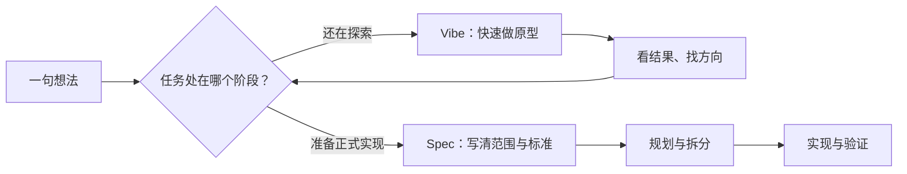
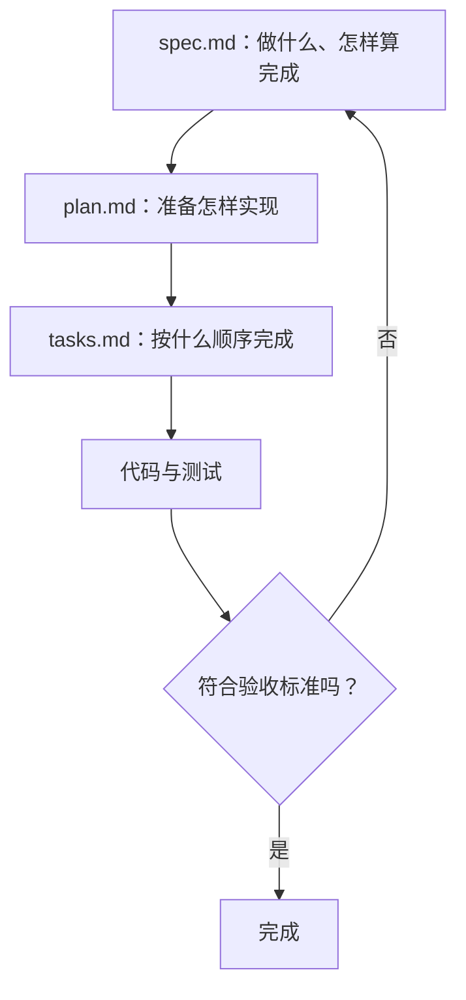
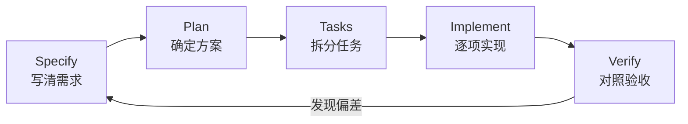

# 从 Vibe Coding 到 Spec Coding：先把需求写清楚，再让 AI 写代码

很多人第一次用 AI 开发软件，都是从一句很自然的话开始：

<div class="workflow-chat">
  <div class="workflow-message workflow-message--user">
    <div class="workflow-message__speaker">🙋 你</div>
    <p>帮我做一个通知中心，要有未读消息，也要能全部标记为已读。</p>
  </div>
  <div class="workflow-message workflow-message--agent">
    <div class="workflow-message__speaker">✨ Agent</div>
    <p>好的，我现在开始创建页面、接口和数据表。</p>
  </div>
</div>

十分钟后，页面可能已经能打开。接着你又想到：通知分为订单、安全和活动三类；用户可以关闭某些类型；未读数量要实时变化；手机推送不能被“全部已读”影响。

于是 AI 一轮轮修改，前面的数据结构被推翻，页面和接口开始使用不同的字段名，最后大家都说不清“这个功能到底怎样才算完成”。

这就是 **Vibe Coding** 容易遇到的天花板：它很适合快速探索，却不擅长长期保存完整意图。

**Spec Coding** 的做法是先把意图变成一份可以检查的规格，再让 AI 规划、实现和验证。它不是让你先写几十页文档，而是把最容易引起返工的决定提前说清楚。

::: info 本文和下一篇的分工

本文讲清楚 **为什么需要 Spec、怎样写出一份能指导 AI 的 Spec**。学会这个方法后，可以继续阅读[《GitHub Issues 驱动开发实战》](https://github.com/datawhalechina/easy-vibe/blob/130e9b75b28b524e8cc74e615fd9733a4e2b330d/zh-cn/stage-3/core-skills/github-iterative-development/README.md)，用真实公开仓库走完整个自动开发流程。

:::

读完本文，你会得到一套可以直接复用的方法：

- 判断一个任务适合 Vibe Coding 还是 Spec Coding；
- 把一句模糊需求整理成范围、规则和验收标准；
- 让 AI 按照 `Spec → Plan → Tasks → Implement → Verify` 工作；
- 当需求变化时，先修正规格，再继续修改代码。

## 1. Vibe Coding 没有错，只是它有适用范围

Vibe Coding 可以理解为：你主要通过即时对话表达想法，AI 根据当前聊天直接修改代码。

它最大的优点是快。你不必先知道正确答案，可以一边看结果、一边寻找方向。

### 1.1 这些事情很适合直接 Vibe

- 做一个半小时后就会丢弃的界面草图；
- 探索一个不熟悉的框架能不能完成某种效果；
- 写一次性数据处理脚本；
- 参加 Hackathon，先证明想法可行；
- 调整颜色、间距、文案等局部细节。

例如下面这条指令就很合理：

```text
先做一个可以点击的通知中心原型。
使用假数据，只验证列表、未读标记和筛选交互，暂时不要接后端。
```

这里的目标本来就是“看一眼感觉”，没有必要先设计完整的数据模型。

### 1.2 出现这些信号，就应该转向 Spec

当任务出现下面任意两三项时，只靠聊天通常就不够了：

1. 要修改多个模块或很多文件；
2. 有权限、支付、隐私或数据安全要求；
3. 存在很多边界情况和失败情况；
4. 需要多人或多个 AI 会话继续开发；
5. 预计几周后还要维护；
6. 你开始频繁说“这个前面不是讲过了吗”；
7. 功能能运行，但没人知道是否已经完整实现。

| 只靠当前聊天 | 使用 Spec |
| --- | --- |
| 需求散落在多轮对话中 | 已确认的需求集中在仓库文档中 |
| 想到什么就立即改什么 | 先确认变更影响，再修改实现 |
| AI 通过“感觉”判断完成 | AI 逐条对照验收标准检查 |
| 换一个会话容易丢失上下文 | 新会话可以先读取同一份规格 |
| 适合探索方向 | 适合稳定交付和长期维护 |



所以，从 Vibe 到 Spec 不是“旧方法被新方法淘汰”，而是项目从探索阶段进入了交付阶段。

## 2. Spec 到底是什么

**Spec 是一份关于预期行为的共同约定。**

它至少要让人和 AI 都能回答三个问题：

1. **要做什么？** 用户最终可以完成哪些事情；
2. **边界在哪里？** 哪些规则、异常和非目标不能被忽略；
3. **怎样证明完成？** 可以观察或测试哪些结果。

一份好的 Spec 不等于一份很长的文档。一个小功能可能只需要一页。真正重要的是内容是否具体、前后一致、可以验证。

### 2.1 Spec 不是愿望清单

下面这段看起来写了不少要求，但仍然太模糊：

```text
做一个好用的通知中心。
界面要现代，速度要快，支持各种通知，注意安全。
```

AI 仍然需要猜：什么叫“好用”？有哪些通知？多快算快？谁能读取通知？

把它改成可观察的行为，就会清楚很多：

```text
- 用户打开通知中心时，默认看到最近 30 天的通知。
- 通知类型包括订单、安全提醒和活动消息。
- 未读通知显示蓝点，顶部显示未读总数。
- 用户可以标记单条已读，也可以将当前账号的全部通知标记为已读。
- 用户只能读取属于当前账号的通知。
- 列表加载失败时保留页面结构，并显示“重新加载”按钮。
```

第二段没有规定按钮必须放在第几个文件里，却已经足够让 AI 设计界面、接口和测试。

### 2.2 一份实用 Spec 的四层结构

| 层次 | 要回答的问题 | 通知中心示例 |
| --- | --- | --- |
| 产品目标 | 为什么要做 | 让用户在一个地方查看与处理重要消息 |
| 用户行为 | 用户能做什么 | 查看、筛选、标记单条或全部已读 |
| 规则与边界 | 什么情况下怎样处理 | 只能读取自己的通知；失败时可以重试 |
| 验收证据 | 怎样证明做完 | 未读数正确变化；权限测试通过 |

技术方案当然也重要，但它应该建立在用户行为已经明确的基础上。不要一开始只写“创建 `NotificationService.ts`”，因为文件存在并不能证明用户问题已经解决。

### 2.3 规格、计划和任务不是同一个东西

这三个概念经常被混在一起：

| 文档 | 主要内容 | 一个典型句子 |
| --- | --- | --- |
| `spec.md` | 期望的行为和验收标准 | “用户可以将单条通知标记为已读” |
| `plan.md` | 准备采用的技术方案 | “通过 `PATCH /notifications/:id` 更新状态” |
| `tasks.md` | 可以按顺序完成的工作 | “先实现读取列表，再实现单条已读” |

如果技术栈发生变化，`plan.md` 可能需要重写；只要用户仍然需要“标记已读”，`spec.md` 中的行为就不应该改变。



## 3. 把一句模糊需求变成可执行规格

下面继续用“通知中心”做一个小练习。重点不是通知功能本身，而是观察需求如何一步步收敛。

### 3.1 第一步：先让 AI 提问，不要马上写代码

<div class="workflow-chat">
  <div class="workflow-message workflow-message--user">
    <div class="workflow-message__speaker">🙋 你</div>
    <p>我想给现有网站增加通知中心。先不要写代码，请帮我找出会影响产品范围、数据结构和验收方式的问题。每次最多问 4 个，并给出你的推荐。</p>
  </div>
  <div class="workflow-message workflow-message--agent">
    <div class="workflow-message__speaker">✨ Agent</div>
    <p>先确认第一组关键问题：通知来自哪些业务？是否需要实时推送？用户可以控制哪些偏好？第一版需要保留多久的历史通知？</p>
  </div>
  <div class="workflow-message workflow-message--user">
    <div class="workflow-message__speaker">🙋 你</div>
    <p>第一版只做订单、安全和活动三类站内通知，不做手机推送。用户可以关闭活动消息，但不能关闭订单和安全提醒。列表显示最近 30 天，数据保留 90 天。</p>
  </div>
</div>

这轮对话解决了四个会影响实现的决定：来源、渠道、偏好和保留周期。它们如果拖到代码写完后才确认，数据模型和接口都可能返工。

### 3.2 第二步：明确“做什么”和“不做什么”

Spec 最容易失控的原因之一，是只写功能清单，没有写第一版边界。

```markdown
## 第一版范围

- 展示最近 30 天的站内通知
- 支持订单、安全、活动三种类型
- 支持单条已读和全部已读
- 支持按“全部 / 未读”筛选
- 允许用户关闭活动消息

## 第一版不做

- 手机推送和邮件通知
- 通知内容搜索
- 管理员群发后台
- 自定义保留时间
```

“不做什么”不是消极信息。它是在保护第一版，避免 AI 看到“通知中心”四个字后顺手搭出一套远超需求的消息平台。

### 3.3 第三步：把形容词改成验收标准

“实时”“安全”“友好”都不是可以直接验证的标准。可以继续追问：发生什么操作后，用户应该看到什么结果？

<div class="workflow-chat">
  <div class="workflow-message workflow-message--agent">
    <div class="workflow-message__speaker">✨ Agent</div>
    <p>“未读数实时变化”还不够具体。我建议定义为：用户标记单条已读后，列表状态和顶部未读数在同一次操作完成后更新，不要求跨设备实时同步。可以吗？</p>
  </div>
  <div class="workflow-message workflow-message--user">
    <div class="workflow-message__speaker">🙋 你</div>
    <p>可以。再补充：操作失败时恢复原来的未读状态，并显示可以重试的提示；“全部已读”只影响当前账号。</p>
  </div>
</div>

现在可以写成几条可检查的验收标准：

```markdown
## 验收标准

1. 当账号有 3 条未读通知时，导航栏显示数字 3。
2. 用户把其中 1 条标记为已读后，该条蓝点消失，未读数变为 2。
3. 如果更新请求失败，页面恢复原状态，并显示“标记失败，请重试”。
4. 用户执行“全部已读”后，仅当前账号的通知被更新。
5. 关闭活动消息后，新产生的活动消息不再写入该用户的通知列表。
6. 订单通知和安全提醒不能在偏好设置中关闭。
```

注意，这些标准都描述用户或系统能观察到的结果，而不是“代码写得优雅”“使用最佳实践”这样的主观判断。

### 3.4 第四步：补上失败情况和数据边界

正常路径往往只占功能的一部分。至少检查下面四类边界：

- **空状态**：一条通知也没有时显示什么；
- **失败状态**：网络或服务异常时能否重试；
- **权限边界**：能不能读取或修改别人的数据；
- **重复操作**：已经已读的通知再次标记会怎样。

本例可以补充：

```markdown
## 边界与异常

- 没有通知时显示空状态，不显示错误提示。
- 请求失败时不清空已有列表。
- 读取、更新通知时都必须校验当前账号归属。
- 对已读通知再次执行“标记已读”时保持成功，不重复增加事件。
- 超过 90 天的数据由后台清理，不属于页面请求的职责。
```

到这里，这份 Spec 已经足够指导后续规划。它仍然只有一页左右，却比十轮零散聊天更可靠。

## 4. 一份可以直接使用的最小 Spec

你不需要每次从空白文档开始。下面这个模板适合大多数中小功能，可以保存为 `specs/功能名称/spec.md`。

```markdown
# 功能名称

## 1. 背景与目标

- 当前问题：
- 希望带来的结果：
- 目标用户：

## 2. 第一版范围

- 用户可以……
- 系统在……时应该……

## 3. 第一版不做

- 暂不支持……

## 4. 业务规则

- 当……时……
- 只有……可以……

## 5. 边界与异常

- 空状态：
- 失败状态：
- 权限边界：
- 重复操作：

## 6. 验收标准

1. 给定……，当……，那么……
2. 给定……，当……，那么……

## 7. 已确认的技术约束

- 必须兼容：
- 不允许引入：
- 性能 / 隐私 / 安全要求：

## 8. 未解决问题

- [ ] 仍需要确认……
```

::: tip 不确定的内容不要伪装成结论

如果某个问题还没有答案，就把它放进“未解决问题”。让 AI 明确知道哪里不能自行猜测，比写一个看起来完整、实际包含错误假设的 Spec 更安全。

:::

## 5. 让 AI 按 Spec 工作，而不是读完就忘

有了文档并不代表已经进入 Spec Coding。真正的变化是：后续规划、实现和验收都要引用它。

### 5.1 建议的仓库结构

工具不同，项目指令文件的名字也可能不同。可以采用下面这种简单结构：

```text
project/
├── AGENTS.md 或 CLAUDE.md        # 整个项目长期遵守的规则
├── specs/
│   └── notification-center/
│       ├── spec.md               # 功能行为与验收标准
│       ├── plan.md               # 技术方案
│       └── tasks.md              # 实现顺序与完成状态
├── src/                           # 实现代码
└── tests/                         # 验证行为的测试
```

`AGENTS.md` 或 `CLAUDE.md` 适合保存长期有效的项目规则，例如如何运行测试、哪些目录不能修改、金额如何存储。具体功能的需求不要全部堆进项目总规则，而应该放到 `specs/` 中。

### 5.2 五段式工作流

GitHub 的 Spec Kit 把核心流程概括为 `Specify → Plan → Tasks → Implement`。实际使用时，再加上独立的验证步骤会更稳妥：

| 阶段 | AI 的工作 | 你要检查什么 |
| --- | --- | --- |
| Specify | 澄清并写出规格 | 范围、规则、非目标是否正确 |
| Plan | 设计数据、接口和改动范围 | 方案是否符合现有项目约束 |
| Tasks | 拆成有依赖的小任务 | 每项是否可独立完成和验证 |
| Implement | 按顺序修改代码与测试 | 是否只做当前任务、是否持续测试 |
| Verify | 对照验收标准审查结果 | 是否有漏项、回归或未经确认的假设 |



### 5.3 可以直接复制的提示词

**先澄清需求：**

```text
我要实现【功能名称】。先不要写代码。

请先阅读当前仓库和已有项目规则，然后通过提问帮我明确：
1. 第一版范围和非目标；
2. 关键业务规则；
3. 空状态、失败状态和权限边界；
4. 可以验证的验收标准。

每次最多问 4 个真正会影响实现的问题，并说明你的推荐。
```

**生成规格：**

```text
根据我们已经确认的讨论，生成 specs/<feature>/spec.md。

文档必须包含：背景与目标、第一版范围、非目标、业务规则、
边界与异常、验收标准、技术约束和未解决问题。
不要把尚未确认的假设写成结论，也不要开始实现。
```

**规划和拆任务：**

```text
阅读 specs/<feature>/spec.md 和现有代码。
先生成 plan.md，说明数据、接口、受影响模块、风险和验证方式；
再生成 tasks.md，把工作拆成有顺序、可独立验证的小任务。
现在不要修改实现代码。
```

**逐项实现：**

```text
按照 tasks.md 的依赖顺序逐项实现。
每次只处理一项：先补充能证明当前行为缺失的测试，再实现，
运行相关检查，最后更新任务状态并说明对应的验收标准。
如果发现 Spec 有矛盾或缺少关键决定，先停下来指出，不要自行扩展范围。
```

**最终检查：**

```text
不要根据任务勾选状态判断完成。
请重新阅读 spec.md，逐条核对范围、业务规则和验收标准；
同时运行测试、类型检查和构建。列出每条要求对应的代码或测试证据，
发现遗漏就修复并重新验证。
```

## 6. 全网调研：主流 Spec 工具和 Skills 怎么选

前面的方法不依赖任何特定工具。为了看看行业里已经有哪些可以直接使用的方案，我们检索并核对了各项目截至 **2026 年 8 月**的官方文档和官方仓库。

先说结论：这些项目都在谈“先明确意图，再写代码”，但解决的问题并不完全相同。

| 工具或 Skills | 核心流程 | 最突出的能力 | 更适合谁 |
| --- | --- | --- | --- |
| [Matt Pocock Skills](https://github.com/mattpocock/skills) | 讨论 → Spec → Tickets → 实现 → 审查 | 把对话、任务系统和代码提交连成一条线 | 想让 Agent 在 GitHub / Linear 上持续工作的人 |
| [GitHub Spec Kit](https://github.github.io/spec-kit/) | Specify → Plan → Tasks → Implement | 模板、检查清单、跨文档一致性分析和多 Agent 集成 | 新项目、正式团队流程、需要治理能力的项目 |
| [OpenSpec](https://github.com/Fission-AI/OpenSpec) | Explore → Propose → Apply → Archive | 以“变更”为单位维护增量规格，流程较轻 | 已有代码库、持续迭代的小团队 |
| [Kiro Specs](https://kiro.dev/docs/specs/) | Requirements → Design → Tasks → Execution | IDE 内直接审阅三份规格文件，支持 EARS 需求格式 | 喜欢图形界面和阶段确认的人 |
| [Superpowers](https://github.com/obra/superpowers) | Brainstorm → Plan → TDD → Review | 用强制 Skills 和验证关卡约束实现质量 | 已经有 Spec，想加强工程纪律的人 |
| [BMAD Method](https://docs.bmad-method.org/) | 分析 → 规划 → 方案 → 实现 | 多角色、PRD、架构和 Story 等完整产品流程 | 较大产品、复杂协作或希望模拟完整团队的人 |

它们不是按“谁最好”排序。选择时应该先问：我缺的是需求澄清、规格文件、任务管理，还是实现质量？

### 6.1 Matt Pocock Skills：让 Spec 跨越多个 Agent 会话

Matt Pocock 的主流程由一组可以按顺序调用的 Skills 组成：

```text
grill-with-docs → to-spec → to-tickets → implement → code-review
```

安装全部 Skills：

```bash
npx skills@latest add mattpocock/skills
```

继续用通知中心举例，可以这样开始：

```text
/grill-with-docs
我要给现有网站增加通知中心。第一版只做订单、安全和活动三类站内通知。
请和我讨论范围、失败情况、权限边界和验收方式，暂时不要写代码。
```

双方达成共识后再依次运行：

```text
/to-spec
把刚才确认的通知中心需求整理成规格，并发布到项目任务系统。

/to-tickets
把规格拆成有优先级、前置依赖和验收方式的纵向任务。

/implement
按照依赖顺序逐张实现，从第一张可以开始的任务出发。

/code-review
分别检查代码质量和需求覆盖情况，发现问题后修复并重新验证。
```

这套 Skills 有一个很重要的使用边界：根据 [`to-spec` 官方说明](https://github.com/mattpocock/skills/blob/main/docs/engineering/to-spec.md)，如果工作已经讨论清楚，而且一个上下文窗口就能完成，可以直接使用 `implement`，不必为了形式额外生成 Spec。`to-spec` 真正有价值的场景，是工作会跨越多个会话，需要把已经做出的决定保存下来。

另外，这套方法把 Spec 视为开发阶段的决策快照。功能交付后，长期有效的项目语言和架构决定应该沉淀到 `CONTEXT.md` 与 ADR，而不是假设每份临时 Spec 永远不会过时。

::: tip 想看完整运行结果？

下一篇[《GitHub Issues 驱动开发实战》](https://github.com/datawhalechina/easy-vibe/blob/130e9b75b28b524e8cc74e615fd9733a4e2b330d/zh-cn/stage-3/core-skills/github-iterative-development/README.md)已经使用这条链路开发出一个真实 macOS 应用，并保留了公开仓库、Issues、代码提交、测试和产品截图。

:::

### 6.2 GitHub Spec Kit：规格工件最完整的一套流程

GitHub Spec Kit 的核心流程是：

```text
Spec → Plan → Tasks → Implement
```

每个阶段都会生成 Markdown 工件，并把上一步的结果交给下一步。它还提供 `clarify`、`analyze` 和 `checklist` 等命令，用来发现规格中的模糊点、文档之间的矛盾和遗漏。


_截图来源：[GitHub Spec Kit 官方仓库](https://github.com/github/spec-kit)。_

官方当前推荐使用 `uv` 安装 CLI：

```bash
uv tool install specify-cli
specify init notification-demo --integration copilot
cd notification-demo
```

`--integration` 后面的值要换成你实际使用的 Agent。可以通过下面的命令查看当前版本支持哪些集成：

```bash
specify integration list
```

初始化后，在对应的编程 Agent 中运行：

```text
/speckit.constitution
建立项目原则：所有通知接口都要校验账号归属；新增行为必须有自动化测试。

/speckit.specify
实现通知中心：订单、安全和活动三类站内通知，支持单条和全部已读。
活动消息可以关闭，订单和安全提醒不能关闭。

/speckit.clarify
/speckit.plan
/speckit.tasks
/speckit.analyze
/speckit.implement
```

这套流程适合希望每个阶段都有正式产物和人工检查点的项目。如果需求特别大，官方还建议使用“Spec of Specs”：先写一份浅层 Roadmap，再让每个独立子功能各自走一轮完整流程，避免单份规格塞进太多子系统。

### 6.3 OpenSpec：围绕一次“变更”维护增量规格

OpenSpec 更强调轻量、迭代和已有项目。它不是先为整个产品写一份巨大 PRD，而是为每次变更建立一个目录：

```text
openspec/changes/add-notification-center/
├── proposal.md
├── specs/
├── design.md
└── tasks.md
```

安装和初始化：

```bash
npm install -g @fission-ai/openspec@latest
cd your-project
openspec init
```

如果方向还没有想清楚，先探索；如果需求已经明确，直接提出变更：

```text
/opsx:explore
我想增加通知中心，但不确定应该采用轮询、SSE 还是 WebSocket。
请先阅读现有项目，比较方案，不要修改代码。

/opsx:propose add-notification-center
第一版只做站内通知。活动消息可关闭，订单和安全提醒不可关闭。

/opsx:apply
/opsx:archive
```

`propose` 会生成提案、增量规格、设计和任务；`apply` 按任务实现；`archive` 在完成后归档这次变更，并把稳定需求合并回项目规格。

::: info 命令名称可能略有不同

OpenSpec 会根据 Agent 的调用方式生成不同名称。例如部分工具使用 `/opsx:propose`，Codex Skills 可能显示为 `$openspec-propose`。初始化完成后，以终端打印出的实际命令为准。

:::

### 6.4 Kiro Specs：直接在 IDE 里审阅 Requirements、Design 和 Tasks

Kiro 把 Spec 做成了 IDE、CLI 和 Web 中的内置工作流。标准 Feature Spec 会生成三份文件：

```text
.kiro/specs/notification-center/
├── requirements.md
├── design.md
└── tasks.md
```

下面是 Kiro 官方演示中的 Spec 工作区。顶部可以在 Requirements、Design 和 Task list 之间切换，右侧保留与 Agent 的讨论过程。


任务阶段会把实现工作拆成有顺序的列表，并把任务重新关联到需求：


_两张截图来源：[Kiro 官方产品介绍](https://kiro.dev/blog/introducing-kiro/)。_

Kiro 的需求文件使用 **EARS** 风格，把事件和预期行为写成固定句式：

```text
WHEN 用户把一条未读通知标记为已读
THE SYSTEM SHALL 移除该条蓝点，并将顶部未读数量减 1

IF 更新请求失败
THE SYSTEM SHALL 恢复原来的未读状态，并显示可重试提示
```

这种格式很适合直接转成测试。Kiro CLI 的基本用法是：

```text
/spec new
# 选择 Build a Feature，然后描述通知中心

/spec run notification-center
# 审阅 requirements.md、design.md 和 tasks.md 后再执行
```

如果功能非常熟悉，可以使用 Quick Spec，一次生成三份工件；涉及支付、权限、合规或陌生领域时，更适合保留每个阶段的人工确认。

### 6.5 Superpowers：用 Skills 守住实现质量

Superpowers 并不是另一种 Spec 文件格式。它更像一套强制执行的工程方法，用来确保 Agent 不跳过设计、测试和审查。

它的基本链路包括：

```text
brainstorming
  → writing-plans
  → using-git-worktrees
  → test-driven-development
  → subagent-driven-development / executing-plans
  → requesting-code-review
  → verification-before-completion
```

对于通知中心，可以这样组合：

| 阶段 | 使用的 Skill | 具体作用 |
| --- | --- | --- |
| 需求还模糊 | `brainstorming` | 通过提问形成设计文档，并让用户确认 |
| Spec 已确认 | `writing-plans` | 拆出文件、任务、测试和验证步骤 |
| 开始实现 | `using-git-worktrees` | 在隔离分支中工作，先确认测试基线 |
| 每张任务 | `test-driven-development` | 先看到测试失败，再写最小实现 |
| 宣布完成前 | `verification-before-completion` | 运行真实检查，不接受“应该已经好了” |

这套 Skills 很适合叠加在 Spec Kit、OpenSpec 或手写 Spec 之后：前者负责“要做什么”，Superpowers 负责“怎样可靠地实现和证明”。

### 6.6 BMAD Method：复杂产品的多角色规划流程

BMAD Method 的范围比单个功能更大。它会逐步产生产品简报、PRD、架构、Stories 和实现记录，并提供产品经理、架构师、开发者、测试等角色化 Skills。

安装：

```bash
npx bmad-method install
```

安装完成后，可以先调用：

```text
bmad-help
```

它会根据已有产物告诉你下一步适合运行什么。一个新产品可能采用下面的顺序：

```text
bmad-product-brief
  → bmad-prd
  → bmad-create-architecture
  → bmad-create-epics-and-stories
  → bmad-dev-story
  → bmad-code-review
```

如果只是给现有页面增加一个小筛选器，这套流程会显得太重；如果要从零规划带有多个角色、多个模块和长期路线图的产品，它提供的上下文会比单页 Spec 更完整。

### 6.7 不依赖工具的六种 Spec 方法

真正值得长期掌握的不是斜杠命令，而是这些可以跨工具迁移的方法。

| 方法 | 解决什么问题 | 简短示例 |
| --- | --- | --- |
| EARS | 减少需求句子的歧义 | `WHEN 发生事件，系统 SHALL 产生结果` |
| Given / When / Then | 把业务规则写成可执行场景 | 已有 3 条未读 → 标记 1 条 → 未读数变 2 |
| ADR | 保存重要技术选择的原因 | 为什么用 SSE，而不是 WebSocket |
| 纵向切片 | 让每张任务交付一小段完整用户价值 | 一张任务同时完成列表接口、页面和测试 |
| 验证关卡 | 防止 Agent 只根据任务勾选宣布完成 | 构建、测试、类型检查和逐条验收都通过 |
| Spec 生命周期 | 明确交付后怎样维护规格 | 快照、持续锚定或以 Spec 为唯一源头 |

**EARS 示例：**

```text
WHEN 用户点击“全部已读”
THE SYSTEM SHALL 只更新当前账号的未读通知
```

**Given / When / Then 示例：**

```gherkin
Given 当前账号有 3 条未读通知
When 用户将其中 1 条标记为已读
Then 顶部未读数量应显示为 2
And 该条通知不再显示未读蓝点
```

**ADR 示例：**

```markdown
# ADR-004：首版使用 SSE 推送未读数量

## 决定
首版使用 SSE，不使用 WebSocket。

## 原因
服务端只需要单向推送；SSE 更简单，并能复用现有 HTTP 鉴权。

## 后果
如果未来加入双向实时协作，需要重新评估传输方案。
```

Spec 的生命周期也需要提前决定。GitHub Spec Kit 的官方文档区分了三种常见模式：

1. **Spec-first**：开发前使用，交付后可以丢弃；
2. **Spec-anchored**：交付后继续维护，作为需求与实现的长期锚点；
3. **Spec-as-source**：人主要修改 Spec，再从它重新生成实现工件。

Matt Pocock Skills 更接近第一种快照模式；OpenSpec 的归档和稳定规格更接近第二种。没有唯一正确答案，但团队必须明确选择，否则最容易出现“文档看起来仍然有效，实际上早已落后”的情况。

### 6.8 我们推荐怎样组合

| 你的情况 | 推荐组合 |
| --- | --- |
| 只想快速试验想法 | Vibe 原型 + 3–5 条验收标准 |
| 现有项目中持续增加中小功能 | OpenSpec + Given/When/Then + 自动化测试 |
| 希望用 GitHub Issues 让 Agent 连续开发 | Matt Pocock Skills + ADR + Code Review |
| 新项目，需要完整且可审查的工件 | GitHub Spec Kit + Analyze + 人工阶段确认 |
| 喜欢在 IDE 中看需求、设计和任务 | Kiro Specs + EARS |
| 已经有 Spec，但 Agent 经常跳过测试 | Superpowers 的 TDD 与 Verification Skills |
| 从零规划多个模块的大型产品 | BMAD Method，再为每个 Story 使用轻量 Spec |

::: warning 不要把所有框架一起装进同一个项目

同时让三个工具各自维护 `spec.md`、`tasks.md` 和完成状态，反而会制造冲突。选择一个工具作为主流程，再从其他方法中借用 EARS、ADR、TDD 或审查关卡即可。

:::

## 7. 需求变化时，先改 Spec 还是先改代码

现实项目一定会变化。Spec Coding 并不要求第一次就预测所有需求，而是要求变化被明确记录。

假设通知中心上线后，用户提出：“安全提醒即使已经读过，也不能被普通用户删除。”正确顺序是：

1. 在 `spec.md` 中增加安全提醒的保留规则和验收标准；
2. 检查 `plan.md` 和 `tasks.md` 是否需要新增任务；
3. 修改代码和测试；
4. 再次对照完整 Spec 验证旧行为没有被破坏。

如果只在聊天里说一句“顺手加上”，下一次会话可能完全不知道这条规则为什么存在。

::: warning Spec 不是写完就冻结

规格需要随着真实反馈演进。过时的 Spec 会给 AI 提供错误上下文，比没有文档更危险。每次发现需求和实现不一致时，都要明确判断：是实现偏离了规格，还是规格已经落后于真实需求。

:::

## 8. 常见的五个误区

### 8.1 把 Spec 写成文件清单

“创建三个组件、两个接口、一个数据表”属于计划，不是用户需求。先写行为，再决定文件。

### 8.2 让 AI 独自决定所有产品问题

AI 可以提出选项和推荐，但权限、隐私、付费规则、数据保留等关键决定应该由负责人确认。

### 8.3 追求一次写出完美长文档

Spec 的价值来自反复澄清，不来自页数。先覆盖高风险决定，再逐步补充细节。

### 8.4 任务打勾就宣布完成

任务列表只能说明“做过哪些工作”，不能代替验收。最终仍要回到 `spec.md` 检查用户行为。

### 8.5 需求变了却只改代码

这样会让规格和实现分叉。以后 AI 读取旧 Spec，很可能把正确的新行为改回去。

## 9. 什么时候用轻量版，什么时候用完整流程

不必给每个按钮都建立一整套文档。可以按风险选择力度：

| 任务类型 | 推荐方式 | 最少需要留下什么 |
| --- | --- | --- |
| 一次性原型 | Vibe Coding | 一段说明目标和临时边界的提示词 |
| 小型局部功能 | 轻量 Spec | 范围、非目标、3–5 条验收标准 |
| 跨模块功能 | 完整 Spec | `spec.md`、`plan.md`、`tasks.md`、测试 |
| 支付、权限、隐私 | 完整 Spec + 人工审查 | 威胁与失败场景、审计要求、验证证据 |
| 多人或多 Agent 开发 | 完整 Spec + 版本管理 | 明确依赖、负责人、变更记录 |

一个简单判断方法是问自己：

> 如果换一个完全没看过当前聊天的人，他只读仓库里的文档，能不能继续开发并判断完成？

如果答案是否定的，就说明关键意图仍然只存在于聊天里。

## 10. 现在就做一次 30 分钟练习

选择你正在开发的一个小功能，控制在“一天内可以实现”的范围，然后完成下面四步：

1. 用本文的澄清提示词，让 AI 问你不超过 8 个问题；
2. 生成一页 `spec.md`，亲自删除所有未经确认的假设；
3. 把“好用、快速、安全”改成可以观察或测试的标准；
4. 让另一个新会话只阅读 Spec，并复述它准备实现什么、不实现什么。

如果新会话的复述与你的想法一致，这份 Spec 已经开始发挥作用。如果仍有明显偏差，不要急着写代码，继续修正规格。

## 总结

从 Vibe Coding 到 Spec Coding，真正改变的不是 Markdown 文件数量，而是 **意图如何进入开发流程**：

- Vibe Coding 用来快速探索，找到正确方向；
- Spec 把已经确认的方向变成共同标准；
- Plan 和 Tasks 把标准翻译成可以执行的顺序；
- 代码和测试提供实现证据；
- Verify 再回到 Spec，检查有没有遗漏或偏离。

你不需要彻底放弃 Vibe Coding。更实用的组合是：

```text
用 Vibe 探索方向 → 用 Spec 固化共识 → 用任务控制实现 → 用验收证明完成
```

下一步，可以进入[《GitHub Issues 驱动开发实战》](https://github.com/datawhalechina/easy-vibe/blob/130e9b75b28b524e8cc74e615fd9733a4e2b330d/zh-cn/stage-3/core-skills/github-iterative-development/README.md)。那里不再只讲方法，而是从一句产品想法开始，展示 Spec、GitHub Issues、代码提交、测试和最终 macOS 软件是怎样一步步产生的。

## 参考资料

- [GitHub Spec Kit：Spec-Driven Development 工具与流程](https://github.github.io/spec-kit/)
- [GitHub Spec Kit：Spec → Plan → Tasks → Implement 的设计说明](https://github.com/github/spec-kit/blob/main/spec-driven.md)
- [GitHub Spec Kit：Spec 生命周期模型](https://github.github.io/spec-kit/concepts/spec-persistence.html)
- [Matt Pocock Skills：to-spec 官方说明](https://github.com/mattpocock/skills/blob/main/docs/engineering/to-spec.md)
- [Matt Pocock Skills：to-tickets 官方说明](https://github.com/mattpocock/skills/blob/main/docs/engineering/to-tickets.md)
- [OpenSpec 官方仓库与示例](https://github.com/Fission-AI/OpenSpec)
- [Kiro：Feature Specs 与 EARS](https://kiro.dev/docs/specs/feature-specs/)
- [Kiro：Specs CLI 工作流](https://kiro.dev/docs/cli/v3/specs/)
- [Superpowers 官方 Skills 工作流](https://github.com/obra/superpowers)
- [BMAD Method 官方安装与方法说明](https://docs.bmad-method.org/how-to/install-bmad/)
- [Cucumber：Given / When / Then 参考](https://cucumber.io/docs/gherkin/reference/)
- [Architectural Decision Records](https://adr.github.io/)
- [Anthropic：Claude Code 项目记忆与 CLAUDE.md](https://docs.anthropic.com/en/docs/claude-code/memory)
- [OpenAI Model Spec](https://model-spec.openai.com/)
- [Sean Grove：The New Code 演讲文字稿](https://lawwu.github.io/transcripts/8rABwKRsec4.html)
