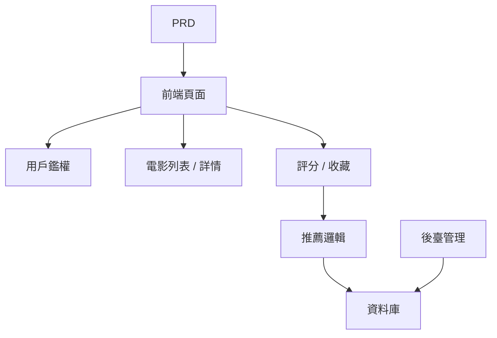

# Spring Boot 電影推薦系統開發實戰

## 概述

本實戰項目要求你圍繞一份真實的 PRD，使用 Spring Boot 完成一個帶推薦能力的電影網站。這個項目的核心挑戰在於：它不是簡單的增刪改查，而是需要你思考"用戶行為如何影響推薦結果"以及"推薦如何可解釋"。

這是 Stage 2 的綜合實戰環節。你將第一次接觸"內容 + 行為 + 推薦"型產品的開發模式，這種模式在電商、內容平臺、個性化 Feed 等場景中非常常見。

## 前置知識

在開始本項目之前，你應該已經掌握以下內容：

- 前端頁面設計與組件庫使用（[UI 設計](https://github.com/datawhalechina/easy-vibe/blob/130e9b75b28b524e8cc74e615fd9733a4e2b330d/docs/zh-tw/stage-2/frontend/ui-design/README.md)、[現代組件庫](https://github.com/datawhalechina/easy-vibe/blob/130e9b75b28b524e8cc74e615fd9733a4e2b330d/docs/zh-tw/stage-2/frontend/modern-component-library/README.md)）
- 後端接口設計與開發（[接口程式碼編寫](https://github.com/datawhalechina/easy-vibe/blob/130e9b75b28b524e8cc74e615fd9733a4e2b330d/docs/zh-tw/stage-2/backend/ai-interface-code/README.md)）
- 資料庫基礎與 Supabase（[從資料庫到 Supabase](https://github.com/datawhalechina/easy-vibe/blob/130e9b75b28b524e8cc74e615fd9733a4e2b330d/docs/zh-tw/stage-2/backend/database-supabase/README.md)）
- Git 工作流與部署（[Git 和 GitHub](https://github.com/datawhalechina/easy-vibe/blob/130e9b75b28b524e8cc74e615fd9733a4e2b330d/docs/zh-tw/stage-2/backend/git-workflow/README.md)、[部署 Web 應用](https://github.com/datawhalechina/easy-vibe/blob/130e9b75b28b524e8cc74e615fd9733a4e2b330d/docs/zh-tw/stage-2/backend/zeabur-deployment/README.md)）

## 學習目標

完成本實戰後，你將能夠：

1. 閱讀 PRD 並從中提取推薦系統的開發任務清單
2. 使用 Spring Boot 搭建後端項目並實現 RESTful API
3. 設計"用戶行為 → 推薦"的完整資料鏈路
4. 實現可解釋的推薦邏輯
5. 完成端到端聯調，交付可演示的產品原型

## 項目簡介

你要構建的產品是一個帶推薦能力的電影網站：

| 功能 | 描述 |
|------|------|
| **瀏覽與搜索** | 用戶可以瀏覽和搜索電影 |
| **評分與收藏** | 用戶可以給電影評分、添加收藏 |
| **個性化推薦** | 系統根據用戶行為給出推薦結果 |
| **管理後臺** | 管理員維護電影資料、查看推薦效果 |

::: tip PRD 入口
本項目的需求文檔在 GitHub： [查看 PRD](https://github.com/datawhalechina/easy-vibe/blob/main/docs/zh-tw/stage-2/assignments/movie-recommendation-springboot/PRD.md)
:::

<div style="margin: 32px 0;">
</div>

## 第一部分：需求分析

### 1.1 閱讀 PRD

打開 PRD 文檔，重點回答以下問題：

- 推薦策略是什麼？第一版是否使用可解釋版本（如基於評分相似度）？
- 用戶行為資料要存哪些？（評分、收藏、瀏覽記錄等）
- 管理員需要看哪些推薦效果指標？
- 頁面清單是否完整？

::: warning
如果以上問題沒有明確答案，不要開始寫程式碼。需求理解不清楚是導致返工的最常見原因。
:::

### 1.2 確認系統架構



## 第二部分：搭建項目骨架

### 2.1 生成前端頁面

提示詞參考：

```text
請基於當前 PRD，幫我生成一個 Spring Boot 電影推薦系統的前端骨架。

要求：
1. 頁面包括：首頁、電影列表、電影詳情、推薦頁、個人中心、後臺管理
2. 先只生成頁面結構和假資料，不接真實接口
3. 風格要像真實內容產品，而不是課堂 demo
```

### 2.2 驗證頁面結構

逐項檢查：

- [ ] 電影列表頁支持搜索和篩選
- [ ] 電影詳情頁包含評分和收藏按鈕
- [ ] 推薦頁能展示推薦結果和推薦理由
- [ ] 管理後臺能展示電影資料和推薦效果

## 第三部分：迭代開發

### 3.1 按模塊推進

1. **Spring Boot 項目搭建**：項目結構、資料庫配置、基礎 CRUD
2. **電影資料管理**：電影列表、詳情、搜索接口
3. **用戶行為**：評分、收藏接口，行為資料寫入
4. **推薦邏輯**：基於用戶行為的推薦算法實現
5. **推薦展示**：推薦結果展示，包含推薦理由
6. **管理後臺**：電影資料維護、推薦效果查看

### 3.2 模塊自檢

| 檢查項 | 驗證方法 |
|--------|----------|
| 基礎功能 | 列表、詳情、評分、收藏是否閉環 |
| 推薦聯動 | 用戶行為是否影響推薦結果 |
| 推薦可解釋性 | 用戶能理解為什麼被推薦這些電影 |
| 後臺資料 | 管理員能查看電影資料和推薦效果 |

## 第四部分：聯調與上線

### 4.1 端到端測試

至少驗證以下場景：

- 瀏覽電影 → 評分 → 收藏 → 查看推薦頁，確認推薦結果發生變化
- 管理員登錄 → 添加電影 → 查看推薦效果統計

## 交付物

完成本項目後，你需要提交以下內容：

- [ ] 可訪問的線上演示鏈接
- [ ] 源碼倉庫鏈接（含 README）
- [ ] PRD 文檔
- [ ] 核心頁面截圖（電影列表、電影詳情、推薦頁、管理後臺）
- [ ] 60 秒演示影片

## 評分標準

| 維度 | 基本要求 | 進階要求 |
|------|---------|---------|
| PRD 對齊 | 頁面、功能、資料結構基本符合 PRD | 能清晰說明設計決策 |
| 產品閉環 | 瀏覽 → 評分 → 收藏 → 推薦可跑通 | 評分行為明顯影響推薦結果 |
| 推薦質量 | 推薦結果合理、推薦理由可解釋 | 支持多種推薦策略 |
| 後臺能力 | 電影資料和推薦效果可查看 | 有推薦準確率等統計指標 |
| 工程完整度 | 前端、Spring Boot 後端、資料庫鏈路已接通 | 推薦接口有緩存或性能優化 |

## 參考資料

- [UI 設計](https://github.com/datawhalechina/easy-vibe/blob/130e9b75b28b524e8cc74e615fd9733a4e2b330d/docs/zh-tw/stage-2/frontend/ui-design/README.md)
- [使用現代組件庫更新你的界面](https://github.com/datawhalechina/easy-vibe/blob/130e9b75b28b524e8cc74e615fd9733a4e2b330d/docs/zh-tw/stage-2/frontend/modern-component-library/README.md)
- [從資料庫到 Supabase](https://github.com/datawhalechina/easy-vibe/blob/130e9b75b28b524e8cc74e615fd9733a4e2b330d/docs/zh-tw/stage-2/backend/database-supabase/README.md)
- [大模型輔助編寫接口程式碼與接口文檔](https://github.com/datawhalechina/easy-vibe/blob/130e9b75b28b524e8cc74e615fd9733a4e2b330d/docs/zh-tw/stage-2/backend/ai-interface-code/README.md)
- [Git 和 GitHub 工作流](https://github.com/datawhalechina/easy-vibe/blob/130e9b75b28b524e8cc74e615fd9733a4e2b330d/docs/zh-tw/stage-2/backend/git-workflow/README.md)
- [如何部署 Web 應用](https://github.com/datawhalechina/easy-vibe/blob/130e9b75b28b524e8cc74e615fd9733a4e2b330d/docs/zh-tw/stage-2/backend/zeabur-deployment/README.md)
