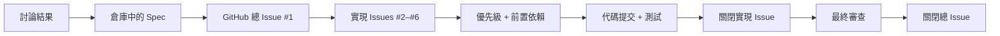
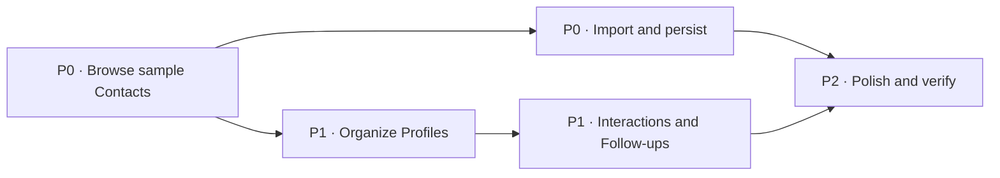

# 用 GitHub Issues 驅動 AI 全流程開發：從需求討論到 macOS 成品

在這篇教程中，我們會完整走一遍這樣的過程：先把一個還比較模糊的想法告訴 AI，再和它一起把需求討論清楚；接著讓 AI 寫出需求文檔、在 GitHub 上拆好任務，最後按照任務順序把軟件真正做出來。

這種方法叫 **Spec 驅動開發**。Spec 是“需求規格”的簡稱。它不是一份寫完就放在角落里的文檔，而是後續拆任務、寫代碼、測試和審查時共同遵守的依據。需求發生變化時，先更新 Spec，再繼續實現，而不是只在聊天里臨時補一句。

::: info 和上一篇有什麼區別？

[《從 Vibe Coding 到 Spec Coding》](https://github.com/datawhalechina/easy-vibe/blob/130e9b75b28b524e8cc74e615fd9733a4e2b330d/zh-tw/stage-3/core-skills/spec-coding/README.md)主要解釋為什麼規範會成為 AI 開發的核心；本文不再重復理論，而是用一個真實 GitHub 倉庫演示如何把規範變成 Issues、任務依賴、提交、測試和最終成品。

:::

我們不會停在“講概念”這一步。文章里的倉庫、Issues、代碼、測試和截圖都來自一次真實開發。最開始，我們只有下面這一句話：

> 我想做一個 macOS 上的 CRM，用來管理聯繫人關係，幫助我梳理人脈。可以先使用假數據。

最後，我們得到了一個名為 **Relationship Compass** 的原生 macOS 應用。它可以搜索和篩選聯繫人、維護關係檔案、導入 CSV、記錄互動，並自動算出下一次應該聯繫誰。


你可以直接查看這次實踐產生的[公開 GitHub 示例倉庫](https://github.com/sanbuphy/relationship-compass-macos)。倉庫只使用假數據，裡面保留了需求文檔、GitHub Issues、提交記錄、源代碼和測試。

## 1. 先理解：什麼是 Spec 驅動開發

很多人第一次用 AI 寫代碼時，會採用下面這種方式：

```text
告訴 AI 想做什麼 → AI 寫代碼 → 發現不對 → 再補一句要求 → 繼續修改
```

做一個小頁面時，這種方式通常夠用。但項目變大後，很容易遇到三個問題：

1. 前面討論過的要求，過幾輪對話後被忘掉了；
2. AI 一次改很多文件，你不知道現在到底完成了多少；
3. 功能看起來能運行，卻沒人逐條檢查它是否真的符合最初需求。

Matt Pocock 的 Skills 就是為瞭解決這些問題。這裡的 **Skill** 可以先簡單理解成“寫給 AI 的標準工作流程”。它不會只告訴 AI 寫哪一段代碼，而是規定 AI 在每個階段應該先做什麼、產出什麼、什麼時候停下來讓你確認。

### 1.1 它和直接讓 AI 寫代碼有什麼不同

普通的 AI 輔助開發，常常把聊天記錄當成唯一需求來源。Spec 驅動開發則會在寫代碼前，先把已經確認的要求保存成倉庫里的正式文檔。後續每一步都回到這份文檔檢查。

| 直接從聊天開始寫 | Spec 驅動開發 |
| --- | --- |
| AI 主要依賴當前聊天內容 | AI 以倉庫中的 Spec 為主要依據 |
| 想到一個要求就直接補一句 | 先確認需求，再更新 Spec 和任務 |
| 進度通常只存在於 AI 的總結里 | 進度保存在 GitHub Issues 和提交中 |
| 完成後主要看“能不能運行” | 完成後逐條對照 Spec 檢查有沒有漏項 |

因此，Spec 驅動開發的重點並不是“多寫一份文檔”，而是讓需求從聊天中的一句話，變成整個開發過程都能引用、更新和驗證的共同標準。

### 1.2 GitHub 在這條流程中具體做什麼

一次聊天只能保存“我們剛才說了什麼”，GitHub 則可以長期保存“項目已經決定了什麼、接下來要做什麼、哪些事情已經完成”。

在這篇教程里，GitHub 不只是存放源代碼的網盤。它同時承擔三種角色：

1. **項目檔案室**：保存 Spec、項目用詞和重要技術決定；
2. **任務看板**：用 Issues、優先級和依賴關係表示工作順序；
3. **完成記錄**：用提交、測試結果和關閉狀態證明每張任務是怎樣完成的。

| GitHub 中的內容 | 用大白話解釋 | 本例中的實際文件或記錄 |
| --- | --- | --- |
| 需求文檔（Spec） | 這個軟件最後要做到什麼 | `specs/relationship-compass-mvp.md` |
| Issue | 一張可以獨立完成的任務卡 | `#2 Browse sample Contacts` |
| 任務依賴 | 哪張任務卡必須先完成 | `#3` 要等待 `#2` |
| Commit | 這一輪具體改了什麼 | `feat: browse sample contacts` |
| Tests | 已經完成的功能有沒有被後續修改弄壞 | `swift test` |
| 架構決策記錄（ADR） | 為什麼選擇這種技術，而不是另一種 | `docs/adr/0002-native-swiftui-macos.md` |

下面這張表更具體地展示了 GitHub 在每個階段發生的變化：

| 開發階段 | GitHub 中發生什麼 | Relationship Compass 的實際結果 |
| --- | --- | --- |
| 需求討論結束 | 把統一用詞和重要決定寫入倉庫 | `CONTEXT.md` 和 2 份 ADR |
| 生成 Spec | 保存需求文件，並創建一張總 Issue | `specs/relationship-compass-mvp.md` 和 [Issue #1](https://github.com/sanbuphy/relationship-compass-macos/issues/1) |
| 拆分任務 | 創建實現 Issues，添加優先級和前置依賴 | [Issues #2–#6](https://github.com/sanbuphy/relationship-compass-macos/issues?q=is%3Aissue%20state%3Aclosed) |
| 逐張實現 | 每完成一張 Issue，就產生對應提交並運行測試 | 5 個主要功能提交 |
| 完成任務 | 移除 `ready-for-agent`，添加 `completed-by-agent`，關閉 Issue | #2–#6 全部關閉 |
| 最終審查 | 把審查修復繼續提交，確認無遺漏後關閉總 Issue | 3 個修復提交，#1 最終關閉 |



所以 GitHub 在這裡更像一塊“有記憶的開發工作台”。AI 每次開始工作前都可以先讀取當前狀態；人也可以隨時打開倉庫，看到需求、進度、代碼和驗證結果，而不必翻完整聊天記錄。

### 1.3 整條路線先看一遍

這次實踐會依次使用五個命令：

1. `grill-with-docs`：先和 AI 討論，把“我大概想做什麼”變成雙方都理解的明確範圍；
2. `to-spec`：把已經確認的討論整理成一份正式需求文檔；
3. `to-tickets`：把大需求拆成幾張有先後順序的 GitHub Issues；
4. `implement`：讓 AI 從第一張可以開始的任務卡出發，邊測試邊實現；
5. `code-review`：完成後再檢查兩遍，一遍看代碼質量，一遍看有沒有漏掉需求。

```text
想法 → 討論清楚 → 寫成文檔 → 拆成任務 → 逐個實現 → 檢查結果
```

現在不需要記住所有英文名詞。你只要先記住一件事：**我們不再讓 AI 拿到一句話就馬上寫完整項目，而是先把需求說清楚，再讓它按有記錄、有順序、可檢查的方式開發。**

## 2. 開始之前要準備什麼

如果你只想理解這套工作方法，可以直接繼續往下讀。如果你想自己跟著做一遍，需要提前準備：

1. 一個 GitHub 賬號；
2. 已經登錄的 GitHub CLI，也就是終端里的 `gh` 命令；
3. Node.js 18 或更高版本，用來安裝 Skills；
4. 一個能夠讀取項目 Skills 的編程 AI 工具；
5. 如果要運行本文的 macOS 示例，還需要一台 Mac 和 Xcode。

### 2.1 安裝 Matt Pocock 的 Skills

先在你準備開發的項目目錄中打開終端，然後運行：

```bash
npx skills@latest add mattpocock/skills
```

安裝過程可能會詢問你要把 Skills 安裝到哪裡。如果希望直接安裝全部內容、不逐項確認，可以使用：

```bash
npx skills@latest add mattpocock/skills -y
```

本次實踐實際安裝了 35 個 Skills。安裝完成後，它們會出現在項目的 `.agents/skills/` 目錄中。本文重點使用的是下面這條主流程：

```text
grill-with-docs → to-spec → to-tickets → implement → code-review
```

這裡比最初流傳的“四步流程”多了最後的 `code-review`。原因很簡單：軟件“能運行”不等於“已經按要求做好”。完成實現後，再單獨檢查一次，往往能發現測試和第一次開發都沒有注意到的問題。

::: tip 項目特別大時怎麼辦？

如果你的項目大到連“應該先討論哪些問題”都不清楚，可以先使用 `wayfinder`。它會幫助你列出還沒有做出的關鍵決定，再回到本文這條主流程。第一次練習時不需要使用它。

相關說明可以查看 [AI Skills for Real Engineers](https://www.aihero.dev/skills) 和 [Skills v1.1 更新說明](https://www.aihero.dev/skills/skills-changelog-v1-1-wayfinder-to-spec-to-tickets-grilling-improvements)。

:::

### 2.2 創建 GitHub 示例倉庫

先確認終端已經登錄 GitHub：

```bash
gh auth status
```

如果還沒有登錄，再運行：

```bash
gh auth login -h github.com
```

接著創建一個名為 `relationship-compass-macos` 的公開倉庫，並把當前項目推送上去：

```bash
gh repo create relationship-compass-macos \
  --public \
  --source . \
  --remote origin \
  --push
```

這幾個參數分別表示：倉庫公開、使用當前文件夾、把 GitHub 地址保存為 `origin`，並立即推送當前代碼。

::: warning 真實聯繫人數據不要放進公開倉庫

本文為了方便讀者查看完整案例，使用的是公開倉庫和固定假數據。如果你要開發自己的聯繫人管理工具，請改用 `--private`，並在推送前檢查樣例文件、日誌和 Git 歷史中是否包含真實姓名、郵箱或關係備注。

:::

### 2.3 準備任務標籤

GitHub 標籤就像貼在任務卡上的彩色便簽。它能告訴 AI 一張 Issue 是否可以開始，以及它有多重要。本例實際使用了下面幾類標籤：

| 標籤 | 表示什麼 |
| --- | --- |
| `ready-for-agent` | 需求已經寫清楚，AI 可以開始做 |
| `priority:P0` | 最先完成，否則後面的功能無法繼續 |
| `priority:P1` | 核心功能，但需要等待前置任務 |
| `priority:P2` | 收尾、文檔和完整驗證 |
| `completed-by-agent` | 已經由 AI 實現並驗證完成 |

## 3. 這次要做一個什麼軟件

我們的例子是一個 macOS 聯繫人關係管理工具。它不是用來追蹤銷售業績，而是幫助個人記住：我認識誰、我們是什麼關係、上次聊了什麼、什麼時候適合再次聯繫。

之所以選擇這個例子，是因為它足夠小，可以在一篇教程里走完；同時又包含真實軟件常見的多個環節：界面、數據導入、本地保存、搜索篩選、日期計算和自動化測試。

第一版只做下面這些事情：

- 內置 6 個假聯繫人，打開應用就能看到效果；
- 支持搜索聯繫人，並按關係強度和圈子篩選；
- 可以編輯組織、角色、郵箱、備注和跟進週期；
- 可以從 UTF-8 CSV 文件導入聯繫人；
- 可以記錄一次互動，並自動計算下一次跟進日期；
- 數據保存為本地 JSON 文件，下次啓動時可以恢復。

第一版暫時不做雲同步、AI 人脈評分，也不讀取 macOS 系統通訊錄。這樣可以先把最重要的使用閉環做完整，同時避免一開始就申請敏感權限。

## 4. 第一步：用 grill-with-docs 把需求聊清楚

`grill-with-docs` 可以理解為“先把需求問透”。它不會在收到第一句話後馬上寫代碼，而是像一位有經驗的產品和技術夥伴一樣，繼續問你幾個真正會影響結果的問題。

進入新倉庫後，像平時說話一樣描述目標即可，不需要提前寫正式的產品文檔：

<div class="workflow-chat">
  <div class="workflow-message workflow-message--user">
    <div class="workflow-message__speaker">🙋 你</div>
    <div class="workflow-message__command">/grill-with-docs</div>
    <p>我想實現一個 macOS 上的 CRM，可以管理我導入的聯繫人關係，幫助我梳理人脈。可以先使用假數據。</p>
  </div>
  <div class="workflow-message workflow-message--agent">
    <div class="workflow-message__speaker">✨ Agent</div>
    <p>好，我們先不急著寫代碼。我會和你一起把“第一版做什麼、不做什麼、數據放在哪裡”討論清楚。遇到需要選擇的地方，我會先解釋區別，再給出推薦。</p>
  </div>
</div>

這一步看起來像“多聊了一會兒”，其實是在提前避免返工。比如，要不要讀取系統通訊錄，會影響隱私權限；要不要雲同步，會影響是否需要賬號和服務器。這些問題如果等代碼寫到一半才決定，改動會更大。

### 4.1 對話如何逐步收斂

下面是本例中最關鍵的幾輪對話。你會發現，用戶不需要懂 SwiftUI、數據庫或測試框架，只需要說清楚自己想要的使用體驗。

<div class="workflow-chat">
  <div class="workflow-message workflow-message--agent">
    <div class="workflow-message__speaker">✨ Agent</div>
    <p>我建議首版採用原生 SwiftUI 和本地優先架構，這樣能獲得真正的 macOS 體驗，又不必先建設賬號和服務器。先確認三件事：是否直接讀取系統通訊錄？是否需要雲同步？首版準備如何導入數據？</p>
  </div>
  <div class="workflow-message workflow-message--user">
    <div class="workflow-message__speaker">🙋 你</div>
    <p>首版使用原生 SwiftUI，只導入 UTF-8 CSV，不直接讀取系統通訊錄。數據全部保存在本地，也不需要賬號、聯網和後端。</p>
  </div>
  <div class="workflow-message workflow-message--agent">
    <div class="workflow-message__speaker">✨ Agent</div>
    <p>明白。那它更像“私人關係維護工具”，而不是銷售漏斗。聯繫人檔案除了姓名、組織、角色和郵箱，還需要哪些關係信息？怎樣才算形成一個最小閉環？</p>
  </div>
  <div class="workflow-message workflow-message--user">
    <div class="workflow-message__speaker">🙋 你</div>
    <p>我需要關係強度、圈子、備注和互動記錄；還想看到哪些人該聯繫了。可以按最近一次互動和我設置的跟進週期計算，不需要把私人關係做成銷售評分。</p>
  </div>
  <div class="workflow-message workflow-message--agent">
    <div class="workflow-message__speaker">✨ Agent</div>
    <p>建議把從未記錄過互動的聯繫人直接放進“待跟進”列表；記錄一次互動後，再按你設置的天數計算下一次日期。首版使用 6 個固定假聯繫人，並為搜索、導入、保存和日期計算編寫自動化測試。這個範圍可以嗎？</p>
  </div>
  <div class="workflow-message workflow-message--user">
    <div class="workflow-message__speaker">🙋 你</div>
    <p>可以，就按這個範圍。先不要做雲同步、AI 人脈評分和系統通訊錄權限。我們已經達成共識，可以生成規格了。</p>
  </div>
</div>

在本例中，我們確定了以下範圍：

| 決策 | 選擇 | 原因 |
| --- | --- | --- |
| 產品形態 | macOS 14+ 原生 SwiftUI | 獲得原生文件選擇、鍵盤操作和輔助功能 |
| 首版數據 | 6 個確定性的假聯繫人 | 不要求用戶一開始就交出敏感數據 |
| 導入格式 | UTF-8 CSV | 容易準備、檢查和修復 |
| 數據保存 | 本地 JSON | 簡單、透明、不需要後端 |
| 關係強度 | Close / Active / Dormant | 避免把私人關係變成銷售評分 |
| 核心行為 | 搜索篩選、資料維護、互動記錄、待跟進列表 | 構成可驗證的最小閉環 |
| 隱私邊界 | 不讀取系統通訊錄、不聯網 | 首版不申請敏感權限 |
| 測試入口 | `RelationshipStore` 對外提供的功能 | 測試用戶能看到的結果，不依賴內部寫法 |

### 4.2 同步建立項目語言

討論過程中，一些詞很容易產生歧義。比如 `Contact` 既可以翻譯成“聯繫人”，也可能被 AI 理解成“銷售線索”；`Follow-up` 可能被理解成任務、提醒或通知。

因此，我們把已經確認的項目用詞寫進 `CONTEXT.md`。下面這段的意思是：`Interaction` 專門表示一次有日期的交流記錄，`Follow-up` 專門表示根據最近交流推算出的下次聯繫日期。

```markdown
**Interaction**:
A dated note that records a meaningful exchange with a Contact.
_Avoid_: Activity, event, touchpoint

**Follow-up**:
A suggested next connection date derived from the latest Interaction
and the Relationship Profile's rhythm.
_Avoid_: Task, reminder, notification
```

這不是為了把文檔寫得更正式，而是為了讓後面的代碼、測試和 Issue 一直使用同一套說法，避免 AI 一會兒寫 `Contact`，一會兒又改成 `Lead` 或 `Customer`。

### 4.3 只記錄真正重要的 ADR

ADR 是“架構決策記錄”的縮寫。你可以把它理解成一張很短的說明卡：記錄一個重要選擇，以及當時為什麼這樣選。這樣幾個月後再看到代碼，不會疑惑“為什麼沒有用另外一種方案”。

本例只記錄了兩條真正重要的決定：

- `0001-local-first-private-data.md`：關係信息留在本地，不申請通訊錄權限；
- `0002-native-swiftui-macos.md`：使用原生 SwiftUI，而不是 Electron 或 Web 殼。

ADR 不需要很長，也不用為每個小選擇都寫一份。只有那些以後很難改、而且存在明顯取捨的決定，才值得單獨記錄。

### 4.4 確認共享理解

討論結束時，AI 會問你是否已經達成共識。只有你明確確認後，流程才進入下一步。

這個暫停很重要。此時改一句需求只需要幾秒；如果等 20 個文件都寫完才發現方向錯了，就要花更多時間返工。

::: tip 完成這一步後，你應該得到什麼？

- 一份明確的第一版功能範圍；
- 一份“不做什麼”的清單；
- 統一的項目用詞；
- 少量真正重要的技術決定；
- 你對最終方向的一次明確確認。

這時還沒有開始實現功能，是正常的。

:::

::: info GitHub 在這一步做什麼？

需求討論發生在你和 AI 的對話中，但確認後的結果不能只留在聊天里。本例把統一用詞寫進 `CONTEXT.md`，把兩項重要技術選擇寫進 `docs/adr/`，然後提交到 GitHub。這樣下一次會話重新打開倉庫時，AI 可以直接讀取這些決定。

此時 GitHub 負責“保存已經確認的上下文”，還沒有開始創建實現任務。

:::

## 5. 第二步：用 to-spec 寫成需求文檔

需求已經聊清楚了，下一步是把聊天內容整理成一份以後可以反復查看的正式文檔。這裡的 **Spec** 就是“需求規格”：它應該講清楚軟件解決什麼問題、用戶可以完成哪些操作、哪些內容不在第一版範圍內，以及最後怎樣判斷功能已經做好。

你只需要告訴 AI：把剛才確認的內容寫下來。

<div class="workflow-chat">
  <div class="workflow-message workflow-message--user">
    <div class="workflow-message__speaker">🙋 你</div>
    <div class="workflow-message__command">/to-spec</div>
    <p>根據剛才的討論生成完整規格，保存到倉庫，併發布到 GitHub Issues，標籤使用 ready-for-agent。</p>
  </div>
  <div class="workflow-message workflow-message--agent">
    <div class="workflow-message__speaker">✨ Agent</div>
    <p>收到。我會直接整理剛才已經確認的內容，不會再從頭問一遍。完成後，我會把文檔保存進倉庫，並創建一張總的 GitHub Issue 作為入口。</p>
  </div>
</div>

`to-spec` 會綜合剛才的對話、項目用詞和架構決定，生成一份結構化文檔。本例最終得到的規格包括：

```text
要解決的問題
第一版解決方案
24 條用戶故事
已經確認的技術選擇
測試方式
第一版明確不做的內容
其他補充說明
```

完整規格保存在 [`specs/relationship-compass-mvp.md`](https://github.com/sanbuphy/relationship-compass-macos/blob/main/specs/relationship-compass-mvp.md)，同時發佈為 [GitHub Issue #1](https://github.com/sanbuphy/relationship-compass-macos/issues/1)。以後無論是人還是 AI，都可以從這張總 Issue 找到完整需求。

::: info GitHub 在這一步做什麼？

同一份需求會以兩種方式存在：倉庫中的 Markdown 文件便於版本管理和代碼審查；GitHub Issue #1 則作為項目入口，方便跟蹤狀態和關聯後續任務。

如果需求後來發生變化，應該先修改 Spec 文件並留下提交，而不是只在新聊天里補充一句。這樣 GitHub 會保留“需求為什麼變了、什麼時候變了”的歷史。

:::

### 5.1 好 Spec 要描述行為，而不是文件

一份好規格應該描述“用戶最後能做到什麼”，而不是過早指定“必須創建哪個文件”。例如，本例有一條用戶故事是：

> 作為用戶，我希望從未記錄過互動的聯繫人也出現在待跟進列表中，這樣剛導入的人不會被悄悄忘掉。

這句話包含三個信息：誰需要它、希望發生什麼、為什麼有價值。它沒有規定 Swift 文件叫什麼，所以以後即使重構代碼，這條需求仍然成立。

### 5.2 提前說明怎樣驗證

規格還要提前說明“做完後怎樣證明它是對的”。本項目把 `RelationshipStore` 對外提供的功能當作主要測試入口，自動檢查：

- 樣例數據初始化；
- 搜索與組合篩選；
- CSV 導入、校驗與去重；
- JSON 保存和恢復；
- 關係檔案編輯；
- 互動記錄的時間順序；
- 指定日期下的下一次跟進計算。

這些測試只關心用戶最終能觀察到的結果，不關心內部某個小函數被調用了幾次。這樣以後整理代碼結構時，測試不會因為內部寫法變化而全部失效。

::: tip 完成這一步後，你應該看到什麼？

倉庫中會出現一份可以直接閱讀的 Spec，GitHub 上會出現一張對應的總 Issue。此時你應該能逐條回答：“第一版到底要做什麼？什麼算完成？哪些功能明確不做？”

:::

## 6. 第三步：用 to-tickets 拆成有順序的任務

一份 Spec 可能包含幾十條要求，直接讓 AI “一次全部實現”仍然很冒險。`to-tickets` 的作用，就是把大目標拆成幾張能夠單獨完成、單獨檢查的 GitHub 任務卡。

接著輸入：

<div class="workflow-chat">
  <div class="workflow-message workflow-message--user">
    <div class="workflow-message__speaker">🙋 你</div>
    <div class="workflow-message__command">/to-tickets</div>
    <p>根據 Relationship Compass 的第一版需求文檔拆分 GitHub Issues。每張任務都要交付一個可以獨立演示的小功能，並寫清楚優先級、完成標準和前置任務。</p>
  </div>
  <div class="workflow-message workflow-message--agent">
    <div class="workflow-message__speaker">✨ Agent</div>
    <p>我會先把任務清單和先後順序展示給你。你確認沒有漏項後，我再創建 GitHub Issues，並寫清楚每張任務卡的完成標準和前置任務。</p>
  </div>
</div>

拆任務時，最容易犯的錯誤是按技術類別分工：一張票只建數據模型，另一張票只寫界面，最後一張票才補測試。這樣前幾張票做完時，用戶仍然看不到任何可以使用的功能。

更合適的方法叫 **縱向切片**。你可以把它想象成切蛋糕：每一塊都同時包含蛋糕胚、奶油和水果。對應到軟件里，就是每張 Issue 都盡量同時包含必要的數據、界面和測試，關閉一張就能多演示一個完整的小功能。

本例拆成 5 張實現票：

| Issue | 優先級 | 完成後可以看到什麼 | 前置任務 | 狀態 |
| --- | --- | --- | --- | --- |
| [#2 Browse sample Contacts](https://github.com/sanbuphy/relationship-compass-macos/issues/2) | P0 | 可啓動的應用、樣例聯繫人、搜索和詳情 | 無 | 已關閉 |
| [#3 Import and persist private Contact data](https://github.com/sanbuphy/relationship-compass-macos/issues/3) | P0 | CSV 導入去重、JSON 打開保存 | #2 | 已關閉 |
| [#4 Organize Relationship Profiles](https://github.com/sanbuphy/relationship-compass-macos/issues/4) | P1 | 編輯資料、關係強度、圈子與篩選 | #2 | 已關閉 |
| [#5 Record Interactions and plan Follow-ups](https://github.com/sanbuphy/relationship-compass-macos/issues/5) | P1 | 互動歷史與待跟進列表 | #4 | 已關閉 |
| [#6 Polish and verify the MVP](https://github.com/sanbuphy/relationship-compass-macos/issues/6) | P2 | 文檔、錯誤狀態、打包和完整驗證 | #3、#5 | 已關閉 |



::: info GitHub 在這一步做什麼？

`to-tickets` 會把 Spec 中的大目標發佈為獨立 Issues，並給它們添加 `priority:P0`、`priority:P1` 或 `priority:P2`。本例還使用了 GitHub 原生的 `Blocked by` 依賴關係，所以 #6 會明確等待 #3 和 #5，而不是只在正文里寫一句“以後再做”。

這一步之後，GitHub 從“需求檔案室”變成了真正的任務看板。

:::

### 6.1 任務為什麼要有先後順序

表格里的 `Blocked by` 表示“必須等待誰先完成”。例如，應用還不能顯示聯繫人時，就不適合先開發聯繫人資料編輯。

流程剛開始時，只有 #2 可以動手。#2 完成後，#3 和 #4 都具備了前置條件；#5 必須等 #4 完成；最後的 #6 則要等導入保存和互動跟進兩條功能線都完成。

Skills 把“所有前置任務已經完成、現在可以開始”的那幾張票稱為 **任務前沿**。名字聽起來有些抽象，其實就是“當前沒有被卡住的任務”。

優先級和依賴是兩回事：P0 表示很重要，依賴關係則表示現在能不能做。一張很重要的任務，如果依賴的基礎功能還沒完成，也需要先等待。

### 6.2 不要拆成橫向任務

下面這種按技術層拆分的方法不適合讓 Agent 連續交付：

```text
創建所有數據模型 → 創建所有 Store → 創建所有 UI → 最後補測試
```

因為任何一張中間任務完成後都無法單獨使用，要到最後才知道各層能不能真正連起來。更好的拆法是：

```text
先讓“瀏覽樣例聯繫人”從模型到 UI 完整工作並通過測試，
再增加“導入與保存”的完整路徑。
```

::: tip 完成這一步後，你應該看到什麼？

GitHub 上會出現 5 張實現 Issue。每張 Issue 都有優先級、驗收標準和前置任務。你不需要自己猜下一步做什麼，只要從當前沒有被阻塞的第一張任務開始。

:::

## 7. 第四步：用 implement 逐張任務實現

任務已經拆好後，才正式進入寫代碼階段。`implement` 會讀取 GitHub Issues，找到當前沒有被前置任務卡住、同時優先級最高的那一張，然後只圍繞這張票工作。

輸入：

<div class="workflow-chat">
  <div class="workflow-message workflow-message--user">
    <div class="workflow-message__speaker">🙋 你</div>
    <div class="workflow-message__command">/implement</div>
    <p>根據優先級和依賴關係逐個實現所有 ready-for-agent Issues，從第一個未被阻塞的 Issue 開始。每張票使用 TDD，在完成後運行類型檢查和對應測試並提交。</p>
  </div>
  <div class="workflow-message workflow-message--agent">
    <div class="workflow-message__speaker">✨ Agent</div>
    <p>我會一次只處理一張可以開始的任務。每張任務都先寫測試，再完成代碼、運行構建並提交。全部完成後，我會繼續檢查代碼質量和需求完成情況。</p>
  </div>
</div>

本例中，每張任務完成後都會留下一個主要提交。這樣如果某一輪出現問題，可以準確知道是哪張任務帶來的修改。

| GitHub 任務 | 主要提交 |
| --- | --- |
| #2 瀏覽樣例聯繫人 | [`9d9d7bd`](https://github.com/sanbuphy/relationship-compass-macos/commit/9d9d7bd) |
| #3 導入並保存聯繫人 | [`935750b`](https://github.com/sanbuphy/relationship-compass-macos/commit/935750b) |
| #4 維護關係檔案 | [`329bd67`](https://github.com/sanbuphy/relationship-compass-macos/commit/329bd67) |
| #5 記錄互動和跟進 | [`83f4af6`](https://github.com/sanbuphy/relationship-compass-macos/commit/83f4af6) |
| #6 打磨、打包和驗證 | [`3ae0bbf`](https://github.com/sanbuphy/relationship-compass-macos/commit/3ae0bbf) |
| 審查後修復 | [`cbad102`](https://github.com/sanbuphy/relationship-compass-macos/commit/cbad102)、[`11361ca`](https://github.com/sanbuphy/relationship-compass-macos/commit/11361ca)、[`d1c83be`](https://github.com/sanbuphy/relationship-compass-macos/commit/d1c83be) |

::: info GitHub 在這一步做什麼？

Agent 不會隨便挑一項功能開始寫。它先讀取 `ready-for-agent`、優先級和 `Blocked by`，找到當前可以執行的 Issue。完成後，把提交哈希和測試結果寫回對應 Issue，移除 `ready-for-agent`，添加 `completed-by-agent`，再關閉這張任務。

因此，GitHub 上的 Issue 狀態就是項目的真實進度，而不是一份需要手動維護、很快就會過期的旁觀清單。

:::

### 7.1 每張任務都先證明“現在還不行”

本例使用 TDD，也就是“測試驅動開發”。這個名字聽起來很專業，但做法並不複雜：先寫一個描述正確結果的測試，確認它現在會失敗；再補上最少的代碼，讓測試變成通過。

以 CSV 導入這張任務為例，Agent 實際按照下面的順序工作：

1. 先寫一個測試：同一份 CSV 導入兩次，聯繫人數量不能翻倍；
2. 運行測試，確認當前版本確實還做不到；
3. 實現 CSV 讀取和去重，讓這個測試通過；
4. 再補一個測試：CSV 表頭錯誤時，原來的聯繫人不能被破壞；
5. 修正實現，重新運行這一組測試和完整構建；
6. 提交代碼，關閉當前 Issue，再領取下一張沒有被阻塞的任務。

本項目使用 Swift Testing：

```bash
swift test --filter RelationshipStoreTests
swift build
swift test
```

`swift build` 負責確認整個項目可以編譯，`swift test` 負責運行全部自動化測試。最終共有 13 項行為測試，完整構建和測試都通過。

### 7.2 打開真實代碼看一眼

下面是本例真正提交到倉庫的 [`RelationshipStore.importCSV`](https://github.com/sanbuphy/relationship-compass-macos/blob/main/Sources/RelationshipCompass/RelationshipStore.swift#L69-L154)，不是為了截圖臨時寫的示例代碼。

這段代碼做了四件事：讀取 UTF-8 CSV、檢查表頭、尋找重復聯繫人、準備導入結果。它會先在一份候選數據上完成全部處理，只有所有行都合法時才替換當前聯繫人列表。因此，文件中途出錯也不會讓應用留下“只導入一半”的狀態。


對應的 [`RelationshipStoreTests`](https://github.com/sanbuphy/relationship-compass-macos/blob/main/Tests/RelationshipCompassTests/RelationshipStoreTests.swift#L29-L69) 會把同一份 CSV 連續導入兩次，確認第二次只更新已有聯繫人，而不是再新增一份。測試還覆蓋了重復表頭和帶 UTF-8 BOM 的文件等邊界情況。


::: tip 完成這一步後，你應該看到什麼？

GitHub 上的實現 Issues 會按照依賴順序逐張關閉；倉庫里會出現對應提交；應用功能會一塊一塊增加；每輪都能用測試和構建命令確認當前版本仍然可用。

:::

## 8. 第五步：用 code-review 檢查有沒有遺漏

所有 Issues 都關閉，並不代表工作已經結束。第一次實現時，AI 的注意力主要放在“把當前任務做通”，仍然可能出現兩類問題：代碼越來越難維護，或者有些需求表面上做了、實際還有缺口。

因此，當前流程在實現完成後還會運行 `code-review`。它分成兩次獨立檢查。

### 8.1 第一遍：檢查代碼是否健康

第一遍只看代碼本身，不重新討論產品需求。它會檢查：

- 文件和類型的名字是否容易理解；
- 同一段邏輯是否在多個地方重復；
- 一個界面文件是否承擔了太多工作；
- 修改一個小功能是否需要同時改很多無關位置；
- 代碼是否遵守倉庫 `AGENTS.md` 中的約定。

本例第一次檢查時，就發現 SwiftUI 主界面過大，而且“跟進天數”只是一個普通整數，很容易繞過最小一天的校驗。隨後我們拆分了界面職責，並把跟進週期變成一個會主動校驗的數據類型。

### 8.2 第二遍：逐條檢查需求是否真的完成

第二遍不評價代碼寫得漂不漂亮，而是重新打開 Spec 和所有 Issues，逐條核對：

- 有沒有遺漏的要求；
- 有沒有只做了一半的功能；
- 界面看起來存在，但實際行為是否正確；
- 有沒有擅自增加不在第一版範圍內的功能。

這次審查並不是走形式，它找出了第一輪測試沒有覆蓋的真實問題：

- CSV 中出現兩個同名表頭時，應用會報運行時錯誤，而不是安全提示；
- 沒有郵箱的聯繫人，無法通過“姓名＋組織”識別為同一個人；
- 普通聯繫人列表已經篩選了，但“待跟進”列表沒有使用同樣的篩選條件；
- 數據雖然能保存，卻不會在下次啓動時自動恢復；
- 詳情頁沒有明確顯示計算出來的下一次跟進日期。

我們先為這些問題補上測試，再修正代碼，然後重新執行兩遍檢查。最終，代碼質量檢查和需求完成度檢查都通過。

這裡最值得記住的是：**測試全部通過，只能證明“已經寫進測試的行為”沒有出錯，不能自動證明最初需求一條都沒有漏。** 所以最後仍然需要重新對照 Spec。

::: tip 完成這一步後，你應該看到什麼？

審查發現的問題會變成新的修復提交；完整測試會再次通過；兩份審查結果都明確給出通過結論。到這裡，才適合把整個 Spec 標記為完成。

:::

::: info GitHub 在這一步做什麼？

審查發現的問題繼續以獨立提交保留在倉庫中。確認全部修復後，#2–#6 的完成評論會寫明主要提交和驗證結果；最後再關閉總需求 Issue #1。這樣打開 [Issues 頁面](https://github.com/sanbuphy/relationship-compass-macos/issues?q=is%3Aissue%20state%3Aclosed) 就能從任務一直追溯到代碼和測試。

:::

## 9. 最終得到的軟件

經過需求討論、文檔整理、任務拆分、逐張實現和兩輪審查後，我們最終得到了 **Relationship Compass**。

它不是一張界面效果圖，也不是一堆無法運行的示例代碼，而是一個可以編譯、測試、打包並雙擊打開的原生 macOS 應用。

| 交付項 | 最終結果 |
| --- | --- |
| GitHub 項目管理 | [1 張總需求 Issue](https://github.com/sanbuphy/relationship-compass-macos/issues/1) 和 5 張實現 Issues，全部關閉 |
| 實現過程 | 9 個小步提交，按照任務依賴逐個完成 |
| 自動化驗證 | 13/13 項行為測試通過，完整項目可以編譯 |
| 最終審查 | 代碼質量與需求完成度兩項檢查均通過 |
| 可運行產物 | 腳本可以生成 `Relationship Compass.app` |
| 數據邊界 | 數據只保存在本地，不讀取系統通訊錄，也不上傳聯繫人關係 |

完成後的產品包含：

- 6 個固定的假聯繫人；
- 按姓名、組織、角色、郵箱和圈子搜索；
- 按關係強度和圈子組合篩選；
- 編輯聯繫人的關係檔案；
- UTF-8 CSV 導入、表頭校驗與安全去重；
- 本地 JSON 打開、保存和下次啓動恢復；
- 互動記錄與按時間排序的歷史；
- 根據最近互動和跟進週期計算待跟進聯繫人；
- 原生 macOS `.app` 打包腳本；
- 13 項自動化行為測試。

### 9.1 搜索與組合篩選

在右上角輸入 `Founder` 後，列表會從 6 位樣例聯繫人縮小到 Maya Chen。左上角還可以繼續選擇關係強度和圈子。普通聯繫人列表與待跟進列表使用同一套篩選規則，不會出現一邊篩選了、另一邊仍顯示全部聯繫人的情況。


### 9.2 編輯關係檔案

選擇聯繫人後，可以修改組織、角色、郵箱、關係強度、圈子、跟進週期和備注。應用會自動清理重復圈子，並檢查跟進週期至少為一天。保存後的內容會立即反映到搜索和篩選結果中。


### 9.3 記錄互動並計算下次跟進

為 Maya 記錄一次 2026 年 8 月 9 日的互動後，應用根據 30 天的跟進週期，把下一次聯繫日期更新為 2026 年 9 月 8 日。互動內容會出現在歷史記錄中；日期到期後，這位聯繫人會自動進入“待跟進”區域。


這些界面背後的關鍵行為都有對應測試。例如，同一份 CSV 重復導入不會產生重復聯繫人；錯誤表頭不會破壞原有數據；保存和重新打開後，所有字段仍然一致；保存文件損壞時，應用會安全回到樣例數據；搜索和兩個篩選條件也可以一起使用。

如果你使用 Mac，可以按照下面的順序下載、測試和打包這個項目：

```bash
git clone https://github.com/sanbuphy/relationship-compass-macos.git
cd relationship-compass-macos
swift build
swift test
./scripts/package-app.sh
open "dist/Relationship Compass.app"
```

前兩條命令下載代碼並進入項目目錄；`swift build` 和 `swift test` 分別檢查編譯與測試；打包腳本會在 `dist` 目錄生成應用，最後一條命令負責打開它。

::: warning 示例不是生產版通訊錄

示例有意不讀取 macOS 系統通訊錄、不上傳關係數據，也不提供 AI 人脈評分。真實產品如果增加雲同步、聯繫人權限、加密或 AI 分析，需要重新討論隱私邊界，並記錄新的架構決定。

:::

## 10. 可直接複製的完整流程

如果你想在自己的項目里復現這套流程，可以從下面四段輸入開始。你不必原樣照抄產品名稱，但建議保留“先確認、再寫文檔、按依賴實現、最後審查”這些約束。

### 10.1 需求討論

<div class="workflow-chat">
  <div class="workflow-message workflow-message--user">
    <div class="workflow-message__speaker">🙋 你 · 可直接複製</div>
    <div class="workflow-message__command">/grill-with-docs</div>
    <p>我想實現一個 macOS 上的 CRM，可以管理我導入的聯繫人關係，幫助我梳理人脈。可以先使用假數據。</p>
    <p>請和我繼續討論第一版要做什麼、不做什麼、數據放在哪裡、採用什麼技術，以及最後怎樣驗證。每次只問當前最關鍵的問題；遇到選擇時先解釋區別並給出推薦。在我明確確認之前，不要開始寫代碼。</p>
  </div>
</div>

### 10.2 生成 Spec

<div class="workflow-chat">
  <div class="workflow-message workflow-message--user">
    <div class="workflow-message__speaker">🙋 你 · 可直接複製</div>
    <div class="workflow-message__command">/to-spec</div>
    <p>把剛才已經確認的討論整理成一份完整需求文檔，保存到倉庫，併發布為一張 GitHub 總 Issue，添加 ready-for-agent 標籤。</p>
    <p>不要重新問已經確認的問題。文檔要寫清楚用戶能完成哪些操作、怎樣驗收、第一版明確不做什麼；技術部分記錄穩定決定，不要堆容易過期的文件路徑。</p>
  </div>
</div>

### 10.3 拆分 Issues

<div class="workflow-chat">
  <div class="workflow-message workflow-message--user">
    <div class="workflow-message__speaker">🙋 你 · 可直接複製</div>
    <div class="workflow-message__command">/to-tickets</div>
    <p>根據剛才的需求文檔拆分 GitHub Issues。不要把數據、界面和測試完全分開；每張任務都要盡量交付一個可以獨立演示的小功能。</p>
    <p>每張 Issue 寫清楚優先級、完成標準和前置任務。先把任務清單與依賴圖展示給我，確認後再發佈到 GitHub。</p>
  </div>
</div>

### 10.4 自動實現

<div class="workflow-chat">
  <div class="workflow-message workflow-message--user">
    <div class="workflow-message__speaker">🙋 你 · 可直接複製</div>
    <div class="workflow-message__command">/implement</div>
    <p>根據優先級和前置任務，實現所有 ready-for-agent Issues。每次只處理一張當前可以開始的任務；先寫描述正確結果的測試，再完成實現，並經常運行測試和完整構建。每張任務完成後單獨提交。</p>
    <p>所有 Issues 完成後，分別檢查代碼質量和需求完成度。修復發現的問題，重新運行全部測試，直到兩項檢查都通過。</p>
  </div>
</div>

## 11. 什麼時候適合“梭哈”

這裡的“梭哈”不是指完全不看過程，而是指：當需求和安全邊界已經確認後，讓 AI 沿著任務清單連續工作，不必每寫一個函數都停下來等待指令。

這條流程比較適合：

- 範圍可以通過討論收斂的 MVP；
- 有明確用戶行為和驗收標準的後台、App 或網站；
- 可以通過測試或構建命令驗證的倉庫；
- 希望 Agent 跨多個會話持續工作的項目。

它不太適合那些需求每小時都在變化、無法通過測試或構建驗證，或者會直接操作生產數據的任務。

即使讓 AI 連續實現，下面幾個節點仍然應該由你親自確認：

1. 需求討論結束時，確認第一版範圍沒有理解錯；
2. 創建 Issues 前，確認任務沒有漏項，先後順序合理；
3. 涉及付費、生產部署、刪除數據、賬號權限和隱私時，確認具體外部操作；
4. 完成後親自打開真實界面，檢查構建產物和審查結果。

真正可靠的自動開發，不是把所有決定都交出去，而是你負責目標、邊界和最終驗收，AI 負責把已經確認的事情穩定地執行下去。

## 總結

到這裡，我們已經從一句模糊想法出發，完成了需求討論、正式文檔、GitHub 任務拆分、逐張實現、測試、審查和應用打包。

這套方法最重要的不是記住幾個斜槓命令，而是把開發過程變成一條隨時可以查看、暫停和繼續的路線：

```text
模糊想法
  ↓ grill-with-docs
明確範圍 + 統一用詞 + 重要技術決定
  ↓ to-spec
可以逐條驗收的需求文檔
  ↓ to-tickets
有優先級和先後順序的 GitHub 任務
  ↓ implement
逐張任務實現、測試和提交
  ↓ code-review
檢查代碼質量 + 檢查需求完成度
  ↓
可構建、可驗證的軟件
```

當一段聊天結束後，需求文檔、Issues、依賴關係、提交和測試仍然留在 GitHub 中。下一次繼續開發時，AI 不需要從頭猜測你想做什麼，而是可以沿著這些記錄繼續往前走。

你可以把這條流程遷移到網站、後台系統、移動應用或自己的工作工具中。先選一個範圍不大的真實需求，完整走通一次，再逐漸把它用到更複雜的項目里。

## 參考資料

- [Skills to Spec：從討論生成規格](https://www.aihero.dev/skills-to-spec)
- [AI Skills for Real Engineers：當前主流程說明](https://www.aihero.dev/skills)
- [Skills v1.1 更新說明](https://www.aihero.dev/skills/skills-changelog-v1-1-wayfinder-to-spec-to-tickets-grilling-improvements)
- [OpenAI：把重復工作流保存為 Skills](https://learn.chatgpt.com/codex/use-cases/reusable-codex-skills)
- [Relationship Compass 公開示例倉庫](https://github.com/sanbuphy/relationship-compass-macos)
