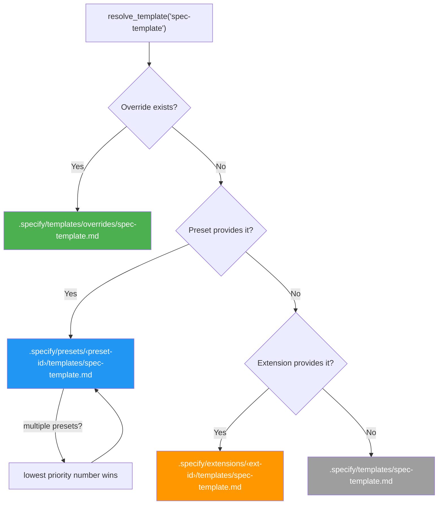
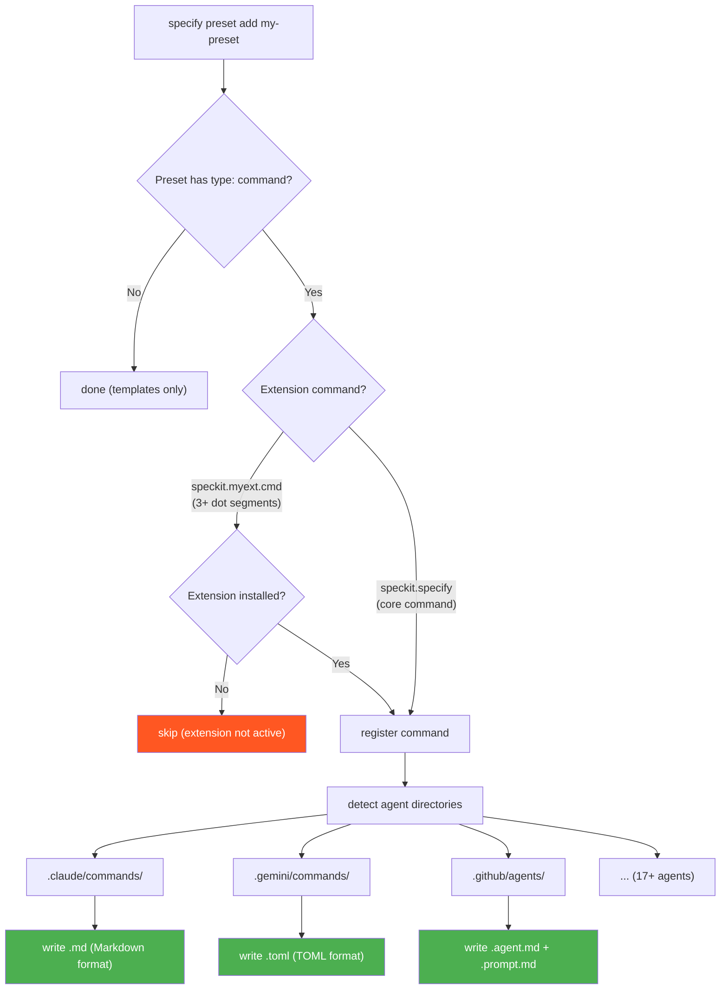

# Preset System Architecture

This document describes the internal architecture of the preset system — how template resolution, command registration, and catalog management work under the hood.

For usage instructions, see [README.md](/lib/07-coding/spec-kit/presets).

## Template Resolution

When Spec Kit needs a template (e.g. `spec-template`), the `PresetResolver` walks a priority stack and returns the first match:

| Priority | Source | Path | Use case |
|----------|--------|------|----------|
| 1 (highest) | Override | `.specify/templates/overrides/` | One-off project-local tweaks |
| 2 | Preset | `.specify/presets/<id>/templates/` | Shareable, stackable customizations |
| 3 | Extension | `.specify/extensions/<id>/templates/` | Extension-provided templates |
| 4 (lowest) | Core | `.specify/templates/` | Shipped defaults |

When multiple presets are installed, they're sorted by their `priority` field (lower number = higher precedence). This is set via `--priority` on `specify preset add`.

The resolution is implemented three times to ensure consistency:
- **Python**: `PresetResolver` in `src/specify_cli/presets.py`
- **Bash**: `resolve_template()` in `scripts/bash/common.sh`
- **PowerShell**: `Resolve-Template` in `scripts/powershell/common.ps1`

### Composition Strategies

Templates, commands, and scripts support a `strategy` field that controls how a preset's content is combined with lower-priority content instead of fully replacing it:

| Strategy | Description | Templates | Commands | Scripts |
|----------|-------------|-----------|----------|---------|
| `replace` (default) | Fully replaces lower-priority content | ✓ | ✓ | ✓ |
| `prepend` | Places content before lower-priority content (separated by a blank line) | ✓ | ✓ | — |
| `append` | Places content after lower-priority content (separated by a blank line) | ✓ | ✓ | — |
| `wrap` | Content contains `\{CORE_TEMPLATE\}` (templates/commands) or `$CORE_SCRIPT` (scripts) placeholder replaced with lower-priority content | ✓ | ✓ | ✓ |

Composition is recursive — multiple composing presets chain. The `PresetResolver.resolve_content()` method walks the full priority stack bottom-up and applies each layer's strategy.

Content resolution functions for composition:
- **Python**: `PresetResolver.resolve_content()` in `src/specify_cli/presets.py` (templates, commands, and scripts)
- **Bash**: `resolve_template_content()` in `scripts/bash/common.sh` (templates only; command/script composition is handled by the Python resolver)
- **PowerShell**: `Resolve-TemplateContent` in `scripts/powershell/common.ps1` (templates only; command/script composition is handled by the Python resolver)

### Constitution lifecycle

Initialization resolves `constitution-template` through the full stack and seeds
`.specify/memory/constitution.md` once. Existing files are preserved byte-for-byte. On subsequent
`/constitution` runs, the command resolves the current composed template at runtime and uses the live
constitution as the source of project-specific values and amendments.

Preset installation, removal, enablement, disablement, and priority changes do not materialize
`constitution-template` by default. When the enabled preset registry contains `constitution-sync`,
those operations may reconcile the live file, but only if its provenance hash proves it is still
generated content. Missing files may be seeded when the preset is installed; authored or edited
constitutions are never overwritten.

## Command Registration

When a preset is installed with `type: "command"` entries, the `PresetManager` registers them into all detected agent directories using the shared `CommandRegistrar` from `src/specify_cli/agents.py`.

### Extension safety check
