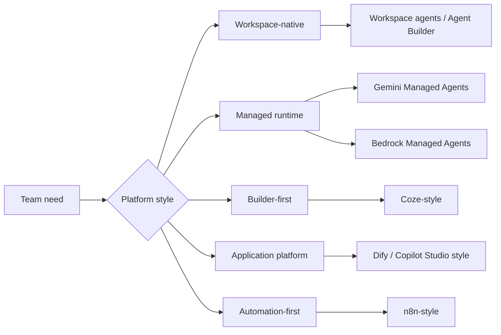

# Agent Systems Handbook（智能体系统手册）

import SupportCTA from "/snippets/support-cta.mdx";

## Summary

Low-code agent platforms turn recurring application patterns into visual,
configuration-first, workspace-native, API-first managed, or cloud-managed
building blocks. In 2026, the comparison surface includes not only standalone
builder products but also agent builders that live inside existing productivity
suites and managed cloud runtimes.

## Why It Matters

Not every useful agent needs to begin with a custom framework. Many teams first
need to validate a product surface, connect common services, or let
non-engineer stakeholders participate in building the workflow.

That is where builder-first, platform-first, automation-first,
workspace-native, and managed-runtime surfaces become attractive.

## Mental Model

The current platform market points to eight useful anchors:

- `Coze`: builder-first experience for quick assembly, plugins, and publishing
- `Dify`: application platform for orchestration, plugins, knowledge, and
  deployment control
- `n8n`: automation-first workflow platform where agent logic lives inside a
  broader process chain
- `Workspace agents`: shared cloud agents inside ChatGPT and Slack for
  long-running team workflows
- `Agent Builder`: in-context Microsoft 365 agent creation for quick
  declarative scenarios
- `Copilot Studio`: broader Microsoft platform for larger audiences, custom
  integrations, and more advanced control
- `Gemini Managed Agents`: an agent-first API surface where Google hosts the
  sandbox, state, and long-running execution while builders still author
  instructions and skills
- `Bedrock Managed Agents`: AWS-managed agent runtime for OpenAI-powered agents
  that need cloud governance, service proximity, and managed operations

These are different choices, not direct substitutes.

- builder-first products optimize fast creation and operator friendliness
- workspace-native builders optimize shared agents inside an existing suite
- cloud-managed and API-first managed surfaces optimize enterprise runtime
  ownership and governance
- application platforms optimize broader product and deployment control
- automation platforms optimize integration into existing business processes

## Architecture Diagram

## Tool Landscape

### Global and enterprise coverage

- Workspace agents show a new workspace-native builder surface where teams can
  create shared cloud agents inside ChatGPT, run long-running work in the
  background, and keep the agent inside existing organizational controls.
- Agent Builder shows the same direction on the Microsoft side: quick
  declarative agents built in context with Microsoft 365 knowledge sources,
  shareable inside the suite, but intentionally narrower than Copilot Studio.
- Copilot Studio matters when the audience is larger, the workflow is more
  complex, or the agent needs custom integrations and stronger deployment
  management than Agent Builder is designed to provide.
- Gemini Managed Agents and the Interactions API point to an API-first managed
  surface: one interface for model calls, Deep Research, and custom managed
  agents with server-side state, background execution, and hosted Linux
  sandboxes. This sits between a framework and a hosted platform because the
  builder still defines instructions and skills, but Google owns the runtime
  boundary.
- Bedrock Managed Agents points to a cloud-managed enterprise surface: teams can
  run OpenAI-powered agents on AWS infrastructure while relying on the provider
  for runtime concerns such as inference, memory, skills, identity, audit logs,
  service connectivity, and operations inside the cloud boundary.
- Dify still represents the broader open-source application-platform pattern
  where orchestration, deployment control, and extensibility matter together.
- n8n still represents the automation-first pattern where the agent is one step
  inside an operational pipeline rather than the whole product surface.

### China-linked coverage

- Coze and Dify remain strong China-linked reference points for builder-first
  and platform-first agent products with plugin-rich expansion paths.

### Selection criteria

- Choose workspace-native builders when the team already lives inside the host
  suite and wants shared agents with built-in governance and familiar
  permissions.
- Choose agent-first managed APIs when the team wants code-first control over
  instructions and tools but does not want to own sandbox infrastructure,
  background execution, or server-side state handling.
- Choose cloud-managed agents when the team already standardizes on a cloud
  provider's data boundaries, governance model, and adjacent services.
- Choose builder-first platforms when quick iteration and cross-functional
  participation matter most.
- Choose application platforms when you need a stronger bridge between
  prototype, orchestration, and a deployable product surface.
- Choose automation-first platforms when the agent must live inside an existing
  operational pipeline such as email, CRM, or internal ops tooling.
- Choose a broader enterprise platform such as Copilot Studio when the in-suite
  builder becomes too limited for audience scope, workflow depth, or
  integrations.

## Tradeoffs

- Faster assembly usually means weaker fine-grained control than code.
- Workspace-native builders are attractive because they reduce setup and align
  with existing permissions, but they are bounded by the host suite's extension
  model, rollout pace, and pricing.
- Cloud-managed agents reduce runtime ownership, but they increase dependence on
  provider-specific capabilities, pricing, regional availability, and release
  timing.
- API-first managed surfaces speed up long-running tool use and hosted
  sandboxes, but they also bind you to provider-specific interaction-state
  semantics, tool contracts, and observability surfaces.
- Visual platforms improve accessibility, but complex flows can still become
  hard to debug.
- Rich plugin ecosystems accelerate capability growth, but they also create
  dependency and trust questions.
- Built-in storage, memory, or retrieval layers may be convenient for
  prototypes but insufficient for production durability.

Useful defaults:

- use suite-native builders to validate shared internal workflows quickly
- use agent-first managed APIs when you need hosted sandboxes, resumable
  execution, or one endpoint for both models and agents
- use cloud-managed agents when service proximity, auditability, and managed
  runtime operations matter more than framework portability
- move to a broader platform or custom code when the host surface becomes the
  blocker
- separate prototype convenience from production requirements early
- keep governance, deployment scope, and integration depth explicit from the
  start
