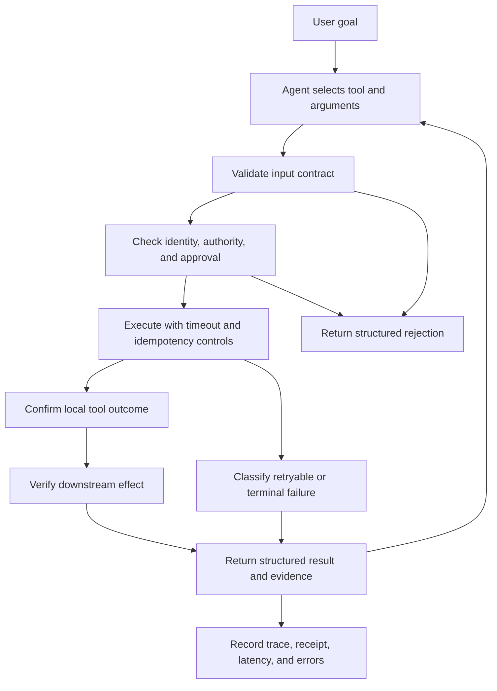

import SupportCTA from "/snippets/support-cta.mdx";

## Summary

Agent tools are callable capabilities through which an agent can observe or
affect its environment. A tool may wrap an API, database operation, browser,
file system, code runtime, business process, physical device, or another agent.

Good tool design does more than make a function callable. It gives the model a
clear contract, gives the runtime enforceable boundaries, and gives operators
enough evidence to decide whether an action actually succeeded. The most useful
tools combine explicit schemas, least-privilege access, predictable failure
semantics, observable execution, and testable success criteria.

## Why It Matters

Traditional application code usually calls functions along paths chosen by a
developer. An agent can choose a tool and generate its arguments dynamically
from natural-language context. That flexibility introduces failure modes that
ordinary function signatures do not handle by themselves:

- the agent selects a plausible but incorrect tool
- generated arguments are structurally valid but unsafe for the current user
- a timeout causes a consequential action to run twice
- a tool reports local success while the downstream system never changes
- an oversized result consumes context without helping the next decision
- an unstructured error leads the agent into an expensive retry loop

A tool that works when called correctly is therefore not automatically a good
agent tool. Its contract must help the model choose well, while its execution
boundary must remain safe even when the model chooses poorly.

## Mental Model

This article uses a repo-native six-contract model to organize tool-design
concerns drawn from API, protocol, security, reliability, and risk-management
guidance:

- `description contract`: what the tool does, when to use it, and what side
  effects it can create
- `input contract`: the allowed arguments, types, constraints, and required
  identifiers
- `authority contract`: which principal may perform which action on which
  resource
- `execution contract`: timeout, retry, cancellation, concurrency, and
  idempotency behavior
- `result contract`: structured success, error, receipt, and verification data
- `evidence contract`: in this handbook, the traces, receipts, and outcome
  checks required to make execution independently testable

Keep four concepts separate:

- a `resource` is something external, such as a database or email service
- a `tool` is the controlled interface to that resource
- a `tool call` is one proposed invocation with concrete arguments
- a `tool result` records what the execution boundary observed

The model proposes the call. The runtime validates, authorizes, executes, and
records it. The tool result then becomes evidence for the agent's next step,
not proof that the user's full goal is complete.

## Architecture Diagram



This handbook distinguishes two verification steps:

- `local action confirmation` asks whether the tool boundary accepted or
  completed the operation it was asked to perform
- `downstream-effect verification` asks whether the external system reached
  the intended state

For example, an email tool can confirm that a provider accepted a send request.
That does not by itself prove delivery. A record-update tool can receive a
successful HTTP response, but a follow-up read may still be needed to confirm
the stored value and version.

### End-To-End Example

Consider a user asking for a refund:

1. The agent selects `create_refund_request`.
2. The input schema validates the order ID, amount, currency, and reason.
3. The runtime verifies that the user may act on the order.
4. Policy determines whether supervisor approval is required.
5. An idempotency key prevents a retry from creating a duplicate request.
6. The tool returns a structured status, operation ID, and allowed next actions.
7. A follow-up read verifies that the refund request exists in the downstream
   system with the expected amount and approval state.

The initial tool response confirms the local operation. The follow-up read
verifies the downstream effect. The tool creates a reviewable request rather
than issuing money, which keeps its authority narrower than a direct refund
tool.

## Tool Landscape

Agent tools appear through several implementation surfaces:

- `function tools` expose application code with a name, description, and input
  schema
- `protocol tools` use contracts such as MCP to advertise inputs, structured
  outputs, and behavioral annotations
- `hosted tools` provide managed capabilities such as search, retrieval, code
  execution, or computer use
- `agent tools` expose another bounded agent as a callable capability

The surface changes, but the design questions remain the same.

The [MCP tools specification](https://modelcontextprotocol.io/specification/2026-07-28/server/tools)
supports input and output schemas as well as behavioral annotations. Those
annotations communicate intended behavior, but clients must not treat
annotations from untrusted servers as enforcement or proof of authorization.
The exact annotation fields are defined in the
[MCP Schema Reference](https://modelcontextprotocol.io/specification/2026-07-28/schema).

### Make Schemas Explicit

Use a narrow name and description, typed properties, required fields, enums,
length or range constraints, and explicit handling of additional properties.
Descriptions should explain preconditions and side effects, not only restate
the tool name. The following MCP-style tool definition uses JSON Schema to
constrain its input:

```json
{
  "name": "create_refund_request",
  "description": "Create a reviewable refund request; this does not issue money.",
  "inputSchema": {
    "type": "object",
    "properties": {
      "order_id": { "type": "string", "minLength": 1 },
      "amount": { "type": "number", "exclusiveMinimum": 0 },
      "currency": { "type": "string", "enum": ["USD", "EUR"] },
      "reason": { "type": "string", "minLength": 1, "maxLength": 500 }
    },
    "required": ["order_id", "amount", "currency", "reason"],
    "additionalProperties": false
  }
}
```

Schema validation answers whether an argument has an allowed shape. It does not
answer whether the current user may refund that order or whether the amount is
within policy. Authorization and business validation must run again at the
execution boundary.

[JSON Schema](https://json-schema.org/learn/getting-started-step-by-step)
provides the structural vocabulary for typed inputs and required fields. Its
official references define
[enumerated values](https://json-schema.org/understanding-json-schema/reference/enum),
[string constraints](https://json-schema.org/understanding-json-schema/reference/string),
and the handling of
[additional object properties](https://json-schema.org/understanding-json-schema/reference/object).
Authorization and business-policy enforcement remain application
responsibilities.

### Keep Authority Narrow

Grant the tool only the access it needs for the current task. Prefer scoped,
short-lived credentials and resource-level permissions over broad credentials
shared across the whole agent runtime.

Useful boundaries include:

- separate read tools from write tools
- separate drafting from publishing or sending
- require approval for consequential or irreversible effects
- bind authorization to the initiating user and target resource
- re-check policy at execution time instead of trusting model-generated claims

Tool metadata can help a client describe read-only, destructive, idempotent, or
open-world behavior, but metadata is not an enforcement mechanism. The server
or application must enforce the real boundary.

### Treat Tool Outputs As Untrusted Data

A tool result may contain content supplied by users, websites, documents, or
external services. The runtime should not assume that this content is trusted
merely because it arrived through an approved tool.

Keep data and instructions separate. Validate structured outputs, sanitize
rendered content, limit which results may influence consequential actions, and
require fresh authorization before a result can trigger a higher-privilege
tool.

For example, text returned by a search or email tool may ask the agent to upload
files, reveal credentials, or invoke an administrative tool. That text is data
to analyze, not authority to expand the current task. This boundary follows the
threat model described by the
[OWASP Top 10 for Agentic Applications](https://genai.owasp.org/resource/owasp-top-10-for-agentic-applications-for-2026/):
access to a legitimate tool does not make every instruction or data item
returned through that tool trustworthy.

### Define Failure And Retry Semantics

Return errors that distinguish invalid input, missing authorization, approval
requirements, conflicts, rate limits, temporary dependency failures, terminal
business failures, and unknown outcomes. Include whether retrying is safe.

Consequential tools should accept an idempotency key or equivalent operation
identifier. If a response is lost after execution, the same logical operation
can then return the original result instead of producing the side effect twice.
Bound retries by count, time, and cost; never let the model infer unlimited
retry policy from a generic error string.

This follows established reliability guidance: AWS recommends making mutating
operations
[idempotent](https://docs.aws.amazon.com/wellarchitected/latest/framework/rel_prevent_interaction_failure_idempotent.html)
and explicitly
[controlling and limiting retries](https://docs.aws.amazon.com/wellarchitected/latest/framework/rel_mitigate_interaction_failure_limit_retries.html).

```json
{
  "status": "error",
  "error": {
    "code": "APPROVAL_REQUIRED",
    "message": "Refunds above USD 500 require supervisor approval.",
    "retryable": false
  },
  "operation_id": "op_7f31",
  "allowed_next_actions": [
    "request_supervisor_approval",
    "reduce_refund_amount"
  ]
}
```

Here, `retryable: false` means that repeating the same call without changing its
authorization state will not help. It does not mean that the workflow is
permanently blocked: the agent may request approval or submit a
policy-compliant amount.

### Return Evidence, Not Just Text

A result such as `Done` is hard to verify. Prefer structured results containing
status, stable resource identifiers, timestamps, versions, receipts, and the
next valid actions. For large outputs, return a summary plus pagination or an
artifact reference rather than flooding the model context.

Observability should connect the user request, tool call, policy decision,
execution attempt, external receipt, verification check, latency, and error
classification under one trace or operation identifier. Sensitive arguments
still need redaction and access control. This model aligns with
[OpenTelemetry traces](https://opentelemetry.io/docs/concepts/signals/traces/),
which represent a request path as related spans under shared trace context.

The [NIST AI Risk Management Framework 1.0](https://www.nist.gov/itl/ai-risk-management-framework)
provides the broader governance context for defined responsibilities,
measurement, monitoring, and risk controls around AI systems.

### Make Success Testable

This article uses three levels of success to make tool behavior testable:

- `contract success`: the tool accepts valid inputs and rejects invalid ones
- `execution success`: authorization, side effects, retries, and errors behave
  according to policy
- `task success`: independent evidence shows that the intended downstream state
  was reached

Test both positive and negative cases: correct selection, non-selection when a
tool is unnecessary, malformed arguments, unauthorized requests, duplicate
calls, timeouts, partial failure, oversized results, and false local success.

## Tradeoffs

- Narrow tools are easier to authorize and test, but too many similar tools can
  make selection harder and consume more context.
- Rich schemas reduce ambiguity, but complex schemas may be difficult for some
  models or clients to follow consistently.
- Strict validation catches malformed calls early, but it cannot replace
  business rules or authorization checks.
- Automatic retries improve resilience for transient failures, but unsafe
  retries can duplicate irreversible effects.
- Detailed traces improve debugging and evaluation, but they can expose
  sensitive arguments or results if access and redaction are weak.
- Downstream verification provides stronger evidence, but it adds latency,
  cost, and sometimes another privileged read.
- Human approval can reduce blast radius, but approval fatigue turns a control
  into a rubber stamp if every routine action requires confirmation.

Useful defaults:

- expose the narrowest capability that can complete the task
- validate structure, authorization, and business policy separately
- make consequential operations idempotent where possible
- return structured results with stable identifiers and retry guidance
- distinguish local completion from downstream-effect verification
- test the tool boundary independently from the model and end to end with it
