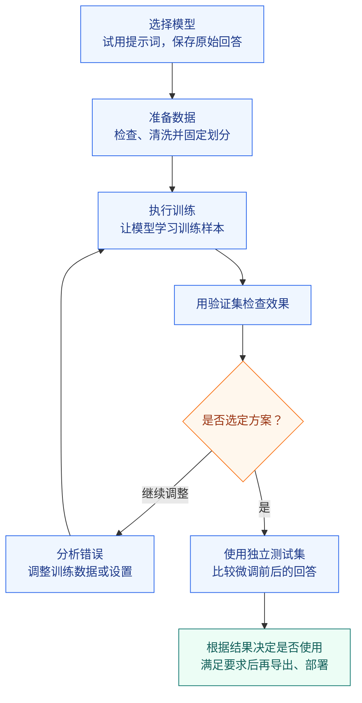

# 28 - 大模型微调概述与整体流程

---

**本章课程目标：**

- 能解释微调与推理的区别，说明监督微调用什么样的样本训练模型。
- 能根据实际问题，选择先调整提示词、补充资料、调用工具，还是考虑微调。
- 能分清预训练、监督微调与偏好对齐的基本作用，并阅读模型介绍选择合适的起点。
- 能说明 SFT、LoRA 与 QLoRA 的关系，理解本课程为什么可以“用 LoRA 做 SFT”。
- 能写清任务要求、保存基线，并说出数据准备、训练、评估和导出各阶段的主要产物。

**学习建议：** 先拿图书馆短文分清输入、期望输出和实际问题，再沿着“判断是否需要微调 → 选择模型 → 准备数据 → 训练 → 检查效果”建立整体认识。第一遍先讲清每一步为什么要做、会得到什么；公式和训练参数留到第 30 章。读完后按第 7 节整理任务约定与基线记录，作为后续几章共同使用的起点。

**官方文档与资源：** 详见[工具导航与参考资料索引 - 微调与模型对齐](/lib/08-agents/ai-agents-from-zero/工具导航与参考资料索引#微调与模型对齐)。

---

## 1、微调项目从一个具体问题开始

### 1.1 任务说明

假设我们正在开发一个文章管理系统。每篇文章除了标题和正文，还需要几个关键词，帮助读者快速了解主题，也方便程序检索和整理内容。

文章少时，可以人工填写；文章多了，就希望模型读完正文后自动提取。这就是**关键词抽取**：从一段文本中找出能够概括主题的词或短语。

先看一个容易理解的例子：

```text
文章：
市图书馆周末开设儿童阅读课，读者可通过公众号预约。

参考关键词：
市图书馆;儿童阅读课;公众号预约
```

为什么选这几个关键词？

- **市图书馆**说明谁开设课程。
- **儿童阅读课**说明开展了什么活动。
- **公众号预约**保留了怎样参与这一信息。

相较之下，“开设”“通过”虽然出现在原文中，却很难单独概括文章主题。关键词抽取不是随便挑几个出现过的词。

这里的关键词是为了讲解而给出的一组参考答案，并不表示这段话只有一种合理选法。实际准备训练数据时，需要统一选词的范围和写法。

**输出格式要求：**

假设程序收到下面的结果：

```text
市图书馆;儿童阅读课;公众号预约
```

它就可以按照英文分号 `;` 拆成三个关键词，再保存或展示。

但如果收到的是：

```text
这篇文章介绍了市图书馆的阅读课，关键词包括：
1. 市图书馆
2. 儿童阅读课
3. 公众号预约
```

人仍然看得懂，程序却不能直接按同样的规则处理，还要额外清除说明文字和序号。

因此，本课程的要求是：**输入中文文本，输出主题关键词；关键词之间使用英文分号，不添加解释、序号和“关键词：”前缀。** 英文分号是本项目约定的输出格式。

第 28～33 章会围绕这项任务学习数据准备、训练和验证。图书馆短文是教学示例；实际练习使用课程附带的关键词数据，第 29 章会打开真实记录逐项查看。

### 1.2 先保存原始回答：认识基线

**Baseline（基线）**是用来比较的起点：把文本和输出要求交给尚未做本次任务微调的模型，原样保存它的回答。后续用这份记录判断微调带来了哪些改善。

沿用图书馆教学示例，假设模型返回以下回答，可以分别记下哪些问题？

| 假设模型这样回答                         | 先记下什么问题                               |
| ---------------------------------------- | -------------------------------------------- |
| `关键词：市图书馆;儿童阅读课;公众号预约` | 选词基本符合要求，但多了前缀                 |
| `市图书馆，儿童阅读课，公众号预约`       | 内容可以，但没有使用规定的分隔符             |
| `市图书馆;读者`                          | 格式正确，却没有概括“儿童阅读课”这一主要内容 |
| `市图书馆;儿童阅读课;公众号预约`         | 这条样本暂未发现明显问题，还要看其他文本     |

检查结果要分成两件事：**格式是否符合约定，内容是否抓住主题。**

比较时，先用同一段文本、同一份任务说明。如果训练前只说“找出关键词”，训练后才补上“使用英文分号”，即使格式变好了，也不能直接把改进归功于微调。

### 1.3 错误原因的初步判断

假设模型回答时多写了“关键词：”。这可能是它不擅长遵守格式，也可能只是我们没有把要求说清楚。

如果补一句“不要添加前缀”就能解决问题，先采用修改后的提示词。要求已经明确、换了多段文本后仍出现同类错误，再继续排查资料、模型和训练数据。

---

## 2、微调前的问题诊断

### 2.1 明确提示词要求

在前面的[提示词工程基础](/lib/08-agents/ai-agents-from-zero/1-2-提示词工程基础)中，我们学过：任务说明越含糊，模型越容易按自己的方式回答。这里直接把这个方法用到关键词任务中。

只写“提取关键词”，没有说明输出格式。可以先改成：

```text
请从下文中抽取能够概括主题的关键词。
只输出关键词，关键词之间使用英文分号分隔。
不要输出“关键词：”、序号和解释。

待抽取文本：
市图书馆周末开设儿童阅读课，读者可通过公众号预约。
```

再观察模型的回答。如果还有格式问题，可以在 Prompt 中补充一组“文本 → 期望答案”的示例，让模型看见我们希望的写法。这就是前面介绍过的 **Few-shot Prompt**，即用少量示例说明任务。

补充示例后，再用没有展示过答案的短文、长文和专业文本检查。模型能照着图书馆示例输出，并不能说明它能处理新文章。

测试过程中，每次改过的 Prompt 都单独保存。这样才能知道哪次修改有帮助。

到[第 32 章第 2.4 节](/lib/08-agents/ai-agents-from-zero/32-微调效果评估与模型部署/index)，会把这一步落实为“原始指令 → 明确要求 → 加入示例”的验证练习。先确定提示词，再让原始模型与微调后的模型使用同一份提示词比较；本章先理解这个顺序。

### 2.2 不同问题的处理方式

如果 Prompt 已经写清楚，结果仍不理想，就要看模型到底卡在哪里。

| 观察到的问题                                   | 可以怎样理解               | 下一步先尝试什么                   |
| ---------------------------------------------- | -------------------------- | ---------------------------------- |
| 不知道需要英文分号                             | 没有收到明确的格式要求     | 修改 Prompt，必要时加入示例        |
| 不认识企业刚发布的产品名称或缩写               | 需要原文之外的补充资料     | 提供产品资料，或通过 RAG 检索      |
| 原文信息完整，但小模型总是抓不住主题           | 当前模型可能不适合这类文本 | 用相同文本比较其他候选模型         |
| 要求清楚、示例一致，多篇文本仍反复出现同类错误 | 模型完成这项任务还不够稳定 | 准备有针对性的数据，评估微调       |
| 提取关键词后还要保存到数据库、发送通知         | 任务包含模型回答之外的操作 | 用程序、Workflow 或 Agent 调用工具 |


这些方法可以搭配使用。例如，先检索产品术语表，再让模型抽取关键词，最后由程序保存结果。不是选了微调，就不再需要 Prompt 或工具。

对于图书馆短文，主要信息已经在原文中，一般不必为了抽取关键词再建一个知识库。对于“查询今天的阅读课还有几个预约名额”，则需要查询实时数据，不能指望微调把每天的名额变化都记住。

方案之间的完整比较见[第 1-3 章](/lib/08-agents/ai-agents-from-zero/1-3-RAG_微调_续训与智能体选型)。

### 2.3 微调的适用场景

提示词和候选模型已经检查过，同类错误仍反复出现时，可以评估微调。前提是**有明确的改进目标，也有正确、写法一致的样本**，并能留出未参与训练的文本检查效果。

相反，如果今天要求输出分号，明天改成一段解释，训练数据里又混着相互矛盾的答案，应该先统一任务和数据。模型很难从这样的示例中学到一致的做法。

还有一种常见需求：较大的模型效果不错，但运行成本较高，希望较小的模型也能完成这项相对固定的任务。可以尝试微调，再结合实际效果和成本决定是否采用。

---

## 3、微调的基本概念

### 3.1 微调与推理的区别

前面的章节中，我们主要使用已经训练好的模型：输入提示词，获得回答。这种使用模型处理输入、生成结果的过程叫作**推理（Inference）**。

微调则要多做一步——**用任务样本继续训练，更新模型中可训练的参数。** 参数，也叫权重，是模型内部参与计算的大量数值；调整这些数值，会影响模型怎样理解输入、生成回答。

可以把微调理解为给已经会读写的助手做专项练习。它不是从零开始学习中文，而是在已有能力上，学习更符合要求的关键词选择和输出方式。

回到图书馆案例，两种做法的区别是：

| 做法                    | 我们提供什么                   | 有没有更新权重               |
| ----------------------- | ------------------------------ | ---------------------------- |
| 修改 Prompt，让模型回答 | 本次任务说明，以及可参考的示例 | 没有，模型根据当前上下文回答 |
| 用样本进行微调          | 多条文本和对应的标准关键词     | 有，训练程序更新可训练部分   |

因此，**微调属于训练（Training）**。在聊天框中告诉模型“以后只用英文分号”，即使它接下来照做了，也不等于完成了一次微调。

微调之后，使用模型时仍需提供任务说明和待处理的文章。

### 3.2 监督微调（SFT）

本课程采用**监督微调（Supervised Fine-Tuning，SFT）**。“监督”指的是样本里提供了希望模型学习的参考答案。

第 1.1 节的图书馆短文和参考关键词，就可以用来理解一条样本的两个部分：

- **输入**：待处理的文章，以及“找出上文中的关键词”这类任务指令。
- **标准输出**：符合选词要求、使用英文分号的参考关键词。

训练程序利用这样的样本调整可训练参数，让模型学习文章与关键词之间的对应关系，以及我们约定的输出方式。它能不能把这种做法用到新文章上，还需要检查。

### 3.3 SFT 与 LoRA 是什么关系

后面打开训练工具时，我们会同时选择 `SFT` 和 `LoRA`。已经选了监督微调，为什么还要选一种微调方式？因为它们回答的是两个问题：

| 要决定什么           | 本课程的选择                           | 放到关键词任务中理解                 |
| -------------------- | -------------------------------------- | ------------------------------------ |
| 用什么样的反馈教模型 | SFT：提供输入和可靠的参考答案          | 给文章，再给一份符合要求的关键词示范 |
| 允许更新哪些参数     | LoRA：冻结原权重，训练新增的小部分参数 | 用少量可训练参数学习这项任务的调整   |

因此，**“用 LoRA 做 SFT”是一套可以组合的方案**。同样的监督微调任务，也可以采用全参数微调，更新原模型中的大量参数。两者最后都要通过实际回答检查效果。

第 30 章还会介绍 **QLoRA**：在量化基础权重的同时训练 LoRA 分支，以降低部分显存开销。“量化”先理解为用更少的位数近似保存数值。它改变了权重的保存与计算安排，并没有把“文章 + 参考关键词”变成另一种任务。

**SFT 说明怎么教，LoRA 说明主要改哪里，QLoRA 进一步考虑怎样节省显存。** [第 30 章](/lib/08-agents/ai-agents-from-zero/30-模型训练原理与高效微调/index)再展开具体计算和参数设置。本课程首次跟做使用已经验证的普通 LoRA 路线。

---

## 4、模型类型与模型选择

理解了“在已有模型上继续训练”，接下来要确定这个“已有模型”是哪一个。

本课程使用 `Qwen/Qwen3-0.6B`。但在模型库中，你还会看到名称非常相近的 `Qwen/Qwen3-0.6B-Base`。两者有什么区别？下载时应该选谁？

### 4.1 基础模型与指令模型

先回顾[第 1-1 章](/lib/08-agents/ai-agents-from-zero/1-1-大模型认知与工程概览)讲过的模型训练过程：

| 训练阶段 | 模型主要学习什么                       | 可以怎样理解                                       |
| -------- | -------------------------------------- | -------------------------------------------------- |
| 预训练   | 从大量语料中学习语言规律和知识关联     | 先具备阅读、续写等基础能力                         |
| 监督微调 | 根据指令学习标准回答                   | 不只是继续写文字，还要完成“总结、分类、抽取”等任务 |
| 偏好对齐 | 学习在候选回答中更倾向于符合要求的回答 | 不只看回答有没有错，也比较怎样回答更合适           |

**Base Model（基础模型）**通常指主要完成预训练、尚未经过面向助手的指令训练的模型。它可以继续写文本，但不一定稳定按照聊天指令完成任务。

**Instruct Model（指令模型）**经过了指令训练，通常更适合直接处理“请总结”“提取关键词”“只输出指定格式”等要求。预训练之后的指令训练、偏好优化等过程，也常统称为**后训练**。

它们的大致关系如下。这是一条帮助理解的常见路线，不代表每个模型的训练步骤和顺序都完全相同。


#### 4.1.1 模型系谱

打开 [ModelScope 的 Qwen3-0.6B 模型页](https://modelscope.cn/models/Qwen/Qwen3-0.6B)，在页面右侧找到“模型系谱”。

“系谱”就是来源关系：**这个模型是在谁的基础上继续训练或处理得到的。**


截图中，基模型一栏是 `Qwen/Qwen3-0.6B-Base`，下面通过“微调”关联到当前模型。对应关系可以读成：

```text
Qwen/Qwen3-0.6B-Base
          ↓ 官方继续进行后训练
Qwen/Qwen3-0.6B
          ↓ 本课程继续做关键词任务的监督微调
面向关键词抽取任务的模型
```

最后一步是本课程接下来要完成的练习。官方模型的后训练方式以模型说明为准。

页面中的几个名字可以这样区分：

| 名称                   | 含义                     | 什么时候会用到                           |
| ---------------------- | ------------------------ | ---------------------------------------- |
| `千问3-0.6B`           | 页面展示给人看的中文名称 | 浏览、辨认模型                           |
| `Qwen/Qwen3-0.6B`      | 当前模型的完整仓库 ID    | 下载模型、填写工具配置                   |
| `Qwen/Qwen3-0.6B-Base` | 对应 Base 版本的仓库 ID  | 查看模型来源，或明确需要 Base 版本时使用 |

**本课程选择的是 `Qwen/Qwen3-0.6B`，不是 `-Base` 版本。** 它已经经过后训练，能够执行指令，并支持思考与非思考模式。这些信息可以在[官方模型说明](https://huggingface.co/Qwen/Qwen3-0.6B)中核对。

指令模型的名称不一定包含 `Instruct`。下载时使用页面给出的完整仓库 ID，不要自行加上 `-Instruct` 后缀。

### 4.2 偏好对齐

**偏好对齐**可以通过比较候选回答，让模型更倾向于符合要求的回答方式。它也是后训练的一部分；本课程在已经过后训练的 Qwen3-0.6B 上继续做关键词 SFT。

假设我们在做一个办事问答助手。用户材料没有交齐，两个回答都指出了这个问题：

```text
回答 A：材料不完整，无法办理。

回答 B：还缺少申请表，请补充后再提交。
```

如果已知缺少的确实是申请表，B 比 A 更具体，也更能帮助用户继续操作。我们可以把这种“更希望助手怎样回答”的选择记录下来，用于偏好训练。

### 4.3 ModelScope 模型页面

仍然留在刚才的 ModelScope 页面，接着看两个位置。

#### 4.3.1 模型介绍

**模型介绍页里的说明，也常叫模型卡。** 可以把它当作模型的使用说明书。

先找到发布者 `Qwen` 和仓库 ID，确认没有进入名称相近的第三方模型页面；然后阅读模型概述，了解它的规模、用途和使用方法。

以本课程模型为例，官方模型说明列出的参数规模是 `0.6B`。`B` 表示 billion，即十亿，因此 `0.6B` 大致表示 6 亿个参数。这里说的是模型内部的数值数量，不是文件有多少 GB；规模可以作为选型参考，但模型是否好用还要通过任务测试。

<details>
<summary>选读：截图中的 751.63M 为什么与 0.6B 不同</summary>

`M` 表示百万，`751.63M` 约为 7.52 亿。[该版本权重文件](https://huggingface.co/Qwen/Qwen3-0.6B/blob/c1899de289a04d12100db370d81485cdf75e47ca/model.safetensors)的清单同时保存了输入嵌入和输出层权重，各项数量合计为 751,632,384。但 Qwen3-0.6B 加载后在这两个位置共用一组权重。共享部分只计算一次，独立参数量为 596,049,920，约 5.96 亿，对应官方标注的 `0.6B`。

这一共享设置可以在[官方配置文件](https://huggingface.co/Qwen/Qwen3-0.6B/blob/c1899de289a04d12100db370d81485cdf75e47ca/config.json)中的 `"tie_word_embeddings": true` 核对。

</details>

#### 4.3.2 模型文件

点击“模型文件”，可以看到模型不是一个孤立的文件，而是权重与多种配置文件组成的目录。


先认识几类后面会用到的文件：

| 文件或文件类别           | 可以怎样理解                                                   |
| ------------------------ | -------------------------------------------------------------- |
| `model.safetensors`      | 保存模型已经学到的权重数值                                     |
| `config.json`            | 描述模型结构需要的配置，例如层数等信息                         |
| `generation_config.json` | 保存一些默认生成设置                                           |
| 分词器相关文件           | 帮助程序把文字转换成模型能够处理的编号，并把输出编号还原成文字 |

截图中的 `model.safetensors` 约为 1.50 GB。这是文件占用的存储空间，与“0.6B 个参数”不是同一个单位；文件大小也不能直接当作训练需要的显存。

加载模型时，程序先根据模型实现和配置搭起计算结构，再读取权重和分词器等文件。因此，后面下载模型时要保留完整的必要文件，而不是只拿一个权重文件就结束。

### 4.4 模型试用与选择

先选 5～10 条有代表性的文本，覆盖短文、长文和专业术语，使用相同的任务说明比较候选模型。按第 1.2 节的内容和格式要求记录问题。这种小规模试用适合筛选候选模型，正式评估仍需使用独立数据。

候选模型有在线试用或 API 时，可以先观察回答，再决定是否下载。本课程固定使用较小的 `Qwen/Qwen3-0.6B`，便于完成数据、训练和验证的整套练习。

---

## 5、微调数据准备

### 5.1 训练样本的基本要求

确定使用哪个模型后，接下来就要准备第 3.2 节所说的“输入与标准答案”。

对关键词任务来说，文章要接近实际业务，参考关键词要能概括主题，输出也要符合分号格式。不能一边要求只输出关键词，一边又在标准答案里放进长段解释。答案本身有错，模型也可能学到错误示范。

课程提供了包含 2,000 条记录的关键词样本文件 `案例与源码-4-微调/keywords_data_sharegpt_small.jsonl`。[第 29 章](/lib/08-agents/ai-agents-from-zero/29-微调数据准备与对话模板/index)将检查、清洗这些样本，再用处理后的数据训练。

### 5.2 数据划分的作用

模型能答好练过的文章，并不代表换一篇也能做好。因此，要在训练之前留出一部分数据，专门检查新文章上的表现。

后面会按用途把数据分成三份：

- **训练集**：交给训练程序，让模型学习。
- **验证集**：训练和调整方案时，用来检查效果。
- **测试集**：方案确定后，用来做最后的独立比较。

比如要比较“训练一轮还是三轮”，用验证集帮助选择；测试集留到方案确定后再使用。

---

## 6、微调的整体流程

### 6.1 主要步骤

把前面的内容连起来，一次微调项目就可以按下面的顺序进行：



检查时发现答案中总有多余解释，就回看任务说明和训练样本：是规则没写清楚，还是数据本身也带着解释？找到原因后调整，再次检查。实际结果符合使用要求后，才接进程序。

### 6.2 微调效果的检查

回到第 1.2 节记录的错误：微调后是否还会多写前缀、用错分隔符、漏掉文章主题？用相同输入和任务说明比较，才知道这些问题有没有改善。

例如，不再输出“关键词：”，说明格式有所改善；但如果同时漏掉更多主题关键词，就不能只展示格式变好的那部分结果。

第 31 章会实际完成训练；第 32 章再把模型加载起来，逐条查看回答、批量评分，并学习如何导出使用。

---

## 7、任务约定与基线记录

### 7.1 任务约定

整理数据、填写训练配置和比较回答时，统一使用下面的任务约定。

| 项目         | 本课程约定                                |
| ------------ | ----------------------------------------- |
| 任务         | 中文文本关键词抽取                        |
| 输入         | 一段中文文本和关键词抽取指令              |
| 输出         | 能够概括主题的关键词，用英文分号 `;` 分隔 |
| 不需要的内容 | 解释、序号、Markdown 列表和“关键词：”前缀 |
| 模型         | `Qwen/Qwen3-0.6B`                         |
| 训练方式     | 用输入与标准答案做 SFT，采用 LoRA         |
| 数据         | 清洗后固定划分的训练集、验证集和测试集    |
| 格式检查     | 是否遵守输出约定                          |
| 内容检查     | 选出的词是否准确，主要主题是否遗漏        |
| 对比对象     | 同一个模型在本次微调前后的表现            |

表中的 **LoRA** 是本课程采用的微调方法，通常比更新模型全部权重节省训练资源，原理见[第 30 章](/lib/08-agents/ai-agents-from-zero/30-模型训练原理与高效微调/index)。

### 7.2 基线记录示例

一次基线记录应让别人知道：模型读到了什么、实际回答了什么，以及在什么条件下运行。可以按下面的表格保存：

| 记录项             | 保存什么                                                 |
| ------------------ | -------------------------------------------------------- |
| 样本来源与完整输入 | 文件名、样本位置、文章全文和任务说明                     |
| 参考答案           | 人工核对后的关键词，单独保存供检查使用                   |
| 模型与运行设置     | 完整模型 ID、版本，以及工具使用的生成设置                |
| 原始回答           | 原样保存模型返回的全部文字，包括不完整或不符合要求的回答 |
| 问题记录           | 分开记录格式错误与内容遗漏，供微调后对照                 |

用第 1.2 节的假设回答练习：`关键词：市图书馆;儿童阅读课;公众号预约` 应完整放入“原始回答”，并在“问题记录”中写“选词符合参考答案，多了前缀”。清除前缀再保存，就丢掉了需要比较的问题。

正式比较时，原始模型应与微调所用的起点版本一致，并保持相同的输入和生成设置。不明配置的在线试用回答只能用于初步观察，不能直接当作本地模型的基线。示例回答与运行设置见[第 32 章的原始模型对照](/lib/08-agents/ai-agents-from-zero/32-微调效果评估与模型部署/index)。

---

**章节思考题：**

1. 微调与日常聊天推理有什么区别？在聊天框中提供几个正确示例，和把这些示例用于监督微调，分别改变了什么？

   **参考思路：** 推理用当前参数处理输入，聊天示例成为本次输入的上下文；监督微调则由训练程序根据样本更新可训练参数。微调后仍需提供当前任务说明和待处理文章，模型不会自动知道下一次业务输入。

2. 预训练、监督微调和偏好对齐分别帮助模型学习什么？选择 Base 模型或指令模型时，应看哪些信息？

   **参考思路：** 预训练主要学习语言规律和知识关联，监督微调用参考答案教模型完成指令，偏好对齐让模型更倾向于符合要求的回答。Base 通常主要完成预训练，指令模型经过面向指令的训练。选择时查看模型说明、输入方式、任务表现与资源要求；模型的实际训练过程和仓库名称以介绍为准，不能只凭 Instruct 后缀判断。

3. “用 LoRA 做 SFT”中，SFT 和 LoRA 各决定什么？换成 QLoRA 后，文章与参考关键词这类训练样本需要变成另一种任务吗？

   **参考思路：** SFT 决定用输入与参考答案提供学习信号；LoRA 决定冻结基础权重，主要训练新增分支。QLoRA 进一步量化基础权重，以减少这部分存储开销，仍可用同样的文章与参考关键词做 SFT。训练目标与参数更新方式是可以组合的选择。

4. 模型多写了“关键词：”、不认识企业刚发布的产品缩写、需要查询今天的活动余位，这三类问题分别优先怎样处理？什么情况下再考虑微调？

   **参考思路：** 前缀问题先明确提示词并换几篇文章检查；缺少术语资料时补充原文或检索资料；实时余位通过查询工具取得。任务要求、资料和候选模型已经检查过，仍反复出现同类行为问题，并且有可靠示范与评估数据时，再评估微调的投入与收益。几种方法也可以组合使用。

5. 为“文章 → 关键词”准备一条监督微调样本，至少要提供什么？为什么只有一篇原始文章还不够？

   **参考思路：** 要提供任务要求、待处理文章，以及有原文依据、符合选词和分隔符约定的参考关键词。原始文章只提供了材料，没有说明本课希望模型生成怎样的答案。整理参考答案时既要检查格式，也要核对内容；实际使用新文章时，再检查模型是否学会了这种对应关系。

6. 怎样建立一份能用于微调前后比较的基线？如果训练后同时换了提示词，分数变化该怎样解释？

   **参考思路：** 保存模型版本、任务说明、代表性输入、参考答案、原始回答和生成设置，分别记录格式与内容问题。比较微调影响时，让原模型和加载 Adapter 的模型使用相同条件；同时换提示词会引入另一项变化，不能把全部收益归因于微调。具体对照在第 32 章完成。

7. 从一个待改善的关键词任务开始，到得到可检查的训练结果，主要经过哪些步骤？每一步应留下什么？

   **参考思路：** 先明确任务并保存基线，再选择模型、审核和划分数据，随后配置训练并保存 Adapter、日志和检查点，最后比较回答、记录错误并学习导出。数据准备留下训练、验证和测试集；验证集用于调整方案，测试集用于方案确定后的检查。任务约定、数据记录、训练配置和评估结果要能对应起来，便于复现和继续改进。

**本章小结：**

- 微调是在已有模型上继续训练，通过样本更新可训练参数，使模型适应任务。推理使用当前参数生成回答，在聊天框中增加示例不会自动完成参数更新。
- 提示词说明任务，外部资料补充知识，工具执行查询与操作。是否需要微调，应从实际错误、业务要求和已有方案的表现出发。
- 预训练、监督微调和偏好对齐分别侧重基础能力、执行指令和回答偏好。选择 Base 或后训练模型时，要结合模型说明、代表性输入和资源条件判断。
- SFT 用输入与参考答案提供学习信号，LoRA 主要训练新增分支，QLoRA 进一步量化基础权重；它们分别涉及训练目标、更新参数和权重表示方式。
- 本课程沿着任务约定、基线、数据准备、训练、评估和导出展开。各阶段的文件与记录要能对应，格式改善、内容改善和处理新文章的能力需要分别检查。

**建议下一步：** 按第 7 节完成任务约定与基线记录，试着说明“要改善什么、为什么考虑微调、准备怎样比较”。随后进入[第 29 章](/lib/08-agents/ai-agents-from-zero/29-微调数据准备与对话模板/index)，把可靠示范整理成可用于训练和检查的数据。
