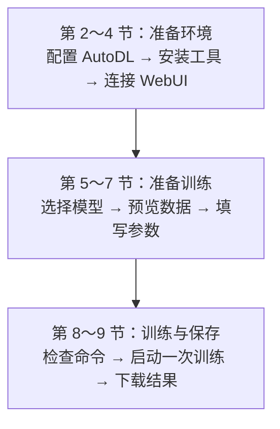

## 1、实验任务与环境

第 29 章已经准备好关键词训练数据，第 30 章也解释了怎样设置训练参数。本章把这些文件和参数交给训练工具，得到一份能在下一章加载的 LoRA Adapter。

本章使用 **AutoDL + LLaMA-Factory**：AutoDL 提供带 GPU 的远程机器，LLaMA-Factory 提供训练程序和 WebUI（浏览器操作页面）。你在自己电脑的浏览器里填写参数，真正的模型下载和训练都在 AutoDL 实例中完成。

本机与 AutoDL 实例的分工如下：

| 位置        | 本章的工作                             | 命令在哪里执行                           |
| ----------- | -------------------------------------- | ---------------------------------------- |
| 自己的电脑  | 打开控制台和训练页面，保存资料备份     | 数据清洗在本机完成；SSH 隧道也在本机建立 |
| AutoDL 实例 | 安装工具、下载模型、读取数据、执行训练 | JupyterLab 终端                          |

后文的 `/root/autodl-tmp` 是 **AutoDL 实例内的数据盘目录**，相关命令在 JupyterLab 终端执行。
