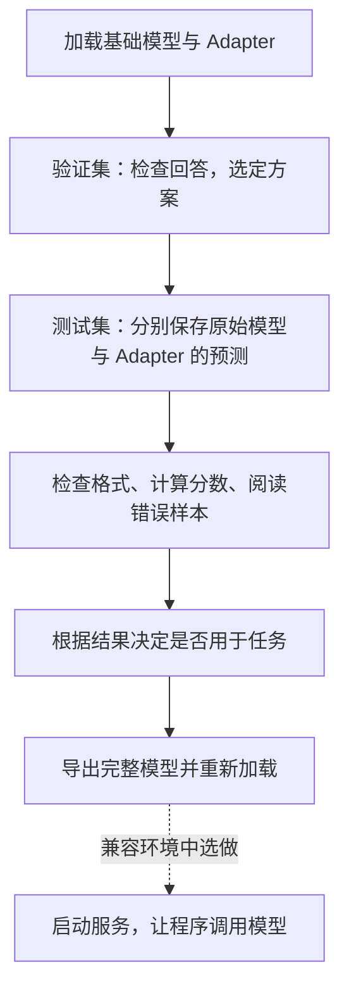

## 1、模型验证的任务与准备

### 1.1 从训练结果到实际回答

第 31 章中，我们完成了一轮 LoRA 训练，保存了 Adapter。接下来，把它与原来的 Qwen3-0.6B 一起加载，看看模型能否按要求抽取关键词。

第 30 章的 Loss 告诉我们模型对参考答案的预测情况；现在要检查的是：**真正让模型回答时，能不能直接给出关键词，选出的内容是否合适。** 这就是本章的模型验证。

沿用第 28 章的文章管理场景：程序收到回答后，要按英文分号拆分关键词，再用于展示和检索。如果模型给出一段解释，或者漏掉文章主题，即使训练顺利结束，也还没有解决这个问题。

把一次评估放进完整项目，可以按下面的顺序推进：



第 29 章已经把数据分成了训练、验证和测试三份。自己的项目先用验证集选定方案，再用未参与选择的测试集验收；**测试集不用于反复挑检查点或调整参数。** 本章附带的 200 条预测保留了当时的固定设置，我们用它练习复算与错误分析；它与第 2.4 节的排查实验分别保存，不能拼成一次优化后的验收。

入门时也可以导出尚未达到任务要求的模型，练习文件保存和加载。导出成功只表示这一步操作完成，不表示它已经适合实际业务。

### 1.2 本章会用到的文件

先认清三样东西：验证／测试数据是“题目”，Adapter 是本轮训练的产物，两组预测文件是模型的“原始答卷”。每一步用到哪个文件，会在对应操作处说明。


<summary>跟做时查阅：本章文件位置</summary>

在本机课程项目中，先找到下面这些文件。它们在第 29、31 章已经介绍或上传过，不需要重新制作测试集：

```text
案例与源码-4-微调/
├── processed/keywords-clean/
│   ├── keywords_validation.jsonl       # 200 条，用于检查与选择方案
│   └── keywords_test.jsonl             # 200 条，用于最后比较
├── configs/
│   ├── keywords_clean_predict_base.yaml # 不加载 Adapter 的预测配置
│   ├── keywords_clean_predict_lora.yaml # 加载 Adapter 的预测配置
│   └── keywords_clean_export.yaml       # 合并导出配置
├── examples/prompt-comparison/ # 第 2.4 节的提示词与 Adapter 对照
├── examples/thinking-control/ # 思考模式诊断与标注审核
├── results/keywords-clean/
│   ├── base/generated_predictions.jsonl # 课程附带的 200 条原始模型预测
│   └── lora/generated_predictions.jsonl # 课程附带的 200 条 LoRA 预测
├── audit_keywords_prediction.py          # 运行预测并核对实际精度、条数与数据
├── convert_keywords_predictions.py      # 把预测文件整理为评分脚本的输入
└── evaluate_keywords_predictions.py     # 对照参考答案评分
```


训练得到的 Adapter 位于 **AutoDL** 中：

```text
/root/autodl-tmp/LLaMA-Factory/saves/Qwen3-0.6B-Thinking/lora/keywords-clean/
```

使用自己训练的目录；若名称不同，后面的检查点选项和配置路径也要对应修改。基础模型仍使用训练时同一份 `Qwen/Qwen3-0.6B` 文件。

本章中，**加载、预测和导出在 AutoDL 完成；下载后的文件转换与评分在本机完成**。后者只是处理文本，不需要占用 GPU。

### 1.3 原始模型与微调模型的比较

第 28 章把微调前的表现称为**基线**。现在实际比较两种状态：

| 比较对象     | 加载什么                                  |
| ------------ | ----------------------------------------- |
| 原始模型     | Qwen3-0.6B，不加载本次训练的 Adapter      |
| 微调后的模型 | 同一个 Qwen3-0.6B，加上第 31 章的 Adapter |

比如，同一篇图书馆文章，原始模型多写了“关键词：”，加载 Adapter 后没有前缀，才可能说明输出行为有变化。如果第二次另外补上了“禁止前缀”的指令，就不能只把改善归功于微调。

所以，两组比较要使用**相同的完整输入、模型文件、对话模板和生成设置**。第 2 节先练习单条观察，第 3 节再用两份配套配置进行批量预测。第 28 章的记录帮助我们认识问题，但不能用不同输入或不明设置下的回答替代这里的比较。
