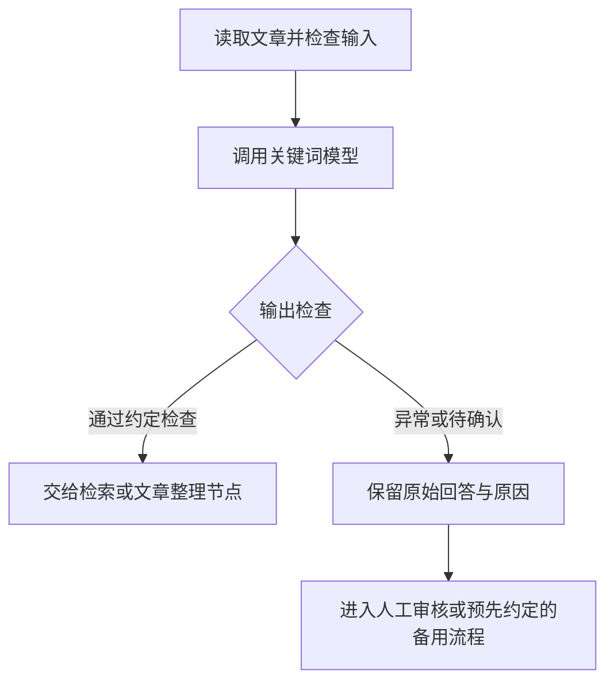

## 6、vLLM 部署与接口调用（选做）

文章管理程序需要完成“发送文章 → 收到回答 → 检查关键词 → 保存或处理失败”。本节用 vLLM 把第 5 节的合并模型变成可调用的服务，第 6.3 节说明怎样接回智能体流程。

先读各节的用途和结果；准备实际部署时，再依次展开第 6.1～6.4 节的操作。示例安装方案针对 V100 与固定版本，不能原样套到所有环境。第 6.5 节介绍另一种加载方式，理解区别即可。

### 6.1 部署环境与安装

Chat 页面适合人工提问；文章管理程序则需要通过接口提交文章、取得关键词。这里使用的 **vLLM 是一种推理框架，负责加载模型、处理输入并生成回答，也能把这些功能提供为程序可调用的接口**。接下来用它运行第 5 节导出的模型。

这一步的结果是：在独立的推理环境里，能够加载依赖并完成 GPU 运算。训练环境继续负责训练，两套环境的 Python 路径要分清。


<summary>选做实操：V100 上安装并验证 vLLM 0.9.2</summary>

先按下面的环境要求核对部署实例，确认它处于**正常开机**状态。若 LLaMA-Factory **Chat 页**仍加载着模型，点击“卸载模型”释放显存。

不再使用 WebUI 时，先确认没有训练任务：前台服务到**启动 `llamafactory-cli webui` 的 AutoDL 终端**按 `Ctrl+C`；后台服务按[第 31 章“怎样停止后台 WebUI”](/lib/08-agents/ai-agents-from-zero/31-LLaMA-Factory环境搭建与微调实战/index)核对 PID 后停止。不要在本机 SSH 隧道终端按 `Ctrl+C` 代替它，那只会断开访问。

本节固定使用 **vLLM 0.9.2**，该版本的[官方安装要求](https://docs.vllm.ai/en/v0.9.2/getting_started/installation/gpu.html)列出 V100。跟做时保留版本号；更换 vLLM 版本或显卡时，重新核对兼容要求。其中的**计算能力**表示 GPU 硬件特性的版本，与显存容量、CUDA 软件版本分别检查。

本节的复现环境为 V100-32GB、驱动 `580.105.08`，配合以下版本：

| 组件                     | 示例版本        |
| ------------------------ | --------------- |
| Python                   | 3.12.3          |
| vLLM                     | 0.9.2           |
| PyTorch / CUDA 构建      | 2.7.0 / 12.6    |
| Transformers             | 4.53.3          |
| xFormers / OpenAI 客户端 | 0.0.30 / 1.90.0 |

接下来，新开一个 JupyterLab 终端，不要激活训练用的 `.venv`，创建独立推理环境：

```bash
cd /root/autodl-tmp
uv venv vllm-compat-092/.venv --python 3.12 --seed
cd vllm-compat-092
source .venv/bin/activate
UV_CACHE_DIR=/root/autodl-tmp/vllm-compat-092/cache uv pip install \
  --python .venv/bin/python \
  --index-url https://pypi.tuna.tsinghua.edu.cn/simple \
  vllm==0.9.2 transformers==4.53.3
python -m pip check
```

`uv` 沿用第 31 章安装的工具。环境目录已经存在时，先核对路径，再激活已有环境。

这和第 31 章的 LLaMA-Factory `.venv` 是两套环境：

```text
LLaMA-Factory/.venv  → 训练和 WebUI
vllm-compat-092/.venv → 本节的推理服务
```

后面的 `vllm serve` 都在推理环境中执行。运行前检查 `which python` 指向 `vllm-compat-092/.venv`，避免把训练环境和推理环境的依赖混用。完整依赖清单可从[配套文件说明](/lib/08-agents/ai-agents-from-zero/案例与源码-4-微调)查阅。

安装后，在推理环境中执行第 31 章第 3.4 节的 GPU 检查代码。下图给出版本、GPU 架构和 FP16 运算的示例检查结果：


重点核对 Python 路径、`sm_70` 和最后的 `cuda:0`，确认当前推理环境能在 V100 上完成 FP16 运算。


### 6.2 前台启动与接口检查

先把服务理解成一个接收文章的窗口：模型目录指定“由谁回答”，服务地址指定“发到哪里”，请求中的模型名指定“调用哪一个”。本例使用：

| 项目                    | 本例取值                                         |
| ----------------------- | ------------------------------------------------ |
| 模型目录                | `/root/autodl-tmp/exports/keywords-clean-merged` |
| AutoDL 实例内的接口地址 | `http://127.0.0.1:8000/v1`                       |
| 请求中的模型名          | `keywords-clean`                                 |

实际跟做时，先展开下方步骤启动服务，再执行后面的请求。上下文长度、显存预算等参数先沿用本例；调整前再查其含义。


<summary>选做实操：准备模型、启动服务与核对参数</summary>

**先确认部署机器上有完整的导出模型。** 如果部署与训练不在同一台机器，第 5 节导出的文件不会自动出现在新机器上。先将整个 `keywords-clean-merged/` 文件夹打包下载到本机，再通过部署实例的 JupyterLab 上传并解压到 `/root/autodl-tmp/exports/`。不能只传 Adapter，也不能只复制一个权重文件。

在**部署实例的 AutoDL 终端**中检查：

```bash
ls -lh /root/autodl-tmp/exports/keywords-clean-merged
```

对照第 5.3 节的导出文件列表：确认模型配置、分词器及全部权重文件齐全；模型采用分片权重时，索引文件和各分片也要一起传。目录不同，就同步修改下面 `vllm serve` 后的地址。文件尚未上传或解压时，先完成文件准备，不进入启动步骤。

为兼容本节的 Transformers 版本，启动时用 `--tokenizer` 指定原 Qwen3-0.6B 的分词器，用 `--chat-template` 指定导出目录的对话模板。基础模型缓存位置按第 31 章第 5.3 节查找；换到另一台机器时，也要准备好这份分词器，并修改命令中的路径。

<details>
<summary>兼容性说明：为什么单独指定分词器？</summary>

第 5 节的导出工具在 `tokenizer_config.json` 中保存了列表形式的 `extra_special_tokens`；本节的 Transformers 4.53.3 按字典读取时，会出现 `AttributeError: 'list' object has no attribute 'keys'`。

这里通过启动参数选择原模型分词器和导出的对话模板。替换分词器前，应比较相同文本的 token 编号，确认与模型相匹配；示例中抽查的三组文本编号一致。

</details>

然后在已激活 **`vllm-compat-092/.venv`** 的 AutoDL 终端中启动服务：

```bash
VLLM_USE_V1=0 vllm serve /root/autodl-tmp/exports/keywords-clean-merged \
  --tokenizer /root/.cache/modelscope/models/Qwen--Qwen3-0.6B/snapshots/master \
  --chat-template /root/autodl-tmp/exports/keywords-clean-merged/chat_template.jinja \
  --served-model-name keywords-clean \
  --dtype half \
  --enforce-eager \
  --max-model-len 2048 \
  --max-num-seqs 4 \
  --gpu-memory-utilization 0.30 \
  --host 127.0.0.1 --port 8000 \
  --generation-config vllm
```

按用途对照这条启动命令：

| 参数或环境变量                                                                                   | 中文含义             | 设置的作用                                           |
| ------------------------------------------------------------------------------------------------ | -------------------- | ---------------------------------------------------- |
| `vllm serve` 后的第一个路径                                                                      | 模型目录             | 加载第 5 节导出的完整模型                            |
| `--tokenizer`                                                                                    | 分词器位置           | 使用原 Qwen3-0.6B 分词器，兼容本节的工具版本         |
| `--chat-template`                                                                                | 对话模板文件         | 使用导出目录中的 `chat_template.jinja` 组织消息      |
| `--served-model-name`                                                                            | 对外提供服务的模型名 | 调用接口时填写 `keywords-clean`                      |
| `VLLM_USE_V1=0`                                                                                  | 引擎版本选择         | 使用 V0 引擎                                         |
| `--dtype half`                                                                                   | 权重数据类型         | 使用 FP16，`half` 是这里的取值名称                   |
| `--enforce-eager`                                                                                | 强制即时执行         | 关闭 CUDA Graph，采用示例的运行方式                  |
| `--max-model-len 2048`                                                                           | 服务上下文长度上限   | 输入与输出合计最多 2,048 个 token                    |
| `--max-num-seqs 4`                                                                               | 同时处理的序列数上限 | 每轮调度最多同时处理 4 条序列                        |
| <code style="white-space: normal; overflow-wrap: anywhere;">--gpu-memory-utilization 0.30</code> | 显存预算比例         | 为本服务设置约 30% 的显存预算，模型权重仍完整加载    |
| `--host 127.0.0.1`                                                                               | 监听地址             | 只接受实例内部连接，本机通过 SSH 隧道访问            |
| `--port 8000`                                                                                    | 监听端口             | 服务通过实例的 8000 端口接收请求                     |
| `--generation-config vllm`                                                                       | 默认生成配置来源     | 使用 vLLM 默认值；温度与输出长度由下面的请求明确设置 |

从本机连接这个服务的方法见第 6.4 节。

这些值用于小模型连通性练习，不是性能最优配置。启动日志应与设置对应：示例使用 V0 引擎、xFormers 后端和 FP16 权重。确认服务启动成功后，再测试接口。
这里的 2048 与第 30 章的训练截断长度取值相同，但不是同一个开关。**服务上下文包括输入与输出**：如果套用模板后的输入已经占了 1800 token，就不能再在这个上限内生成 1024 token。请求中的最大生成长度只限制输出，也要受服务总长度约束。[vLLM 长度参数说明](https://docs.vllm.ai/en/stable/configuration/engine_args/#max-model-len)


前台启动时，终端会持续显示日志，没有马上回到命令提示符是正常的。保留这个终端，另开一个 **AutoDL 终端**，先查看模型列表：

```bash
curl http://127.0.0.1:8000/v1/models
```

`/v1/models` 用来确认服务能访问、模型名称是什么，还没有执行关键词抽取。接着发送一次实际请求：

```bash
curl http://127.0.0.1:8000/v1/chat/completions \
  -H "Content-Type: application/json" \
  -d '{
    "model": "keywords-clean",
    "messages": [
      {
        "role": "user",
        "content": "市图书馆周末开设儿童阅读课，读者可通过公众号预约。请提取关键词，只输出关键词，并使用英文分号分隔。"
      }
    ],
    "temperature": 0,
    "max_tokens": 1024,
    "top_p": 1,
    "chat_template_kwargs": {"enable_thinking": false}
  }'
```

正常返回时，响应是 JSON，模型回答位于 `choices[0].message.content`：`choices[0]` 表示取第一个候选结果，`message.content` 是它的回答文字。打开这一项，检查是否只有分号分隔的关键词；不能只看 HTTP 请求成功。

这里的图书馆输入用于接口连通性练习，不是前面 200 条测试的一部分。curl 和下面的 Python 请求统一使用温度 `0`、Top-p `1`、最大生成长度 `1024`，关闭思考模式；输入与生成长度不同于前面的批量测试，因此不把它作为同条件效果复测。温度为 0 也不保证跨环境逐字一致。

### 6.3 在 Python 中调用模型

使用 LangChain 接入时，可以沿用[第 11 章的 ChatOpenAI 调用](/lib/08-agents/ai-agents-from-zero/11-Model-I-O与模型接入)，将服务地址与模型名改为这里的 vLLM 配置，消息内容继续使用关键词任务。

**把这个模型接回前面的智能体流程。** 关键词模型负责“读取文章、给出关键词”，其他节点负责检查和后续处理。下面是接入流程的教学示意；只有回答通过业务检查，才进入自动保存环节：



可以把 `article`、`raw_answer`、`keywords` 和 `status` 分别保存在第 23 章的状态中：`raw_answer` 保留原始文字，`keywords` 只接收通过格式检查后解析出的列表，`status` 决定下一步走向。模型调用抛出异常时也进入失败分支，不能把空结果默认为成功。

这里需要两层检查：程序先检查前缀、分隔符、空项、重复和是否被长度限制截断；选词依据与主题完整性再按业务规则审核。**程序能拆出列表，不代表内容已经正确。** 例如本次 `F58050;Bakeking;F68050` 可以拆成三个词，却有无依据内容，仍应留在审核环节。

这也对应[第 14 章的输出解析与校验](/lib/08-agents/ai-agents-from-zero/14-输出解析器)：程序能读懂结果的结构，还需要检查字段或词语是否符合任务要求。微调、格式约束和后续校验可以配合使用。

流程分支可复用[第 24 章的条件边](/lib/08-agents/ai-agents-from-zero/24-LangGraphAPI_节点_边与进阶)。如果允许重试，应规定次数与退出条件；不要对同一失败请求无限重试，也不要静默替换成另一模型的回答后，仍把它算作这份 Adapter 的效果。

若进一步希望模型自己选择工具、填写参数、读取工具结果，可先对照[第 29 章的工具调用样本](/lib/08-agents/ai-agents-from-zero/29-微调数据准备与对话模板/index)和[本章第 4.7 节的回归检查](/lib/08-agents/ai-agents-from-zero/32-微调效果评估与模型部署/index)。仅做关键词训练没有证明这些能力，完整训练可把 [Function Calling 微调课程](https://huggingface.co/learn/agents-course/en/bonus-unit1/introduction)作为进阶选读。

`curl` 适合检查接口，项目里则通常用代码调用。第 11 章已经学过 [OpenAI 兼容接口与模型接入](/lib/08-agents/ai-agents-from-zero/11-Model-I-O与模型接入)：这里复用同一种客户端，只把服务地址和模型名指向自己部署的模型，并不是改用 OpenAI 的云端模型。

需要跟做时，先确认第 6.2 节的服务仍在运行，再展开下面的客户端代码。


<summary>选做实操：创建并运行 Python 调用文件</summary>

下面的代码先在 **AutoDL 的 `vllm-compat-092/.venv` 环境**中运行，`127.0.0.1` 指这台 AutoDL 实例。客户端随上述依赖安装，先确认版本：

```bash
python -m pip show openai
```

在 AutoDL 中新建 `call_keywords.py`，填入以下代码：

```python
from openai import OpenAI

client = OpenAI(
    base_url="http://127.0.0.1:8000/v1",
    api_key="none",  # 当前 vLLM 启动命令未启用 API 密钥；这里只是 SDK 必填占位符
)

response = client.chat.completions.create(
    model="keywords-clean",
    messages=[
        {
            "role": "user",
            "content": "市图书馆周末开设儿童阅读课，读者可通过公众号预约。请提取关键词，只输出关键词，并使用英文分号分隔。",
        }
    ],
    temperature=0,
    top_p=1,
    max_tokens=1024,
    extra_body={
        "chat_template_kwargs": {"enable_thinking": False}
    },
)

print(response.choices[0].message.content)
```

保存文件后，在其所在目录执行：

```bash
python call_keywords.py
```

这里的 `base_url`、模型名和第 6.2 节的 curl 请求必须对应同一台 AutoDL 实例、同一个 vLLM 服务。`enable_thinking: false` 的目的是让 Qwen3 直接返回关键词，不把思考内容混进任务输出。


**检查返回内容，而不只看请求是否成功。** 下面的示例响应没有思考段，但关键词仍不合格；原始回答以这段内容开头：

```text
children;reading;library;weekends;public;book;book;book;book;book
```

这里只展示开头，后面继续重复 `book`。响应中的 `completion_tokens` 为 `1024`、`finish_reason` 为 `length`，说明触及生成长度上限，不能当作正常完成的关键词列表。


**接口可调用，回答仍可能不合格。** 这条输入和生成设置与第 4 节的批量测试不同，不能直接比较分数。遇到类似问题，回到验证集固定输入，再分别检查模板、生成设置和执行环境。

### 6.4 后台运行与本机访问

前台运行适合看日志；后台运行方便关闭终端后继续使用。两种方式沿用同一组模型和服务参数，切换前先停止原服务，避免重复占用端口和显存。

本机访问时，SSH 隧道把本机的 `18000` 端口转发到 AutoDL 的 `8000` 端口；因此本机客户端地址改为 `http://127.0.0.1:18000/v1`。隧道只负责转发，服务仍须在 AutoDL 运行。


<summary>需要后台服务或本机调用时：完整启动、隧道与停止步骤</summary>

确认前台接口能够返回响应后，回到**第 6.2 节运行 `vllm serve` 的 AutoDL 终端**，按 `Ctrl+C`，等待服务退出。不是在发请求的终端或本机 SSH 隧道终端操作。若进程仍存在，按下面折叠说明核对 PID 后停止，确认显存和端口释放，再切换运行方式。然后仍在推理环境中，保留第 6.2 节的全部参数，用后台方式启动：

```bash
nohup env VLLM_USE_V1=0 vllm serve /root/autodl-tmp/exports/keywords-clean-merged \
  --tokenizer /root/.cache/modelscope/models/Qwen--Qwen3-0.6B/snapshots/master \
  --chat-template /root/autodl-tmp/exports/keywords-clean-merged/chat_template.jinja \
  --served-model-name keywords-clean \
  --dtype half \
  --enforce-eager \
  --max-model-len 2048 \
  --max-num-seqs 4 \
  --gpu-memory-utilization 0.30 \
  --host 127.0.0.1 --port 8000 \
  --generation-config vllm \
  > /root/autodl-tmp/vllm-keywords.log 2>&1 < /dev/null &
VLLM_PID=$!
ps -p "$VLLM_PID" -o pid,ppid,lstart,args
```

查看后台日志：

```bash
tail -f /root/autodl-tmp/vllm-keywords.log
```

`nohup` 配合末尾的 `&` 让服务在后台运行，`>` 与 `2>&1` 将输出和报错一起写入日志。此时关闭日志查看或按 `Ctrl + C` 退出 `tail`，不会停止后台服务。


<summary>结束本次部署或切换加载方式时：停止后台 vLLM</summary>

先完成后面的接口访问；只有准备结束服务或切换到第 6.5 节时，才执行这里的停止操作。在 AutoDL 终端运行下面的命令，找到该服务的进程编号，并核对模型路径和启动时间：

```bash
ps -eo pid,ppid,lstart,args | grep '[v]llm serve'
```

新终端不会保留刚才的 `VLLM_PID` 变量。输入核对后的 PID，再查看一次目标：

```bash
read -r -p "输入要停止的 vLLM PID：" vllm_pid
ps -p "$vllm_pid" -o pid,ppid,lstart,args
```

确认无误后再停止，不使用截图里的旧编号：

```bash
[[ "$vllm_pid" =~ ^[1-9][0-9]*$ ]] && (( vllm_pid > 1 )) && kill -TERM "$vllm_pid"
ps -p "$vllm_pid" -o pid,ppid,lstart,args
python - <<'PY'
import socket
s = socket.socket()
s.settimeout(2)
print("8000 连接检查：", s.connect_ex(("127.0.0.1", 8000)))
s.close()
PY
nvidia-smi
```

这里用 Python 检查端口：返回 `0` 表示仍可连接，不能启动第二个占用相同端口的服务。确认目标进程退出、端口不能连接、模型显存已释放后，再启动另一种加载方式；仍有占用时先核对遗留进程，不批量终止所有 Python 进程。


API 服务运行在 AutoDL 实例的 `8000` 端口。若要从自己的电脑调用，沿用第 31 章的 **SSH 隧道**，不是进入“自定义服务”填写本地代理。**两端端口不必相同**：本机 `8000` 已被其他程序使用时，可以选择空闲的 `18000`，远端目标仍是 `8000`。Windows 隧道工具也分别填写本地端口和远端目标端口；Mac / Linux 在**本机终端**执行：

```bash
# 替换为当前部署实例的 SSH 登录信息；不要照抄其他实例
ssh -N -L 127.0.0.1:18000:127.0.0.1:8000 -o ExitOnForwardFailure=yes -p SSH端口 root@实例主机
```

先确认远端服务已启动并通过第 6.2 节的检查，再保持隧道运行，在本机访问：

```text
http://127.0.0.1:18000/v1/models
```

在本机运行第 6.3 节的 Python 代码时，`base_url` 也改为 `http://127.0.0.1:18000/v1`；在 AutoDL 终端运行时仍用 `http://127.0.0.1:8000/v1`。隧道只负责转发，不会替我们启动模型服务。

**确认后台服务和本机访问。** 退出启动终端后，在另一终端检查进程是否仍在，并请求 `/v1/models`，确认列表包含预期的 `keywords-clean`。下图展示需要关注的进程与模型列表：


这张图主要看服务进程和返回的模型名。`PPID` 为 `1` 是示例中的父进程状态，不是接口健康的充分条件；仍需发起请求检查。右侧命令未完整显示，运行时复制本节命令，并使用自己查询到的 PID。

本机通过 `18000 → 8000` 隧道访问时，也要检查响应内容和 `finish_reason`。HTTP `200` 表示请求成功，不表示关键词合格；停止服务时，按折叠说明重新查询并核对 PID。


### 6.5 分开加载基础模型与 Adapter

例如，同一份 Qwen3 基础模型，一次训练了关键词 Adapter，另一次训练了翻译 Adapter。分别保存它们，可以在支持的服务中选择调用哪个任务版本，而不必每个任务都另存一套合并权重。

**课程跟做采用第 6.2 节的合并模型部署。** 分开加载还依赖推理引擎、GPU 和 LoRA 内核的兼容性；课程示例的 V100、vLLM 0.9.2、Triton 3.3.0 组合存在 LoRA 内核编译问题。下面只解释配置关系，不作为这套环境的运行步骤。

<details>
<summary>选读：分开加载时需要配置什么</summary>

分开加载时，服务读取原始基础模型目录与 Adapter 目录，而不是将同一个 Adapter 再次叠加到合并模型上。主要设置如下：

| 设置             | 用途                                               |
| ---------------- | -------------------------------------------------- |
| 基础模型目录     | 指向与训练匹配的原始模型权重                       |
| `--enable-lora`  | 开启 LoRA 加载支持                                 |
| `--lora-modules` | 用“服务中的 Adapter 名称=Adapter 目录”登记增量权重 |
| 请求中的模型名   | 选择服务实际提供的基础模型或 Adapter               |

模型目录的填写方法见[第 31 章本地模型路径](/lib/08-agents/ai-agents-from-zero/31-LLaMA-Factory环境搭建与微调实战/index)。准备使用其他环境时，先按对应版本的 [vLLM LoRA 服务说明](https://docs.vllm.ai/en/v0.9.2/features/lora.html)核对支持条件。

只有服务启动成功后，才能查看 `/v1/models` 并用实际返回的 Adapter 名称调用。启动参数中出现了 Adapter 名称，不代表请求已经使用它；还要检查服务加载信息和实际回答。

</details>

| 方式                       | 适合什么情况                                                 |
| -------------------------- | ------------------------------------------------------------ |
| 加载合并模型               | 权重已经合并，服务中不再单独登记 Adapter；课程跟做采用此路线 |
| 分开加载基础模型 + Adapter | 一个基础模型对应多个任务 Adapter，需要灵活切换               |

两种方式选择一种即可。启动合并模型时不再添加 `--enable-lora` 与 `--lora-modules`；分开加载时则不使用第 5 节的合并目录作为基础模型路径。

---

**结果整理：** 保留两组原始预测、评分报告和比较条件，在第 31 章的实验记录卡中写清“改善了什么、还错在哪里、下一步做什么”。使用课程预测时注明是案例复算；自己训练时关联实际 Adapter，导出时保存完整模型目录，选做部署时再保存启动命令。

介绍这项项目经历时，可以顺着“业务要求 → 为什么比较这些方案 → 怎样评估 → 发现什么错误 → 为什么采用或暂缓”讲述。结论尚未达到上线要求，也可以说明你怎样依据证据作出决定。下面的思考题用于检查这些判断，不要求背诵全部参数。

**章节思考题：**

1. 第 31 章得到 Adapter 后，怎样在本章开始检查效果？为什么先用验证输入试问，再做批量测试？

   **参考思路：** 先加载匹配的基础模型与 Adapter，核对模板和生成设置，用验证输入检查能否正常回答，再固定方案运行批量预测、保存原始输出并评分。试问用于发现加载或输入问题、选择方案，测试数据留到方案确定后使用。单条回答只是一种局部观察，不能代表整份数据的表现。

2. 怎样比较原模型和微调模型，才能判断差异来自哪里？如果两组使用不同提示词，应该怎样安排和解释实验？

   **参考思路：** 比较微调影响时，固定基础模型版本、输入、提示词、模板、生成设置和评分规则，并确认 Adapter 加载正确。若分别优化各自的使用方案，应先在验证集上完成并冻结，再用未参与调试的测试数据比较，说明结论对应这些条件。两组同时改变提示词时，不能把全部差异归给微调。

3. 一条样本的参考有 8 个关键词，预测有 4 个，命中 2 个。精确率、召回率和 F1 各是多少？它们分别反映什么？

   **参考思路：** 精确率为 2/4=0.5，表示预测词中有多少命中参考；召回率为 2/8=0.25，表示参考词中找回多少。F1 综合两者，按 2×0.5×0.25÷(0.5+0.25) 得到约 0.3333。只看精确率可能忽略大量漏词，只看召回率也可能忽略多输出的不合适词。

4. 课程报告中的格式合规率 86.5%、Macro F1 0.3125、完全匹配率 0，应怎样解释？汇总前要核对哪些内容？

   **参考思路：** 200 条中有 173 条符合格式要求；Macro F1 是逐条 F1 的平均值，不是文章完全正确的比例，也不是用平均精确率和平均召回率再算一次 F1。完全匹配率为 0 表示没有一条预测关键词集合与参考完全一致。先核对预期与实际均为 200 条、两组逐条对应且无缺失，再解释该条件下的结果。

5. 预测为“关键词：图书馆；图书馆；亲子阅读”，为什么要保留原始文本，同时另做规范化评分？

   **参考思路：** 原始文本保留了前缀、重复词和分隔符等问题，格式检查应按原输出进行。内容评分可以按既定规则统一分隔符、空白并去重，但不能先修好格式再报告合规率。即使规范化后的内容得分较高，也要记录原输出的问题；清洗训练参考则还需审核答案依据与标注规则。

6. 第 4.6 节预测中的“约束”没有命中参考，就一定是编造吗？遇到漏词、简称或多词时，应怎样分析？

   **参考思路：** “约束”出现在原文中，未命中参考不等于无依据。把原文、参考和预测放在一起，分别检查漏掉的关键信息、过宽或截短的词语、确实无来源的内容，以及参考本身是否合理。先确定错误类型和标注口径，再决定是修数据、补样本，还是继续检查模型行为。

7. 确定部分农业样本的名称标注需要修订后，怎样设计下一轮实验，判断数据修改是否有效？

   **参考思路：** 审核修订并保留旧版、来源与集合归属，新增材料按来源分组，重新核对格式、重复和集合交叉。先固定基础模型和训练设置，从同一起点比较候选数据，用验证集选方案，再用未参与开发的数据检查。参考口径若改变，两组都按同一版重新评分；样本数改变带来的更新步与工作量变化也要记录。

8. 关键词测试分数提高后，为什么还要做回归检查？你会选择哪些输入，怎样使用检查结果？

   **参考思路：** 目标任务改善不保证通用问答、指令遵循、澄清或其他必须保留的行为不变。选取代表性输入，固定条件比较原模型与 Adapter；若模型还负责工具调用，还要检查工具选择、参数及结果使用。用这些题反复选方案后，它们属于开发检查数据，最终验收仍需未参与选择的留出数据。

9. 基础模型加 Adapter，与合并导出的完整模型，在加载方式上有什么不同？怎样确认合并结果可以独立使用？

   **参考思路：** 前者需要基础模型与对应 Adapter 一起加载，后者将支持合并的增量写入完整权重，可按导出路径加载。检查权重、配置和 Tokenizer 等文件齐全，清除重复挂载 Adapter 的设置，再用相同输入和生成条件比较合并前后的回答与评分。导出成功还不等于任务质量达标。

<details>
<summary>选读练习：部署与接口调用</summary>

1. /v1/models 能返回列表，关键词请求却重复输出，且 finish_reason 为 length。接下来应怎样检查服务？

   **参考思路：** 模型列表只证明接口的一部分可访问，还需检查实际任务请求与返回内容。length 表示触及生成长度限制，不能单凭它确定重复原因；继续核对模型、输入、模板、结束标记和生成设置，再观察回答。直接加长输出上限可能只得到更多重复。

</details>

**本章小结：**

- 效果评估从正确加载模型开始，先用验证数据试问并选择方案，再对固定测试数据生成预测、评分和分析。比较条件与原始输出一起保存，才能解释微调带来的变化。
- 精确率看预测词的命中比例，召回率看参考词的找回比例，F1 综合两者。Macro F1 先逐条计算再平均，格式合规与完全匹配分别衡量其他要求。
- 评分前核对样本完整性和逐条对应关系；评分后回到原文区分漏词、多词、概括不当与参考问题。规范化后的分数不能掩盖原始输出的格式和重复问题。
- 数据改进应保留版本与来源，固定比较起点和条件，用验证集选择方案，再用独立数据验收。回归检查用于观察必须保留的旧行为，不能只关注关键词分数。
- Adapter 需要匹配的基础模型，合并模型则应验证独立加载并比较合并前后的回答表现。选做部署时，还要分别检查接口连通、任务输出和生成结束情况。

**建议下一步：** 保存两组预测、评分报告、错误分析和回归记录，写清哪些表现改善、哪些仍不合格、比较条件及下一轮计划。然后进入[第 33 章](/lib/08-agents/ai-agents-from-zero/33-微调显存优化与多卡训练/index)，学习在资源受限时选择训练方案。使用课程附带预测完成练习时，注明它们是课程案例结果。
