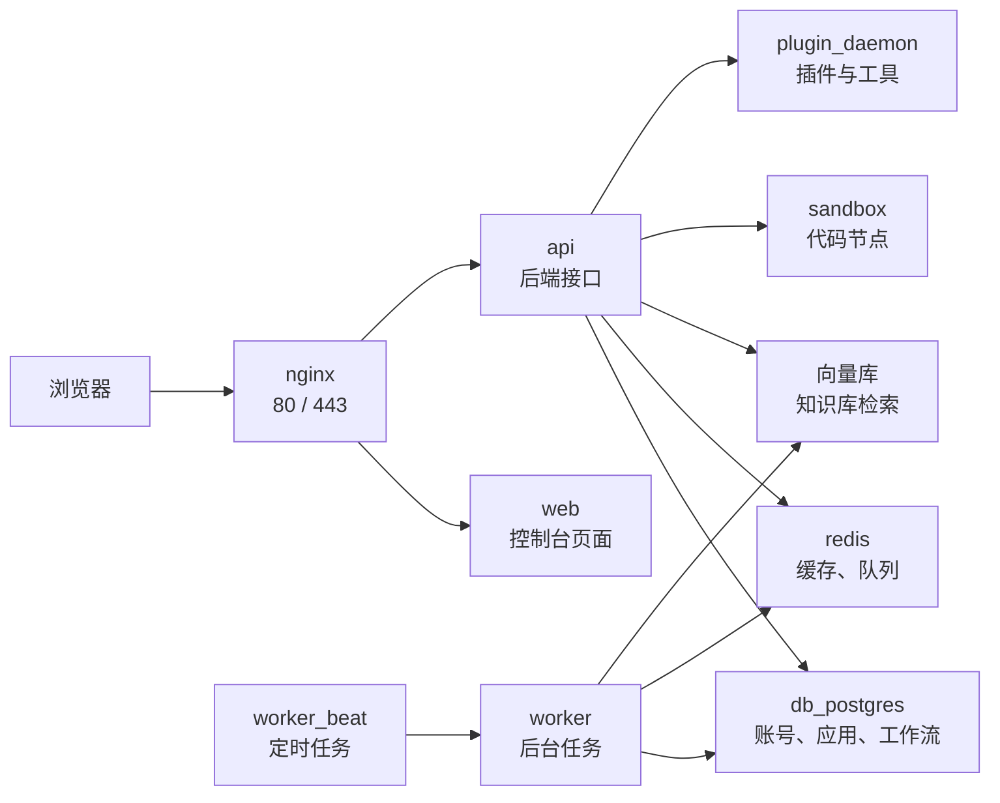

## 5、把 Docker 知识迁移到 Dify 部署结构

Dify 不是一个单进程应用。用 Compose 启动后，你看到的是一组容器在一起工作。

Dify 使用 Docker Compose 启动时，通常会包含 `api`、`worker`、`worker_beat`、`web`、`plugin_daemon` 这些服务，也会启动 `weaviate`、`db_postgres`、`redis`、`nginx`、`ssrf_proxy`、`sandbox` 等依赖组件。不同版本的 service 名、镜像 tag、可选组件可能变化，实际排查时以你本机的 `docker-compose.yaml`、`.env` 和 `docker compose ps` 输出为准。

前面讲过的 Docker 概念，放到 Dify 里大概是这样：

| Docker 概念         | 在 Dify 里的对应物                                                   | 排障时看什么                           |
| ------------------- | -------------------------------------------------------------------- | -------------------------------------- |
| 镜像                | `langgenius/dify-api`、`langgenius/dify-web`、`postgres`、`redis` 等 | `docker images`、`docker compose pull` |
| 容器 / 服务         | `api`、`worker`、`web`、`nginx`、`db_postgres` 等                    | `docker compose ps`、`docker ps`       |
| 端口映射            | `EXPOSE_NGINX_PORT`、`EXPOSE_NGINX_SSL_PORT`                         | `docker compose ps`、`.env`            |
| volume / bind mount | `./volumes/db/data`、`./volumes/app/storage` 等                      | `docker inspect ... Mounts`            |
| 网络                | Compose 自动创建的项目网络、`ssrf_proxy_network` 等                  | 服务名互访、日志里的连接失败           |
| 环境变量            | `.env`、`envs/*.env`                                                 | 数据库、Redis、URL、向量库、密钥配置   |

读 Dify 的 compose 文件，不用从第一行硬读到最后一行。先抓四类信息：

1. **服务**：这套部署启动了哪些容器。
2. **镜像**：哪些服务使用官方镜像，哪些服务可能需要本地构建。
3. **挂载**：数据库、Redis、上传文件、插件、向量库数据保存在哪里。
4. **入口**：浏览器请求从哪个服务和端口进入。

### 5.1 访问链路

先用一张图建立整体印象：



浏览器先访问 `nginx`，再由 `nginx` 转给 `web` 或 `api`。`api` 和 `worker` 再去访问 PostgreSQL、Redis、向量库、sandbox、plugin_daemon。

排障时也按这条链路看：

- 页面完全打不开：先看 `nginx` 和端口映射。
- 页面能打开但接口报错：看 `api`。
- 知识库索引、异步任务不动：看 `worker`。
- 登录、应用、工作流数据异常：看 `db_postgres`。
- 队列、缓存、任务状态异常：看 `redis`。
- 知识库检索异常：看当前启用的向量库。

### 5.2 典型容器分工

| 层次   | 常见服务                                | 主要职责                             |
| ------ | --------------------------------------- | ------------------------------------ |
| 入口层 | `nginx`                                 | 对外提供 80/443 入口，转发到 web/api |
| 应用层 | `web`                                   | Dify 控制台和应用页面                |
| 应用层 | `api`                                   | 后端接口、鉴权、工作流、应用配置等   |
| 应用层 | `api_websocket`                         | 协作、实时通信等可选能力             |
| 任务层 | `worker`                                | 异步任务、知识库索引、队列消费       |
| 任务层 | `worker_beat`                           | 定时任务调度                         |
| 数据层 | `db_postgres` 或其他数据库服务          | 主业务数据库                         |
| 数据层 | `redis`                                 | 缓存、队列、任务中间状态             |
| 向量层 | `weaviate` / `milvus` / `opensearch` 等 | 知识库向量检索，取决于配置           |
| 安全层 | `sandbox`                               | 安全执行代码节点                     |
| 安全层 | `ssrf_proxy`                            | 代理外部访问，降低 SSRF 风险         |
| 插件层 | `plugin_daemon`                         | 插件、工具、模型供应商等扩展能力支撑 |
| 初始化 | `init_permissions`                      | 初始化挂载目录权限，通常执行后退出   |

实际环境中可以用：

```bash
docker compose config --services
docker compose ps
docker ps
```

确认当前版本到底启动了哪些服务。

读官方 compose 时，可以先按这几类服务来理解：

| 服务                                   | 镜像或来源                                | 主要作用                       | 关键挂载 / 端口                                             |
| -------------------------------------- | ----------------------------------------- | ------------------------------ | ----------------------------------------------------------- |
| `nginx`                                | `nginx:latest`                            | 对外入口，转发到 web / api     | `${EXPOSE_NGINX_PORT:-80}`、`${EXPOSE_NGINX_SSL_PORT:-443\}` |
| `web`                                  | `langgenius/dify-web:<version>`           | 前端页面                       | 主要依赖环境变量                                            |
| `api`                                  | `langgenius/dify-api:<version>`           | 后端接口                       | `./volumes/app/storage:/app/api/storage`                    |
| `api_websocket`                        | `langgenius/dify-api:<version>`           | WebSocket / 协作能力，可选启用 | 取决于 `COMPOSE_PROFILES` 和当前版本                        |
| `worker`                               | `langgenius/dify-api:<version>`           | 后台任务、知识库索引、队列消费 | `./volumes/app/storage:/app/api/storage`                    |
| `worker_beat`                          | `langgenius/dify-api:<version>`           | 定时任务调度                   | 主要依赖数据库和 Redis                                      |
| `db_postgres`                          | `postgres:15-alpine`                      | 主业务数据库                   | `./volumes/db/data:/var/lib/postgresql/data`                |
| `db_mysql` / `oceanbase` / `seekdb` 等 | 数据库镜像或外部数据库配置                | 可选数据库后端                 | 取决于当前版本和 `.env` / `envs/` 配置                      |
| `redis`                                | `redis:6-alpine`                          | 缓存、队列、中间状态           | `./volumes/redis/data:/data`                                |
| `sandbox`                              | `langgenius/dify-sandbox:<version>`       | 代码节点隔离执行               | `./volumes/sandbox/...`                                     |
| `plugin_daemon`                        | `langgenius/dify-plugin-daemon:<version>` | 插件服务                       | `./volumes/plugin_daemon:/app/storage`                      |
| `ssrf_proxy`                           | `ubuntu/squid:latest`                     | 外部访问代理与 SSRF 防护       | `ssrf_proxy_network`                                        |
| `weaviate` / `qdrant` / `pgvector` 等  | 向量库镜像                                | 知识库向量检索                 | 对应 `./volumes/<向量库>` 目录                              |

读 compose 文件不是为了记住每一行，而是为了回答三个问题：启动了哪些服务，数据挂载在哪里，外部请求从哪个端口进入。

### 5.3 同一个镜像为什么会起多个容器

Dify 后端常见的 `api`、`worker`、`worker_beat` 可能使用同一个后端镜像，只是启动模式不同：

- `api`：对外提供后端接口。
- `worker`：消费队列并执行后台任务。
- `worker_beat`：负责定时调度。

在官方 compose 里，这几个服务都可能使用 `langgenius/dify-api:<version>`，但通过不同的启动命令或环境变量区分角色。

示意配置：

```yaml
api:
  image: langgenius/dify-api:<version>
  environment:
    MODE: api

worker:
  image: langgenius/dify-api:<version>
  environment:
    MODE: worker

worker_beat:
  image: langgenius/dify-api:<version>
  environment:
    MODE: beat
```

所以看到多个容器对应同一个镜像，不代表哪里配错了。判断职责时，要看 service 名、容器名、日志和环境变量，而不是只看镜像名。

### 5.4 docker 目录

Dify 仓库里的 `docker/` 目录主要是部署配置，不是业务源码本身。常见内容包括：

- `docker-compose.yaml`：服务清单。
- `.env`：部署参数、端口、密钥、数据库连接等。
- `envs/`：按核心服务、数据库、向量库、安全配置等拆分的环境变量文件。
- `nginx/`：入口代理配置模板。
- `volumes/`：部分部署方式下的运行数据和挂载目录。

官方 `docker-compose.yaml` 开头也明确提示：该文件由生成脚本生成，不建议直接手动大改。日常部署优先调整 `.env`；确实需要改 compose 行为时，再考虑 override 或模板层面的改造。

如果 Compose 里使用的是 `image: langgenius/dify-web:<version>` 或 `image: langgenius/dify-api:<version>`，实际运行的是官方已经构建好的镜像，不会自动读取你本地的 `web/` 或 `api/` 源码目录。

只有某个服务配置了 `build:`，例如：

```yaml
services:
  web:
    build:
      context: ../web
```

才表示 Compose 会从本地源码构建镜像。

因此，`docker/` 目录更像部署说明书，不是源码目录。后面第 7.2 小节讲“改前端不生效”，原因也在这里：你改了本地源码，但容器可能仍在运行官方镜像。

### 5.5 数据存储位置

看到这里，重点已经从“容器怎么启动”变成了“数据在哪里”。Dify 的容器可以重建，数据库、向量库、上传文件不能随便丢。

确认 Dify 数据位置时，优先看 Compose 中的挂载配置，而不是直接进容器翻文件。

Dify 的关键数据通常包括：

| 数据类型                   | 常见服务                          | 常见位置                                                   |
| -------------------------- | --------------------------------- | ---------------------------------------------------------- |
| 账号、应用、工作流、配置   | PostgreSQL                        | `./volumes/db/data` 或 named volume                        |
| 缓存、队列状态             | Redis                             | `./volumes/redis/data` 或 named volume                     |
| 知识库向量数据             | Weaviate / Milvus / OpenSearch 等 | `./volumes/weaviate` 或对应 volume                         |
| 用户上传文件、应用运行文件 | API / Worker                      | `./volumes/app/storage`                                    |
| 插件数据                   | plugin_daemon                     | `./volumes/plugin_daemon`                                  |
| 代码节点依赖和配置         | sandbox                           | `./volumes/sandbox/dependencies`、`./volumes/sandbox/conf` |
| Nginx 运行配置或证书       | nginx                             | `./nginx`、`./volumes/nginx`                               |
| HTTPS 证书申请数据         | certbot                           | `./volumes/certbot/...`                                    |

具体路径以当前版本的 `docker-compose.yaml` 为准。要确认一个容器实际挂了什么目录，可以执行：

```bash
docker inspect <容器名> --format '{{json .Mounts}}'
```

例如查看 PostgreSQL：

```bash
docker inspect docker-db_postgres-1 --format '{{json .Mounts}}'
```

如果容器名不一致，先用 `docker ps` 看 NAMES 列，再替换命令里的容器名。

判断数据位置时，优先相信 `docker-compose.yaml` 和 `docker inspect`，不要只看文件夹名字。有些版本使用 `./volumes/...`，有些环境使用 Docker named volume，路径表现会不同。

### 5.6 删除容器会不会丢数据

通常不会。前提是数据已经通过 volume 或宿主机目录挂载出来。

危险操作主要是这些：

```bash
docker compose down -v
docker volume rm <volume名>
docker volume prune
rm -rf ./volumes
```

这些操作可能删除真实数据。升级、迁移和清理环境前，先确认 volume 和挂载目录，再备份。

本地测试环境里，清空 volume 有时是为了重新来一遍；服务器或生产环境里，它通常就是高风险操作。看到 `-v`、`volume rm`、`prune`、`rm -rf`，都应该先停一下确认。

`docker compose down` 默认不删数据，但升级过程可能执行数据库 migration，改表结构或写入新数据。升级中途失败时，volume 可能还在，但里面的数据已经处于半升级状态。

所以升级前必须做逻辑备份，例如用 `pg_dump` 导出 PostgreSQL 数据。备份文件和 volume 不是一回事：

- Volume：数据库原始数据目录。
- `pg_dump`：可恢复、可迁移的 SQL 备份。

建议保留 volume，但不要只依赖 volume；先导出 SQL 备份，再启动新版本。这样即使 migration 失败，也还有一条可恢复路径。
