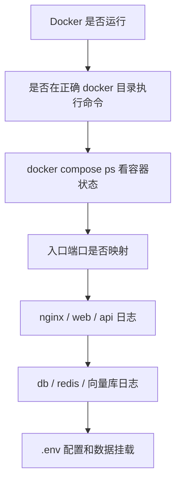

## 6、Dify 排障：状态、日志、数据与数据库连接

Dify 排障别一上来就改 `.env`，也别一上来就重装。先判断问题发生在哪一层，再看对应日志。

| 现象                 | 优先检查                                        | 常用命令                                            |
| -------------------- | ----------------------------------------------- | --------------------------------------------------- |
| 浏览器完全打不开     | Docker 是否运行、`nginx` 是否启动、端口是否映射 | `docker compose ps`、`docker compose logs -f nginx` |
| 页面能打开但接口报错 | `api` 日志、数据库和 Redis 连接                 | `docker compose logs -f api`                        |
| 知识库索引卡住       | `worker`、向量库、Redis                         | `docker compose logs -f worker`                     |
| 升级后进入初始化页   | PostgreSQL 是否读到旧数据、volume 是否变了      | `psql` 查询、`docker inspect ... Mounts`            |
| 数据库工具连不上     | 端口映射、SSH 隧道、数据库账号密码              | `docker ps`、`ssh -L ...`                           |

### 6.1 常见排障路径

遇到 Dify 无法访问时，建议按下面的链路排查：



这个顺序是为了把问题分层定位：先排 Docker 和目录问题，再看容器、网络、日志，最后再进入 Dify 配置和数据。

### 6.2 页面无法访问

先执行：

```bash
docker compose ps
docker ps
docker compose logs -f nginx
docker compose logs -f web
docker compose logs -f api
```

重点看：

- `nginx` 是否运行。
- `web` 和 `api` 是否运行。
- `nginx` 是否映射了你访问的端口，例如 `80:80`、`8080:80`。
- `.env` 中端口、域名、URL 配置是否和访问地址一致。
- 本机防火墙、代理、端口占用是否影响访问。

如果 `nginx` 没起来，先看入口层；如果 `nginx` 正常但接口报错，继续看 `api`；如果 `api` 连不上依赖，再看数据库、Redis、向量库。`.env` 建议在日志已经指向配置问题时再修改。

### 6.3 容器启动失败或重启循环

先找具体失败服务：

```bash
docker compose ps
```

再看日志：

```bash
docker compose logs -f <服务名>
```

例如：

```bash
docker compose logs -f api
docker compose logs -f worker
docker compose logs -f db_postgres
docker compose logs -f redis
```

常见原因：

- `.env` 缺少变量或变量不兼容当前版本。
- 数据库、Redis、向量库还没准备好。
- 端口被占用。
- 镜像没拉完整。
- 旧版本数据和新版本 migration 不兼容。

日志里先找第一条关键错误，不要只看最后一行。有些容器会因为前面的配置或连接错误反复重启，最后一行只是“进程退出”。

### 6.4 升级后进入初始化页面

如果升级后页面进入初始化安装页，通常说明新环境没有读到旧数据库。

这类页面不是“正常升级完成”，而是新环境像第一次安装一样重新进入了初始化流程：


也可能在浏览器里看到安装/初始化入口。出现这种情况时，不要急着重新初始化，先检查旧数据库是否还在：


先查 PostgreSQL 里是否有用户表数据：

```bash
docker exec -it docker-db_postgres-1 psql -U postgres -d dify -c "select count(*) as users_count from account;"
```


如果用户表有记录，说明数据库里仍有旧数据；如果为 0 或表不存在，需要继续查库名和挂载。

如果容器名或数据库名不同，以你的 `docker ps` 和 `\l` 输出为准。

继续查当前数据库容器挂载了哪个 volume：

```bash
docker inspect docker-db_postgres-1 --format '{{json .Mounts}}'
docker volume ls
```

`docker volume ls` 可以帮助确认当前环境里有哪些 Docker 管理的数据卷：


`docker inspect` 的 Mounts 字段能看到数据库容器实际挂载到了哪里：


常见原因：

- 新版本 Compose 创建了新的 volume。
- `.env` 中数据库 service 名或 profile 没同步。
- 旧数据还在旧目录或旧 volume，但新容器没有挂载到那里。
- 需要从升级前备份的 SQL 文件导入。

这一类问题通常不在页面，而在于“新容器没有读到旧数据库”。排查时重点看数据库库名、volume 名、挂载路径和 `.env` 的数据库配置。

### 6.5 用 Navicat 连接 Dify 数据库

不要直接修改数据库文件目录。`docker/volumes/db/data` 这类目录是 PostgreSQL 的底层数据文件，不是给 Navicat 直接打开的。

要管理数据库，应该通过 PostgreSQL 协议连接。

本节只讨论如何通过 PostgreSQL 协议安全连接数据库。生产环境中，改表、删数据、批量更新前都应先备份，并确认影响范围。

**本地开发环境：暴露端口**

如果只是本地学习，可以在 Compose 中给 PostgreSQL 暴露端口，例如：

```yaml
services:
  db_postgres:
    ports:
      - "5432:5432"
```

然后重启数据库服务：

```bash
docker compose up -d db_postgres
```

Navicat 连接参数通常类似：

| 参数     | 示例                  |
| -------- | --------------------- |
| Host     | `127.0.0.1`           |
| Port     | `5432`                |
| User     | `.env` 中的数据库用户 |
| Password | `.env` 中的数据库密码 |
| Database | `dify`                |

注意：生产环境不要把 5432 直接暴露到公网。

本地学习时暴露 `5432:5432` 没问题，因为访问范围通常只在你自己的电脑上。服务器环境要多考虑安全组、防火墙、数据库弱口令和公网扫描。

**服务器环境：优先用 SSH 隧道**

服务器环境里，更推荐让数据库只在服务器内部访问，然后用 SSH 隧道把本机端口转发过去。

思路是：

```text
Navicat 本机端口
  -> SSH 隧道
  -> 服务器
  -> PostgreSQL 容器或宿主机映射端口
```

示例：

```bash
ssh -L 15432:127.0.0.1:5432 user@your-server
```

然后 Navicat 连：

| 参数     | 示例                  |
| -------- | --------------------- |
| Host     | `127.0.0.1`           |
| Port     | `15432`               |
| User     | `.env` 中的数据库用户 |
| Password | `.env` 中的数据库密码 |
| Database | `dify`                |

如果数据库端口没有映射到宿主机，而只在容器网络里可见，需要先确认容器 IP 或临时使用跳板方式。生产环境建议由运维统一配置安全访问方式。

有些团队会用堡垒机、VPN、内网跳板或云厂商数据库访问策略来做这件事。课程里给的是通用思路，实际生产环境要服从团队的安全规范。

**Mac + SSH 隧道连接服务器 PostgreSQL**

下面是一条更贴近实操的路径：本机用 Navicat，数据库仍留在服务器 Docker 内部网络里，不把 5432 暴露到公网。

先在服务器上确认 Postgres 容器 IP：

```bash
docker inspect -f '{{range .NetworkSettings.Networks}}{{.IPAddress}}{{end}}' docker-db_postgres-1
```

假设输出为 `172.20.0.4`，后面 SSH 隧道就转发到这个容器 IP。

在 Mac 本地保存服务器私钥，例如：


```bash
nano ~/.ssh/aliyun_navicat.pem
chmod 600 ~/.ssh/aliyun_navicat.pem
```

然后建立隧道：

```bash
ssh -i ~/.ssh/aliyun_navicat.pem \
  -N \
  -L 15432:172.20.0.4:5432 \
  root@your-server-ip
```

这个终端窗口需要保持打开。关闭窗口，隧道就断开。


Navicat 里不要再勾选 SSH 选项，因为隧道已经由命令行建好了。它只需要连接本机端口：


常见填写方式：

| 参数     | 示例                  |
| -------- | --------------------- |
| Host     | `127.0.0.1`           |
| Port     | `15432`               |
| User     | `.env` 中的数据库用户 |
| Password | `.env` 中的数据库密码 |
| Database | `dify`                |

连接成功后，就可以像普通 PostgreSQL 一样查看 Dify 表结构和数据：


生产环境里，查看表结构通常没问题；如果要改数据、删数据或批量更新，先备份，再确认影响范围。
