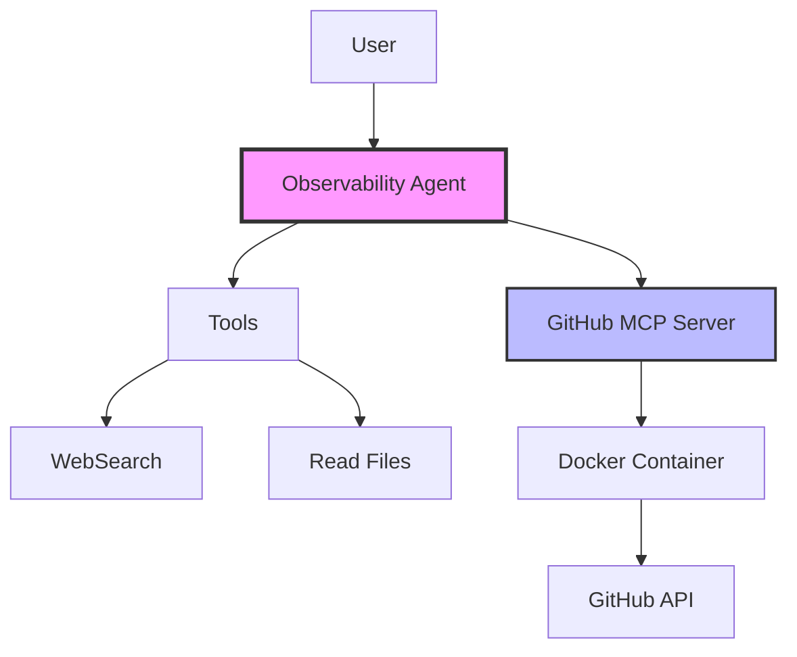
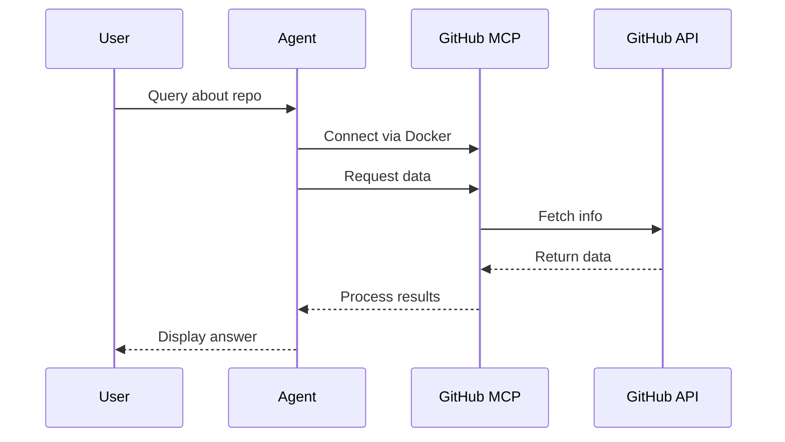

# Observability Agent Architecture

```mermaid
graph TD
    User[User] --> Agent[Observability Agent]
    Agent --> GitHub[GitHub MCP Server]

    Agent --> Tools[Tools]
    Tools --> WebSearch[WebSearch]
    Tools --> Read[Read Files]

    GitHub --> Docker[Docker Container]
    Docker --> API[GitHub API]

    style Agent fill:#f9f,stroke:#333,stroke-width:3px
    style GitHub fill:#bbf,stroke:#333,stroke-width:2px
```

# Communication Flow Diagram

```mermaid
sequenceDiagram
    participant User
    participant Agent
    participant MCP as GitHub MCP
    participant API as GitHub API

    User->>Agent: Query about repo
    Agent->>MCP: Connect via Docker
    Agent->>MCP: Request data
    MCP->>API: Fetch info
    API-->>MCP: Return data
    MCP-->>Agent: Process results
    Agent-->>User: Display answer
```
