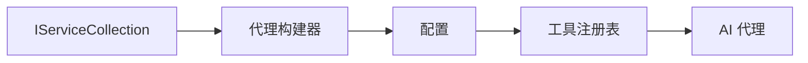

# 🎨 使用 Azure OpenAI （Responses API） 的智能代理设计模式（.NET）

## 📋 学习目标

本示例演示了使用 .NET 中的 Microsoft Agent Framework 结合 Azure OpenAI （Responses API）集成构建智能代理的企业级设计模式。您将学习专业的模式和架构方法，使代理具备生产准备、易维护和可扩展的能力。

### 企业设计模式

- 🏭 <strong>工厂模式</strong>：使用依赖注入实现标准化的代理创建
- 🔧 <strong>生成器模式</strong>：流畅的代理配置与设置
- 🧵 <strong>线程安全模式</strong>：并发对话管理
- 📋 <strong>仓储模式</strong>：有序的工具和能力管理

## 🎯 .NET 特定的架构优势

### 企业功能

- <strong>强类型</strong>：编译时验证与智能感知支持
- <strong>依赖注入</strong>：内置 DI 容器集成
- <strong>配置管理</strong>：IConfiguration 和选项模式
- **异步/等待**：一流的异步编程支持

### 生产就绪模式

- <strong>日志集成</strong>：ILogger 与结构化日志支持
- <strong>健康检查</strong>：内置监控与诊断
- <strong>配置验证</strong>：带数据注解的强类型
- <strong>错误处理</strong>：结构化异常管理

## 🔧 技术架构

### 核心 .NET 组件

- **Microsoft.Extensions.AI**：统一的 AI 服务抽象
- **Microsoft.Agents.AI**：企业级代理编排框架
- **Azure OpenAI（Responses API）**：高性能 API 客户端模式
- <strong>配置系统</strong>：appsettings.json 和环境集成

### 设计模式实现



## 🏗️ 展示的企业模式

### 1. <strong>创建型模式</strong>

- <strong>代理工厂</strong>：集中式代理创建及一致配置
- <strong>生成器模式</strong>：复杂代理配置的流式 API
- <strong>单例模式</strong>：共享资源与配置管理
- <strong>依赖注入</strong>：松耦合与易测试

### 2. <strong>行为型模式</strong>

- <strong>策略模式</strong>：可替换的工具执行策略
- <strong>命令模式</strong>：封装的代理操作支持撤销/重做
- <strong>观察者模式</strong>：事件驱动的代理生命周期管理
- <strong>模板方法</strong>：标准化代理执行工作流

### 3. <strong>结构型模式</strong>

- <strong>适配器模式</strong>：Azure OpenAI（Responses API）集成层
- <strong>装饰器模式</strong>：增强代理能力
- <strong>外观模式</strong>：简化代理交互接口
- <strong>代理模式</strong>：延迟加载与缓存以提升性能

## 📚 .NET 设计原则

### SOLID 原则

- <strong>单一职责</strong>：每个组件只有一个明确职责
- <strong>开闭原则</strong>：可扩展而无需修改
- <strong>里氏替换</strong>：基于接口的工具实现
- <strong>接口隔离</strong>：专注且内聚的接口
- <strong>依赖倒置</strong>：依赖抽象而非具体实现

### 清晰架构

- <strong>领域层</strong>：核心代理和工具抽象
- <strong>应用层</strong>：代理编排与工作流
- <strong>基础设施层</strong>：Azure OpenAI（Responses API）集成及外部服务
- <strong>表现层</strong>：用户交互和响应格式化

## 🔒 企业级注意事项

### 安全性

- <strong>凭证管理</strong>：使用 IConfiguration 安全处理 API 密钥
- <strong>输入验证</strong>：强类型与数据注解验证
- <strong>输出净化</strong>：安全的响应处理与过滤
- <strong>审计日志</strong>：全面的操作跟踪

### 性能

- <strong>异步模式</strong>：非阻塞 I/O 操作
- <strong>连接池</strong>：高效的 HTTP 客户端管理
- <strong>缓存</strong>：响应缓存以提升性能
- <strong>资源管理</strong>：合适的释放与清理模式

### 可扩展性

- <strong>线程安全</strong>：支持并发代理执行
- <strong>资源池</strong>：高效利用资源
- <strong>负载管理</strong>：限流与背压处理
- <strong>监控</strong>：性能指标与健康检查

## 🚀 生产部署

- <strong>配置管理</strong>：环境特定设置
- <strong>日志策略</strong>：带关联 ID 的结构化日志
- <strong>错误处理</strong>：全局异常处理与合适的恢复
- <strong>监控</strong>：应用洞察与性能计数器
- <strong>测试</strong>：单元测试、集成测试和负载测试模式

准备好用 .NET 构建企业级智能代理了吗？让我们共同设计一个强健的架构！🏢✨

## 🚀 入门指南

### 前置条件

- [.NET 10 SDK](https://dotnet.microsoft.com/download/dotnet/10.0) 或更高版本
- 拥有一个带有 Azure OpenAI 资源和模型部署的 [Azure 订阅](https://azure.microsoft.com/free/)
- 安装 [Azure CLI](https://learn.microsoft.com/cli/azure/install-azure-cli) — 使用 `az login` 登录

### 必需的环境变量

```bash
# zsh/bash
