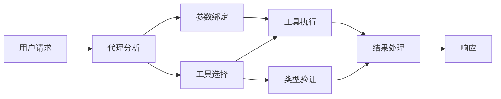

# 🛠️ 使用 Azure OpenAI（Responses API）进行高级工具使用 (.NET)

## 📋 学习目标

本笔记本演示了在 .NET 中使用 Microsoft Agent Framework 和 Azure OpenAI（Responses API）实现企业级工具集成模式。您将学习如何使用多种专业工具构建复杂的代理，利用 C# 的强类型和 .NET 的企业特性。

### 您将掌握的高级工具能力

- 🔧 <strong>多工具架构</strong>：构建具有多种专业能力的代理
- 🎯 <strong>类型安全的工具执行</strong>：利用 C# 的编译时验证
- 📊 <strong>企业级工具模式</strong>：生产准备的工具设计和错误处理
- 🔗 <strong>工具组合</strong>：组合工具以实现复杂业务流程

## 🎯 .NET 工具架构优势

### 企业级工具特性

- <strong>编译时验证</strong>：强类型确保工具参数正确性
- <strong>依赖注入</strong>：IoC 容器集成实现工具管理
- **异步/等待模式**：非阻塞工具执行及资源管理
- <strong>结构化日志</strong>：内置日志集成用于工具执行监控

### 生产就绪模式

- <strong>异常处理</strong>：带类型异常的全面错误管理
- <strong>资源管理</strong>：规范释放模式和内存管理
- <strong>性能监测</strong>：内置指标和性能计数器
- <strong>配置管理</strong>：带验证的类型安全配置

## 🔧 技术架构

### 核心 .NET 工具组件

- **Microsoft.Extensions.AI**：统一的工具抽象层
- **Microsoft.Agents.AI**：企业级工具编排
- **Azure OpenAI（Responses API）**：高性能 API 客户端，支持连接池

### 工具执行管道



## 🛠️ 工具类别和模式

### 1. <strong>数据处理工具</strong>

- <strong>输入验证</strong>：带数据注解的强类型
- <strong>转换操作</strong>：类型安全的数据转换与格式化
- <strong>业务逻辑</strong>：领域特定的计算与分析工具
- <strong>输出格式化</strong>：结构化响应生成

### 2. <strong>集成工具</strong>

- **API 连接器**：使用 HttpClient 进行 RESTful 服务集成
- <strong>数据库工具</strong>：使用 Entity Framework 进行数据访问
- <strong>文件操作</strong>：带验证的安全文件系统操作
- <strong>外部服务</strong>：第三方服务集成模式

### 3. <strong>通用工具</strong>

- <strong>文本处理</strong>：字符串操作与格式化工具
- **日期/时间操作**：文化感知的日期/时间计算
- <strong>数学工具</strong>：精确计算与统计操作
- <strong>验证工具</strong>：业务规则验证与数据校验

准备好在 .NET 中构建具有强大类型安全工具能力的企业级代理了吗？让我们一起设计专业级解决方案！🏢⚡

## 🚀 快速开始

### 前置条件

- [.NET 10 SDK](https://dotnet.microsoft.com/download/dotnet/10.0) 或更高版本
- 一个包含 Azure OpenAI 资源及模型部署的 [Azure 订阅](https://azure.microsoft.com/free/)
- [Azure CLI](https://learn.microsoft.com/cli/azure/install-azure-cli) —— 使用 `az login` 登录

### 必需的环境变量

```bash
# zsh/bash
