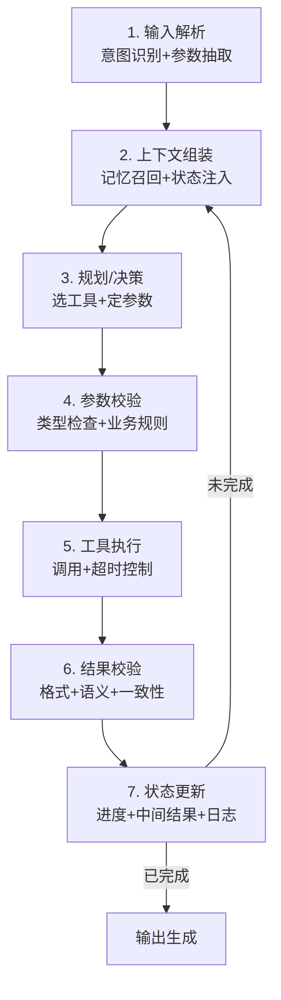
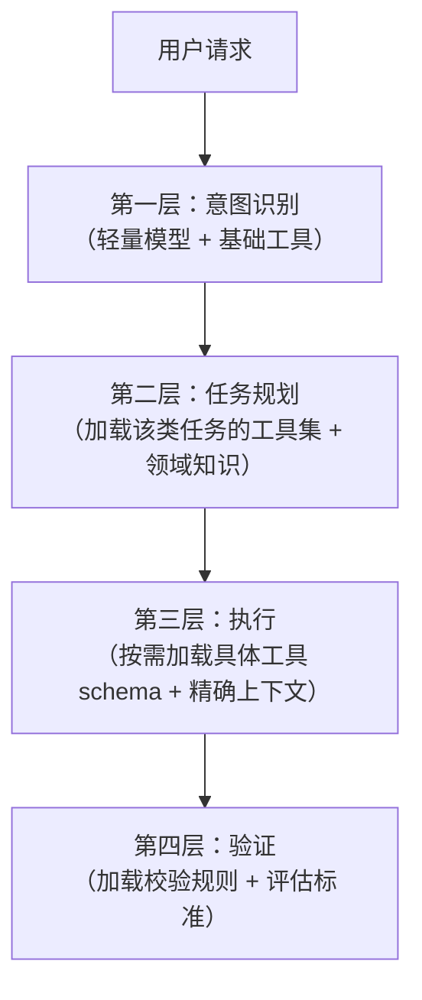
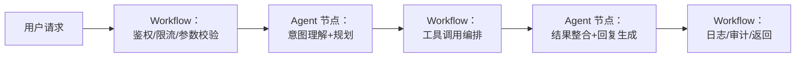

## 系统设计原则与模式

### Q：什么时候该做 Agent？和 Workflow 的边界在哪？

> 来源：Agent 开发面试 30 题 【小红书 Rednote AI Native 一面追问：大模型与工作流如何权衡、固定流程为何仍用 Agent】【广报 Agent 开发追问：没有长期记忆或不完全自主是否仍算 Agent】【阿里 Agent Infra 一面题库同题】【[虾皮Agent一面](https://www.nowcoder.com/feed/main/detail/409dc8793a7b450eb51ee32c2b923d49)追问：Agent 是人工触发任务吗？整体工作流程是否固定？】

**新手答**：“需求复杂就用 Agent，简单就用 Workflow。”

**高手答**：

判断标准不是“复杂不复杂”，而是**决策路径是否在设计时可穷举**：

| 类型 | 特征 | 适合方案 |
|------|------|---------|
| 所有分支可预知 | 审批流、ETL 管线 | Workflow / 后端服务 |
| 分支可预知但语言理解复杂 | 客服分流、意图提取 | Prompt 链 |
| 分支不可穷举，需运行时决策 | 开放问答、自主任务执行 | Agent |

不要把“有长期记忆”或“完全自主”当成 Agent 的硬门槛。Agent 的最小必要特征是：**围绕目标，根据运行时观察决定下一步动作或工具**。记忆、长期规划、反思、多 Agent 协作都属于可选增强；一个无长期记忆、只在受限工具集里做两三步决策的系统，仍然可以是 Agent。

因此 Workflow 和 Agent 更像一条连续谱，而不是非黑即白的分类：`固定代码流程 → 含 LLM 判断节点的 Workflow → 在边界内自主规划的 Agent → 高自主长周期 Agent`。越往右，开放决策越多，同时评测、权限、预算和人工门禁也要越强。选型时应先确定需要开放到哪一级，再补相应治理能力，而不是为了“像 Agent”而追求记忆或全自动。

更精确的判断框架：

1. **决策维度是否开放**：用户输入只需分成有限几类去处理 → Workflow。用户可能提出任何要求，且处理路径取决于中间结果 → Agent
2. **是否需要运行时工具选择**：处理流程固定（先查数据库 → 再格式化 → 返回）→ Workflow。“查什么、用什么工具”要根据当前情况判断 → Agent
3. **是否需要自我修正**：Workflow 出错只能按预设路径降级。Agent 能根据错误原因调整策略——这是核心区别

**Agent 和 Workflow 的本质区别**：Workflow 是“编排”——设计者画好流程图，系统按图执行。Agent 是“委托”——给一个目标，让系统自己决定怎么达成。Workflow 的确定性更高，Agent 的灵活性更高。

大部分真实需求的答案是：**用 Workflow 做主干流程控制，在需要灵活判断的节点嵌入 Agent**。纯 Agent 系统太不可控，纯 Workflow 系统太僵化。

**差距在哪**：新手用“复杂度”做判断，但复杂的 ETL 也可以是 Workflow。高手用“决策路径可否穷举”这个精确标准，且给出了三个具体判断维度和两者的本质区别。面试官考的是你选方案时有没有明确的决策框架。

---

### Q：生产级 Agent 的执行循环包含哪些阶段？哪些必须显式状态化？

> 来源：Agent 开发面试 30 题【阿里 Agent Infra 一面题库追问：Agent Loop】【[字节中国交易与广告 AI 应用开发一面](https://www.nowcoder.com/feed/main/detail/b34f6902e8544fe2953696ed52e49dba)同题】【[蚂蚁 Agent 开发一面](https://www.nowcoder.com/feed/main/detail/39451cad5d2245b491d16778f2a9ca01)同题】

**新手答**：“就是思考 → 行动 → 观察的循环。”

**高手答**：

ReAct 的“思考 → 行动 → 观察”只是学术简化。生产级 Agent 的执行循环至少包含**七个阶段**：



**哪些必须显式状态化**（不能靠模型上下文承载）：

| 必须状态化的 | 原因 |
|------------|------|
| 当前执行阶段 | 断点恢复、异常重入 |
| 已完成步骤和结果 | 防止重复执行 |
| 累计 token / 调用次数 | 成本控制和熔断 |
| 失败次数和失败原因 | 决定重试/降级/终止 |
| 用户确认的关键约束 | 防止被后续上下文淹没 |

**不需要状态化的**：模型的中间推理过程、工具返回的原始 JSON（提取关键字段后可丢弃）。

核心认知：**学术论文里的 Agent 循环是三步（think-act-observe），生产级的是七步，多出来的四步（输入解析、参数校验、结果校验、状态更新）全是工程防线**。没有这四步，Agent 能跑 Demo 但上不了生产。

**差距在哪**：新手只知道 ReAct 三步循环。高手展示了生产级的七阶段循环，且明确了哪些状态必须显式持久化——这是“做过”和“听过”的本质区别。面试官考的是你对生产级 Agent 工程化的理解深度。

---

### Q：设计一个 AI Agent 爬取短视频平台内容，如何设计？

> 来源：字节 Agent 实习一面

**新手答**：“写个爬虫脚本，调 API 下载视频。”

**高手答**：

这道题考的不是爬虫技术，而是**如何用 Agent 架构解决一个复杂的端到端任务**。系统设计分四层：

**1. 任务规划层**：

- Agent 接收用户需求（如“爬取某话题下的热门视频及评论”），先做任务分解：
  - 目标页面发现 → 内容抓取 → 数据解析 → 结构化存储
- 每个子任务可能需要不同工具，规划器负责编排执行顺序和依赖关系

**2. 工具执行层**：

| 工具 | 职责 | 技术选型 |
|------|------|---------|
| 浏览器工具 | 模拟用户浏览、滚动加载、点击交互 | Playwright / Selenium |
| API 探测工具 | 抓包分析移动端 API，直接请求数据接口 | mitmproxy + requests |
| 多模态解析工具 | 视频转文字、封面 OCR、音频转录 | Whisper、PaddleOCR |
| 存储工具 | 结构化存储爬取结果 | MongoDB / S3 |

**3. 反爬对抗层**（这是核心难点）：

- **请求频率控制**：Agent 需要感知限流信号（429 状态码、验证码），自动降频或切换策略
- **身份伪装**：UA 轮换、Cookie 池、代理 IP 池。Agent 根据被封情况动态调整
- **动态渲染**：很多内容是 JS 动态加载的，需要无头浏览器渲染后再抓取
- **失败恢复**：Agent 记录爬取进度，断点续爬，不因单次失败丢失已有成果

**4. 数据质量层**：

- 去重：相同视频不同入口可能重复，按 video_id 去重
- 校验：检查视频是否下载完整、元信息是否齐全
- 合规：过滤违规内容，遵守 robots.txt 和平台 ToS

**关键设计决策**：优先走 API 接口（速度快、结构化好），API 被封时降级到浏览器模拟（慢但稳）。Agent 的价值在于**能根据反爬反馈自适应切换策略**，而不是写死一套流程。

**差距在哪**：新手只想到写爬虫脚本。高手把问题转化成一个 Agent 系统设计——任务规划、工具编排、反爬对抗、数据质量四层架构。面试官考的是你能不能用 Agent 的思维方式（规划 + 工具 + 自适应）解决一个复杂的端到端工程问题。

---

### Q：现在的 Agent 架构和之前有什么本质不同？渐进式披露是什么思路？

> 来源：蚂蚁集团 Agent 开发二面【[上海某量化开发 一面](https://www.nowcoder.com/feed/main/detail/87319d167f494d28a361ffd4a0215e06)追问：老架构有什么问题，新架构如何解决？】

**新手答**：“现在用更强的模型了。”

**高手答**：

Agent 架构正在经历从**“一次性全量加载”到“渐进式按需披露”**的范式转变。

**之前的架构思路——全量预加载**：

系统启动时就把所有工具、所有知识、所有规则一次性塞进上下文。Agent 拿到全部信息后做决策。

问题：① 上下文爆炸——100 个工具的 schema 占掉大半窗口；② 信息干扰——和当前任务无关的工具描述反而影响模型判断；③ 不可扩展——工具或知识增长后系统无法线性扩展。

**现在的架构思路——渐进式披露（Progressive Disclosure）**：

不预加载所有信息，而是**根据任务进展逐步暴露相关能力**。Agent 在每个阶段只看到当前阶段需要的工具、知识和规则：



**关键设计原则**：

1. **按需加载工具**：不是一次性给模型 100 个工具，而是先给 5-8 个工具大类，选中大类后再展开具体工具
2. **上下文随阶段演化**：规划阶段看全局信息，执行阶段只看当前步骤的精确上下文，验证阶段切换到评估视角
3. **能力逐级升级**：简单请求用小模型 + 少量工具处理；判断需要更强能力时才升级到大模型 + 完整工具集

**和传统分层架构的区别**：传统分层是静态的——每层负责什么在设计时就定死了。渐进式披露是动态的——**每层暴露什么取决于运行时的任务状态**。同一个请求，在不同执行阶段看到的“系统”是不一样的。

这也是为什么上下文工程成为 2026 年 Agent 开发的核心挑战——不是“怎么把信息塞进去”，而是“怎么在正确的时机给出正确的信息”。

**差距在哪**：新手只看到了模型变化。高手理解了架构范式的本质转变——从全量预加载到渐进式按需披露。面试官考的是你对 Agent 架构演进方向的认知，以及你理不理解“上下文不是越多越好”这个核心洞察。

---

### Q：为什么很多团队做到最后是“Workflow + Agent 节点”的混合架构？

> 来源：Agent 开发面试 30 题

**新手答**：“因为纯 Agent 不够稳定。”

**高手答**：

不是 Agent“不够好”，是**不同环节对确定性的要求不同**。一个完整的业务流程里，80% 的步骤是确定性的（权限校验、数据查询、格式转换），只有 20% 需要智能判断（意图理解、方案推荐、自然语言生成）。

如果全用 Agent：
- 确定性步骤被模型处理 → 偶尔出错，不如规则可靠
- 成本翻倍 → 每个确定性步骤都消耗 token，毫无必要
- 可测试性差 → 模型输出概率性的，同样输入不一定同样输出



混合架构的原则是：**确定性环节用 Workflow（可靠、可测、低成本），不确定性环节用 Agent（灵活、智能）**。Agent 节点像状态机里的“智能节点”——系统控制它何时被调用、输入什么、输出约束是什么，但节点内部允许模型自由推理。

这也解释了为什么纯 Agent 创业项目容易死——不是技术不行，是把本该确定性处理的东西也交给了模型，导致系统整体可靠性无法保证。

**差距在哪**：新手只说了“不稳定”。高手分析了根因——不同环节对确定性的要求不同，且给出了 80/20 的量化认知和混合架构的设计原则。面试官考的是你有没有把 Agent 从 Demo 推到生产的实战认知。

---

### Q：Agent 系统里，模型和系统代码的职责边界怎么划？

> 来源：Agent 开发面试 30 题

**新手答**：“模型负责思考，代码负责执行。”

**高手答**：

方向对但太粗。精确的边界划分：

**模型负责的**（需要语言理解/生成/推理的）：
- 意图识别：理解用户到底想做什么
- 参数抽取：从自然语言中提取结构化参数
- 方案选择：在多个可行路径中选最优的
- 内容生成：自然语言回复、代码、摘要

**系统代码负责的**（需要确定性保证的）：
- 流程控制：任务状态机、步骤编排、超时管理
- 参数校验：类型检查、范围约束、必填项检查
- 权限管控：工具访问控制、操作审批
- 状态持久化：中间结果存储、断点恢复
- 安全兜底：输出过滤、敏感信息脱敏、成本熔断

**核心原则：永远不要让模型做它不擅长的事——精确计算、状态维护、流程控制、安全决策**。

一个简单的验证标准：如果这个环节出错后果严重且不可接受 → 系统代码负责。如果这个环节出错可以通过重试/降级补救 → 可以交给模型。

**差距在哪**：新手的“思考 vs 执行”太笼统。高手把两者的职责列表拉出来对比，且给出了一个实用的验证标准（出错后果是否可接受）。面试官考的是你能不能精确划分系统设计中的职责边界。

---

### Q：如果面试官说“Agent 本质上就是套壳调用工具”，你怎么反驳？

> 来源：Agent 开发面试 30 题

**新手答**：“不是套壳，Agent 更智能。”

**高手答**：

这句话的逻辑类似于说“操作系统就是套壳调硬件”——技术上没错，但忽略了**中间层的价值**。

“套壳调工具”只描述了 Agent 的最表层行为（接收输入 → 调工具 → 返回结果），但 Agent 的核心价值在于三个“套壳”做不到的能力：

1. **动态规划**：不是“收到请求 → 调固定工具 → 返回”，而是“理解意图 → 拆解任务 → 根据中间结果动态选择下一步”。一个订机票的 Agent 可能需要先查航班 → 发现满了 → 改查临近日期 → 发现价格高 → 问用户是否接受 → 最终下单。这个决策链在设计时不可穷举
2. **自我修正**：调工具失败后不是报错，而是分析失败原因、换一个工具或调整参数重试。这种“错了知道怎么补救”的能力是纯工具链做不到的
3. **上下文推理**：能把多轮对话、用户画像、当前任务状态综合起来做决策，而不是每次请求都是无状态的

API Wrapper 是确定性的——同样输入永远同样输出。Agent 是概率性的但有推理能力——面对未见过的输入也能给出合理响应。这个区别就像“if-else 路由器”和“有经验的客服”的区别。

**差距在哪**：新手的反驳苍白无力。高手从动态规划、自我修正、上下文推理三个具体能力点说明 Agent 不是“套壳”，且用“操作系统 vs 硬件”类比让论证更有力。面试官用这种挑衅式问题考的是你对 Agent 的理解有多深。

---

### Q：什么样的任务适合先全局规划再执行，什么样的任务更适合边走边决策？

> 来源：Agent 开发面试 30 题

**新手答**：“简单任务边走边做，复杂任务先规划。”

**高手答**：

不是“简单 vs 复杂”，而是**任务的信息完备度和可预测性**：

**适合先规划再执行（Plan-and-Execute）**：
- 任务目标明确、步骤可预知：日报生成、数据 ETL、固定流程的表单填写
- 所有需要的信息在开始时就已具备
- 步骤之间有强依赖，必须按顺序执行
- 关键特征：**开始时就能画出完整的流程图**

**适合边走边决策（ReAct）**：
- 下一步取决于上一步的结果：故障诊断、信息调研、开放式对话
- 用户可能随时改变需求
- 中间步骤可能失败，需要动态调整路线
- 关键特征：**开始时画不出完整流程图，因为分支取决于运行时的数据**

**混合策略**（实际生产中最常见）：先做一次粗粒度规划（定义 3-5 个阶段目标），每个阶段内部用 ReAct 灵活执行。阶段目标变化时才触发重规划，不是每步都重规划。

```text
粗规划：信息收集 → 方案对比 → 用户确认 → 执行操作
每个阶段内部：ReAct（边做边调整）
重规划触发：用户改需求 / 关键前提失效 / 连续失败
```

**差距在哪**：新手用“简单 vs 复杂”做判断——但“简单”的信息调研可能需要边走边做，“复杂”的 ETL 反而适合先规划。高手用“信息完备度”和“可预测性”两个维度做判断，且给出了混合策略。面试官考的是你在选执行策略时有没有清晰的判断标准。
