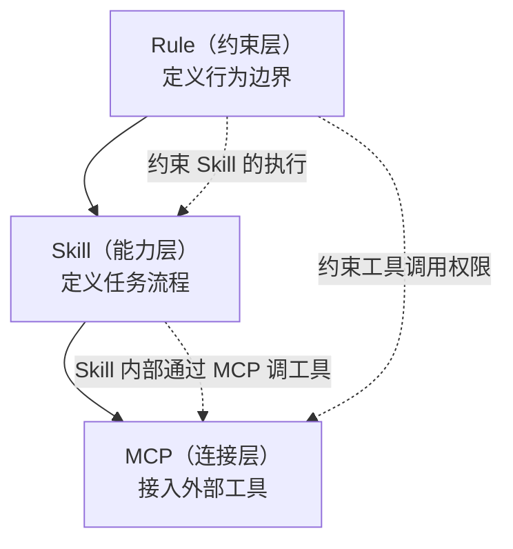
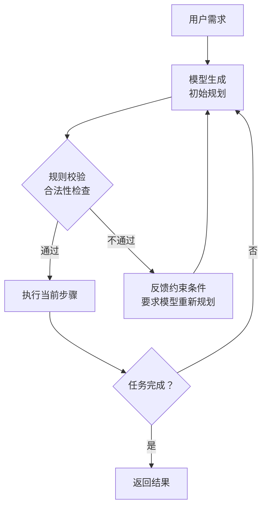
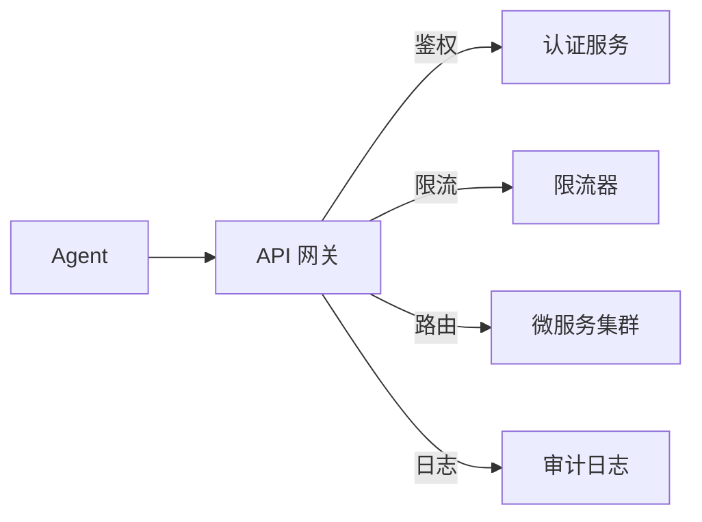
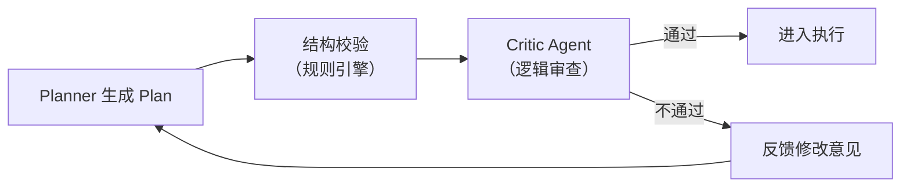
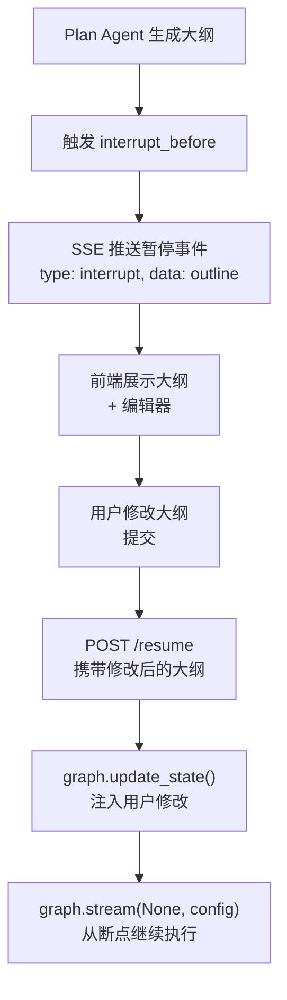

## 系统集成与规划保障

### Q：Skill、MCP、Rule 三者有什么区别？

> 来源：蚂蚁集团一面

**新手答**：“都是给 Agent 加功能的方式吧。”

**高手答**：

三者解决的是 Agent 系统中**不同层次的扩展问题**，看起来都是“给 Agent 加东西”，但职责完全不同：

| 概念 | 本质 | 解决什么问题 | 类比 |
|------|------|------------|------|
| **Rule** | 行为约束规则 | Agent 什么能做、什么不能做 | 公司制度 / 安全规范 |
| **Skill** | 可复用的能力模块 | Agent 怎么做某类特定任务 | 员工的专业技能 / SOP |
| **MCP** | 工具连接协议 | Agent 怎么接入外部工具和数据 | USB 接口标准 |

**Rule（规则/约束）**：

定义 Agent 的行为边界和决策偏好。不是“能力”，而是“约束”：

```text
Rule 示例：
- 禁止执行 rm -rf 命令
- 回答必须使用中文
- 代码修改前必须先读取文件
- 敏感操作需要用户确认
```

Rule 通常写在配置文件中（如 CLAUDE.md），在每次对话中持续生效。它约束的是 Agent 的**所有行为**，不绑定特定任务。

**Skill（技能模块）**：

封装了完成某类特定任务的完整流程——包括步骤定义、输入输出格式、注意事项、甚至子工具的组合使用方式：

```text
Skill 示例：
- "代码审查"技能：定义了审查流程、检查维度、输出格式
- "文章写作"技能：定义了写作风格、结构模板、质量标准
- "面试题分类"技能：定义了分类维度、插入格式、来源标注规范
```

Skill 是**按需激活**的——用户触发特定任务时才加载。它解决的是“同类任务每次都要从头教 Agent 怎么做”的问题。

**MCP（Model Context Protocol）**：

标准化的工具连接协议。解决的不是“怎么用工具”，而是“怎么发现和接入工具”：

```text
MCP 示例：
- 数据库 MCP Server：暴露 query、insert、update 等工具
- GitHub MCP Server：暴露 create_pr、list_issues 等工具
- 搜索 MCP Server：暴露 web_search、image_search 等工具
```

MCP 的价值是**标准化**——任何工具只要实现 MCP 协议，任何 Agent 都能即插即用，不需要为每个工具写适配代码。

**三者的协作关系**：



Rule 是最上层的约束，贯穿所有行为；Skill 在 Rule 的约束下定义任务流程；Skill 内部通过 MCP 调用具体工具。三者不是平行关系，而是**约束 → 能力 → 连接的层次关系**。

**本地工具 vs MCP Tools vs Skill 的三层对比**：

面试中经常把这三者放一起问，核心区别在于**抽象层级不同**：

| 维度 | 本地工具（Native Tool） | MCP Tool | Skill |
|------|----------------------|----------|-------|
| 本质 | 硬编码的函数调用 | 协议标准化的外部能力 | 领域知识 + 执行流程 |
| 注册方式 | 代码中直接定义 | 通过 MCP Server 动态发现 | Markdown 文件加载到上下文 |
| 调用方式 | Agent 直接调用函数 | 通过 MCP Client 发 JSON-RPC | 注入上下文后影响模型行为 |
| 可扩展性 | 改代码、重部署 | 新增 MCP Server 即可 | 新增 .md 文件即可 |
| 典型例子 | Read、Edit、Bash | GitHub MCP、Slack MCP | classify-interview-questions |
| 类比 | 内置器官 | 外接设备（USB） | 操作手册 |

关键洞察：本地工具是“能力”，MCP 是“能力的标准化接口”，Skill 是“怎么用能力的知识”。三者不是替代关系，而是**互补的不同层级**。一个完整的 Agent 系统通常同时需要这三层。

**差距在哪**：新手把三者混为一谈。高手从“约束 / 能力 / 连接”三个层次清晰区分了三者的职责，且说明了它们的层次关系和协作方式。面试官考的是你对 Agent 系统扩展机制的架构理解——不是“都能加功能”，而是“在不同层次解决不同问题”。

---

### Q：Agent 的任务规划是怎么做的？规划由模型完成还是规则实现？

> 来源：快手 AI Agent 开发一面 【[阿里国际 Agent 开发三面](https://www.nowcoder.com/feed/main/detail/747f07e71f4448bebdce6ada5de800cd)追问：长任务规划与拆解】

**新手答**：“让模型自己决定每一步做什么。”

**高手答**：

生产级 Agent 的规划**几乎都是模型 + 规则的混合架构**，纯模型或纯规则都有致命缺陷：

| 方案 | 优势 | 缺陷 | 适用场景 |
|------|------|------|---------|
| 纯模型规划（ReAct） | 灵活，能处理新任务 | 不可控，可能跑偏 | 探索性任务、开放域 |
| 纯规则规划（状态机） | 确定性强，行为可预测 | 僵化，无法处理意外 | 流程固定的业务场景 |
| **混合架构** | 灵活性 + 可控性 | 设计复杂度高 | 生产环境首选 |

**混合架构的典型做法**：

```text
规则层：定义任务的主干流程（必经节点、禁止操作、超时限制）
模型层：在规则允许的范围内，负责子任务拆解和具体决策
验证层：每步规划结果经过规则校验后才执行
```



**多工具调用时如何决定调用顺序**：

1. **显式依赖**：工具 B 的输入依赖工具 A 的输出 → A 必须先执行，由 DAG（有向无环图）描述依赖关系
2. **无依赖并行**：工具之间无数据依赖 → 并行执行，总延迟取最慢的那个
3. **模型推理**：依赖关系不明确时，让模型根据任务上下文判断调用顺序，但要加防护——限制最大步数、禁止循环调用

```text
工程实践：先用规则解析工具间的硬依赖（参数传递关系），
再用模型判断软依赖（逻辑上应该先查天气再推荐穿搭），
无依赖的全部并行
```

**工具调用失败的处理**：

| 失败类型 | 处理策略 |
|---------|---------|
| 网络超时/5xx | 指数退避重试（最多 2 次） |
| 参数错误/4xx | 让模型分析错误信息，修正参数后重试 |
| 工具不可用 | 切换到备选工具（如主搜索引擎挂了切备用） |
| 多次失败 | 跳过该步骤，用已有信息给出部分结果，告知用户“XX 信息暂时无法获取” |

**差距在哪**：新手把规划全交给模型——这在生产中不可控。高手用“模型规划 + 规则校验”的混合架构，在灵活性和安全性之间找到了平衡。多工具调用有 DAG 依赖分析 + 并行优化，失败有分类处理策略。面试官考的是你能不能设计一个既灵活又可控的规划系统。

---

### Q：微服务怎么接入一个 Agent 系统？

> 来源：蚂蚁集团一面

**新手答**：“Agent 调微服务的 API 就行。”

**高手答**：

“调 API”只是最表面的一层。微服务接入 Agent 系统要解决**发现、适配、治理**三个层面的问题：

**1. 服务发现与注册（Agent 怎么知道有哪些微服务可用）**

不能把所有微服务的 API 文档硬编码在 Agent 的 Prompt 里——微服务会增删改。需要一个**动态的工具注册中心**：

```text
微服务 A 注册：
  name: "订单查询服务"
  capabilities: ["查询订单状态", "查询订单详情", "查询历史订单"]
  endpoint: "order-service.internal:8080"
  schema: OpenAPI 3.0 spec
  auth: Bearer Token
  rate_limit: 100 RPM
```

Agent 在需要时从注册中心按能力描述检索合适的服务，而不是预加载所有服务。这就是 MCP 协议在解决的问题——用标准化的方式让 Agent 发现和调用工具。

**2. 协议适配（微服务的接口怎么变成 Agent 能理解的工具）**

微服务的 REST/gRPC 接口和 Agent 的工具调用接口之间需要**适配层**：

| 微服务侧 | 适配层处理 | Agent 侧 |
|---------|-----------|---------|
| REST API + JSON | 转换成 Tool Schema | function calling 参数 |
| gRPC + Protobuf | 序列化/反序列化 | 结构化输入输出 |
| 复杂嵌套参数 | 简化 + 文字描述 | 模型可理解的扁平参数 |
| 技术性错误码 | 翻译成自然语言 | 模型可推理的错误信息 |

关键：适配层不只是格式转换，还需要**把技术概念翻译成模型能理解的语义描述**。比如微服务返回 `\{"code": 40301, "msg": "insufficient_balance"\}`，适配层要翻译成“用户余额不足，无法完成支付”。

**3. 治理（接入后怎么保证稳定可控）**



- **鉴权**：Agent 调微服务不能用同一个“超级 Token”，应该按任务类型分发不同权限的临时凭证
- **限流**：Agent 可能短时间内高频调用某个服务（比如循环查询），需要在网关层做 Agent 维度的限流
- **熔断**：某个微服务不可用时，Agent 不能死等，需要快速感知并切换策略
- **可观测**：每次调用的入参、出参、延迟、状态码都要记录，方便排查 Agent 行为异常时的根因

**差距在哪**：新手只想到“调 API”。高手从服务发现、协议适配、运行治理三层说清了微服务接入 Agent 的完整方案，且指出了“语义翻译”和“Agent 维度限流”这两个 Agent 系统特有的难点。面试官考的是你能不能把传统微服务架构的经验迁移到 Agent 系统中。

---

### Q：如何保证规划 Agent plan 的结果正确？

> 来源：AI 工程师面试

**新手答**：“让模型多想想，加个 CoT 就行。”

**高手答**：

Plan 的正确性不能只靠模型“想得好”，要从**事前约束、事中校验、事后修正**三个阶段建立保障机制：

**事前——约束 Plan 的输出质量**：

1. **Structured Output**：强制模型以 JSON 格式输出 plan，每个步骤必须包含 `step_id`、`action`、`tool`、`expected_output`、`dependencies`。格式约束本身就能过滤掉“一句话笼统计划”
2. **Few-shot 示范**：在 Prompt 中给出 2-3 个高质量的 plan 示例，让模型学到正确的粒度和结构
3. **领域知识注入**：把当前任务相关的工具列表、能力边界、业务规则注入上下文，避免模型规划出“做不到的步骤”

**事中——引入 Critic 校验**：

4. **Critic Agent**：用另一个模型（或同一个模型不同 Prompt）审查 plan，检查逻辑一致性、步骤可执行性、是否有遗漏
5. **规则校验器**：用代码检查 plan 的结构合法性——步骤依赖是否成环、引用的工具是否存在、参数是否完整



**事后——执行中反馈修正**：

6. **Self-Reflection**：每个步骤执行完后，检查实际结果和 plan 预期是否一致，不一致时触发局部修正
7. **Re-plan 机制**：当关键前提失效（如某个工具不可用、用户改了需求）时，允许重新规划，但保留已完成步骤的成果
8. **Plan 版本管理**：每次修改 plan 都保存历史版本，方便回溯和复盘

核心认知：**Plan 的正确性不是一次生成就能保证的，而是通过“生成 → 审查 → 执行 → 反馈 → 修正”的闭环逐步收敛的**。只靠 Prompt 调优永远不够，必须有外部校验机制。

**差距在哪**：新手只想到让模型“想清楚”——这是最弱的保障。高手从事前（格式约束 + Few-shot + 知识注入）、事中（Critic + 规则校验）、事后（反馈修正 + Re-plan）三个阶段构建了完整的 Plan 质量保障体系。面试官考的是你对规划可靠性的工程化认知。

---

### Q：规划完成后需要人工介入修改大纲，SSE 怎么实现这种 Human-in-the-Loop？前端怎么让用户输入？

> 来源：AI 工程师面试

**新手答**：“弹个输入框让用户改就行。”

**高手答**：

这道题考的是**Human-in-the-Loop（HITL）的工程实现**——Agent 执行到某个节点时暂停，等待人类输入后再继续。核心挑战是：后端是异步流式的（SSE），前端需要在正确的时机切换到“等待用户输入”状态。

**后端实现（以 LangGraph 为例）**：

LangGraph 原生支持 `interrupt_before` 机制——在指定节点执行前暂停 graph，等待外部输入：

```python
graph = create_graph()
# 在 search_node 之前中断，等待人工确认/修改大纲
app = graph.compile(
    checkpointer=checkpointer,
    interrupt_before=[“search_node”]
)
```

执行流程：



关键 API 调用：

```python
# 1. 用户修改后，更新 graph 状态
graph.update_state(
    config,
    {“outline”: user_modified_outline},
    as_node=”plan_node”  # 以 plan_node 的身份写入状态
)

# 2. 传入 None 表示从上次中断处继续
for event in graph.stream(None, config):
    send_sse_event(event)
```

**SSE 通信协议设计**：

后端通过 SSE 推送不同类型的事件，前端根据事件类型切换 UI 状态：

```text
event: node_output      # 普通节点输出，前端展示流式内容
data: {“node”: “plan”, “content”: “...”}

event: interrupt         # 中断事件，前端切换到编辑模式
data: {“node”: “plan”, “outline”: [...], “editable”: true}

event: resumed           # 恢复执行，前端切回流式展示模式
data: {“node”: “search”}
```

**前端交互设计**：

1. **监听 SSE 事件流**：收到 `interrupt` 事件时，停止流式展示，渲染大纲编辑器
2. **用户编辑并提交**：提交时调用 `POST /resume` 接口，携带修改后的大纲和当前 `thread_id`
3. **恢复流式展示**：收到 `resumed` 事件后，前端切回流式输出模式，继续展示后续节点的输出

核心认知：**HITL 不是简单的“弹窗确认”，而是后端状态暂停 + 前端模式切换 + 状态注入恢复的完整链路**。LangGraph 的 `interrupt_before` + `update_state` + `stream(None)` 三板斧是标准实现。

**差距在哪**：新手只想到前端交互。高手从后端中断机制（interrupt_before）、SSE 事件协议设计、前端状态切换、恢复执行（update_state + stream(None)）四个环节说清了完整的 HITL 实现方案。面试官考的是你对 Agent 系统中“人机协作”的全链路工程化理解。
