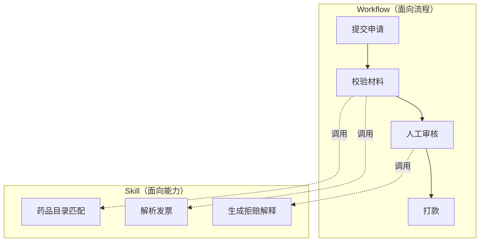

## Q：Skill 和 Workflow 的区别是什么？什么场景该用 Skill 而不是 Workflow？

> 来源：快手AI应用开发一面 【[快手 AI 全栈一面](https://www.nowcoder.com/feed/main/detail/a30242712e8d456c839ff4223470f491)同题】

**新手答**：“Skill 就是一个功能模块，Workflow 是流程编排，两个差不多吧。”

**高手答**：

Workflow 是面向**业务流程**的编排，适合步骤稳定、分支明确、有审批和状态流转的任务，比如“提交理赔申请 → 校验材料 → 人工审核 → 打款”。它强调的是顺序、状态、重试和完整性。

Skill 是面向**能力复用**的封装，适合被不同 Agent、不同流程按需调用。它有明确的输入输出契约，强调可组合、可编排。



关键判断标准：

| 维度 | Workflow | Skill |
|------|----------|-------|
| 目的 | 完成端到端业务流程 | 完成一个稳定业务能力 |
| 复用 | 流程间很难复用 | 跨流程、跨 Agent 复用 |
| 接口 | 状态机 + 审批点 | 稳定 Input/Output Schema |
| 典型例 | 理赔审核全流程 | 药品目录匹配能力 |

以理赔场景为例：门诊理赔、住院理赔、药品理赔三条 Workflow 都需要“药品目录匹配”能力。如果做成 Workflow 节点，三条流程各复制一份，改一处要改三处。做成 Skill 后只维护一份，任何流程按需调用。

Skill 的定义更像一个稳定接口：

```json
{
  "skillName": "medical_catalog_match",
  "input": {
    "drugName": "string",
    "diagnosisCode": "string"
  },
  "output": {
    "covered": "boolean",
    "matchedRuleId": "string",
    "reason": "string"
  }
}
```

**差距在哪**：新手分不清 Skill 和 Workflow，混为一谈或者觉得 Skill 只是小功能。高手能清晰说出两者的设计目标不同——Workflow 关注流程完整性和状态流转，Skill 关注能力复用和可组合性。面试官考的是你对**系统解耦和能力沉淀**的理解：什么时候该固化流程，什么时候该抽取通用能力。
