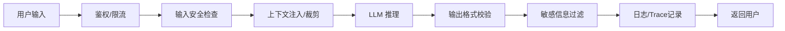

## Agent 中间件（Middleware）

### Q：AI 系统该做单域工具还是跨团队通用平台？怎么选？

> 来源：数据智能查询平台面试 【[英迈软件一面](https://www.nowcoder.com/feed/main/detail/355e6818b7e7418ba6f2c88c6bc50351)追问：垂直 Agent 相比 Coze 的优势】【[阿里国际 Agent 开发三面](https://www.nowcoder.com/feed/main/detail/747f07e71f4448bebdce6ada5de800cd)追问：标准模型服务与业务工程化】【[互联网金融 Agent 开发三面](https://www.nowcoder.com/feed/main/detail/88c55ee65af04ac98c218b9d17c47a71)追问：通用能力垂直化】【[阿里千问平台开发复活赛一面](https://www.nowcoder.com/feed/main/detail/141447389dab4e8e9ca6db742a514f39)追问：Agent 中台耦合边界】

**新手答**：“做通用平台，这样 ROI 高。”

**高手答**：

这不是一个技术问题，是一个**阶段+资源**的决策问题：

| 维度 | 单域工具 | 通用平台 |
|------|---------|---------|
| 适用阶段 | 0→1 验证、早期团队 | 已有多个业务域验证成功后 |
| 投入成本 | 低（聚焦一个场景做深） | 高（需要抽象能力+多场景适配） |
| 迭代速度 | 快（只服务一个业务方） | 慢（改一处需兼容所有域） |
| 核心风险 | 做深了但推不开 | 做薄了每个域都不好用 |

**判断框架——三个信号判断是否该平台化：**

1. **重复建设信号**：多个团队在独立做类似的事（比如 3 个团队各自搭了 Text2SQL），说明有平台化需求
2. **架构可抽象性**：核心链路（检索→生成→校验）是否跨域通用？差异是否可以通过配置而非代码隔离？
3. **组织支撑**：有没有平台团队的编制和 KPI 支持？没有专人维护的“通用平台”最终会变成无人认领的烂尾项目

**Text2SQL 场景的典型路径：**
- 阶段一：先为一个业务域（如电商运营）做单域 Text2SQL，把准确率做到 85%+
- 阶段二：第二个业务域（如财务）接入时，抽取通用层（DDL 管理、SQL 校验、评测框架）+ 业务配置层（规则库、示例库按域隔离）
- 阶段三：多域验证后再做平台化——提供 Web 控制台让业务方自助配置规则和示例

平台只标准化稳定契约，例如模型/Tool 接入、身份、Trace、评测、版本和发布；领域层保留业务 Schema、规则、权限、专属工具、流程门禁和验收集。所谓“垂直 Agent 的优势”必须能落到这些资产及业务指标，而不是换一个 Prompt。中台与业务通过版本化接口和扩展点协作：平台不能直接依赖某个业务对象，业务也不能绕过平台安全与审计；当第二、第三个领域仍需要复制核心代码时，才有证据继续上收抽象。

**差距在哪**：新手直觉性地选“做通用的”——但过早平台化是创业公司最常见的失败模式之一。高手用阶段判断框架说明“先单域做深验证，再逐步抽象平台化”的渐进策略。面试官考的是你对“做什么”的决策能力，而不只是“怎么做”的执行能力。

---

### Q：讲一讲 Agent 的 Middleware（中间件）是什么？

> 来源：字节跳动 Agent开发实习生一面

**新手答**：“就是后端框架里的中间件吧，处理请求的。”

**高手答**：

Agent Middleware 和 Web 框架的中间件思想相同——在核心执行流的前后插入**可组合的横切逻辑**——但作用对象从 HTTP 请求变成了 Agent 的每一步决策。

**Agent Middleware 的典型处理位置：**

**常见 Middleware 类型：**

| 阶段 | 中间件 | 职责 |
|------|--------|------|
| 请求前 | Auth Middleware | 验证用户身份和权限 |
| 请求前 | Rate Limiter | Token 预算控制、QPS 限流 |
| 推理前 | Context Middleware | 注入记忆、检索结果、系统规则 |
| 推理前 | Safety Filter | 拦截 Prompt 注入、敏感输入 |
| 推理后 | Format Validator | 校验 JSON schema、必填字段 |
| 推理后 | PII Redactor | 过滤模型输出中的个人信息 |
| 工具调用 | Tool Guard | 校验参数合法性、拦截危险操作 |
| 全局 | Trace/Log | 记录每步输入输出，支持回溯 |

**为什么用中间件模式而不是硬编码：**
1. **可组合**：不同场景按需组装不同中间件栈，不用改核心逻辑
2. **可复用**：安全检查、日志记录等横切关注点写一次到处用
3. **可测试**：每个中间件可以独立单测
4. **关注点分离**：核心推理逻辑不被安全、日志、格式化等代码污染

**差距在哪**：面试官用这题测试你对“Agent 不只是一个 LLM 调用”的理解。只会调 API 的人不知道生产级 Agent 需要多少横切逻辑。能说出 Middleware 栈的分层设计 + 每层的职责，说明你理解从 Demo 到生产之间的工程距离。
