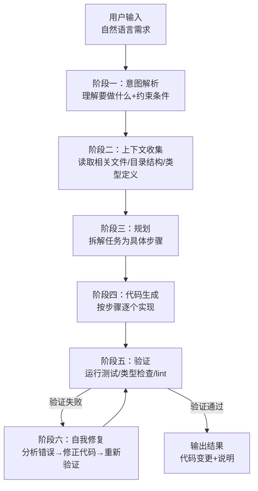

## Q：Coding Agent 的完整链路是怎么运转的？从用户输入到代码产出的全流程

> 来源：字节跳动 Agent 二面（Coding Agent）【百度大模型研发二面追问：Claude Code 用户交互全流程数据流】

**新手答**：“用户输入需求，模型生成代码，就这样。”

**高手答**：

Coding Agent 不是“用户说一句话、模型吐一段代码”的单轮对话——它是一个**多阶段闭环系统**，从用户输入到代码产出经历了至少六个阶段：

从用户交互数据流看，前端先创建或恢复 Session/Thread，把输入、附件和当前工作区标识交给 Runtime；Runtime 以 SSE/WebSocket 流式返回模型文本、工具请求、审批请求、工具结果摘要和状态变化。需要工具时，前端只展示并收集授权，真正执行由受控 Tool Runtime 完成；结果写入 Transcript/State 后再进入下一轮模型调用。最终代码 diff、测试结果和完成状态分别作为结构化事件返回，断线重连按事件序号续传，而不是重新执行整个任务。

**各阶段的关键设计**：

**阶段一：意图解析**——不只是理解“用户想要什么”，还要识别隐含约束：用户的技术栈偏好（从现有代码推断）、项目规范（从配置文件和 lint 规则推断）、改动范围（是新增功能还是修 bug）。

**阶段二：上下文收集**——这是 Coding Agent 最核心的能力。模型不能凭空写代码，它需要“看到”相关的代码。关键是**精准收集而非全量加载**：
- 先读目录结构，定位相关文件
- 读取目标文件和被依赖的模块
- 检索类型定义、接口契约、测试用例作为参考
- 加载项目级规则（如 CLAUDE.md 中的编码规范）

**阶段三：规划**——把一个模糊需求拆成具体的文件操作序列。例如“添加用户注册功能”拆解为：① 创建路由文件 → ② 实现 handler → ③ 添加数据库迁移 → ④ 补充测试 → ⑤ 更新 API 文档。

**阶段四：代码生成**——按步骤逐个实现，每步生成后立即写入文件。关键技巧是**增量生成**——不是重写整个文件，而是精确编辑目标区域，减少对已有代码的干扰。

**阶段五：验证**——生成的代码必须通过验证才算完成。验证手段包括：运行测试套件、类型检查（TypeScript/mypy）、lint 检查、甚至运行应用看是否启动正常。

**阶段六：自我修复**——验证失败时不直接报错给用户，而是分析错误信息（编译错误、测试失败、lint 警告），定位问题根因，修正代码后重新验证。这个循环通常限制在 2-3 次。

**与普通 Chat 补全的本质区别**：

| 维度 | Chat 代码补全 | Coding Agent |
|------|-------------|--------------|
| 上下文 | 用户手动提供 | Agent 自主探索和收集 |
| 粒度 | 生成一段代码片段 | 完成端到端的功能实现 |
| 验证 | 用户自行验证 | Agent 自动验证并修复 |
| 文件操作 | 无 | 直接创建/编辑/删除文件 |
| 持续性 | 单轮 | 多轮闭环直到任务完成 |

**差距在哪**：新手把 Coding Agent 理解为“更强的代码补全”。高手理解它是一个六阶段闭环系统——意图解析→上下文收集→规划→生成→验证→修复，每个阶段都有独立的工程设计。面试官考的是你对 Coding Agent 全链路的认知深度，以及你理不理解“自主收集上下文”和“自动验证修复”才是它的核心价值。
