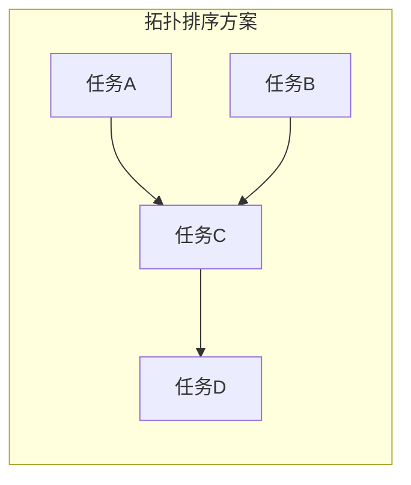

## Q：用拓扑排序（规则式）管理任务依赖 vs 让大模型自己推理决策执行顺序，各有什么问题？

> 来源：广州某小厂 Agent 后端开发二面

**新手答**：“拓扑排序是固定的不灵活，大模型灵活但不准。”

**高手答**：

这道题的核心是**确定性与灵活性的工程权衡**——两种方案各自在什么场景下崩溃。

**方案一：拓扑排序（规则式 DAG 调度）**

原理：把所有任务和依赖关系建模为有向无环图，用拓扑排序确定执行顺序，无依赖的任务可以并行。



**优势**：
- 执行顺序确定、可预测、可重复
- 天然支持并行——无依赖的任务同时执行
- 调度开销极低（O(V+E)），不消耗 token
- 容易做可视化和调试

**问题**：
1. **依赖关系必须提前定义**——如果任务之间的依赖取决于运行时结果（“任务 B 是否需要执行取决于任务 A 的返回值”），静态 DAG 无法表达
2. **无法处理动态新增任务**——执行过程中发现需要额外步骤，DAG 已经定死了
3. **对环敏感**——如果业务逻辑本身存在条件性循环（“检查不通过则修正后重新检查”），DAG 无法建模
4. **过度依赖前期规划质量**——如果 Planner 一开始就规划错了依赖关系，整条链路都跑偏

**方案二：大模型自主推理执行顺序**

原理：每步执行完后让模型根据当前状态决定下一步做什么，不预定义执行图。

**优势**：
- 极其灵活——能根据中间结果动态调整策略
- 能处理模糊需求和意外情况
- 不需要提前穷举所有依赖关系

**问题**：
1. **路径震荡**——模型每步重新推理，可能前一步决定做 A，下一步又改成 B，执行路径来回抖动
2. **全局最优缺失**——模型是逐步贪心决策，缺乏全局视角，可能漏掉可以并行的任务
3. **不可重复**——同样的输入，模型可能给出不同的执行顺序，调试困难
4. **成本高昂**——每步决策都消耗一次 LLM 推理，token 成本线性增长
5. **循环风险**——模型可能在两个任务之间来回跳转，没有拓扑排序的“无环保证”

**生产环境的最佳实践：混合方案**

```text
粗粒度：用拓扑排序管理阶段间的硬依赖（信息收集→分析→生成→验证）
细粒度：每个阶段内部让模型灵活决策具体动作
动态修正：当中间结果导致硬依赖变化时，触发重新拓扑排序
```

具体实现：
1. **Planner 生成初始 DAG**：模型规划出任务和依赖关系，系统做拓扑排序确定执行顺序
2. **执行中监控前提条件**：每个任务执行前检查其依赖是否满足，不满足则等待或触发修正
3. **有限重规划**：关键前提失效时允许模型修改 DAG（增删节点/边），但重规划次数有上限
4. **并行兜底**：无依赖任务自动并行，降低总延迟

**差距在哪**：新手只说了“一个固定一个灵活”——这是最表层的对比。高手详细分析了两种方案各自崩溃的具体场景（静态 DAG 无法处理动态依赖、模型决策存在路径震荡和成本问题），且给出了混合方案的工程实现。面试官考的是你在设计 Agent 调度系统时的权衡能力——不是“选 A 还是选 B”，而是“怎么组合 A 和 B 取长补短”。

---

### Q：Agent 如何判断已经收集了足够的信息，并最终给出输出结论？

> 来源：字节跳动多模态算法一面【字节火山引擎 Managed Agent 一面追问：Loop 继续与结束条件】【阿里 Agent Infra 一面题库同题：停止条件】【[平安健康保险 AI 应用开发一面](https://www.nowcoder.com/feed/main/detail/6c11a75a8bd44628943deff3e42ae15c)追问：Agent 偷懒、过早结束或省略必要步骤】【[未知公司 Agent 二面](https://www.nowcoder.com/feed/main/detail/16675d793c0c42e8a6b46d42fb561561)追问：任务结束与会话终止策略】【[快手 AI 全栈一面](https://www.nowcoder.com/feed/main/detail/a30242712e8d456c839ff4223470f491)同题】

**新手答**：“设置最大循环次数，到了就输出。”

**高手答**：

这是 Loop Engineering 的核心问题——退出条件设计。仅靠 max iterations 是最粗暴的兜底，真正的“足够”需要多维度判断：

**1. 目标对齐检查**：
- 用户原始需求拆分成的子目标是否都已覆盖
- 对每个子目标标记 resolved/unresolved 状态
- 全部 resolved 时退出

**2. 信息增量检测**：
- 对比最近 N 轮的信息增益——如果连续 2-3 轮没有新增有效信息，说明已达到信息饱和
- 信息增益可以通过“本轮工具返回是否改变了结论”来近似衡量

**3. 置信度收敛**：
- 让模型在每轮结束时输出一个 confidence score
- 当 confidence 超过阈值（如 0.85）且连续 2 轮稳定 → 退出
- 如果 confidence 一直不收敛 → 可能任务本身模糊，需要反问用户

**4. 工程防护**：
- max_iterations 作为硬兜底
- token budget 作为成本约束
- 相同工具+相同参数连续调用 → 强制跳出（死循环检测）

还要区分**任务完成**和**会话结束**。任务只能由成功条件和外部证据关闭，不能因为模型输出了 `finish` 就完成；会话则可以在任务进入 `COMPLETED / FAILED / CANCELLED` 后按 TTL 回收交互状态。任务等待用户时应进入 `WAITING_FOR_USER` 并释放执行资源，而不是提前清空状态或无限占用 Worker。

为防止 Agent “偷懒”，Verifier 应逐项检查子目标、必需步骤和交付物，且关键证据来自工具结果、测试或业务终态，不能让执行模型自证完成。缺少证据时回到补充执行、澄清或明确的部分完成状态；预算耗尽只代表停止执行，不代表目标已经达成。

**差距在哪**：新手只知道 max iterations。高手理解“够不够”是一个多信号融合决策——目标覆盖、信息增量、置信度收敛三个维度联合判断，并用工程防护兜底。这直接决定了 Agent 的“智商”——太早停会漏信息，太晚停会烧 token。

---

### Q：Agent 的 thinking 阶段怎么决定是调用工具还是直接回复？

> 来源：腾讯AI应用开发实习生一面【字节火山引擎 Managed Agent 一面同题】

**新手答**：“模型会根据 system prompt 里的指令判断需不需要调用工具。”

**高手答**：

这个决策本质上是模型在每一步的 action space 里做选择——action space 包括「调用某个工具」和「直接生成回复」。决策依据来自三个维度：

**1. 信息完备性判断**：
- 当前上下文是否已经包含回答用户问题的所有信息
- 如果缺失关键信息（如实时数据、外部状态），必须调用工具
- 如果信息已完备，直接回复——多余的工具调用是浪费 token

**2. 工具可用性匹配**：
- 当前 available tools 里有没有能填补信息缺口的工具
- 工具 schema 的语义描述和当前需求的匹配度
- 如果没有匹配的工具，即使信息缺失也只能基于已有知识回复

**3. 置信度与风险评估**：
- 对于高确定性问题（如代码语法）→ 直接回复
- 对于需要实时/准确数据的问题（如查询余额）→ 必须调用工具
- 对于模棱两可的情况 → 优先调用工具确认，而非凭“感觉”回答

**工程上的加强手段**：
- 在 system prompt 中明确“什么情况必须调工具”的规则
- 在 schema 中标注 `required_when` 条件，降低模型犹豫的概率
- 通过 few-shot 示例展示正确的决策模式

**差距在哪**：新手把它当成一个黑盒的“模型自己判断”。高手理解这是一个可以被工程化引导的决策过程——通过工具描述设计、system prompt 规则、few-shot 示例三个抓手，让模型在“工具调用”和“直接回复”之间做出更可控的选择。
