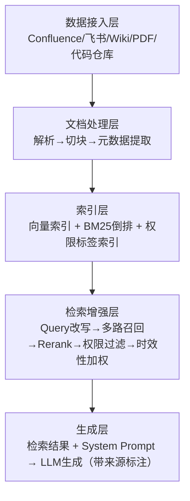

## Q：设计一个内部的多源文档问答 AI，架构设计是什么？

> 来源：百度/AI智能体开发一面 【[百度 Agent 一面](https://www.nowcoder.com/feed/main/detail/53542e2dcfd44b1d84b0ae55b4fc1b35)同题】【[OPPO IT 开发一面](https://www.nowcoder.com/discuss/923561467092160512)追问：Word 图文上下文与图文混合响应】

**新手答**：“用 RAG 就行，把文档切块建索引。”

**高手答**：

这是一道场景设计题，核心约束在“多源”二字——不同来源的文档格式、权限、时效性各不相同，不是单纯的 RAG 能解决的。

**整体架构分五层**：

**1. 数据接入层**：对接多种文档源（Confluence、飞书文档、内部 Wiki、PDF、代码仓库），每种源一个 connector，统一输出标准化文档格式。

**2. 文档处理层**：解析（PDF→文本、表格→markdown）→ 切块（语义切分，保持章节完整性）→ 元数据提取（来源、更新时间、权限标签、作者）。

Word 不能只按段落文本读取。`.docx` 属于 [ECMA-376 Office Open XML](https://ecma-international.org/publications-and-standards/standards/ecma-376/) 包结构：正文 drawing 中的 relationship ID 用来定位图片 Part，但题注通常仍是主文档里的普通段落、Caption 样式或 `SEQ` 字段，并不由该 relationship 直接指向。解析器先解析图片资源与 inline/anchor 位置，再结合文档顺序、题注样式、编号字段和版面关系关联附近段落；推断结果保留置信度和原始位置。统一中间表示带 `document/part/paragraph/image` source span，图文联合 Chunk 保存正文、图片 Artifact 引用、替代文本和章节路径，OCR/视觉摘要只能作为派生字段，不能覆盖原文件证据。

**3. 索引层**：双路索引（向量索引 + BM25 倒排索引），附带权限标签索引（用于检索时过滤无权限文档）。

**4. 检索增强层**：Query 改写 → 多路召回 → Rerank → 权限过滤 → 时效性加权（近期文档分数 boost）。

**5. 生成层**：检索结果 + System Prompt + 引用要求 → LLM 生成答案（带来源标注）。

若响应需要同时返回文字和图片，模型只生成结构化引用计划，例如文本块与 `artifact_id` 列表；Host 再按用户权限解析为签名 URL、缩略图或附件事件。模型上下文中放受控图片引用或视觉表示，不把二进制塞进消息；最终引用必须能回到 Word 原始 Part 和位置，并分别测试文字正确性、图片对应关系、权限和断链降级。

**多源场景的特殊挑战及解法**：

| 挑战 | 解法 |
|------|------|
| 权限隔离 | 每个文档块带 ACL 标签，检索时按用户身份过滤——不能让 A 部门的人看到 B 部门的机密文档 |
| 信息冲突 | 同一主题多个源说法不同 → 生成时标注每个观点的来源，让用户自行判断 |
| 时效性 | 文档有新旧版本 → 旧版本降权但不删除（可能有“当时为什么这么决定”的查询需求） |
| 增量更新 | 各源更新频率不同 → webhook/轮询混合策略，增量重建索引而非全量 |

**差距在哪**：新手只说了“用 RAG”，把问题简化成了单一数据源的检索生成。高手的回答展示了完整的五层架构，且重点解决了多源场景特有的四个挑战——权限隔离、信息冲突、时效性、增量更新。面试官考的是系统设计能力——不只是 RAG 本身，而是“如何将 RAG 嵌入到一个有权限控制、多数据源、增量更新的企业级系统中”。
