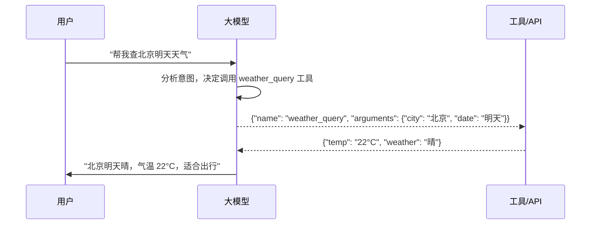
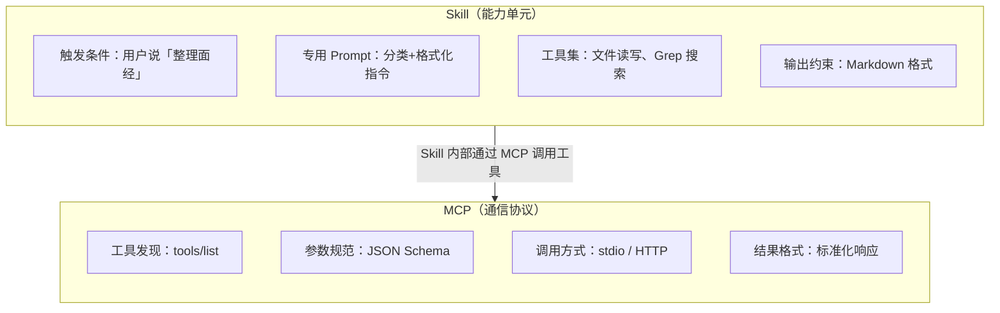

## MCP 与 Function Calling

### Q：大模型的 Function Call 是什么？Tool Use 一般怎么用？

> 来源：蚂蚁集团智能体与大模型应用一面 【字节实习Agent开发一面追问：工具注册/解析/调用/回传全链路】【小红书 Agent 岗一面追问：`tool_use` 捕获、执行与非标准命令请求】；[BIGO 音频算法工程师一面](https://www.nowcoder.com/discuss/924359576990781440)；[百度 Agent 一面](https://www.nowcoder.com/feed/main/detail/53542e2dcfd44b1d84b0ae55b4fc1b35)【[启云方AI Agent一面凉经](https://www.nowcoder.com/feed/main/detail/fea2d18bd59a421da7d16fe16223d38c)追问：“语言调用工具”中的“语言”和真正的 tool call / function call 到底是什么关系？】

**新手答**：“就是让模型调用函数。”

**高手答**：

Function Call（Tool Use）是让大模型**不只生成文本，还能结构化地调用外部工具**的核心机制。

**工作原理**：



模型不是直接执行代码——它输出的是**结构化的调用意图**（工具名 + 参数 JSON），由外部编排层执行实际调用，再把结果回传给模型做最终整合。

**和普通 Prompt 的关键区别**：

| 维度 | 普通 Prompt | Function Call |
|------|-----------|---------------|
| 输出 | 自由文本 | 结构化 JSON（工具名 + 参数） |
| 能力边界 | 只能用训练数据 | 可接入实时数据和外部系统 |
| 可控性 | 低（自由发挥） | 高（Schema 约束参数类型和取值） |
| 典型场景 | 问答、创作 | 查天气、操作数据库、发消息、执行代码 |

**在 Agent 项目中的典型 Function Call**：

1. **信息查询类**：知识库检索、数据库查询、API 调用——Agent 不靠记忆回答，而是实时查
2. **操作执行类**：创建工单、发送通知、修改配置——Agent 不只回答问题，还能执行动作
3. **代码执行类**：运行 Python 代码做计算、执行 SQL 查询——把模型的“推理”变成“验证”

**工程上的关键设计**：

- **Schema 定义要精准**：工具描述写给模型看，参数 Schema 约束类型和枚举值。描述越精确，模型选错工具和瞎传参的概率越低
- **返回值要结构化**：工具返回不要是一大段文本，而是 JSON——模型解析结构化数据比理解自然语言更稳定
- **错误处理要前置**：工具调用可能失败，返回值里必须带状态码和错误信息，让模型能根据错误类型决定下一步

当 Tool Use 由 Skill 驱动时，完整链路是：先按任务发现并加载 Skill，Skill 提供流程、约束和可用工具说明；模型据此生成工具调用意图；宿主按 Tool Schema、权限和业务不变量校验参数，执行真实工具，再把带 `tool_call_id` 的 Observation 回写给模型继续推理。Skill 只是指导模型“应该怎样做”，实际执行、授权和校验仍由确定性宿主负责，不能把 Skill 文本当成安全边界。

**差距在哪**：新手把 Function Call 等同于“调函数”。高手理解它是模型从“文本生成器”升级为“行动执行器”的关键机制，且清楚 Schema 设计、返回值规范和错误处理这些工程细节决定了 Tool Use 的稳定性。面试官考的是你对 Agent 核心能力的理解深度。

**追问：如果不做训练（不 SFT），怎么让 Agent 知道怎么调用工具？调用格式是什么？**

> 来源：小红书 AI应用开发

这道题的关键在于理解：**应用开发者不需要自己训练模型的 tool use 能力，但模型的 tool use 能力不是凭空出现的**。

**两种实现路径**：

| 路径 | 原理 | 适用场景 |
|------|------|---------|
| **API 原生 Function Calling** | 模型厂商（OpenAI/Anthropic）在训练阶段已做了 tool use 的 SFT + RLHF，开发者只需传 tool schema | 使用商业 API 的主流方案 |
| **Prompt-based（ReAct）** | 通过提示词教模型按固定格式输出工具调用，再由代码解析执行 | 没有原生 FC 能力的开源模型 |

**API 原生 FC 的工作方式**——开发者只做三件事：

1. **定义 Tool Schema**：用 JSON Schema 描述工具的名称、功能、参数类型和约束
2. **传给 API**：在请求的 `tools` 参数中传入 schema 列表
3. **解析响应**：模型返回结构化的 `tool_calls`（工具名 + 参数 JSON），编排层执行后回传结果

```text
开发者定义：
  tools: [{
    name: “search_order”,
    description: “根据订单号查询订单状态”,
    parameters: {
      order_id: { type: “string”, description: “订单编号” }
    }
  }]

模型输出：
  tool_calls: [{
    name: “search_order”,
    arguments: { “order_id”: “2024050312345” }
  }]
```

模型“知道”怎么调用，是因为**厂商在训练阶段已经用大量 tool use 数据做了对齐**——开发者不需要训练，但不代表没有训练。

**Prompt-based 方案**——当模型没有原生 FC 时：

在 System Prompt 中定义 ReAct 格式，让模型按固定模式输出，再用正则/JSON 解析提取调用意图：

```text
System Prompt:
  你可以使用以下工具：
  - search_order(order_id: str): 查询订单状态
  
  使用工具时，严格按以下格式输出：
  Thought: 我需要查询订单
  Action: search_order
  Action Input: {“order_id”: “2024050312345”}
  
  等待工具返回后继续推理。
```

**两种方案的工程差异**：

- **可靠性**：原生 FC 远高于 Prompt-based——前者有专门的训练和 Schema 约束，后者依赖模型遵循格式的能力
- **并行调用**：原生 FC 支持一次返回多个 tool_calls；Prompt-based 通常只能单步
- **错误率**：Prompt-based 容易输出格式不规范（多一个逗号、少一个引号），需要额外的输出修复逻辑

核心认知：**“不做训练”不等于“没有训练”——应用开发者不需要训练，是因为模型厂商已经做了。真正需要开发者做的是写好 Tool Schema，这是 tool use 准确率最大的杠杆。**

---

### Q：MCP 和 Skills 的本质区别是什么？都是工具调用，为什么需要两套机制？

> 来源：蚂蚁集团智能体与大模型应用二面 【蚂蚁AI应用开发二面同题：Skill 与 MCP 核心差异】【[钉钉二面](https://www.nowcoder.com/discuss/925181638412091392)追问：MCP 跟 Skill 有什么区别？】【[字节跳动 - AI Agent 开发岗（工程方向）](https://www.nowcoder.com/discuss/926273296180547584)追问：MCP 与 Skill 的核心区别是什么？迁移的原因是什么？】【[美团 - Agent 开发岗（场景设计方向）](https://www.nowcoder.com/discuss/926273749555376128)追问：MCP vs Skill 选型场景？】【[pdd agent 一面](https://www.nowcoder.com/feed/main/detail/ee971b755cbd475a91ef62cee38cdac8)追问：MCP是什么，为什么项目没有选用MCP而选择自己封装？Skill与MCP的核心区别是什么？】

**新手答**：“MCP 是协议，Skills 是能力，不太一样。”

**高手答**：

MCP 和 Skills 解决的是**不同层次的问题**，虽然都和“Agent 如何使用工具”相关，但它们不在同一个抽象层级上：

**MCP（Model Context Protocol）——工具调用的“通信协议”**

MCP 解决的是：Agent 如何**发现、调用、获取结果**。它定义了一套标准的交互格式——工具怎么注册（`tools/list`）、参数怎么传（JSON Schema）、结果怎么返回。类比网络协议：MCP 是 HTTP，定义了请求/响应的格式，不关心你用这个请求做什么。

**Skills——任务执行的“能力单元”**

Skills 解决的是：Agent 面对某类任务时，**怎么思考、用什么工具、按什么流程执行**。一个 Skill 包含触发条件、专用 Prompt、可用工具集、输出约束。类比：Skill 是一个“微型 Agent 配置”，告诉 Agent“遇到这类问题时按这个方案办”。



**核心区别对照**：

| 维度 | MCP | Skills |
|------|-----|--------|
| 抽象层级 | 通信协议层 | 业务能力层 |
| 解决的问题 | “怎么调工具” | “什么场景用什么方案” |
| 包含内容 | 工具描述、参数规范、传输方式 | 触发条件 + Prompt + 工具集 + 输出约束 |
| 类比 | HTTP 协议 | Web 应用的一个 Controller |
| 复用粒度 | 单个工具 | 一套完整方案 |

**为什么需要两套机制**：

只有 MCP 没有 Skills → Agent 知道怎么调工具，但不知道什么时候该调哪个，需要每次都靠模型自己推理，不稳定。

只有 Skills 没有 MCP → Agent 知道该怎么办，但每个工具要单独写适配代码，不可扩展。

两者结合：Skills 定义“策略”，MCP 提供“基础设施”。Skill 里的工具调用通过 MCP 协议完成——这样新增工具只需要写 MCP Server，不需要改 Skill 逻辑；新增能力只需要写 Skill，不需要改工具接口。

**差距在哪**：新手把 MCP 和 Skills 当成两个并列的概念。高手看到的是**分层架构**——MCP 在协议层解决“怎么调”，Skills 在业务层解决“怎么用”，两者是上下层关系而非替代关系。面试官考的是你能不能把 Agent 架构按层次拆清楚。

---

### Q：MCP Server 是怎么构建的？

> 来源：字节 Agent 实习二面；[OPPO IT 开发一面](https://www.nowcoder.com/discuss/923561467092160512)【[钉钉二面](https://www.nowcoder.com/discuss/925181638412091392)追问：自己有去搭建过 MCP Server 吗？】

**新手答**：“就是写个 API 接口。”

**高手答**：

MCP（Model Context Protocol）是 Anthropic 提出的**模型与外部工具/数据源的标准化通信协议**，目标是让 Agent 以统一的方式调用不同工具，不需要为每个工具写专门的适配代码。

**MCP Server 的核心职责**是：把外部能力（API、数据库、文件系统等）封装成符合 MCP 协议的标准工具，供 Agent 调用。

**构建一个 MCP Server 的关键步骤**：

1. **定义 Tool Schema**：
   - 每个工具需要声明名称、描述、输入参数（JSON Schema）和输出格式
   - 描述要写给模型看——清晰说明“什么时候该用这个工具”和“参数怎么填”

2. **实现 Handler**：
   - 每个工具对应一个 handler 函数，接收标准化的参数，执行实际操作，返回标准化的结果
   - Handler 内部做参数校验、错误处理、超时控制

3. **选择传输方式**：
   - **stdio**：通过标准输入输出通信，适合本地工具（如文件操作、命令行工具）
   - **Streamable HTTP**：通过 HTTP POST/GET 通信，可选 SSE 承载服务端消息，适合远程服务
   - 本地单 Host 工具可用 stdio，独立部署和扩缩容使用 Streamable HTTP；旧 HTTP+SSE 仅用于兼容旧协议 Server

4. **注册与发现**：
   - Client 端（Agent）通过配置或服务发现机制找到 MCP Server
   - Server 启动时声明自己提供的工具列表，Client 按需选择

如果设计高德这类地图 MCP Server，不应暴露一个参数巨大的 `map_everything`。按稳定业务能力拆成地点搜索、地理编码、路线规划、路况查询等 Tool，把底图说明、行政区划或结果详情建模为 Resource；每个 Tool 明确坐标系、区域、出行方式、时间语义、配额和错误契约。实时结果携带数据时间与有效期，写操作或会产生费用的能力单独授权；Server 从传输层身份解析租户与 scope，不能信任模型在参数里自报用户身份。评测要覆盖同名地点消歧、无路线、跨城、实时数据过期、限流和部分结果，而不只验证 happy path。

**和直接写 API 的区别**：

- 普通 API：每个工具一套接口定义、一套调用方式、一套错误处理
- MCP：所有工具统一协议，Agent 不需要知道底层是 REST 还是 gRPC 还是本地调用——只需要知道 tool name 和参数

**差距在哪**：新手把 MCP 等同于“写 API”。高手理解 MCP 是一个协议层抽象——统一了工具发现、参数定义、调用方式和错误处理，让 Agent 能以即插即用的方式扩展能力。面试官考的是你对 Agent 工具生态标准化趋势的理解。

---

### Q：Function Calling 的本质价值是什么？它解决的是“模型能力问题”还是“系统约束问题”？

> 来源：Agent 开发面试 30 题

**新手答**：“让模型能调工具，解决的是能力问题。”

**高手答**：

Function Calling 解决的**主要是系统约束问题**，不是模型能力问题。

没有 Function Calling 的时候，模型也能“调工具”——你在 Prompt 里告诉模型“如果需要查天气，请输出 `\{"tool": "weather", "city": "北京"\}`”，模型大概率能输出正确的 JSON。但这个方案有三个致命问题：

1. **输出格式不可靠**：模型可能在 JSON 前面加一句“好的，我来查一下”，或者少一个引号，导致解析失败
2. **调用时机不可控**：你不知道模型这次输出是“要调工具”还是“在正常回复”，必须靠正则或关键词猜
3. **参数类型无约束**：price 字段可能传成字符串“一百”，而不是数字 100

Function Calling 的本质价值是**把“模型想调工具”这件事从自由文本变成了结构化协议**：

```text
没有 FC：模型生成文本 → 你用正则猜它要不要调工具 → 手动解析参数 → 祈祷格式正确
有了 FC：模型明确返回 tool_call 结构 → 系统确定性地知道要调工具 → 参数有 schema 约束
```

这不是让模型“更聪明”了，而是**给模型和系统之间建立了一个明确的通信协议**——模型的意图（调什么工具、传什么参数）不再是需要“猜”的自由文本，而是有格式保证的结构化消息。

**差距在哪**：新手觉得 FC 是一种“新能力”。高手理解 FC 本质是模型和系统之间的**接口协议**——解决的是“怎么可靠地把模型意图传递给系统”这个工程问题。面试官考的是你对 FC 的理解停留在“会用”还是“理解设计动机”。

**追问：有了 Function Calling，是不是可以没有 MCP？**

> 来源：蚂蚁 Agent 开发一面

技术上可以——FC 完全能实现 MCP 做的事。但 MCP 的价值不在技术能力，而在**标准化带来的生态效应**。

没有 MCP 时，每接入一个新工具都要：定义 FC schema → 写调用适配 → 处理鉴权 → 维护版本。10 个工具写 10 套适配代码。

有了 MCP，工具提供方按协议实现一次 Server，所有支持 MCP 的 Agent 都能直接用——**工具侧一次实现，Agent 侧零适配**。

类比：HTTP 出现之前，两个系统也能通信（自定义 TCP 协议）。HTTP 的价值不是「让通信变得可能」，而是「让通信有了通用标准，生态可以爆发」。MCP 之于 FC，就是 HTTP 之于 TCP。

---

### Q：大厂开源的 CLI 工具（如 lark-cli）和 MCP 有什么区别？它们跟直接调 API 又有什么不同？

> 来源：大厂 Agent 面试高频题

**新手答**：“CLI 就是命令行工具，MCP 就是协议，API 就是接口，三个不同的东西。”

**高手答**：

这三者解决的问题不同，服务的“用户”也不同：

**1. API——给程序用的原始接口**

API 是最底层的能力暴露方式。比如飞书开放平台的 REST API，你要自己处理鉴权、拼参数、解析响应、处理错误码。它的“用户”是开发者写的代码。

```text
开发者代码 → HTTP 请求 → 飞书 API → 响应 JSON
```

**2. CLI 工具——大厂跟进 Agent 生态的抢位之作**

关键背景：lark-cli、coze-cli 这批大厂 CLI 工具集中涌现，不是偶然——它们是 MCP 和 Agent 生态爆火之后，各平台为了**抢占 Agent 工具生态入口**而快速推出的。

CLI 本质上是 **machine-friendly** 的接口形态。和 GUI（人类友好）不同，CLI 天然适合被程序和 Agent 调用——结构化的输入输出、可脚本化、可管道组合。大厂推 CLI 而不是只提供 API，是因为 CLI 降低了 Agent 接入的门槛：不用写 SDK 集成代码，直接 `lark-cli send --chat "xxx" --text "hello"` 就能调用。

```text
Agent / 脚本 → lark-cli send --chat "xxx" --text "hello"
                    ↓ 内部封装鉴权、参数、错误处理
               飞书 API 调用 → 结构化输出
```

但 CLI 的局限很明显：**每个平台一套 CLI，Agent 需要为每个平台学一套命令**。

**3. MCP——Agent 工具调用的统一协议**

MCP 解决的是 CLI 解决不了的问题：**标准化**。它不是封装某一个平台的 API，而是定义了 Agent 发现和调用任意工具的统一协议。不管底层是飞书 API、数据库还是本地文件系统，Agent 只需要按 MCP 协议交互。

```text
Agent → MCP 协议 → MCP Server A（封装飞书能力）
                  → MCP Server B（封装数据库）
                  → MCP Server C（封装本地文件系统）
```

MCP 的价值在于：Agent 不需要知道底层是 REST、gRPC 还是 CLI——**一套协议打通所有工具**。

**那大厂为什么不直接做 MCP Server，还要出 CLI？**

因为 CLI 是**更低成本的试水方式**：不需要实现完整的 MCP 协议栈，先用 CLI 把平台能力暴露给 Agent 生态，抢个身位。而且 CLI 可以被 MCP Server 二次封装——社区已经有大量“CLI → MCP Server”的适配层了。

**核心区别总结**：

| 维度 | API | CLI 工具 | MCP |
|------|-----|----------|-----|
| 服务对象 | 程序代码 | Agent / 脚本（machine-friendly） | AI Agent（协议级） |
| 设计动机 | 开放平台能力 | 抢占 Agent 工具生态入口 | 统一 Agent 工具标准 |
| 抽象层级 | 原始接口 | 平台级封装 | 协议级抽象 |
| 覆盖范围 | 单一平台 | 单一平台 | 跨平台统一 |
| 工具发现 | 查文档 | `--help` | 协议内置 `tools/list` |
| 典型场景 | 后端集成 | Agent 快速接入单一平台 | Agent 统一工具管理 |

**它们的关系是递进的**：API 是原始能力 → CLI 是大厂面向 Agent 生态的快速封装 → MCP 是最终的协议层标准。一个 MCP Server 内部可以调 API，也可以调 CLI，它们不互斥。

**差距在哪**：新手把三者当成并列的“不同的东西”。高手看到的是 Agent 工具生态的演进脉络——API 一直在，CLI 是大厂看到 MCP/Agent 趋势后的抢位动作，MCP 是最终统一标准。面试官考的是你能不能看到这波 CLI 扎堆出现背后的产业逻辑，以及理解为什么 Agent 时代的终局是协议层标准化而不是各家出各家的 CLI。
