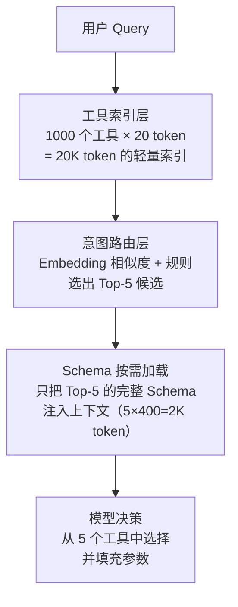

## Q：如何不用多智能体方案让 1000 个 Tools 正常工作？

> 来源：AI应用开发进阶面

**新手答**：“分层加载，只加载需要的工具。”

**高手答**：

方向对了，但“分层加载”只是一个概念，关键是**怎么实现精准的工具路由，让 1000 个工具在单 Agent 下高效工作**。

**完整分层方案**：

**六层工程设计**：

1. **工具索引层**：所有工具只保留 `name + 一句话描述`（每个约 20 token），1000 个共 20K token，能塞进上下文作为“工具目录”

2. **意图路由**：用户 query → 轻量分类器（可以是 embedding 相似度 + 规则）→ 选出 Top-5 候选工具。这步不用大模型，延迟 <50ms

3. **Schema 按需加载**：只把 Top-5 的完整 JSON Schema 注入上下文（5 × 400 = 2000 token），而非全量 1000 个工具的 Schema

4. **工具分域**：按业务领域（订单/支付/物流/用户）建索引，路由先确定领域再在域内选工具，两级漏斗大幅缩小搜索空间

5. **工具别名 + 语义增强**：给每个工具补充 synonyms 和 example queries（“查快递” → 物流查询工具），提升路由命中率

6. **缓存热点工具**：统计调用频次，Top-20 热点工具常驻 system prompt，覆盖 80% 的日常请求

**关键指标**：

| 指标 | 目标值 | 意义 |
|------|--------|------|
| 路由准确率 | > 95% | Top-5 中包含正确工具的比例 |
| 上下文节省 | > 90% | 相比全量加载节省的 token |
| 路由延迟 | < 100ms | 不能让路由成为瓶颈 |
| 冷门工具召回率 | > 85% | 低频工具不能被热门工具挤掉 |

**差距在哪**：新手只说了“分层加载”的概念。高手给出了从索引层、路由层、加载层、分域策略、语义增强到热点缓存的完整六层方案，且有量化指标。面试官考的是在单 Agent 限制下如何用工程手段解决规模问题——不是所有问题都需要 multi-agent。
