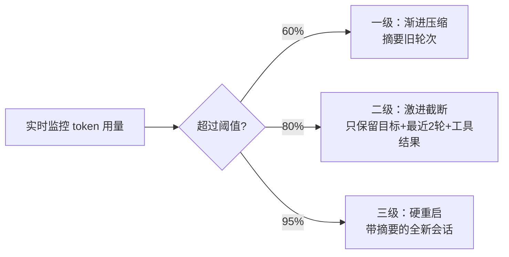

## 上下文爆炸与工具循环调用

### Q：如果上下文爆炸或工具循环调用，你是怎么解决的？

> 来源：慧疗互联网医院 Agent开发一面 【字节Agent开发实习生一面同题：“压缩方案是啥（三级压缩）”】【[格物致信（一面过，二面线下拒）](https://www.nowcoder.com/feed/main/detail/f68f0d54184944c391e0d7b6d1bb82c8)追问：Agent上下文窗口膨胀你是怎么解决的？难点是什么？】

**新手答**：“设个最大轮次就行了，超过就停。”

**高手答**：

这两个问题经常同时出现，因为工具循环调用本身就是上下文爆炸的主要原因之一。要分别设计防线。

**上下文爆炸的三级防御：**

1. **一级——渐进压缩**：对超过 N 轮的历史做 LLM 摘要，保留关键决策和工具调用结果的 key-value，丢弃中间推理过程
2. **二级——激进截断**：只保留系统 Prompt + 任务目标 + 最近 2 轮完整上下文 + 关键工具调用结果的结构化摘要
3. **三级——硬重启**：启动新会话，System Prompt 中注入之前的任务摘要和已完成步骤

**工具循环调用的检测与打断：**

1. **调用指纹去重**：记录每次工具调用的 (tool_name, params_hash)，相同指纹连续出现 2 次立即打断
2. **步数硬上限**：设置 max_iterations（通常 10-15），超过后强制进入总结模式
3. **进度检测**：每 3 步检查“是否离目标更近了”——如果 Agent 输出的 Thought 连续重复相似内容，触发 Reflection 或换策略
4. **工具结果缓存**：相同参数的工具调用直接返回缓存结果，避免重复请求外部系统

**差距在哪**：面试官要看你是否理解“这两个问题是一体两面”——循环调用导致上下文膨胀，上下文膨胀又导致模型遗忘目标从而继续循环。只答一个方向说明你没遇到过线上的复合故障。
