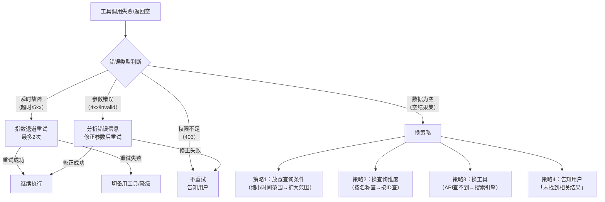

## Q：工具调用返回结果为空或调用失败，Agent 应该怎么处理？是直接重试还是换策略？

> 来源：最有料 AI 实习生面经【[快手 - Agent 开发岗（应用落地 + AI 工具）](https://www.nowcoder.com/discuss/926274020192841728)追问：工具调用失败率较高时，应从描述、重试、降级等哪些维度进行优化？】

**新手答**：“重试几次，还不行就报错。”

**高手答**：

“直接重试”是最低效的策略——如果工具返回空是因为参数不对或数据不存在，重试 100 次结果都一样。正确做法是**先诊断失败原因，再根据原因选择恢复策略**。

**第一步：失败分类**

工具调用失败本质上分两大类、四小类：

| 失败类型 | 表现 | 根因 | 正确策略 |
|---------|------|------|---------|
| 瞬时故障 | 超时、5xx、网络错误 | 外部系统临时不可用 | 退避重试（相同参数） |
| 参数错误 | 4xx、“invalid parameter” | Agent 传了错误的参数 | 分析错误信息→修正参数→重试 |
| 数据不存在 | 返回空集、404 | 查询条件不匹配或数据确实没有 | 换查询策略或告知用户 |
| 权限不足 | 403、“access denied” | Agent 无权调用此工具/参数 | 不重试，向用户报告限制 |

**第二步：分策略处理**



**关键设计原则**：

1. **重试前必须判断“重试是否有意义”**：瞬时故障可以重试，参数错误和权限不足重试毫无意义——浪费 token 和时间
2. **参数修正要利用错误信息**：工具返回的错误消息（如“date format should be YYYY-MM-DD”）是修正参数的关键线索，要结构化后反馈给模型
3. **“空结果”不等于“失败”**：数据确实不存在是正常情况，Agent 应该能区分“没查到因为查错了”和“没查到因为确实没有”
4. **换策略有优先级**：先尝试最小改动（放宽条件），再尝试中等改动（换查询维度），最后才是大改动（换工具）

**工程实现要点**：

```text
每个工具调用必须带结构化的错误分类：
{
  "status": "empty_result",    // 而非简单的 "error"
  "error_type": "no_data",     // 精确分类
  "context": "未找到2026年7月的销售数据",
  "suggestion": "尝试扩大时间范围或检查数据源"
}

Agent 的重试预算：
  - 同一工具同一参数：最多重试 2 次
  - 同一工具不同参数：最多重试 3 次
  - 换工具后：重新计算重试预算
  - 总重试次数：全局不超过 5 次
```

**差距在哪**：新手的“重试几次再报错”是最粗暴的一刀切策略——对瞬时故障有效，对其他三类失败完全无效甚至有害。高手先做失败分类，再根据类型选择不同的恢复路径（退避重试/参数修正/换策略/直接报告），且设置了重试预算防止无限循环。面试官考的是你对“Agent 工具调用失败”这个最常见问题的处理精细度——不是“会不会重试”，而是“知不知道什么时候该重试、什么时候不该”。
