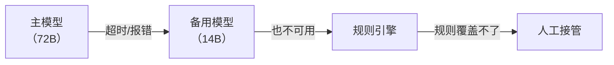
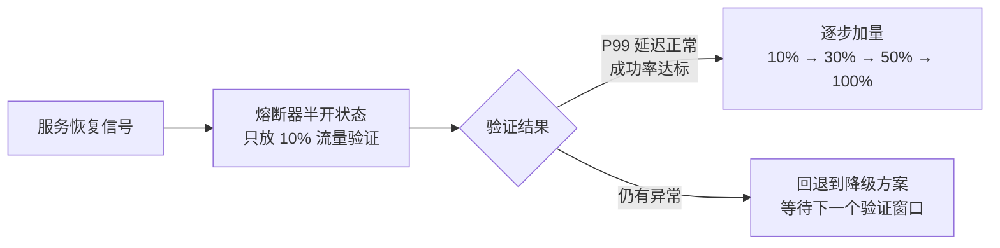

## Q：所有模型超时或故障时怎么兜底？什么时候用规则引擎，什么时候转人工，服务恢复后怎么回切？

> 来源：商汤/大模型算法应用实习二面；拼多多 AI Agent 提前批二面（API Provider 故障切换、自动恢复与回切）

**新手答**：“超时就重试，重试失败就报错给用户。”

**高手答**：

“重试”只能应对偶发超时。当所有模型都不可用时（如 GPU 集群故障、API 全面限流），需要一套完整的**降级链路**：

**降级策略（优雅退化）**：

**何时用规则引擎**：

| 条件 | 原因 | 示例 |
|------|------|------|
| 任务可枚举 | 有限的输入 → 确定的输出，不需要模型推理 | FAQ 问答、固定流程审批 |
| 错误可预判 | 特定错误码对应固定处理方式 | 余额不足 → 返回固定话术 |
| 延迟敏感 | 规则引擎 <5ms 响应，模型要 1-5s | 支付风控实时拦截 |
| 合规硬要求 | 某些场景法规要求确定性输出 | 金融披露、法律声明 |

**何时转人工**：

1. 连续 3 次降级仍失败——说明不是偶发问题
2. 涉及资金/安全的高风险操作——宁可慢不可错
3. 用户主动要求——尊重用户选择
4. 置信度低于阈值的模糊决策——模型和规则都不确定时

**服务恢复后的回切策略**：

**三步回切**：

1. **熔断器半开**：恢复后只放 10% 流量验证主模型是否真的恢复，不一次性全切回去
2. **金丝雀验证**：新请求走主模型，旧积压请求继续走降级方案处理完——避免恢复瞬间的流量洪峰
3. **指标对齐才全量**：P99 延迟和成功率恢复到 baseline 才完全回切，不只看“能响应”还要看“响应质量”

如果系统接入多个 API Provider，路由层还要维护供应商级健康状态，而不是“某次请求失败就永久换 Key”：按超时、5xx、429、鉴权错误分别统计滑动窗口指标；使用熔断器把异常实例摘除，半开探测恢复；路由时综合模型能力、区域、延迟、RPM/TPM 配额、成本和数据合规。API Key 轮换只解决单账号配额或凭证问题，不能替代供应商级故障判断和负载均衡。

**关键设计原则**：降级决策要在**网关层**做，不能在 Agent 内部做——Agent 自己可能已经卡死了，靠它自己做降级决策不现实。

**差距在哪**：新手只有“重试”和“报错”两个选项。高手设计了完整的降级链路（主模型 → 备用模型 → 规则引擎 → 人工），明确了每层的触发条件，且给出了服务恢复后的渐进回切策略。面试官考察的是生产级系统的韧性设计——不只是“重试”，而是完整的降级-兜底-恢复闭环。
