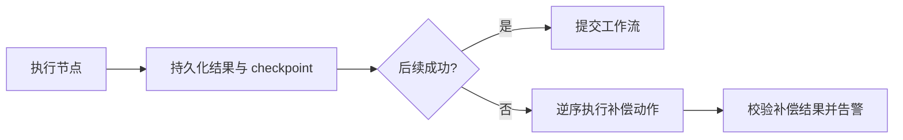

## Q：Agent Workflow 如何保证节点原子性，并在部分成功后安全回滚？

> 来源：字节剪映/Agent 一面【[美团 - Agent 开发岗（场景设计方向）](https://www.nowcoder.com/discuss/926273749555376128)追问：Agent 回滚机制（修改异常时恢复）？】

**新手答**：“每个节点只做一件事，失败时把数据库事务回滚。”

**高手答**：

节点原子性首先是职责与提交边界清晰：输入、输出、幂等键和副作用必须显式定义。但跨 LLM、对象存储、第三方 API 的工作流无法依靠一个数据库事务覆盖，因此要采用 Saga 式补偿：

每个有副作用的节点都定义 `execute`、`compensate` 和幂等键；先记录意图再执行外部操作，成功后落 checkpoint。恢复时根据持久状态判断是继续、补偿还是人工介入，不能仅凭模型记忆。补偿也可能失败，因此需要重试上限、死信队列和人工修复入口。对于支付、发信等不可真正撤销的操作，应使用预授权、延迟提交或人工确认，而不是伪装成可回滚。

**差距在哪**：新手把原子性等同数据库事务，高手理解分布式副作用只能靠幂等、checkpoint、Saga 补偿和人工兜底实现。面试官考的是 Agent 工作流的一致性设计。
