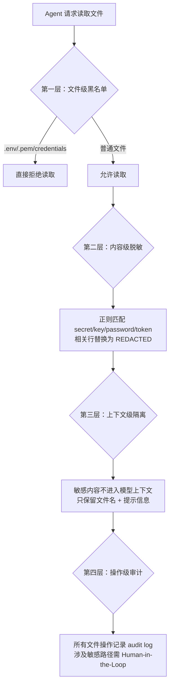

## Q：Coding Agent 看到 .env 文件会怎样？如何设计安全边界？

> 来源：Coding Agent面经（简历项目拷打）

**新手答**：“应该让 Agent 忽略 .env 文件。”

**高手答**：

“忽略”是最弱的防护——靠 Prompt 告诉模型“别看这个文件”，模型不一定听。问题的本质是：`.env` 包含 API Key、数据库密码等敏感信息，Agent 如果读取并放入上下文，可能导致三种泄露路径：

1. **日志泄露**：敏感信息出现在 trace/log 中被持久化
2. **模型记忆**：模型在后续对话中无意输出之前看到的密钥
3. **不当操作**：Agent 用读到的数据库密码执行了危险操作

**安全边界设计（四层防护）**：

**四层详解**：

| 层级 | 机制 | 防护目标 |
|------|------|---------|
| 文件级黑名单 | `.env` / `.env.*` / `credentials.*` / `*.pem` 等文件禁止读取，工具层直接拒绝 | 源头阻断——Agent 根本看不到 |
| 内容级脱敏 | 即使读到了，正则匹配敏感行，替换为 `[REDACTED]` | 即使黑名单漏了，内容也是脱敏的 |
| 上下文级隔离 | 敏感文件内容不进入模型上下文，只保留“此文件包含敏感信息”的提示 | 即使脱敏不彻底，模型也看不到原文 |
| 操作级审计 | 所有文件操作记录 audit log，敏感路径操作需人工确认 | 事后可追溯，实时可拦截 |

**实际产品做法（Claude Code 为例）**：

通过 `.claudeignore`（文件级排除）+ permission 模型（操作级审批）+ 工具白名单（能力级约束）三重机制实现安全边界。核心设计理念：**默认拒绝，显式授权**。

**差距在哪**：新手只想到“忽略”——这依赖模型是否听话，不可靠。高手通过文件黑名单、内容脱敏、上下文隔离、操作审计四层递进防护，任何一层被突破都有下一层兜底。面试官通过这个具体场景考察你对 Agent 安全设计的系统性思维——不是“告诉 Agent 别看”就完了，是“系统层面让它看不到、看到也无害、操作要审批”。
