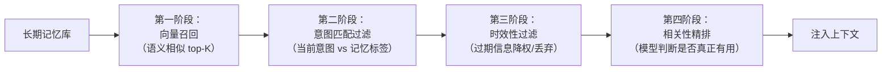

## 记忆检索与维护

### Q：如何判断当前对话与历史对话是否相关？

> 来源：字节 Agent 实习二面

**新手答**：“看关键词有没有重叠。”

**高手答**：

相关性判断是上下文管理的前置环节——Agent 需要决定是否召回历史对话来辅助当前回答。做错了要么遗漏关键信息，要么引入无关噪声。

**判断方法分三个层次**：

**1. 实体和意图匹配**（快、粗）：

- 提取当前对话的关键实体（人名、产品名、任务名）和意图标签
- 与历史对话的实体/意图做交集匹配
- 有交集 → 可能相关，进入下一步精判
- 无交集 → 大概率无关，跳过

**2. 语义相似度**（中等精度）：

- 对当前对话和历史对话分别做 embedding
- 计算余弦相似度，设阈值（如 0.7）
- 注意：不能只拿最后一句话做 embedding，应该取当前对话的主题摘要

**3. 模型精判**（慢、准）：

- 把当前对话和候选历史对话组合成一个 prompt，让小模型（7B）判断“这两段对话是否讨论同一主题或有因果关系”
- 适合高价值场景（如客服接续、任务继续），不适合每次都调

**工程实践中的组合策略**：

```text
当前对话 → 实体/意图提取（规则/小模型）
        → 用实体做倒排检索，召回候选历史
        → embedding 相似度粗排，保留 top-K
        → （可选）模型精排
        → 判断是否关联
```

**关键设计点**：

- **时间衰减**：越近的历史对话越可能相关，给相似度分数加时间衰减权重
- **主题切换检测**：如果用户明确说“换个话题”或提了一个完全无关的新需求，直接判定与历史无关
- **会话级 vs 跨会话级**：同一会话内的历史默认相关，跨会话的才需要判断

**差距在哪**：新手只想到关键词匹配，这在语义相近但用词不同时会失效。高手用三层递进的判断方法（实体匹配 → 语义相似 → 模型精判），且考虑了时间衰减和主题切换等实际场景。面试官考的是你能不能把“相关性判断”设计成一个可工程化的方案，而不是拍脑袋设阈值。

---

### Q：你会如何判断一条历史信息该进入长期记忆，还是只留在当前会话里？

> 来源：Agent 开发面试 30 题 / [去哪儿 AI 全栈 AI 面](https://www.nowcoder.com/feed/main/detail/9cf516b3c2404100baeac52564e40709)

**新手答**：“重要的存长期，不重要的只留会话。”

**高手答**：

“重要不重要”太主观了。需要一套**可程序化的判断标准**：

**进入长期记忆的条件（满足任一）**：

| 条件 | 示例 | 原因 |
|------|------|------|
| 用户显式声明的偏好 | “我不吃辣”“预算一般在 5000 以内” | 跨会话复用价值高 |
| 反复出现的模式 | 连续三次对话都查某只股票 | 隐式偏好，值得记住 |
| 身份性信息 | 姓名、角色、所在城市、公司 | 个性化服务的基础 |
| 已确认的事实性结论 | “上次排查发现是 Redis 配置问题” | 避免重复排查 |

**只留在当前会话的条件**：

| 条件 | 示例 | 原因 |
|------|------|------|
| 一次性的任务上下文 | “帮我写封邮件”的具体内容 | 任务完成后无复用价值 |
| 中间推理过程 | 模型的 chain-of-thought | 占空间大、复用价值低 |
| 临时性的环境信息 | “现在网络不好” | 下次对话时已过期 |
| 未经确认的猜测 | Agent 推测用户可能想要 X | 未验证的信息不应持久化 |

**工程实现**：每轮对话结束后，用一个轻量模型做“记忆准入判断”——从当前对话中提取候选记忆条目，按上述条件过滤，通过的写入长期存储。关键是**去重**——新记忆和已有记忆做语义相似度检查，重复的合并而非追加。

**差距在哪**：新手用“重要性”做主观判断。高手给出了可程序化的准入条件表——显式偏好、反复模式、身份信息、确认事实四类进长期，一次性上下文、中间过程、临时信息、未确认猜测只留会话。面试官考的是你能不能把模糊的“重要性”转化成可执行的工程规则。

---

### Q：记忆摘要、压缩、去重、合并这几件事，你会怎么设计触发时机？

> 来源：Agent 开发面试 30 题

**新手答**：“定时跑一个清理任务。”

**高手答**：

定时清理是最简单但最粗糙的方案——可能还没到清理时间记忆就爆了，也可能频繁清理浪费资源。更合理的做法是**事件驱动 + 阈值触发**的组合：

| 操作 | 触发时机 | 原因 |
|------|---------|------|
| **摘要** | 单次会话结束时 | 会话原始内容太长，摘要后再存入长期记忆 |
| **压缩** | 当前上下文 token 数达到窗口 70% | 预留 30% 给模型生成和新信息，不等到 100% 才压缩 |
| **去重** | 新记忆写入时 | 写入前和已有记忆做相似度检查，发现重复就合并而非追加 |
| **合并** | 同一主题的记忆条目超过 N 条时 | 5 条关于“用户喜欢日料”的记忆可以合并成 1 条 |

**设计关键点**：

1. **压缩不是简单截断**：不能直接砍掉前面的对话。用模型对历史消息做摘要压缩——保留关键决策和约束条件，丢弃中间推理过程
2. **去重要看语义不是看字面**：“用户偏好日料”和“用户喜欢吃日本菜”字面不同但语义重复，需要用 embedding 相似度判断
3. **合并要保留时间线**：合并后的记忆应保留“最早/最近出现时间”，方便后续做时效性判断

```text
触发策略优先级：
  写入时去重（实时）> 会话结束时摘要（会话级）> 上下文压缩（对话中）> 主题合并（后台异步）
```

**差距在哪**：新手用定时任务一刀切。高手按操作类型分别设计了不同的触发时机——摘要在会话结束、压缩在 token 阈值、去重在写入时、合并在条目超限时，且说清了每个操作的关键约束。面试官考的是你对记忆生命周期管理的工程化设计能力。

**追问：向量记忆库中，用户重复表述同一内容时，是重复存储还是语义合并？去重方案怎么设计？**

> 来源：阿里淘天 AI应用开发一面

用户说了三次“我不吃辣”——第一次直接说、第二次在点餐时说、第三次投诉时说。如果每次都存一条，记忆库迅速膨胀且检索时返回大量冗余。但简单去重又可能丢失上下文差异。

**写入时语义去重的三步方案**：

| 步骤 | 做什么 | 实现 |
|------|--------|------|
| 相似度检测 | 新记忆入库前，和已有记忆做 embedding 相似度匹配 | cosine similarity > 0.85 判为语义重复 |
| 冲突判断 | 语义相似但内容矛盾（“喜欢辣” vs “不吃辣”）→ 不合并，保留最新 | 用 LLM 做一致性判断 |
| 语义合并 | 确认是同一含义的重复 → 合并为一条，更新置信度和时间戳 | 保留最丰富的表述 + 出现次数计数 |

核心原则：**高频重复 = 高置信度**。“不吃辣”被说了 3 次，合并后这条记忆的权重应该更高，而不是存 3 条占 3 倍空间。

---

### Q：长期记忆检索时，怎么避免把“语义相关但当前无用”的内容召回进来污染理解？

> 来源：Agent 开发面试 30 题

**新手答**：“调高相似度阈值。”

**高手答**：

单纯调高阈值会漏掉真正有用的记忆。问题的根源不是“检索到了不相关的”，而是**“语义相关”不等于“当前有用”**。

比如用户以前聊过北京的餐厅推荐，现在在聊北京的天气——“北京”“推荐”这些词语义上确实相关，但餐厅记忆对天气问题毫无帮助。

解决方案是**多阶段过滤**：



1. **意图匹配过滤**：每条长期记忆存储时打上意图标签（美食、出行、技术、偏好等），召回时只取和当前意图匹配的类别
2. **时效性过滤**：带时间戳的记忆检查是否过期——“上周的天气”对本周没用，但“用户不吃辣”长期有效
3. **相关性精排**：用一个轻量模型或 Cross-Encoder 判断：“这条记忆对回答当前问题是否有帮助？”

关键原则：**宁可少召回，不要多召回**。注入一条无关记忆的危害比漏掉一条有用记忆更大——因为无关信息会干扰模型的推理方向，而缺少信息模型会主动追问。

**差距在哪**：新手靠调阈值——这是一维调节，解决不了“语义相关但无用”的核心矛盾。高手用四阶段过滤（向量召回 → 意图匹配 → 时效性 → 精排）逐步缩小范围，且给出了“宁少勿多”的设计原则。面试官考的是你对记忆检索质量的工程化思考。

---

### Q：如果用户偏好、事实记忆、系统状态三者冲突了，Agent 应该信谁？

> 来源：Agent 开发面试 30 题

**新手答**：“听用户的。”

**高手答**：

不能无条件听用户的。三者的优先级要**按冲突类型分别处理**：

**冲突类型 1：用户偏好 vs 事实记忆**

用户说“我预算不限”，但历史记忆显示用户每次都选最便宜的 → **以当前偏好为准，但可以柔性提醒**：“好的，预算不限。顺便说一下，之前您几次选的都是经济型方案，需要我也推荐一些高端选项吗？”

原则：当前会话的显式声明 > 历史隐式行为模式。

**冲突类型 2：用户偏好 vs 系统状态**

用户说“帮我订明天的机票”，但系统状态显示用户账户已被风控冻结 → **系统状态优先，必须拦截**。不能因为用户想做就帮他做——安全约束、权限约束、业务规则是硬性边界。

原则：系统安全/合规约束 > 一切用户偏好。

**冲突类型 3：事实记忆 vs 系统状态**

记忆里存的是“用户 VIP 等级为金卡”，但系统实时查询显示已降级为银卡 → **以系统实时状态为准**。记忆可能过期，系统状态是当前事实。

原则：实时系统状态 > 历史记忆快照。

**总结优先级**：

```text
系统安全/合规约束（不可违反）
    > 系统实时状态（当前事实）
        > 用户当前显式声明（当前意愿）
            > 历史记忆/行为模式（参考但可被覆盖）
```

**差距在哪**：新手无条件听用户的——但如果用户要做违反安全规则的事呢？高手按冲突类型分别处理，给出了明确的优先级链：安全 > 实时状态 > 当前声明 > 历史记忆。面试官考的是你在设计 Agent 决策逻辑时有没有考虑过“信息源冲突”这个关键问题。
