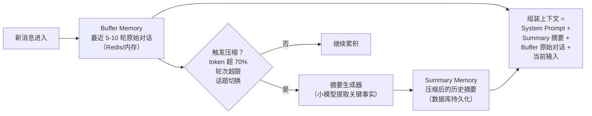
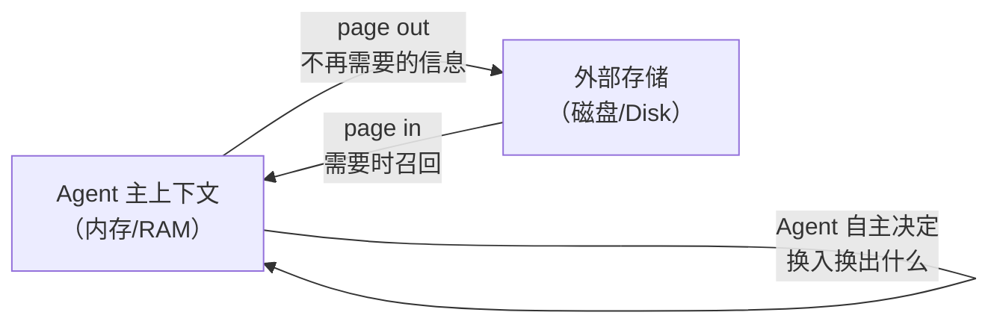
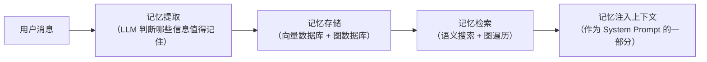
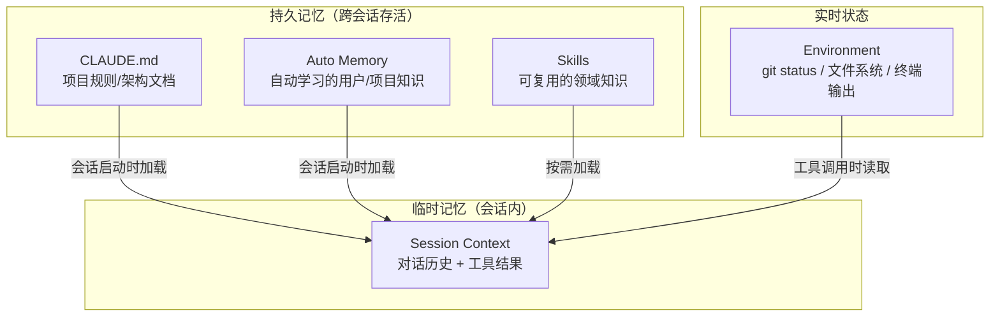
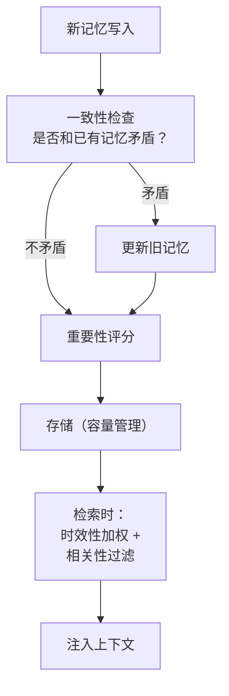
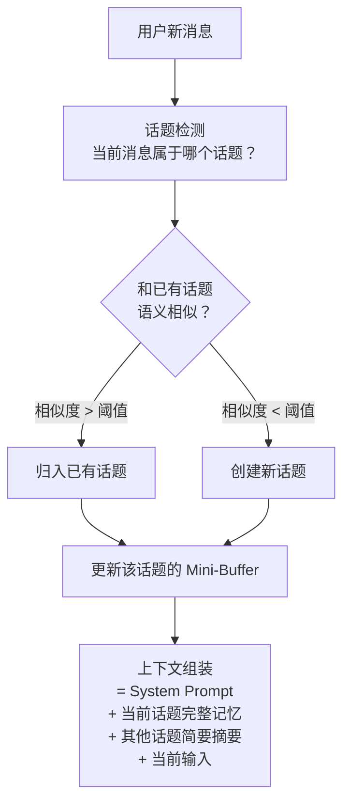
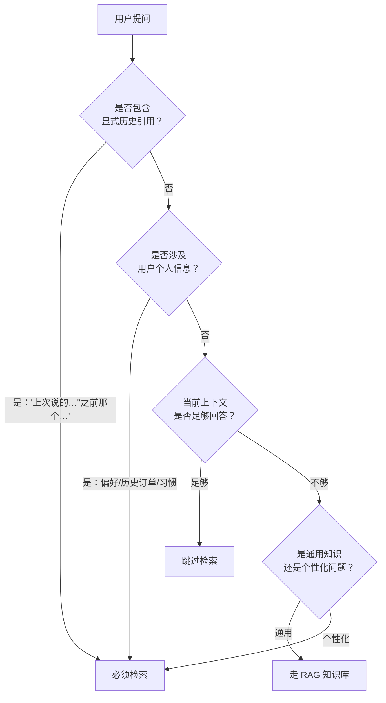
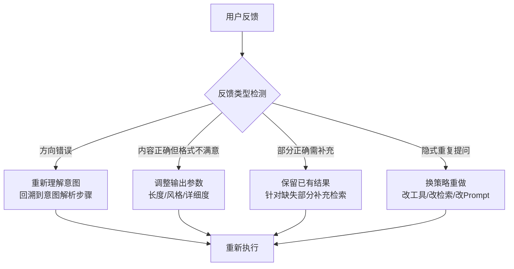
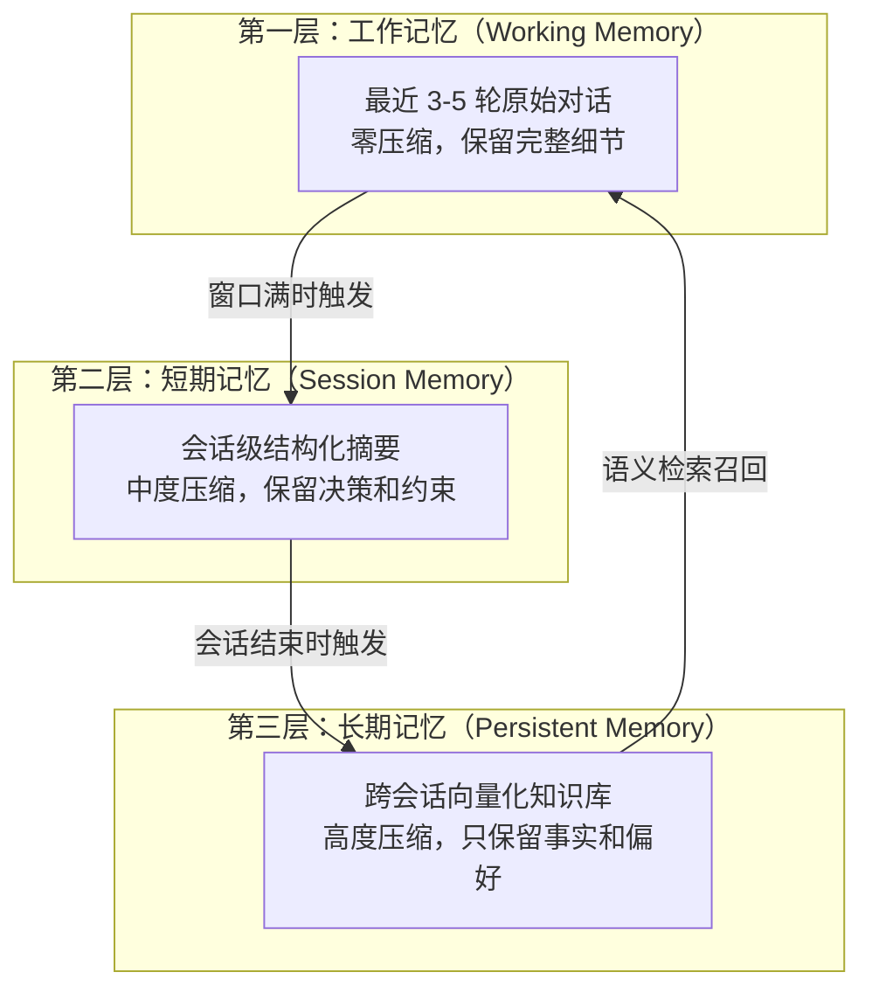
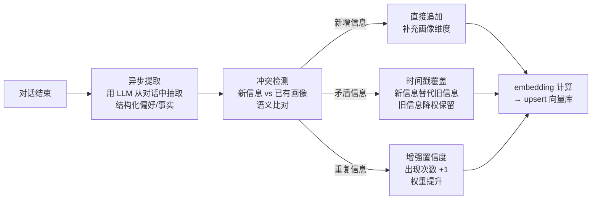

## 会话记忆与前沿

### Q：会话记忆具体是怎么实现的？滑动窗口设几轮？摘要压缩怎么触发？

> 来源：高德 AI 应用开发实习一面【[字节二面（Trae）](https://www.nowcoder.com/discuss/924821959647440896)追问：上下文压缩怎么做？】【[抖音电商Agent全栈开发工程师一面](https://www.nowcoder.com/discuss/925066865183858688)追问：记忆压缩怎么做？进行到第十一轮时，应该给模型哪些信息？】【[美团 - Agent 开发岗（场景设计方向）](https://www.nowcoder.com/discuss/926273749555376128)追问：记忆压缩（减少上下文同时保留关键信息）的实现？】【[深圳tuitti视界之外实习一面](https://www.nowcoder.com/feed/main/detail/9b1329caf4b64389a0ab666585bda045)追问：这个摘要是怎样使用的？】

**新手答**：“存最近几轮对话就行。”

**高手答**：

单纯存最近几轮是最朴素的实现，但生产环境中会话记忆需要一个**双层架构：Buffer Memory（近期原始对话）+ Summary Memory（历史压缩摘要）**。

**Buffer Memory（滑动窗口）**：

保留最近 5-10 轮的原始对话。为什么是这个范围？

- 5 轮对话大约消耗 2K-4K token，覆盖了绝大多数即时上下文需求
- 太少（<3 轮）→ 连上一个问题的追问都接不上
- 太多（>15 轮）→ 大量 token 浪费在已经不相关的早期闲聊上

存储介质选 Redis 或内存（快速读写），因为 Buffer 的访问频率极高——每轮对话都要读。

**Summary Memory（摘要层）**：

当 Buffer 中的旧轮次被挤出去时，不是直接丢弃，而是经过摘要压缩后存入持久化存储（数据库）。

**摘要压缩的触发条件**（满足任一即触发）：

| 触发条件 | 具体阈值 | 原因 |
|---------|---------|------|
| Token 数超限 | 总上下文达到窗口的 70% | 预留 30% 给模型生成和新信息 |
| 轮次超限 | Buffer 超过 N 轮（如 8 轮） | 最早的轮次已经不太相关 |
| 话题切换 | 当前轮与 Buffer 的语义相似度低于阈值 | 话题变了，旧话题的细节可以压缩 |

**压缩实现**：将最早的 K 轮对话喂给一个小模型，Prompt 要求：“从以下对话中提取关键事实、用户偏好、已做决策和未解决问题。”

**压缩时保留什么、丢弃什么**：

```text
✅ 保留：用户偏好、关键决策、事实性承诺、未解决的问题
❌ 丢弃：寒暄客套、重复信息、中间推理步骤
```

**双层流转全景**：



**差距在哪**：新手只有一个简单的 Buffer，不知道溢出后怎么办。高手设计了双层架构（Buffer + Summary），明确了滑动窗口的轮次范围及其原因，定义了三种压缩触发条件，且区分了压缩时该保留和该丢弃的信息类型。面试官考的是你能不能把“存最近几轮”这个模糊概念，落地成一个有触发机制、有存储分层、有信息筛选策略的完整方案。

---

### Q：有没有了解过最前沿的记忆设计？

> 来源：字节 Agent 开发实习一面 【CVTE AI应用工程师一面追问：openclaw 的记忆机制怎么实现的？有借鉴吗】

**新手答**：“用向量数据库存历史对话。”

**高手答**：

前沿的 Agent 记忆研究正在从“被动存储”走向“主动知识管理”。三个最值得关注的方向：

**1. MemGPT / Letta——虚拟内存管理**

类比操作系统的虚拟内存：主上下文窗口 = “内存”，外部存储 = “磁盘”。



核心创新：**把上下文管理变成了 Agent 可以主动调用的操作**——Agent 自己决定“记住什么、忘掉什么、什么时候召回”。不是被动地被截断，而是主动地管理自己的记忆空间。

**2. Generative Agents（Stanford）——记忆的反思与抽象**

斯坦福“AI 小镇”实验中提出的三层记忆机制：

```text
观察流（Observation Stream）
  → 反思（Reflection）：定期元认知——"最近观察到的最重要洞察是什么？"
    → 规划（Planning）：基于反思结果调整行为策略
```

关键机制：
- **重要性评分**：每条记忆按 **时效性 x 重要性 x 相关性** 综合打分
- **反思触发**：当最近记忆的重要性累计分数超过阈值时触发一次 Reflection，而不是简单按时间间隔
- **效果**：Agent 能形成“关系”、记住过去的交互、随时间演化行为模式

Reflection 和简单 Summarization 的本质区别：Summarization 压缩信息量，Reflection 产生**原始记忆中不存在的新认知**（归纳共性、识别模式、推导策略）。

**3. Claude Code 的实践路线——工程化分层记忆**

没有用复杂的记忆架构，而是用简单但有效的分层方案：Auto Memory 文件 + CLAUDE.md + Context Compaction。

```text
学术路线：复杂的记忆管理算法（MemGPT 的换页、Generative Agents 的反思）
工程路线：简单、可调试、可维护的分层文件系统（Claude Code）

生产系统更倾向后者——简单可调试的记忆 > 精巧但脆弱的架构
```

**元趋势**：记忆正在从**被动存储**走向**主动知识管理**——Agent 不只是存储和检索，还在**筛选、抽象、自我反思**自己的记忆。未来的方向是“给 Agent 管理自己记忆的工具”，而不是“帮 Agent 建更大的记忆库”。

**差距在哪**：新手只知道向量数据库做检索。高手能讨论 MemGPT 的虚拟内存范式（Agent 自主管理上下文换入换出）、Generative Agents 的反思机制（从记忆中产生新认知）、以及生产环境中简单分层记忆的工程优势，展现出对前沿研究的了解和对工程落地的务实判断。面试官考的是你的技术视野——知不知道这个领域最前沿在探索什么方向。

**追问：对比 OpenClaw 和 Hermes 的记忆机制，重点说说分层压缩方案和 .md 文件使用方式？**

> 来源：淘宝闪购 Agent 一面

两者代表了 Agent 记忆的两种设计哲学：

| 维度 | OpenClaw | Hermes |
|------|----------|--------|
| 核心理念 | 时间轴分层压缩 | 情景记忆(Episodic Memory) |
| 压缩策略 | T-1h 完整保留 → T-24h 段落摘要 → T-7d 关键词图 | 双索引（语义+时间），长历史按事件聚类 |
| 召回方式 | 语义相似度 + 时间衰减加权 | 事件关联度 + 上下文匹配 |
| .md 文件角色 | Human-in-the-Loop 审查入口，人可直接编辑记忆 | 配置文件，定义记忆策略和索引规则 |
| 优势 | 压缩粒度精细，长历史不膨胀 | 事件间关联保留好，适合多轮复杂任务 |
| 劣势 | 关键词图层可能丢失语义细节 | 长历史压缩粒度不如 OpenClaw |

**实践融合方案**：工程中可取两者之长——用 OpenClaw 的分层压缩策略控制存储规模，用 Hermes 的双索引提升召回质量，.md 文件作为 human-in-the-loop 审查接口让人可以直接校正记忆偏差。

**追问：Mem0 的原理是什么？和自己实现记忆有什么区别？**

> 来源：美团Keeta Agent开发一面

Mem0 是目前开源社区最流行的 Agent 记忆中间件，核心定位是**「给任何 LLM 应用加上长期记忆」**。

**Mem0 的工作原理**：



核心流程：每轮对话后，用 LLM 从对话中抽取值得记住的信息（偏好、事实、约束），以结构化形式存入向量数据库；下一轮对话时，根据当前 query 检索相关记忆，注入上下文。

**Mem0 的关键设计**：

| 设计点 | 实现方式 | 解决的问题 |
|--------|---------|-----------|
| 记忆抽取 | LLM 判断「这段对话有什么值得记住的」 | 不是全存，而是选择性存储 |
| 冲突处理 | 新记忆和旧记忆矛盾时，用 LLM 判断保留哪个 | 防止过期信息污染 |
| 双存储 | 向量数据库（语义检索）+ 图数据库（关系推理） | 兼顾语义相似和实体关联 |
| 用户隔离 | 每个用户独立的记忆空间 | 多用户场景不串记忆 |

**和自己实现记忆的区别**：

自己实现通常是**粗粒度的全量存储**——把对话历史全部存进向量库，检索时按相似度召回。Mem0 多了两个关键步骤：**选择性抽取**（不是所有信息都值得记）和**冲突消解**（用户改了偏好要更新旧记忆）。代价是每轮多一次 LLM 调用做抽取判断，但记忆质量显著提升。

---

### Q：Claude Code 的记忆架构是什么？上下文真的等于记忆吗？

> 来源：字节 Agent 开发实习一面 【小红书数据库智能化一面追问：主流 Agent 与 Claude Code 的上下文管理策略】【[阿里边缘bu 秋招一面 （已过）](https://www.nowcoder.com/feed/main/detail/bdebbb6088b6405e9eb2bd2c345acb6e)追问：你读过哪些 Claude Code 源码，了解它的上下文管理机制吗？】

**新手答**：“上下文就是记忆，对话历史就是全部。”

**高手答**：

Claude Code 的记忆**不是**一个单一系统，而是一个**多层架构**，每一层解决不同的持久化和访问需求：

**五层记忆架构**：

| 层级 | 持久性 | 容量 | 更新方式 | 访问时机 |
|------|--------|------|---------|---------|
| 会话上下文（Session Context） | 仅当前会话 | Token 窗口限制 | 自动（每轮更新） | 始终加载 |
| 项目记忆（CLAUDE.md） | 持久化 | 无硬性限制 | 手动维护 | 会话启动时加载 |
| 自动记忆（Auto Memory） | 持久化 | 无硬性限制 | Claude 自动写入 | 会话启动时加载 |
| 技能记忆（Skills） | 持久化 | 无硬性限制 | 手动创建 | 按需加载 |
| 环境状态（Environment） | 实时 | N/A | 外部变化 | 按需（工具调用） |

**上下文等于记忆吗？——不等于。**

上下文是**工作记忆**（当前窗口中加载的内容），而记忆是一个更广的概念——包含了跨会话持久化的知识。两者的关系：

```text
上下文 ⊂ 记忆

上下文：临时性的，会话结束即消失
记忆：持久性的，跨会话存活

上下文：受 token 窗口硬限制
记忆：存储在外部文件中，无硬性容量限制

压缩（Compaction）会销毁上下文细节
但 CLAUDE.md 和 Auto Memory 文件不受影响
```



**核心洞察**：Claude Code 的设计创新在于认识到**不同类型的信息需要不同的持久化和访问模式**。不是所有东西都该塞进上下文窗口——会话上下文是高速但易失的“内存”，CLAUDE.md 和 Auto Memory 是可靠但需要显式加载的“磁盘”，环境状态是实时但需要主动查询的“外设”。

**差距在哪**：新手把上下文等同于记忆，认为对话历史就是 Agent 知道的一切。高手能画出五层记忆架构，清楚地区分临时上下文与持久记忆的关系——上下文只是记忆加载到当前会话的子集，Compaction 会销毁上下文但不影响持久记忆文件。面试官考的是你对 Agent 记忆系统的结构性认知，而不只是“对话历史”三个字。

---

### Q：什么是上下文缓存（Prompt Caching）？它在 Agent 系统中有什么价值？

> 来源：蚂蚁 AI应用开发 二面【阿里 Agent Infra 一面题库同题：上下文预计算与 Prefix Cache】【[全栈实习一面，20分钟居然问这么细😂](https://www.nowcoder.com/feed/main/detail/4af1e257116e4e36970c6e0d8bf2f70e)追问：你的项目有没有做前上下文缓存、前缀缓存？】

**新手答**：“就是把常用的 Prompt 缓存起来，下次直接用。”

**高手答**：

上下文缓存（Prompt Caching）是模型服务层面的优化技术。核心原理：当多次 API 调用共享相同的 Prompt 前缀时，模型服务端可以**缓存前缀部分的 KV Cache**，后续请求只需要计算新增的部分，大幅降低延迟和成本。

**在 Agent 系统中的价值**：

Agent 的典型调用模式是：每轮对话都带上完整的 System Prompt + 工具定义 + 历史对话。其中 System Prompt 和工具定义在整个会话中不变，可能占 2000-5000 token——每次都重新计算这部分是巨大的浪费。

| 场景 | 不用缓存 | 用缓存 | 节省 |
|------|---------|-------|------|
| 10 轮对话 | 每轮处理完整 System Prompt | 第 2-10 轮跳过前缀计算 | ~40% token 成本 |
| 多用户相同 Agent | 每用户独立处理 | 跨用户共享前缀缓存 | 延迟降低 50%+ |

**工程实践**：

1. **前缀稳定性**：缓存命中要求前缀**逐字节一致**。动态注入的内容（如用户画像、时间戳）不能放在 System Prompt 开头，否则前缀不匹配导致缓存失效。正确做法：静态内容（身份、规则、工具定义）放前面，动态内容放后面

2. **缓存粒度**：Anthropic 的 Prompt Caching 以 block 为单位缓存，支持在请求中用 `cache_control` 标记缓存断点。OpenAI 的自动前缀匹配则不需要显式标记

3. **在 Agent 循环中的应用**：Agent 的 ReAct 循环每轮都在上下文末尾追加新的 Thought-Action-Observation，前缀部分（System Prompt + 历史轮次）保持不变——天然适合前缀缓存

**差距在哪**：新手把上下文缓存等同于“存 Prompt 字符串”。高手理解的是模型服务层面的 KV Cache 复用机制，且能说清楚在 Agent 系统中的适用场景（System Prompt 不变、工具定义不变）和工程约束（前缀必须一致）。面试官考的是你对模型调用成本优化的工程理解。

---

### Q：长周期对话（间隔数周后继续）如何管理历史？冷启动怎么做？

> 来源：淘宝闪购 Agent 一面 / [阿里千问 Agent 开发一面](https://www.nowcoder.com/feed/main/detail/463438ee0d9e403b98e8578a05ba4e3f)

**新手答**：“把所有历史存数据库，下次全部加载到上下文。”

**高手答**：

长周期对话的核心挑战不是“存不存”，而是**间隔数周后如何用最少 token 恢复最相关的上下文**。全量加载既不现实（token 限制）也不必要（大部分历史已无关）。

**分层压缩策略**：

```text
近期（T < 1h）：  完整原文保留，无压缩
中期（1h < T < 24h）：段落级摘要，保留关键决策和结论
远期（T > 7d）：  关键事件 + 决策结果 → 结构化存入向量数据库
```

**冷启动流程**（间隔数周后的新会话）：

1. **检索相关历史**：基于新会话的首条消息，向量检索最相关的历史片段（Top-K，通常 K=3-5）
2. **注入 System Prompt**：将检索到的历史摘要作为背景信息注入 system prompt，格式如“上次对话关键信息：...”
3. **渐进补充**：如果用户引用了更早的上下文（“上次说的那个方案”），再按需检索补充

长周期任务还要将“一次会话”与“持续任务档案”分开。档案保存经确认的目标、约束、决策、待办、证据指针和版本；新会话只按当前任务投影必要部分。不同用户、项目和任务必须用作用域与 ACL 隔离，避免检索把其他任务的历史带入当前执行。

**关键设计决策**：

| 决策点 | 方案 | 原因 |
|-------|------|------|
| 压缩触发时机 | 会话结束时异步压缩 | 不影响实时交互体验 |
| 摘要粒度 | 按“话题段”而非固定长度 | 保持语义完整性 |
| 召回排序 | 时间衰减 × 语义相似度 | 既相关又新鲜的优先 |
| 冲突处理 | 历史结论 vs 当前输入冲突时，以当前为准 | 用户的最新意图优先 |

**和短周期对话管理的本质区别**：短周期靠滑动窗口就够了，长周期的核心是**压缩质量**——摘要不能丢关键信息，结构化存储不能丢决策上下文。压缩是一次性的（压坏了不可逆），所以远期存储要保留原文备查，结构化数据只是索引层。

**差距在哪**：新手的方案会撑爆上下文窗口或加载大量无关历史。高手展示了分层压缩（近/中/远三层策略）+ 语义冷启动（检索注入而非全量加载）的完整方案。面试官考的是你对“记忆 ≠ 存储，记忆 = 选择性遗忘 + 精准召回”这个核心认知的理解。

---

### Q：设计会话记忆系统时需要考虑哪些维度？

> 来源：高德 AI 应用开发实习一面

**新手答**：“考虑存多少轮。”

**高手答**：

只考虑容量是远远不够的。设计会话记忆系统需要从**五个核心维度**出发：

| 维度 | 实现策略 | 常见陷阱 |
|------|---------|---------|
| **时效性** | 衰减函数：recency-weighted scoring，越近的记忆权重越高 | 有些信息永远不该衰减（用户名、过敏信息），需要设置“不衰减白名单” |
| **相关性** | 注入上下文前做语义相似度过滤，只取和当前查询相关的记忆 | 不过滤就全塞进去，导致无关记忆干扰模型推理 |
| **重要性** | 重要性评分器（规则 or LLM）：用户承诺（“我要退货”）、关键决策、纠错信息为高重要性；闲聊为低重要性 | 把所有记忆一视同仁，闲聊占满了上下文空间 |
| **容量** | 固定 token 预算分配：系统指令 > 当前查询上下文 > 相关记忆 > 工具结果 | 记忆占了太多 token，挤压了当前任务的空间 |
| **一致性** | 用户更新偏好时（“其实我想要红色的，不是蓝色的”），旧记忆必须被更新而非追加 | 只做追加不做更新，导致记忆自相矛盾，模型不知道该信哪条 |

**五个维度之间的关系**：



**元原则**：记忆不是一份日志（log），而是一个**精心维护的知识库**。日志只管追加，知识库要管理增删改查和数据质量。很多系统把记忆当日志来做——只管往里写、不管清理和更新——最终记忆越来越多，质量越来越差，模型被噪声淹没。

**差距在哪**：新手只想到了容量这一个维度。高手从时效性、相关性、重要性、容量、一致性五个维度系统分析，每个维度都有具体的实现策略和常见陷阱。面试官考的是你对记忆系统的认知深度——它不是一个“存东西的地方”，而是一个需要多维度设计的知识管理系统。

---

### Q：用户对话中频繁切换话题，会话记忆该怎么设计？

> 来源：高德 AI 应用开发实习一面

**新手答**：“按时间顺序存就行。”

**高手答**：

按时间线性存储在话题频繁切换时会崩溃。举个例子：用户先问机票 → 切到酒店 → 又回到机票问“刚才说的那个航班呢”。如果用简单的滑动窗口，第一次讨论机票的对话可能已经被挤出去了，Agent 完全接不上。

核心问题是：**线性对话历史无法处理话题交错**。解决方案是**基于话题分段的记忆架构**。

**整体架构**：



**五个关键机制**：

**1. 话题检测**：对每条用户消息做 embedding，和当前所有活跃话题的 embedding 计算相似度。相似度高于阈值 → 属于该话题；低于所有话题 → 新话题。

**2. 分话题记忆段**：每个话题维护独立的 mini-buffer 和摘要。数据结构：

```text
topics: [
  { id: "flight", label: "机票预订", turns: [...], summary: "...", last_active: "..." },
  { id: "hotel",  label: "酒店预订", turns: [...], summary: "...", last_active: "..." }
]
```

**3. 活跃话题追踪**：维护一个“话题栈”或“话题集合”。当前正在讨论的话题为活跃状态，其他话题为“暂停”（parked）状态——暂停不等于遗忘。

**4. 话题重激活**：当用户说“刚才说的机票呢”时，检测到话题切换回“机票”→ 将机票话题的记忆段重新加载到活跃上下文中，Agent 能无缝接续之前的讨论。

**5. 上下文组装**：

```text
当前上下文 = System Prompt
           + 活跃话题的完整记忆（原始对话）
           + 暂停话题的简要摘要（一句话概括进展）
           + 当前用户输入
```

**关键难点：话题检测的准确性**。误判会导致两种问题：

- 把同一话题的延续误判为新话题 → 记忆碎片化，上下文断裂
- 把新话题误归为已有话题 → 记忆污染，不同话题的信息混杂

**降级方案**：如果话题检测不够可靠，可以用更简单的方式——仍然按时间线保留所有近期对话，但给每轮对话打上话题标签。检索时按话题标签过滤，而不是按时间截断。这样即使检测偶尔出错，也不会丢失关键信息。

**差距在哪**：新手按时间线性存储，话题一交错就丢失上下文。高手设计了基于话题分段的记忆架构，包括话题检测、分话题 buffer、活跃追踪、重激活和智能上下文组装五个机制。核心洞察是：**会话记忆应该按话题组织，而不是按时间组织**。面试官考的是你面对非线性对话场景时的架构设计能力。

---

### Q：Lost in the Middle 问题是什么？有哪些解决方案？

> 来源：淘宝闪购 AI应用研发 一面

**新手答**：“把重要信息放在 Prompt 的前面就行了。”

**高手答**：

Lost in the Middle 是指模型处理长上下文时，**对中间位置信息的注意力显著低于开头和结尾**——即使信息在上下文里，放在中间位置也可能被“忽略”。这个现象在 2023 年被 Stanford 的论文系统验证过。

解决方案从四个层面入手：

**1. 信息布局优化**

最直接的策略——把最重要的信息放在上下文的**开头或结尾**：
- 检索结果按相关度排序后，最相关的放最前面
- 系统级指令放在 System Prompt 开头
- 关键约束在 Prompt 末尾再强调一次

**2. 检索阶段优化**

从源头减少“中间”的长度：
- 控制检索结果数量：不是越多越好，Top-3 到 Top-5 通常就够
- Rerank 后严格截断：只保留真正相关的内容，宁缺毋滥
- 结果去重：多路召回后去除重复或高度相似的内容

**3. 上下文压缩**

把长上下文压缩成更短、更密集的形式：
- 摘要压缩：对检索结果先做摘要，只保留与查询相关的部分
- 递归摘要：超长文本分段摘要后再合并
- 提取式压缩：只抽取与问题直接相关的句子，丢弃背景信息

**4. 结构化标记**

用显式的结构标记帮助模型定位信息：
- 给每段检索结果加编号和标签：`[文档1-最相关]`、`[文档2-补充]`
- 在 Prompt 中显式引用：`请主要参考文档1回答`
- 分隔符：用明确的分隔符区分不同来源的信息

**本质理解**：Lost in the Middle 的根因是 Attention 机制的分布不均匀——位置靠前和靠后的 token 天然获得更多注意力权重。上述方案都是在工程层面缓解这个问题，而不是从模型层面根治。随着模型上下文处理能力的提升（如 Claude 的 200K 上下文），这个问题在缓解但未消失。

**差距在哪**：新手只知道“放前面”这一个策略。高手从信息布局、检索控制、上下文压缩、结构化标记四个层面系统解决，且理解问题的本质是 Attention 分布不均。面试官考的是你对长上下文处理的工程经验和对底层机制的理解。

---

### Q：怎么判断当前用户的提问需不需要去检索长期记忆？

> 来源：淘天 Agent 开发

**新手答**：“每次都检索，反正多查一次也不慢。”

**高手答**：

每次都检索的方案在生产中有三个问题：**延迟增加**（向量检索 50-200ms）、**噪声引入**（召回不相关的历史信息污染上下文）、**成本浪费**（Embedding + 向量检索都要钱）。需要一个**检索路由判断**：

**判断框架**：



**实现方案**：

| 方案 | 做法 | 适用场景 |
|------|------|---------|
| **规则先行** | 关键词检测（「上次」「之前」「我的」「还记得」等）→ 触发检索 | 覆盖显式引用，零延迟 |
| **意图分类器** | 轻量分类器判断当前 query 是否需要历史上下文（二分类） | 隐式引用场景 |
| **相关性预判** | 用当前 query 和最近 N 轮对话的 embedding 算相似度，低于阈值才去检索长期记忆 | 平衡精度和成本 |

**关键工程细节**：即使判断「需要检索」，也不是把所有长期记忆都拉回来。检索后还要做**相关性过滤**——召回的记忆和当前 query 的相关度低于阈值就丢弃，避免注入过时或无关的历史信息。

**差距在哪**：新手的「每次都检索」在 Demo 里没问题，上线后会带来延迟、噪声和成本三重问题。高手设计了分层判断框架——先规则过滤，再意图分类，最后相关性预判——在检索价值和成本之间取得平衡。面试官考的是你对记忆系统「精准召回」而非「暴力检索」的工程认知。

---

### Q：怎么实现多轮对话过程中，根据用户反馈自我调整的功能？

> 来源：腾讯 AI 应用开发实习一面

**新手答**：「把用户反馈加到上下文里，模型自然就会调整。」

**高手答**：

把反馈丢进上下文只是最原始的做法——模型可能「看到了但没改」。真正的自我调整需要**显式检测反馈 → 识别调整方向 → 修改执行策略**三步闭环：

**反馈检测——区分显式和隐式**：

| 反馈类型 | 示例 | 检测方式 |
|---------|------|---------|
| 显式否定 | 「不对」「错了」「我问的不是这个」 | 关键词 + 意图分类 |
| 显式修正 | 「太长了」「简洁点」「换个角度」 | 解析用户期望的调整方向 |
| 隐式否定 | 重复相同问题、换个说法再问一次 | 检测 query 和上一轮 query 的语义重叠度 |
| 隐式满意 | 追问细节、在回答基础上继续深入 | 检测 query 是上一轮回答的自然延伸 |

**调整策略——按反馈类型走不同分支**：



**工程实现的三个关键点**：

1. **反馈不只是放进上下文，而是转化为结构化指令**：检测到「太长了」后，不只是在 Prompt 里加一句「用户说太长了」——而是把输出控制参数从 `max_tokens=1000` 调到 `max_tokens=300`，或在 System Prompt 里注入「本轮回答限制在 3 句话内」。结构化参数比自然语言提示更可靠

2. **累积偏好跨轮生效**：用户连续两次说「简洁点」，应该记住这个偏好并应用到后续所有回答，而非每轮重新判断。实现方式是维护一个**会话级偏好状态**：

```text
session_preferences = {
    "output_style": "concise",     // 用户反馈「太长了」后更新
    "detail_level": "overview",    // 用户反馈「不需要这么细」后更新
    "language_style": "technical"  // 用户追问技术细节后推断
}
```

3. **隐式反馈的检测阈值**：用户重复提问不一定是不满意——可能是换了个角度。判断标准是**语义重叠度 + 是否有新约束**：重叠度高且没有新约束 → 上一轮回答不满意，换策略；重叠度高但加了新约束 → 正常追问，基于上一轮结果继续

**差距在哪**：新手以为「放进上下文模型就能调整」——这依赖模型的隐式理解，不可控。高手把反馈处理拆成检测→分类→结构化调整三步，用显式参数控制而非依赖模型自行理解，且区分了会话级偏好和单轮调整。面试官考的是你对多轮对话系统**可控性**的理解——不是「模型能不能做到」，而是「你怎么保证它每次都做到」。

---

### Q：基于滑动窗口对最近 N 轮进行摘要时，是将之前摘要和新摘要合并还是分别保留？各自适合什么场景？

> 来源：快手 AI应用开发 一面

**新手答**：“合并成一条摘要就行，省空间。”

**高手答**：

这是一个经典的摘要策略选型问题。两种方案本质上是**信息密度和时序保留**之间的权衡：

| 维度 | 合并式摘要（Rolling Summary） | 分段式摘要（Segmented Summary） |
|------|---------------------------|-------------------------------|
| 做法 | 每次新内容到来时，将旧摘要 + 新对话一起重新生成一份更新的单一摘要 | 每段独立生成摘要，按时间线保留多份摘要 |
| Token 占用 | 始终只占一份摘要的空间（固定大小） | 随时间线性增长（每段一份） |
| 时序信息 | 丢失——无法区分“先说了什么、后说了什么” | 保留——每份摘要带时间标记，时序清晰 |
| 信息衰减 | 早期信息经过多次压缩后逐渐丢失细节 | 每段独立压缩，早期段落精度不衰减 |
| 适合场景 | 单一目标的稳定任务（客服工单、单次购买流程） | 话题频繁切换、需要回溯的长对话（技术咨询、项目讨论） |

**工程实现的关键细节**：

```text
合并式实现：
  prompt = f"将以下旧摘要和新对话合并为一份更新的摘要：\n旧摘要：{old_summary}\n新对话：{new_turns}"
  → 输出一份新摘要，替换旧摘要

分段式实现：
  每 N 轮生成一份独立摘要，存入 list：
  summaries = [
    {time: T1, summary: "讨论了预算问题..."},
    {time: T2, summary: "切换到技术选型..."},
    {time: T3, summary: "确认了部署方案..."},
  ]
  检索时按时间或语义相关度选择注入哪几段
```

**混合策略**（生产推荐）：对最近 2-3 段用分段式保留时序细节，更早的段落合并为一份全局摘要。兼顾 token 预算和时序信息保留。

**差距在哪**：新手不区分两种策略直接选合并。高手理解两者的 trade-off——合并省 token 但丢时序，分段保时序但占空间——并根据任务特征选型，生产中用混合策略取长补短。面试官考的是你对摘要压缩策略的精细化设计能力。

---

### Q：如果让你设计一个三层记忆机制，你会如何设计？从整体架构和具体压缩方法进行描述。

> 来源：快手 AI应用开发 一面

**新手答**：“短期记忆、长期记忆、向量数据库，三层。”

**高手答**：

三层记忆的设计核心不是“分几层存”，而是**每层的信息密度、访问模式和压缩触发机制**的协同设计：

**整体架构**：



**三层详细设计**：

| 层级 | 内容 | 存储 | 压缩方法 | 触发时机 |
|------|------|------|---------|---------|
| 工作记忆 | 最近 3-5 轮原始消息 | 内存/Redis | 无压缩 | 每轮对话自动滚动 |
| 短期记忆 | 超出窗口的对话 → 结构化摘要 | 数据库（JSON） | LLM 提取关键决策 + 约束条件 + 未解决问题 | 工作记忆窗口满时 |
| 长期记忆 | 用户偏好、事实性知识、历史决策模式 | 向量数据库 + KV | 实体提取 → embedding → upsert | 会话结束时异步提取 |

**压缩方法的具体实现**：

**工作记忆 → 短期记忆**（结构化压缩）：

```text
压缩 Prompt：
  "从以下对话中提取：
   1. 用户的关键约束（预算、时间、偏好）
   2. 已确认的决策
   3. 未解决的问题
   输出 JSON 格式。"

输入：5 轮原始对话（~2000 token）
输出：结构化摘要（~200 token）
压缩率：~10:1
```

**短期记忆 → 长期记忆**（语义提取）：

```text
提取 Prompt：
  "从以下会话摘要中提取可跨会话复用的信息：
   - 用户偏好（永久有效）
   - 事实性信息（身份、联系方式）
   - 行为模式（购买习惯、沟通风格）"

提取结果 → embedding → 向量库 upsert（按 user_id 分区）
```

**检索融合**：每轮对话组装上下文时，三层信息按优先级融合注入：

```text
上下文 = System Prompt
       + 长期记忆检索结果（相关偏好和事实）
       + 短期记忆摘要（当前会话进展）
       + 工作记忆原始对话（最近几轮）
       + 当前用户输入
```

**差距在哪**：新手只列了三层名字没有设计细节。高手对每层的内容、存储、压缩方法、触发时机都给出了具体方案，且设计了层间的数据流转和融合机制。面试官考的是你能不能把“三层记忆”从概念落地为一个可实现的工程方案。

---

### Q：你的向量记忆库是如何更新用户画像的？

> 来源：快手 AI应用开发算法 一面

**新手答**：“用户说了新的偏好就存进去。”

**高手答**：

用户画像更新不是简单的覆盖写入——新信息可能和已有画像矛盾、补充或过时。核心是**增量提取 + 冲突解决 + 时间衰减**三步机制：

**更新流程**：



**三种冲突场景的处理**：

| 冲突类型 | 示例 | 处理策略 |
|---------|------|---------|
| 新增补充 | 已有“喜欢日料”，新增“对花生过敏” | 直接追加新维度 |
| 矛盾覆盖 | 已有“在北京”，新说“搬到上海了” | 新记录设为当前有效，旧记录标记过期但保留（支持溯源） |
| 重复强化 | 第三次提到“不吃辣” | 该偏好的置信度 +1，检索时权重更高 |

**工程实现要点**：

1. **异步提取**：对话结束后触发异步任务（不阻塞主链路），用小模型提取结构化偏好
2. **向量化存储**：每条偏好/事实独立 embedding，而非整个画像一条向量。粒度越细，检索时越精准
3. **时间权重**：检索时加时间衰减——`score = similarity × decay(time_elapsed)`，最近的偏好优先
4. **定期清理**：低置信度 + 长时间未被检索命中的记录，定期降权或归档

**实际存储结构**：

```text
user_profile_vectors:
  user_id: "u_12345"
  entries: [
    {text: "偏好日料", embedding: [...], confidence: 3, updated_at: "2026-04-01", source: "session_89"},
    {text: "对花生过敏", embedding: [...], confidence: 1, updated_at: "2026-05-10", source: "session_102"},
    {text: "居住在上海", embedding: [...], confidence: 1, updated_at: "2026-05-12", source: "session_105",
     supersedes: "entry_old_beijing"}
  ]
```

**差距在哪**：新手把画像更新当成简单的“存进去”。高手设计了增量提取 + 冲突检测 + 时间衰减的完整更新机制，处理了新增、矛盾、重复三种场景，且在工程实现上用了异步提取、细粒度向量化、定期清理等手段。面试官考的是你对用户画像这种持续演化的数据的工程化管理能力。
