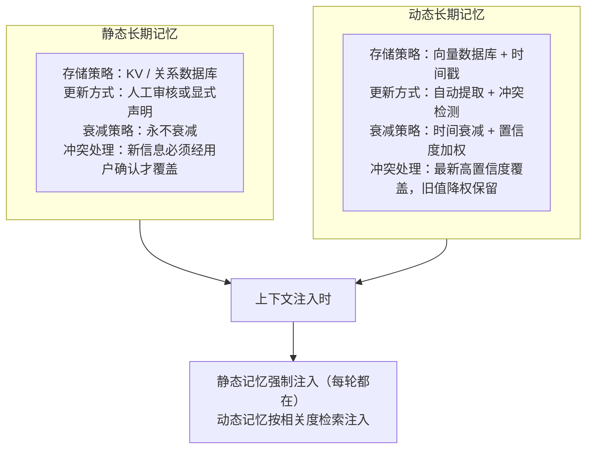
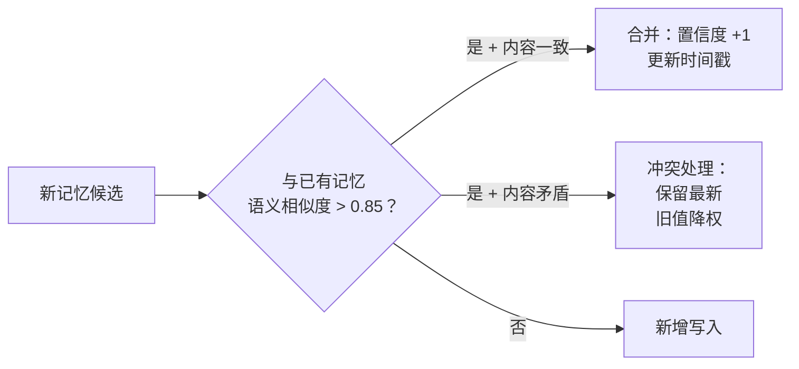

## Prompt 长度 vs 内容对决策的影响

### Q：如何判断是 Prompt 内容影响了决策，还是 Prompt 太长导致注意力涣散影响了决策？

> 来源：淘天 AI Agent 暑期实习一面

**新手答**：“缩短 Prompt 试试？”

**高手答**：

这是一个因果归因问题——两种失效模式（内容误导 vs 注意力稀释）的表现类似（输出质量下降），但根因不同，解法也不同。需要设计对照实验来区分。

**实验设计方法：**

| 实验组 | 操作 | 预期 |
|--------|------|------|
| A（基线） | 短 Prompt + 核心指令 | 正常输出 |
| B（内容影响） | 短 Prompt + 核心指令 + 可能干扰的内容 | 如果 B 变差 → 内容本身干扰了决策 |
| C（长度影响） | 长 Prompt + 核心指令 + 无关但无害的填充文本 | 如果 C 变差 → 纯长度导致注意力涣散 |
| D（双因素） | 长 Prompt + 核心指令 + 可能干扰的内容 | 对比 B 和 C 判断哪个因素占主导 |

**判断标准：**
- **B 差而 C 不差** → 问题在内容本身（误导性信息干扰了模型推理）
- **C 差而 B 不差** → 问题在长度（Lost in the Middle 效应）
- **B 和 C 都差** → 双重影响，需要同时解决

**工程化诊断方法：**
1. **关键指令位置测试**：把同一条核心指令分别放在 Prompt 开头、中间、结尾，观察遵循率变化。如果中间明显差 → 注意力涣散问题
2. **注意力可视化**：用模型的 attention weight 分布看关键 token 是否被正确关注（需要开源模型支持）
3. **逐段消融**：逐步删除 Prompt 中的某些段落，观察哪段删除后输出质量提升 → 该段是干扰源

**差距在哪**：面试官考的是你对“模型行为诊断”的方法论。只说“缩短试试”是瞎猜，能设计出控制变量的对照实验并说出判断标准，说明你有科学化调优 Agent 的能力。

---

### Q：为什么要区分静态长期记忆和动态长期记忆？各自存什么？

> 来源：字节跳动 Agent 二面（Coding Agent）

**新手答**：“长期记忆就是把重要信息存起来，不用分那么细。”

**高手答**：

区分静态和动态长期记忆的根本原因是**更新频率和置信度完全不同**，混在一起存会导致两个问题：高频更新的数据冲刷掉稳定的事实，以及不同衰减策略无法精细化控制。

**静态长期记忆——变化极少、置信度极高的事实性信息**：

| 内容类型 | 示例 | 特征 |
|---------|------|------|
| 身份信息 | 用户名、公司、角色 | 几乎不变，一旦确认就固定 |
| 硬性约束 | 过敏信息、合规红线 | 绝不能被覆盖或衰减 |
| 系统规则 | 项目编码规范、架构约定 | 人工维护，变更走审批流程 |
| 工具能力描述 | 工具的功能边界和限制 | 随版本更新，但频率低 |

**动态长期记忆——会随时间演化、需要持续更新的偏好和行为模式**：

| 内容类型 | 示例 | 特征 |
|---------|------|------|
| 用户偏好 | “最近喜欢简洁风格”“倾向用 TypeScript” | 可能随时间改变 |
| 行为模式 | “每次都先跑测试再提交” | 从多次观察中归纳，有置信度 |
| 上下文习惯 | “习惯在下午处理复杂任务” | 统计规律，非绝对 |
| 历史决策 | “上次选了方案 A，原因是性能优先” | 有时效性，新决策覆盖旧决策 |

**为什么必须分开**：



**工程实现的关键差异**：

1. **查询方式不同**：静态记忆用精确键值查询（`user.allergy = "花生"`），动态记忆用语义检索（embedding 相似度）
2. **写入保护不同**：静态记忆写入需要高置信度确认（用户明确说“我对花生过敏”），动态记忆可以从行为中推断写入
3. **注入策略不同**：静态记忆每轮强制注入 System Prompt（因为永远相关），动态记忆按当前 query 的语义相关度选择性注入

**差距在哪**：新手把长期记忆当成一个“大桶”——什么都往里扔。高手区分了静态和动态两类，每类有独立的存储引擎、更新策略、衰减机制和注入逻辑。面试官考的是你对记忆系统“数据治理”的精细化认知——不同性质的信息需要不同的管理策略，混着管必然出问题。

---

### Q：每轮对话都触发长期记忆存储，用户记忆快速积累、存得过多怎么办？

> 来源：字节跳动 Agent 二面（Coding Agent）

**新手答**：“设个上限，满了就删最早的。”

**高手答**：

“删最早的”是最粗暴的策略——可能把用户三个月前说的“我对花生过敏”删掉，留下昨天的闲聊。问题的根源不是“存太多”，而是**没有准入控制和质量管理**。

**解决方案分四层**：

**第一层：写入准入控制——不是所有信息都值得存**

每轮对话结束后，用轻量模型做“记忆价值评估”：

| 条件 | 处理 | 示例 |
|------|------|------|
| 显式偏好/事实声明 | 高优先级存入 | “我不吃辣”“我在北京” |
| 反复出现的模式 | 中优先级存入 | 连续三次选了最便宜的 |
| 一次性任务上下文 | 不存 | “帮我写封邮件” |
| 寒暄/确认性回复 | 不存 | “好的”“谢谢” |
| 中间推理过程 | 不存 | Agent 的 chain-of-thought |

准入率控制在 20-30%——绝大多数对话不产生持久化记忆。

**第二层：写入时去重合并——同一信息不重复存**



用户说了 5 次“不吃辣”，最终只存一条，但置信度为 5——不是存 5 条占 5 倍空间。

**第三层：定期淘汰——低价值记忆主动清理**

不是按时间删，而是按**综合分数**淘汰：

```text
保留分数 = 重要性权重 × 访问频率 × 时间衰减系数

  - 重要性高 + 近期被检索命中 → 分数高，保留
  - 重要性低 + 长期未被检索 → 分数低，淘汰候选
  - 事实性记忆（过敏、身份）→ 永不淘汰（白名单）
```

定时任务（如每周一次）扫描用户记忆库，淘汰分数最低的 N% 记忆。淘汰不是物理删除，而是归档到冷存储——万一误删还能恢复。

**第四层：记忆抽象提升——用 Reflection 压缩细节**

当同一主题的记忆积累过多时，触发 Reflection：

```text
原始记忆（10 条）：
  - "第一次选了 Python"
  - "第二次又用 Python"
  - "问了 Python 装饰器"
  - "问了 Python 异步"
  - ...

Reflection 产出（1 条）：
  "用户是 Python 重度使用者，关注高级特性（装饰器、异步），
   代码风格偏好函数式。"
```

10 条细节记忆被 1 条高级认知替代——信息密度提升 10 倍，存储空间释放 90%。

**差距在哪**：新手只想到容量限制和粗暴删除。高手从准入控制、去重合并、智能淘汰、记忆抽象四层构建了完整的记忆容量治理方案。面试官考的是你对“记忆是需要主动管理的资产”这个核心认知——不管理的记忆会变成垃圾堆，管理好的记忆才是竞争力。
