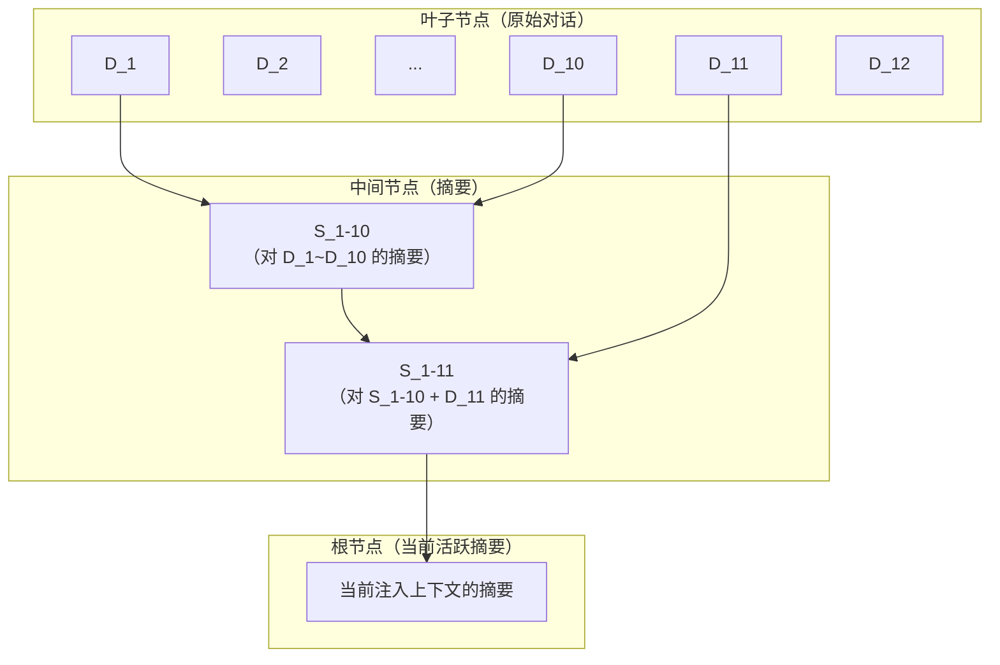

## Q：已进行 10 轮并做了总结，第 11 轮开始时，总结怎么处理？是重算前 11 轮还是叠加？

> 来源：月之暗面/Agent开发岗

**新手答**：“全部重新总结一遍。”

**高手答**：

正确做法是**增量叠加，而非全量重算**。

第 10 轮结束时已有摘要 S_1-10（约 300 token），第 11 轮新对话 D_11（约 800 token），直接将 S_1-10 + D_11 拼在一起发给模型——不重新处理前 10 轮的原始对话。

**为什么不重算**：

- 全量重算的时间复杂度是 O(n²)——每新增一轮都要重处理所有历史
- Token 消耗是增量方式的 10 倍以上——重算意味着每轮都把全部原始对话喂一遍
- 在延迟敏感场景（对话系统）中，额外几秒的等待直接影响体验

**关键陷阱**：当 S_1-10 + D_11 又到达阈值时，第 12 轮触发新一次总结——此时对 S_1-10 + D_11 做一次新总结生成 S_1-11，然后丢弃旧的 S_1-10。这本质是一棵**分层摘要树**，每一层是对上一层的压缩：

**工程实现要点**：
- 摘要生成用异步任务，不阻塞当前轮的响应
- 每次新摘要生成后，保留旧摘要的引用（方便调试和回溯）
- 设置摘要的最大嵌套层数（通常 3-4 层），防止“摘要的摘要的摘要”信息损失过大

**差距在哪**：面试官通过连续追问考察你对摘要策略的工程实现细节——是真写过还是只看过文章。全量重算暴露的是“没算过复杂度”，增量叠加+分层摘要树暴露的是“真正实现过这个系统”。
